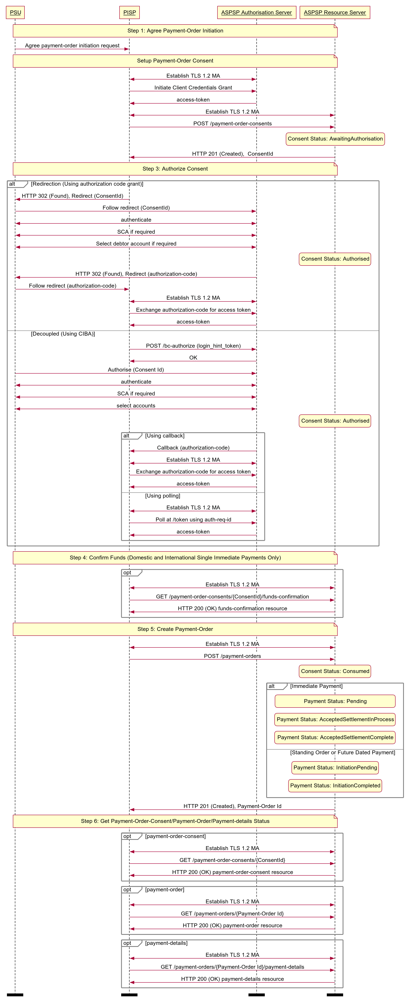

# Variable Recurring Payments API Profile - v3.1.10 <!-- omit in toc -->

- [Introduction](#introduction)
  - [Resources](#resources)
- [Basics](#basics)
  - [Overview](#overview)
    - [Steps](#steps)
    - [Sequence Diagram](#sequence-diagram)
  - [Payment Restrictions](#payment-restrictions)
  - [Deferred specification of VRP Consent Parameters](#deferred-specification-of-vrp-consent-parameters)
  - [Deferred specification of CreditorAccount and CreditorAgent](#deferred-specification-of-creditoraccount-and-creditoragent)
- [Security & Access Control](#security-access-control)
  - [Scopes](#scopes)
  - [Grants Types](#grants-types)
  - [Consent Authorisation](#consent-authorisation)
  - [PSU Authentication Methods](#psu-authentication-methods)
  - [Consent Revocation](#consent-revocation)
  - [Multiple Authorisation](#multiple-authorisation)
  - [SCA through the PISP](#sca-through-the-pisp)
  - [Error Condition](#error-condition)
  - [Consent Re-authentication](#consent-re-authentication)
  - [Risk Scoring Information](#risk-scoring-information)
- [Event Notifications](#event-notifications)
  - [Event Notification for changes to DebtorAccount](#event-notification-for-changes-to-debtoraccount)
  - [Event notifications for cancellation of a VRP Consent](#event-notifications-for-cancellation-of-a-vrp-consent)

## Introduction

The Variable Recurring Payments API Profile describes the flows and common functionality for setting up VRP Consents and subsequently creating one or more payment orders that meet the limitations set by the VRP Consent.

The functionality includes the ability to:

- **Stage** a VRP Consent.
- Optionally **confirm available funds** for a VRP of a specified amount
- Subsequently **submit** the VRP for processing.
- Optionally **retrieve the status** of VRP Consents and VRPs.

This profile should be read in conjunction with a compatible Read/Write Data API Profile which provides a description of the elements that are common across all the Read/Write Data APIs.

### Resources

Each of the Payment Initiation API resources are documented in the  [Resources and Data Models](../resources-and-data-models/) area of the specification. Each resource is documented with:

- Endpoints
  - The API endpoints available for the resource.
- Data Model
  - Resource definition.
  - UML diagram.
  - Permissions as they relate to accessing the resource.
  - Data dictionary - which defines fields, re-usable classes, mandatory (1..1) or conditional (0..1) as defined in the Design Principles section, and enumerations.
- Usage Examples

## Basics

### Overview

The figure below provides a **general** outline of a VRP flow.

The flow below is documented in terms of two abstract resources:

- `domestic-vrp-consents`: A consent created between a PSU and TPP that allows the TPP to create `vrps` on behalf of the PSU subject to _control parameters_
- `vrps`: A payment order created by the TPP that meets the limitations set out by an approved `domestic-vrp-consents` resource.

These resources will be instantiated as specific resources for various types of payments.

This version of the specification is limited to `domestic-vrp-consents` and `domestic-vrps`.


#### Steps

Step 1: PSU and TPP agree upon a VRP Consent

- This flow begins with a PSU agreeing to the setup of VRP Consent. The consent is between the PSU and the TPP.
- At this stage, the control parameters are agreed between the PSU and TPP
- The PSU may provide the debtor accounts to be used (or specify them at a later stage directly to the ASPSP)

Step 2: Setup VRP Consent

- The TPP connects to the ASPSP that services the PSU's payment account and creates a new `domestic-vrp-consents` resource. This informs the ASPSP that one of its PSUs intends to setup a VRP Consent. The ASPSP responds with a consent id that is the identifier for the VRP Consent resource
- This step is carried out by making a **POST** request to the `domestic-vrp-consents` resource.

Step 3: Authorise Consent

- The TPP requests the PSU to authorise the consent. The ASPSP may carry this out by using a ***redirection flow*** or a ***decoupled flow***.
  - In a redirection flow, the TPP redirects the PSU to the ASPSP.
    - The redirect includes the ConsentId generated in the previous step.
    - This allows the ASPSP to correlate the VRP Consent that was setup.
    - The ASPSP authenticates the PSU.
    - The PSU reviews the debtor account(s) at this stage (and other control parameters, specified in Step 1).
    - The ASPSP provides an interface for the PSU to select the debtor accounts to be used.
    - The ASPSP updates the state of the VRP Consent resource internally to indicate that the consent has been authorised.
    - Once the consent has been authorised, the PSU is redirected back to the TPP.
  - In a decoupled flow, the ASPSP requests the PSU to authorise consent on an  *authentication device* that is separate from the  *consumption device* on which the PSU is interacting with the TPP.
    - The decoupled flow is initiated by the TPP calling a back-channel authorisation request.
    - The request contains a 'hint' that identifies the PSU paired with the consent to be authorised.
    - The ASPSP authenticates the PSU
    - The PSU reviews the debtor account(s) at this stage (and other control parameters, specified in Step 1).
    - The ASPSP provides an interface for the PSU to select the debtor accounts to be used.
    - The ASPSP updates the state of the VRP Consent resource internally to indicate that the consent has been authorised.
    - Once the consent has been authorised, the ASPSP can make a callback to the TPP to provide an access token.

Step 4: Confirm Funds (TPP confirms the availability of specific amount in PSU's account)

- Once the PSU is authenticated and authorised the VRP Consent, the TPP can check whether funds are available to make the payment.
- This is carried out by making a **POST** request, calling the **funds-confirmation** operator on the `domestic-vrp-consents` resource.

Step 5: Create domestic-vrp

- The TPP can then creates one or more VRPs for processing the payment. The payment orders must adhere to the control parameters specified by the VRP Consent.
- This is carried out by making a **POST** request to the appropriate `vrps` resource.
- The ASPSP returns the identifier for the domestic-vrps resource to the TPP.

Step 6: Check resource status

- The TPP can check the status of the VRP Consent (with the ConsentId), VRPs and VRP details.
- This is carried out by making a **GET** request to the `domestic-vrp-consents`, `vrps` or `vrp-details` resource.

#### Sequence Diagram



[Diagram source](./images/Payments-Flow.puml)

### Payment Restrictions

The standard provides a set of conrol parameters that may be specified as part of the VRP Consent. These control parameters set limits for the payment orders that can be created by the TPP for a given VRP.

In addition to the control parameters defined in this standard ASPSPs may implement additional control parameters, limits and restrictions for non-sweeping VRPs.

These restrictions should be documented on ASPSP's developer portal.

### Deferred specification of VRP Consent Parameters

For non-sweeping VRPs a PISP may create a `vrp-consent` without specifying VRP Consent Parameters in the `ControlParameters` for the VRP Consent.

The PISP subsequently provides this information when initiating a VRP Payment based on the VRP Consent.

An ASPSP may permit these type of consents only when an appropriate contract is in place with the PISP.

As described in the section below, the ASPSP may also rely on the PISP to carry out SCA (with appropriate contracts in place).

### Deferred specification of CreditorAccount and CreditorAgent

Similarly, for non-sweeping VRPs a PISP may create a `vrp-consent` without specifying the `CreditorAccount` and `CreditorAgent` for the VRP Consent.

The PISP subsequently provides this information when initiating a VRP Payment based on the VRP Consent.

An ASPSP may permit these type of consents only when an appropriate contract is in place with the PISP.

As described in the section below, the ASPSP may also rely on the PISP to carry out SCA (with appropriate contracts in place).

## Security & Access Control

### Scopes

A PISP can call VRP APIs using the `payments` scope.

### Grants Types

As defined in resources and data models.

### Consent Authorisation

OAuth 2.0 scopes are coarse-grained and the set of available scopes are defined at the point of client registration. There is no standard method for specifying and enforcing fine-grained scopes e.g., a scope to enforce payments of a specified amount on a specified date.

A *consent authorisation* is used to define the fine-grained scope that is granted by the PSU to the TPP.

The TPP **must** begin setup of a Variable Recurring Payment, by creating a `domestic-vrp-consents` resource through a **POST** operation. These resources indicate the  _consent_ that the TPP claims it has been given by the PSU. At this stage, the consent is not yet authorised as the ASPSP has not yet verified this claim with the PSU.

The ASPSP responds with a ConsentId. This is the intent-id that is used when initiating the authorization code grant (as described in the Trust Framework).

As part of the authorization code grant:

- The ASPSP authenticates the PSU.
- The ASPSP plays back the consent (registered by the TPP) back to the PSU to get consent authorisation. The PSU may accept or reject the consent in its entirety (but not selectively).

Once these steps are complete, the consent is considered to have been authorised by the PSU.

### PSU Authentication Methods

The VRP Consent must specify the `PSUAuthenticationMethods` that are acceptable for payments made under that consent.

One or more PSU Authentication methods can be specified:

- __Authentication Not Required__: This indicates that the PSU does not need to authenticate for individual payments and the payments can be made without the PSU being present. This method is useful for sweeping use-cases, but may also be used in other situations.
- __SCA By TPP__: This indicates that SCA is carried out by the TPP. The ASPSP and TPP must have a contract in place to accept this type of authentication.

### Consent Revocation

A PSU may revoke consent for initiation of any future payment orders, by revoking the authorisation of VRP Consent, at any point in time.

The PSU may request the TPP to revoke consent that it has authorised. If consent is revoked with the TPP:

- The TPP must cease to initiate any future payment orders or Funds Confirmations using the VRP Consent.
- The TPP must call the DELETE operation on the VRP Consent resource to indicate to the ASPSP that the PSU has revoked consent.

The PSU may revoke the VRP access via ASPSP's online channel. If the access is revoked via ASPSP:

- The ASPSP must fail any future payment order request using the ConsentId.
- The ASPSP must make a Notification Event available for the TPP to poll/deliver Real Time Event Notification for the event - `consent-access-revoked`.
- The ASPSP must take the necessary action to revoke access e.g. by revoking/expiring the access token provided to the PISP.
- The status of the `domestic-vrp-consents` resource must remain unchanged and the PISP must be allowed to request PSU to re-authenticate the same `domestic-vrp-consents` resource.
- Upon successful re-authentication by the PSU, an ASPSP may issue new authorization code and subsequently new access token to the PISP.

### Multiple Authorisation

- In the current version of the specification, VRP is not supported for accounts that require multiple PSUs to authorise a payment.

### SCA through the PISP

An ASPSP may enter into a contractual arrangement with a PISP to carry out SCA on its behalf. The Read-Write API profile describes the use of a `jwt-bearer` grant type.

This can also be used for vrp consents.

### Error Condition

If the PSU does not complete a successful consent authorisation (e.g., if the PSU has not authenticated successfully), the authorization code grant ends with a redirection to the TPP with an error response as described in [RFC 6749 Section 4.1.2.1](https://tools.ietf.org/html/rfc6749#section-4.1.2.1). The PSU is redirected to the TPP with an error parameter indicating the error that occurred.

### Consent Re-authentication

VRP Consents are long-lived and can be re-authenticated by the PSU. The access token issued by the ASPSP must be valid for the same length of time as the VRP consent.

ASPSPs may revoke access tokens associated with a VRP consent for fraud and risk reduction. In such situations, they would have to provide a event delivery mechanism.

A PSU may re-authenticate a VRP Consent where:

- the resource has a status of `Authorised` and
- the consent has not expired as determined through the `ValidToDate` in the control parameters.

ASPSPs may revoke access tokens issued for a VRP consent if they suspect risk or fraud situations. However, unlike AIS consents, VRP access tokens should not be set to expire at 90 days.

### Risk Scoring Information

The same risk scoring information contained in the `Risk` of other OBIE R/W payment resources will be available.

## Event Notifications

### Event Notification for changes to DebtorAccount

The `DebtorAccount` that is associated with a `vrp-consent` may change due to a number of factors:

- The PSU may close the account
- The PSU may close the account and switch to another ASPSP
- The account may be blocked due to a fraud referal
- The PSU may have ceased trading or may be deceased

In any such situation where an account linked to a vrp-consent can no longer be used, temporarily or permanently, to make payments, the ASPSP should inform the TPP using events.

The TPP may subscribe to these events using an aggregated polling mechanism or a push notification mechanism.

The `urn:uk:org:openbanking:events:domestic-vrp-consent-linked-account-update` event should be used to indicate such a change for domestic VRP Consents

A custom claim, `reason` should be used with the event to indicate the reason for the event. This should be a namespaced enumeration.

The `sub` and `subject` claim references the URL of the `vrp-consent` that gives the TPP access to the account.
The TPP can then use the GET operation to retrieve the `vrp-consent`

``` json
{
  "iss": "https://examplebank.com/",
  "iat": 1516239022,
  "jti": "b460a07c-4962-43d1-85ee-9dc10fbb8f6c",
  "sub": "https://examplebank.com/api/open-banking/v3.1/pisp/domestic-vrp-consents/aac-1234-007",
  "aud": "7umx5nTR33811QyQfi",
  "events": {
    "urn:uk:org:openbanking:events:domestic-vrp-consent-linked-account-update": {
      "subject": {
        "subject_type": "http://openbanking.org.uk/rid_http://openbanking.org.uk/rty",
        "http://openbanking.org.uk/rid": "90200",
        "http://openbanking.org.uk/rty": "domestic-vrp-consents",
        "http://openbanking.org.uk/rlk": [{
            "version": "v3.1",
            "link": "https://examplebank.com/api/open-banking/v3.1/pisp/domestic-vrp-consents/aac-1234-007"
          }
        ]
      }
      }
   },
  "txn": "dfc51628-3479-4b81-ad60-210b43d02306",
  "toe": 1516239022
}
```

### Event notifications for cancellation of a VRP Consent

In the situation that a VRP Consent is cancelled by a PSU at the ASPSP, the ASPSP must inform the PISP through an event notification about the cancellation.

The TPP may subscribe to these events using an aggregated polling mechanism or a push notification mechanism.

The `urn:uk:org:openbanking:events:consent-authorization-revoked` event should be used to indicate this.

The TPP can then use the GET operation to retrieve the consent.

```json
{
  "iss": "https://examplebank.com/",
  "iat": 1516239022,
  "jti": "b460a07c-4962-43d1-85ee-9dc10fbb8f6c",
  "sub": "https://examplebank.com/api/open-banking/v3.1/pisp/domestic-vrp-consents/88379",
  "aud": "7umx5nTR33811QyQfi",
  "events": {
    "urn:uk:org:openbanking:events:consent-authorization-revoked": {
      "subject": {
        "subject_type": "http://openbanking.org.uk/rid_http://openbanking.org.uk/rty",
        "http://openbanking.org.uk/rid": "88379",
        "http://openbanking.org.uk/rty": "domestic-vrp-consents",
        "http://openbanking.org.uk/rlk": [
          {
            "version": "v3.1",
            "link": "https://examplebank.com/api/open-banking/v3.1/vtp/domestic-vrp-consents/88379"
          }
        ]
      }
    }
  },
  "txn": "dfc51628-3479-4b81-ad60-210b43d02306",
  "toe": 1516239022
}
```
