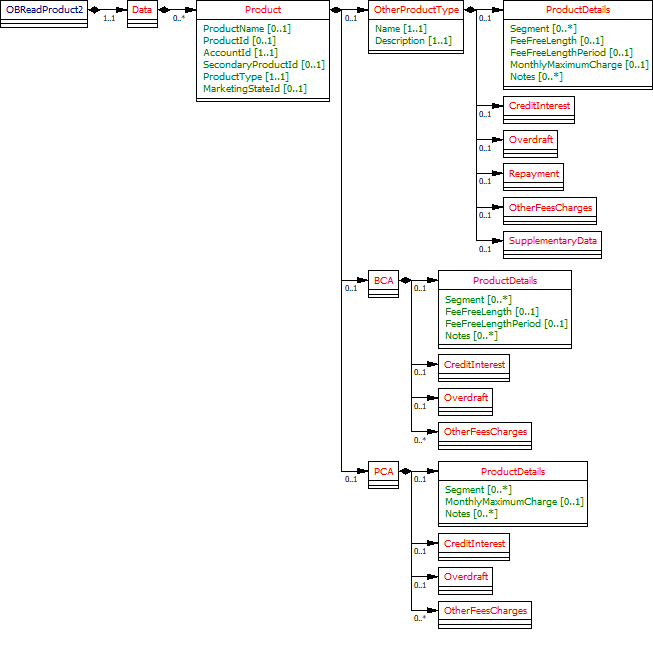

# Products - v3.1.10 <!-- omit in toc -->

- [Overview](#overview)
- [Endpoints](#endpoints)
  - [GET /accounts/{AccountId}/product](#get-accountsaccountidproduct)
  - [GET /products](#get-products)
- [Data Model](#data-model)
  - [Resource Definition](#resource-definition)
    - [Notes](#notes)
  - [UML Diagram](#uml-diagram)
    - [Notes](#notes-1)
  - [Permission Codes](#permission-codes)
  - [Data Dictionary](#data-dictionary)
    - [Common Payload](#common-payload)
    - [PCA & BCA Extensions](#pca--bca-extensions)
- [Usage Examples](#usage-examples)
  - [Specific Account](#specific-account)
    - [Get Accounts Product Request](#get-accounts-product-request)
    - [Get Accounts Product Response](#get-accounts-product-response)
  - [Bulk](#bulk)
    - [Get Products Request](#get-products-request)
    - [Get Products Response](#get-products-response)

## Overview

The product resource is used by an AISP to retrieve the account product information for a specific AccountId.

The products resource is used by an AISP to retrieve the products for all authorised accounts linked to a specific account-request.

This resource description should be read in conjunction with a compatible Account Information Services API Profile.

## Endpoints

Endpoints for the resource and available methods.

|  |Resource |HTTP Operation |Endpoint |Mandatory? |Scope |Grant Type |Idempotency Key |Parameters |Request Object |Response Object |
| --- |--- |--- |--- |--- |--- |--- |--- |--- |--- |--- |
| 1 |products |GET |GET /accounts/{AccountId}/product |Conditional |accounts |Authorization Code |No | | |OBReadProduct2 |
| 2 |products |GET |GET /products |Optional |accounts |Authorization Code |No |Pagination | |OBReadProduct2 |

### GET /accounts/{AccountId}/product

An AISP may retrieve the account product information for a specific AccountId (which is retrieved in the call to GET /accounts).
While this endpoint is marked as Conditional, it will be Mandatory for ASPSPs and account types covered in the CMA Order.

### GET /products

If an ASPSP has implemented the bulk retrieval endpoints for products an AISP may optionally retrieve the products information in bulk.
This endpoint will retrieve the products resources for all authorised accounts linked to a specific account-request.

## Data Model

The OBReadProduct2 object will be used for the call to:

* GET /accounts/{AccountId}/product
* GET /products

### Resource Definition

A resource that contains a set of elements that describes the product details specific to the account (AccountId) which will include any pricing, fees, interest rates and product features for the account.
An account (AccountId) must only have a single product.

#### Notes

* The product resource must be available for all PSD2 in scope accounts (if the product information is also available to the logged in PSU).
* Detailed product information is only available for BCA and PCA products.
* High level product information for other products (other than BCA and PCA products) may be available via a reference to the Open Data APIs.

### UML Diagram



#### Notes

* All PSD2 in-scope accounts are expected to return a response to the product resource. However, the BCA and PCA objects only apply to current account products (which are a CMA Order requirement).
* Product/ProductIdentifier and Product/SecondaryProductIdentifier are renamed to Product/ProductId and Product/SecondaryProductId respectively.
* The APIs are split in to 2 broad groups based on respective security requirements:-
    * Open Data includes an API which provides **Marketed** PCA/BCA/Other Information.
    * Read-Write (aka "Closed Data") includes an API which provides **Operated** PCA/BCA/Other Information.
* Open Data Product information covers:- Core Product, Eligibility, Credit Interest, Overdraft, Features &amp; Benefits and Other Fees &amp; Charges.
* In July 2017, as part of Open Data-Account Information design workshop, it was agreed that the Products endpoint should contain a reference to Open Data AND subset of Open Data model (Decision [039](https://openbanking.atlassian.net/wiki/spaces/WOR/pages/3654377/039) - option 4).
* Approach to supplying product information via the Account and Transaction Information API for v2.x:
    * An optional "Open Data Product ID" link to the Open Data APIs should be retained, so that marketed product information is made available (where this is available). This could be more than "Front book" if a bank has decided to retain marketed product information for "Back book" products on the Open Data API.
    * In addition to the "Open Data Product ID" link, we should focus on fields that are provided by price comparison websites today. Although overdraft rates are typically marked as "Negotiable" on PCWs, we feel that it would be useful to provide information about the actual overdraft rate(s) that the account holder is on, even if this cannot easily be used for comparison with other products.
    * If there is a reference to "Open Data Product ID", then the TPP may lookup product features from Open Data. If any element/fields of the products endpoint are populated, then this should override the default in Open Data (Decision
[039](https://openbanking.atlassian.net/wiki/spaces/WOR/pages/3654377/039) &amp; [100](https://openbanking.atlassian.net/wiki/spaces/WOR/pages/32376202/100)).
    * The "Open Data Product ID" should be populated by the ASPSP in the **products** resource if there is a corresponding entry in the Open Data APIs.
    * Information supplied in the Account and Transaction Information API v2.x product section must come from account operating platforms.
    * ProductType enumeration matches to types available in Open Data APIs, ASPSPs may choose to provide any additional product type by closing value=Other in ProductType, and providing a brief type details in OtherProductType data fields, and reference to their Open Data product. At this moment, we don't have detailed Product Info structure for product types other than PCA/BCA.

### Permission Codes

The resource requires the ReadProducts permission. The resource response payload does not differ depending on the permissions granted.

### Data Dictionary

#### Common Payload

Data Dictionary for Common Payload between PCA, BCA and other product types.

| Name |Occurrence |XPath |EnhancedDefinition |Class |Codes |Pattern |
| --- |--- |--- |--- |--- |--- |--- |
| OBReadProduct2 | |OBReadProduct2 | |OBReadProduct2 | | |
| Data |1..1 |OBReadProduct2/Data | |OBReadDataProduct2 | | |
| Product |0..n |OBReadProduct2/Data/Product | |OBProduct2 | | |
| ProductName |0..1 |OBReadProduct2/Data/Product/ProductName |The name of the product used for marketing purposes from a customer perspective. I.e. what the customer would recognise. |Max350Text | | |
| ProductId |0..1 |OBReadProduct2/Data/Product/ProductId |Identifier within the parent organisation for the product. Must be unique in the organisation. |Max40Text | | |
| AccountId |1..1 |OBReadProduct2/Data/Product/AccountId |A unique and immutable identifier used to identify the account resource. This identifier has no meaning to the account owner. |Max40Text | | |
| SecondaryProductId |0..1 |OBReadProduct2/Data/Product/SecondaryProductId |Identifier within the parent organisation for the product. Must be unique in the organisation. |Max70Text | | |
| ProductType |1..1 |OBReadProduct2/Data/Product/ProductType |Descriptive code for the product category. If ProductType - "Other" is chosen, the object OtherProductType must be populated with name, and description. |OBExternalProductType1Code |BusinessCurrentAccount CommercialCreditCard Other PersonalCurrentAccount SMELoan | |
| MarketingStateId |0..1 |OBReadProduct2/Data/Product/MarketingStateId |Unique and unambiguous identification of a Product Marketing State. |Max35Text | | |
| OtherProductType |0..1 |OBReadProduct2/Data/Product/OtherProductType |This field provides extension to the ProductType enumeration. If ProductType - "Other" is chosen, this field must be populated with name, and description for ASPSP specific product type. |OBOtherProductType1 | | |
| Name |1..1 |OBReadProduct2/Data/Product/OtherProductType/Name |Name of "Other" product type. |Max350Text | | |
| Description |1..1 |OBReadProduct2/Data/Product/OtherProductType/Description |Description of "Other" product type. |Max350Text | | |
| BCA |0..1 |OBReadProduct2/Data/Product/BCA | |OBBCAData1 | | |
| PCA |0..1 |OBReadProduct2/Data/Product/PCA | |OBPCAData1 | | |


#### PCA & BCA Extensions

[BCA Product Data Model v3.1.2](./BCA Product Data Model.md)

[PCA Product Data Model v3.1.2](./PCA Product Data Model.md)

[Other Product Data Model v3.1.2](./Other Product Data Model.md)


## Usage Examples

Detailed usage examples for PCA, and BCA can be found in theMessage Implementation Guide section of PCA and BCA sub pages.

### Specific Account

#### Get Accounts Product Request

```
GET /accounts/22289/product HTTP/1.1
Authorization: Bearer Az90SAOJklae
x-fapi-auth-date:  Sun, 10 Sep 2017 19:43:31 GMT
x-fapi-customer-ip-address: 104.25.212.99
x-fapi-interaction-id: 93bac548-d2de-4546-b106-880a5018460d
Accept: application/json
```

#### Get Accounts Product Response

```
HTTP/1.1 200 OK
x-fapi-interaction-id: 93bac548-d2de-4546-b106-880a5018460d
Content-Type: application/json
```

```json
{
  "Data": {
    "Product": [
      {
        "AccountId": "22289",
        "ProductId": "51B",
        "ProductType": "PersonalCurrentAccount",
        "ProductName": "321 Product",
        "PCA": {
         ....
		    }
	    }
    ]
  },
  "Links": {
    "Self": "https://api.alphabank.com/open-banking/v3.1/aisp/accounts/22289/product"
  },
  "Meta": {
    "TotalPages": 1
  }
}
```

### Bulk

#### Get Products Request

```
GET /products HTTP/1.1
Authorization: Bearer Az90SAOJklae
x-fapi-auth-date:  Sun, 10 Sep 2017 19:43:31 GMT
x-fapi-customer-ip-address: 104.25.212.99
x-fapi-interaction-id: 93bac548-d2de-4546-b106-880a5018460d
Accept: application/json
```

#### Get Products Response

```
HTTP/1.1 200 OK
x-fapi-interaction-id: 93bac548-d2de-4546-b106-880a5018460d
Content-Type: application/json
```

```json
{
  "Data": {
    "Product": [
      {
        "AccountId": "22289",
        "ProductId": "51B",
        "ProductType": "PersonalCurrentAccount",
        "ProductName": "321 Product",
        "PCA": { .. }
      },
      {
        "AccountId": "31820",
        "ProductId": "001",
        "ProductType": "BusinessCurrentAccount",
        "ProductName": "123 Product",
        "BCA": { .. }
      }
    ]
  },
  "Links": {
    "Self": "https://api.alphabank.com/open-banking/v3.1/aisp/products/"
  },
  "Meta": {
    "TotalPages": 1
  }
}
```
