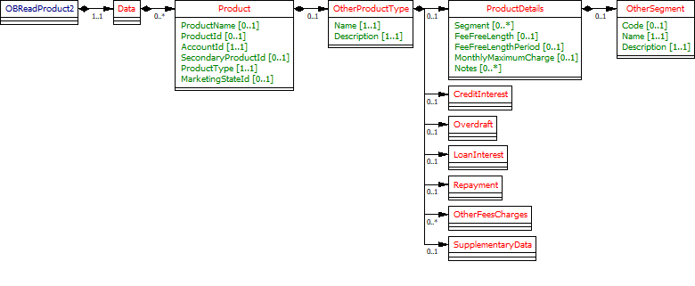
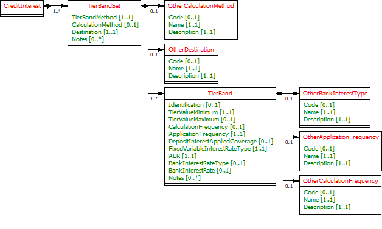
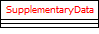
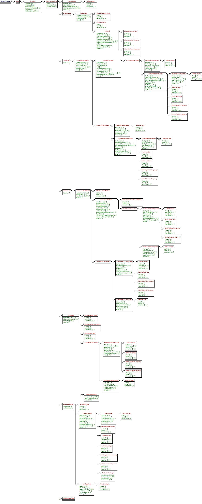

# Other Product Data Model - v3.1.10 <!-- omit in toc -->

- [Overview](#overview)
  - [Fields to include in Other Product](#fields-to-include-in-other-product)
  - [Data Model](#data-model)
    - [CreditInterest Model](#creditinterest-model)
    - [Overdraft](#overdraft)
    - [OverdraftFeeCharges](#overdraftfeecharges)
    - [LoanInterest](#loaninterest)
    - [Repayment](#repayment)
    - [OtherFeesCharges](#otherfeescharges)
    - [SupplementaryData](#supplementarydata)
  - [Data Payload](#data-payload)
  - [Data Dictionary](#data-dictionary)
  - [Data Payload - Enumerations](#data-payload-enumerations)
- [Usage Examples](#usage-examples)
  - [Publish Other Product Type](#publish-other-product-type)
    - [Get Accounts Product Request](#get-accounts-product-request)
    - [Get Accounts Product Response](#get-accounts-product-response)
  - [Publish Other Product Type along with Other Fee and Charges](#publish-other-product-type-along-with-other-fee-and-charges)
    - [Get Accounts Product Request](#get-accounts-product-request-2)
    - [Get Accounts Product Response](#get-accounts-product-response-2)

## Overview

From the analysis:-

* Banks will provide the Open Data Product ID
* In addition to the "Open Data Product ID" link, we should focus on fields that are provided by price comparison websites today. Each product type may have completely different set of fields, like Mortgages , Insurance or Islamic Banking. It may not be possible to publish complete product details using the generic structure.
* The generic structure supports the publishing of key feature of Other Product Type

Further analysis required:-

* Further analysis is required to elaborate key features of other supported products. Generic Data Model just supports the publishing of very basic features.

### Fields to include in Other Product

| Product Section |Fields to be included |
| --- |--- |
| ProductDetails |<ul><li>Name</li><li>Segmeent </li><li>Notes to capture other details</li></ul> |
| CreditInterest |<ul><li>TierBandSet fields (excluding credit interest eligibility). </li><li>All TierBand fields</li></ul> |
| LoanInterest |<ul><li>TierBandSet fields. </li><li>All TierBand fields</li></ul> |
| Repayment |<ul><li>Repayment Charges </li><li>Repayment holiday</li></ul> |
| OtherFeesAndCharges |<ul><li>Other fee charges such as servicing</li></ul> |
| SupplementaryData |Any other feature of the product which cant be published using above functionality. |

### Data Model



#### CreditInterest Model

* A generic data model to publish the Credit Interest functionality if applicable to Other Product Type.



#### Overdraft

* A generic structure for Overdraft published only if applicable to Other Product Type .

#### OverdraftFeeCharges

* A generic structure for Overdraft Fee Charges published only if applicable to Other Product Type .


#### LoanInterest

* A generic structure for Loan Interest published only if applicable to Other Product Type .


#### Repayment

* A generic structure for Loan Repayment along with Fee Charges published only if applicable to Other Product Type.


#### OtherFeesCharges

* A generic structure for Other Fee Charges published only if applicable to Other Product Type.


#### SupplementaryData

SupplementaryData allows to publish features or functionality that is not catered for by other sections of the data model.
The Supplementary Data section is defined as an empty JSON object in the specification.
Wherever used, an ASPSP **must** define and document (on their developer portal) their own structure, usage and (mandatory/optional) requirements for Supplementary Data.


### Data Payload



### Data Dictionary

* [Other Product Type Data Definition](./productdatafiles/OtherProductInfo.v3.1.2.DD.xlsx )


### Data Payload - Enumerations

* [Other Product Type Code List](./productdatafiles/OtherProduct.v3.1.2.CodeList.xlsx )

## Usage Examples

### Publish Other Product Type

Example reference HSBC Basic Saving Account

#### Get Accounts Product Request

```
GET /accounts/22389/product HTTP/1.1
Authorization: Bearer Az90SAOJklae
x-fapi-auth-date:  Sun, 10 Sep 2017 19:43:31 GMT
x-fapi-customer-ip-address: 104.25.212.99
x-fapi-interaction-id: 93bac548-d2de-4546-b106-880a5018460d
Accept: application/json
```

#### Get Accounts Product Response

```
HTTP/1.1 200 OK
x-fapi-interaction-id: 93bac548-d2de-4546-b106-880a5018460d
Content-Type: application/json
```

```json
{
  "Data": {
    "Product": [
      {
        "AccountId": "22389",
        "ProductId": "HSBC12234BAS",
        "ProductType": "Othert",
        "ProductName": "HSBC Basic Saving Account",
        "OtherProductType": {
          "Name": "BasicSavingAccount",
          "Description": "HSBC fee free saving basic saving account"
        }
      }
    ]
  },
  "Links": {
    "Self": "https://api.alphabank.com/open-banking/v3.1/aisp/accounts/22289/product"
  },
  "Meta": {
    "TotalPages": 1
  }
}
```

### Publish Other Product Type along with Other Fee and Charges

The example below has been taken from HSBC saving account. The example is purely madeup data for illustration purpose only.

#### Get Accounts Product Request

```
GET /accounts/22390/product HTTP/1.1
Authorization: Bearer Az90SAOJklae
x-fapi-auth-date:  Sun, 10 Sep 2017 19:43:31 GMT
x-fapi-customer-ip-address: 104.25.212.99
x-fapi-interaction-id: 93bac548-d2de-4546-b106-880a5018460d
Accept: application/json
```

#### Get Accounts Product Response

```
HTTP/1.1 200 OK
x-fapi-interaction-id: 93bac548-d2de-4546-b106-880a5018460d
Content-Type: application/json
```

```json
{
  "Data": {
    "Product": [
      {
        "AccountId": "22390",
        "ProductId": "HSBC12234BAS",
        "ProductType": "Other",
        "ProductName": "Saving Account No Monthly Fee",
        "OtherProductType": {
          "Name": "BasicSavingAccount",
          "Description": "HSBC fee free saving basic saving account"
          "OtherProductDetails": {
            "OtherFeesCharges": {
              "FeeChargeDetail": [
                {
                  "FeeCategory": "Servicing",
                  "FeeType": "ServiceCAccountFeeMonthly",
                  "FeeAmount": "12.500",
                  "ApplicationFrequency": "Monthly",
                  "CalculationFrequency": "Daily",
                  "Notes": [
                    "Our tariff includes:\n* depositing and sending cheques\n* cash deposits up to the limit your tariff allows\n* withdrawals\n* Direct Debits, standing orders, bill payments\n* Bas credits\n* debit card payments"
                  ]
                }
              ]
            }
          }
        }
      }
    ]
  },
  "Links": {
    "Self": "https://api.alphabank.com/open-banking/v3.1/aisp/accounts/22390/product"
  },
  "Meta": {
    "TotalPages": 1
  }
}
```
