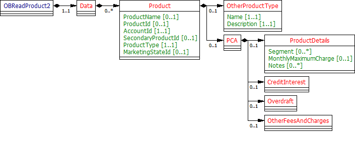
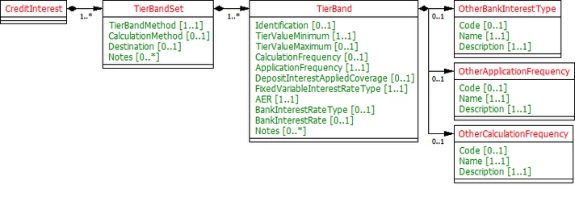
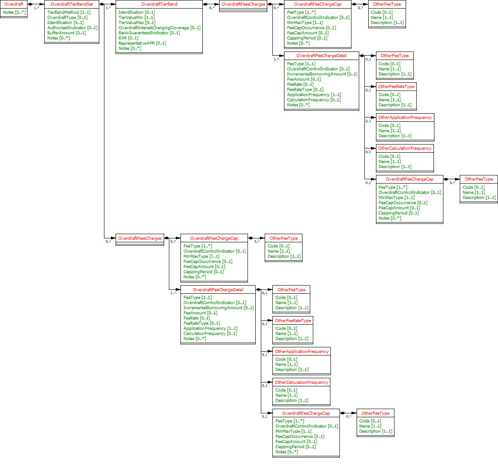
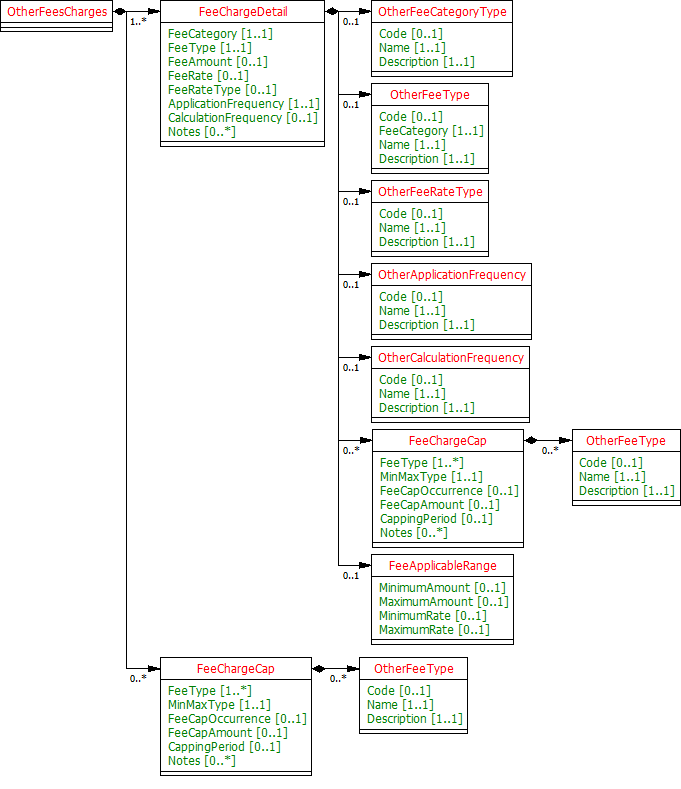
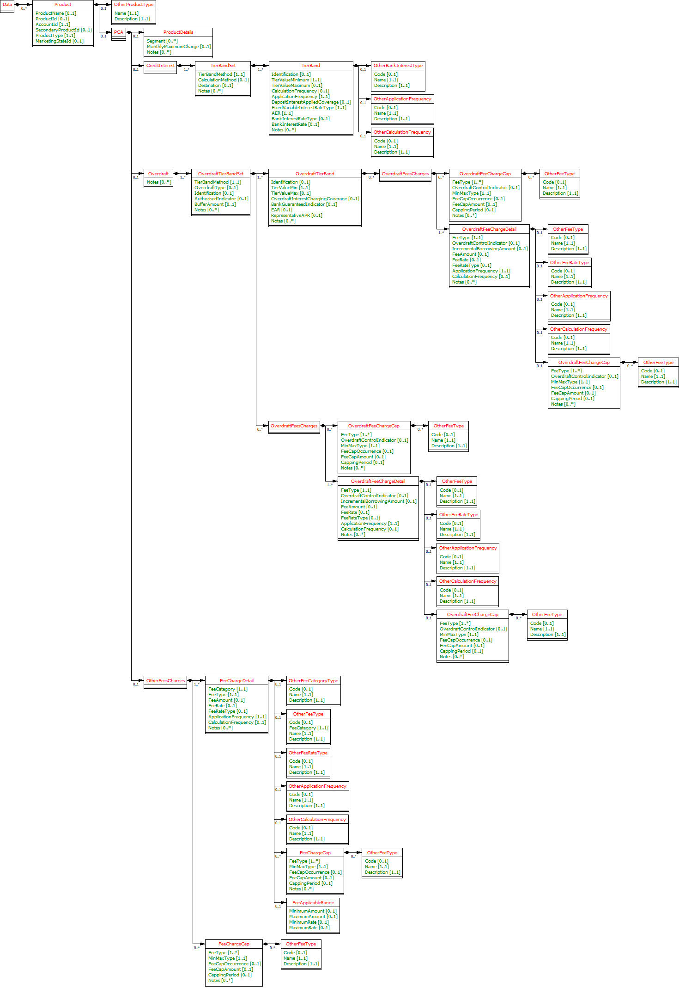

# PCA Product Data Model - v3.1.10 <!-- omit in toc -->

- [Overview](#overview)
    - [Fields to include in PCA Product](#fields-to-include-in-pca-product)
    - [Changes from the OpenData Model](#changes-from-the-opendata-model)
        - [No Eligibility and FeaturesAndBenefits](#no-eligibility-and-featuresandbenefits)
        - [Credit Interest Model](#credit-interest-model)
        - [Overdraft](#overdraft)
        - [OverdraftFeeCharges](#overdraftfeecharges)
        - [OtherFeeCharges](#otherfeecharges)
- [Data Model](#data-model)
    - [Data Payload](#data-payload)
        - [PCA](#pca)
            - [UML Class Diagram](#uml-class-diagram)
            - [Data Dictionary](#data-dictionary)
    - [Data Payload - Enumerations](#data-payload-enumerations)
- [Usage Examples](#usage-examples)
    - [Publish Open Data Standard PCA Product](#publish-open-data-standard-pca-product)
        - [Get Accounts Product Request](#get-accounts-product-request)
        - [Get Accounts Product Response](#get-accounts-product-response)
    - [Publish Open Data Standard PCA Product, along with new other fee charges](#publish-open-data-standard-pca-product-along-with-new-other-fee-charges)
        - [Get Accounts Product Request](#get-accounts-product-request-2)
        - [Get Accounts Product Response](#get-accounts-product-response-2)
    - [Publish Open Data Standard PCA Product along with Marketing State ID](#publish-open-data-standard-pca-product-along-with-marketing-state-id)
        - [Get Accounts Product Request](#get-accounts-product-request-3)
        - [Get Accounts Product Response](#get-accounts-product-response-3)
    - [Publish Back Book product along with MMC](#publish-back-book-product-along-with-mmc)
        - [Get Accounts Product Request](#get-accounts-product-request-4)
        - [Get Accounts Product Response](#get-accounts-product-response-4)
    - [Showing tiered interest rates (Example for back book prod)](#showing-tiered-interest-rates-example-for-back-book-prod)
        - [Get Accounts Product Request](#get-accounts-product-request-5)
        - [Get Accounts Product Response](#get-accounts-product-response-5)
    - [Showing whole interest rates](#showing-whole-interest-rates)
        - [Get Accounts Product Request](#get-accounts-product-request-6)
        - [Get Accounts Product Response](#get-accounts-product-response-6)
    - [Represent graduate overdraft limits](#represent-graduate-overdraft-limits)
        - [Get Accounts Product Request](#get-accounts-product-request-7)
        - [Get Accounts Product Response](#get-accounts-product-response-7)
    - [Represent overdrafts with periodic &amp; per item fees with caps](#represent-overdrafts-with-periodic--per-item-fees-with-caps)
        - [Get Accounts Product Request](#get-accounts-product-request-8)
        - [Get Accounts Product Response](#get-accounts-product-response-8)
    - [Represent overdrafts with periodic &amp; per item fees with caps, another example](#represent-overdrafts-with-periodic--per-item-fees-with-caps-another-example)
        - [Get Accounts Product Request](#get-accounts-product-request-9)
        - [Get Accounts Product Response](#get-accounts-product-response-9)

## Overview

From the analysis:-

* Most banks (other than CMA9) simply have to supply the MMC for their PCA products (on-sale, negotiated or back book).
* The MMC is the CMA's attempt to come up with a core fee/charge that can be used for PCA product comparison purposes.
* This, in combination, with representative rates (AER for Credit Interest, EAR for overdrafts) would allow a customer
  to reasonably compare PCA products.
* PCA Marketing state information is not required.
* Eligibility criteria met when the PCA was sold is unlikely to be reliable. Hence eligibility criteria information is
  not required.

Further analysis required:-

* FeaturesAndBenefits: Further analysis is required to check whether the features and benefits section is needed.

### Fields to include in PCA Product

| Product Section |Fields to be included |
| --- |--- |
| PCA (We'll rename this "Product" and merge PCA and CoreProduct attributes) |<ul><li>Name</li> <li>Open Data Product ID (Mandatory, if product info is available on Open Data PCA API) </li><li>ProductType ("PCA") </li><li>MonthlyMaximumCharge (Mandatory for "front book" products)</li></ul> |
| CoreProduct |**None** - Will be merged in to new "Product" section. |
| PCAMarketingState |**None** - Sections will only include current state information, so this section is not required |
| CreditInterest |<ul><li>TierBandSet fields (excluding credit interest eligibility). </li><li>All TierBand fields <br>**
Note:** Only current state credit interest information is required.</li></ul> |
| Overdraft |<ul><li> All TierBandSet fields (including OverdraftFeesAndCharges) </li><li> All TierBand fields (including OverdraftFeesAndCharges). <br>**
Note:** Only current state information is required.</li></ul> |
| Eligibility |**None** - Eligibility criteria met when PCA was sold unlikely to be reliable. |
| FeaturesAndBenefits |**
None** - The value of a particular feature and benefit to an accountholder is dependent on their use of that benefit and whether they met eligibility criteria. Certain benefits may be provided by external suppliers making it difficult to provide real time info. Relevant general features &amp; benefits info can be obtained from Open Data API for "front book" products. |
| OtherFeesAndCharges |<ul><li> Periodic Fee (i.e. the service charge)</li></ul> |

### Changes from the OpenData Model

#### No Eligibility and FeaturesAndBenefits

* Eligibility and FeaturesAndBenefits section are removed from Product as information related to them might not be
  easily available. May be looked into, in future releases.
* Monthly maximum charge (MMC): covering all unarranged overdraft charges (including debit interest)



#### Credit Interest Model

* AER is the only representative rate for CreditInterest for product comparison purposes and therefore has been
  explicitly captured.
* The banks often also specify Gross rates. Net is usually determined by removing basic rate tax only, and banks stopped
  doing this from April 2016. This may still be required for backbook products.
* It has been ensured that both the calculation and application frequency for credit interest is captured.
    * The term "Nominal" used by some banks is synonymous with "Gross".
* DepositInterestAppliedCoverage refers to which interest rate is applied when interests are tiered. For example, if an
  account balance is £2k and the interest tiers are:- 0-£500 0.1%, 500-1000 0.2%, 1000-10000 0.5%, then the applicable
  interest rate could either be 0.5% of the entire balance (since the account balance sits in the top interest tier)
  or (0.1%*500)+(0.2%*500)+(0.5%*1000). In the 1st situation, the interest should be applied to the "Whole" of the
  account balance and in the 2nd, this should be "Tiered".
* Destination refers to whether the Product allows interest to be credited to another account ("PayAway") or only to
  itself ("SelfCredit").



#### Overdraft

* Overdraft Types can either be committed: The banks are committed to provide this overdraft facility and cannot demand
  repayment without notifying the customer, or OnDemand : The bank can demand instant repayment of this overdraft.
* Student Account: Can it be negotiated or back book product?
* OverdraftFeeCharges are defined at TierBandSet level for fees/charges that are not tiered and at the TierBand level
  for those that are.



#### OverdraftFeeCharges

* A cap can be applied to 1 or more Overdraft Fees/Charges and are typically capped for a particular period e.g. Total
  overdraft charges (Arranged, Unarranged, Paid Transaction, Unpaid Transaction) may be capped on a monthly basis. More
  than one fee charges can be clubbed to be capped into one cap. Also a fee charge can be clubbed or used in more than
  one caps?
* Capping can either be based on an amount (in gbp), an amount (in items) or a rate.
* We will need notes to make it clear how any formula used to apply the capping is deduced.
* FeeCapOccurrence has been added to capture situations where fee/charges are captured dependent on the number of
  occurrences rather than capped at a particular amount.
* OverdraftControlIndicator has been added to the OverdraftFeeChargeCap &amp; OverdraftFeeChargeDetail to allow fees
  &amp; caps to be specified for the overdraft control feature/benefit.

#### OtherFeeCharges

* Other fee charges such as Service charge, Monthly Account Maintenance Fee or Service Charge - Account Fee.



## Data Model

### Data Payload

#### PCA

##### UML Class Diagram

* This implementation is based on the assumption that all pending decisions were based on the OBIE recommended option.
* Other Fee Charges: Only Periodic Fee(service charge) has been included in the Code List.
* We have taken Open Data PCA Segments for PCA Account Info as well.



##### Data Dictionary

* [PCA Account Info Data Definition](./productdatafiles/ainfopca.v3.1.4.DD.xlsx)

### Data Payload - Enumerations

* [PCA Product Info CodeList](./productdatafiles/ainfopca.v3.1.2.CodeLists.xlsx)

## Usage Examples

### Publish Open Data Standard PCA Product

#### Get Accounts Product Request

```
GET /accounts/22289/product HTTP/1.1
Authorization: Bearer Az90SAOJklae
x-fapi-auth-date:  Sun, 10 Sep 2017 19:43:31 GMT
x-fapi-customer-ip-address: 104.25.212.99
x-fapi-interaction-id: 93bac548-d2de-4546-b106-880a5018460d
Accept: application/json
```

#### Get Accounts Product Response

```
HTTP/1.1 200 OK
x-fapi-interaction-id: 93bac548-d2de-4546-b106-880a5018460d
Content-Type: application/json
```

```json
{
  "Data": {
    "Product": [
      {
        "AccountId": "22289",
        "ProductId": "HSBC12234BAS",
        "ProductType": "PersonalCurrentAccount",
        "ProductName": "HSBC Basic Bank Account"
      }
    ]
  },
  "Links": {
    "Self": "https://api.alphabank.com/open-banking/v3.1/aisp/accounts/22289/product"
  },
  "Meta": {
    "TotalPages": 1
  }
}
```

### Publish Open Data Standard PCA Product, along with new other fee charges

Additional £5 monthly account fee

#### Get Accounts Product Request

```
GET /accounts/22299/product HTTP/1.1
Authorization: Bearer Az90SAOJklae
x-fapi-auth-date:  Sun, 10 Sep 2017 19:43:31 GMT
x-fapi-customer-ip-address: 104.25.212.99
x-fapi-interaction-id: 93bac548-d2de-4546-b106-880a5018460d
Accept: application/json
```

#### Get Accounts Product Response

```
HTTP/1.1 200 OK
x-fapi-interaction-id: 93bac548-d2de-4546-b106-880a5018460d
Content-Type: application/json
```

```json
{
  "Data": {
    "Product": [
      {
        "AccountId": "22299",
        "ProductId": "SNTNDR1234BSCA",
        "ProductType": "PersonalCurrentAccount",
        "ProductName": "Select Current Account",
        "PCA": {
          "OtherFeesCharges": {
            "FeeChargeDetail": {
              "FeeCategory": "Servicing",
              "FeeType": "ServiceCAccountFeeMonthly",
              "FeeAmount": "5.0",
              "CalculationFrequency": "Yearly",
              "ApplicationFrequency": "Monthly",
              "Notes": [
                "Personal support from a Relationship Manager.",
                "24 hour priority service at home and abroad",
                "Preferential products",
                "Access to Santander Select globally"
              ]
            }
          }
        }
      }
    ]
  },
  "Links": {
    "Self": "https://api.alphabank.com/open-banking/v3.1/aisp/accounts/22299/product"
  },
  "Meta": {
    "TotalPages": 1
  }
}
```

### Publish Open Data Standard PCA Product along with Marketing State ID

#### Get Accounts Product Request

```
GET /accounts/22305/product HTTP/1.1
Authorization: Bearer Az90SAOJklae
x-fapi-auth-date:  Sun, 10 Sep 2017 19:43:31 GMT
x-fapi-customer-ip-address: 104.25.212.99
x-fapi-interaction-id: 93bac548-d2de-4546-b106-880a5018460d
Accept: application/json
```

#### Get Accounts Product Response

```
HTTP/1.1 200 OK
x-fapi-interaction-id: 93bac548-d2de-4546-b106-880a5018460d
Content-Type: application/json
```

```json
{
  "Data": {
    "Product": [
      {
        "AccountId": "22305",
        "ProductId": "BARC1234STDNT",
        "ProductType": "PersonalCurrentAccount",
        "ProductName": "Higher Education Account",
        "MarketingStateId": "EAR2"
      }
    ]
  },
  "Links": {
    "Self": "https://api.alphabank.com/open-banking/v3.1/aisp/accounts/22305/product"
  },
  "Meta": {
    "TotalPages": 1
  }
}
```

### Publish Back Book product along with MMC

#### Get Accounts Product Request

```
GET /accounts/22306/product HTTP/1.1
Authorization: Bearer Az90SAOJklae
x-fapi-auth-date:  Sun, 10 Sep 2017 19:43:31 GMT
x-fapi-customer-ip-address: 104.25.212.99
x-fapi-interaction-id: 93bac548-d2de-4546-b106-880a5018460d
Accept: application/json
```

#### Get Accounts Product Response

```
HTTP/1.1 200 OK
x-fapi-interaction-id: 93bac548-d2de-4546-b106-880a5018460d
Content-Type: application/json
```

```json
{
  "Data": {
    "Product": [
      {
        "AccountId": "22306",
        "ProductType": "PersonalCurrentAccount",
        "ProductName": "Barclays Current Account",
        "MarketingStateId": "EAR2",
        "PCA": {
          "ProductDetails": {
            "Segment": "General",
            "MonthlyMaximumCharge": "32",
            "Notes": [
              "We'll only charge you a single fee - whichever is highest. So, for example, if your've exceeded your overdraft limit, exceeded your Emergency Borrowing Limit and had a transaction returned as unpaid, all on the same day, we'll only charge your the £8 Unpaid Transaction Fee"
            ]
          }
        }
      }
    ]
  },
  "Links": {
    "Self": "https://api.alphabank.com/open-banking/v3.1/aisp/accounts/22306/product"
  },
  "Meta": {
    "TotalPages": 1
  }
}
```

### Showing tiered interest rates (Example for back book prod)

Example is from Bank of Scotland Classic Vantage account (prior to 11th June 2017)
3.00% AER (2.96% Gross) variable on balances £3,000-£5,000 2.00% AER (1.98% Gross) variable on balances £1,000-£2,999.99
1.50% AER (1.49% Gross) variable on balances £1-£999.99

#### Get Accounts Product Request

```
GET /accounts/22307/product HTTP/1.1
Authorization: Bearer Az90SAOJkla
x-fapi-auth-date:  Sun, 10 Sep 2017 19:43:31 GMT
x-fapi-customer-ip-address: 104.25.212.99
x-fapi-interaction-id: 93bac548-d2de-4546-b106-880a5018460d
Accept: application/json
```

#### Get Accounts Product Response

```
HTTP/1.1 200 OK
x-fapi-interaction-id: 93bac548-d2de-4546-b106-880a5018460d
Content-Type: application/json
```

```json
{
  "Data": {
    "Product": [
      {
        "AccountId": "22307",
        "ProductType": "PersonalCurrentAccount",
        "ProductName": "BankOfScotland Classic Vantage Account",
        "PCA": {
          "CreditInterest": {
            "TierBandSet": {
              "TierBandMethod": "Tiered",
              "CalculationMethod": "Compound",
              "Notes": [
                "From the 11th June 2017, we will be changing how we pat credit interest on our Bank of Scotland current accounts with Vantage.",
                "We are replacing the current tiered rates with a single interest rate of 2% AER(1.98% gross) (variable) on credit balances between £1 and £5,000. Depending on the balance of your account this may be an increase or decrease to the rate your currently receive."
              ],
              "TierBand": [
                {
                  "Identification": "1",
                  "TierValueMinimum": "1.00",
                  "TierValueMaximum": "999.99",
                  "CalculationFrequency": "Monthly",
                  "ApplicationFrequency": "Monthly",
                  "DepositInterestAppliedCoverage": "Tiered",
                  "FixedVariableInterestRateType": "Variable",
                  "AER": "1.50",
                  "BankInterestRateType": "Gross"
                },
                {
                  "Identification": "2",
                  "TierValueMinimum": "1000.00",
                  "TierValueMaximum": "2999.99",
                  "CalculationFrequency": "Monthly",
                  "ApplicationFrequency": "Monthly",
                  "DepositInterestAppliedCoverage": "Tiered",
                  "FixedVariableInterestRateType": "Variable",
                  "AER": "2.00",
                  "BankInterestRateType": "Gross"
                },
                {
                  "TierValueMinimum": "3000.00",
                  "TierValueMaximum": "5000.00",
                  "CalculationFrequency": "Monthly",
                  "ApplicationFrequency": "Monthly",
                  "DepositInterestAppliedCoverage": "Tiered",
                  "FixedVariableInterestRateType": "Variable",
                  "AER": "3.00",
                  "BankInterestRateType": "Gross"
                }
              ]
            }
          }
        }
      }
    ]
  },
  "Links": {
    "Self": "https://api.alphabank.com/open-banking/v3.1/aisp/accounts/22307/product"
  },
  "Meta": {
    "TotalPages": 1
  }
}
```

### Showing whole interest rates

Example is Bank of Scotland Classic Vantage account (After 11th June 2017)
2% AER (1.98% Gross) variable on balances £1-£5,000

#### Get Accounts Product Request

```
GET /accounts/22308/product HTTP/1.1
Authorization: Bearer Az90SAOJklae
x-fapi-auth-date:  Sun, 10 Sep 2017 19:43:31 GMT
x-fapi-customer-ip-address: 104.25.212.99
x-fapi-interaction-id: 93bac548-d2de-4546-b106-880a5018460d
Accept: application/json
```

#### Get Accounts Product Response

```
HTTP/1.1 200 OK
x-fapi-interaction-id: 93bac548-d2de-4546-b106-880a5018460d
Content-Type: application/json
```

```json
{
  "Data": {
    "Product": [
      {
        "AccountId": "22308",
        "ProductType": "PersonalCurrentAccount",
        "ProductName": "BankOfScotland Classic Vantage Account",
        "PCA": {
          "CreditInterest": {
            "TierBandSet": {
              "TierBandMethod": "Whole",
              "CalculationMethod": "Compound",
              "Notes": [
                "No interest on balances over £5000"
              ],
              "TierBand": [
                {
                  "Identification": "1",
                  "TierValueMinimum": "1.00",
                  "TierValueMaximum": "5000.00",
                  "CalculationFrequency": "Monthly",
                  "ApplicationFrequency": "Monthly",
                  "DepositInterestAppliedCoverage": "Whole",
                  "FixedVariableInterestRateType": "Variable",
                  "AER": "2.00",
                  "BankInterestRateType": "Gross",
                  "BankInterestRate": "1.98"
                }
              ]
            }
          }
        }
      }
    ]
  },
  "Links": {
    "Self": "https://api.alphabank.com/open-banking/v3.1/aisp/accounts/22308/product"
  },
  "Meta": {
    "TotalPages": 1
  }
}
```

### Represent graduate overdraft limits

If you've graduated within the last 3 years, you can apply for an overdraft of upto £3,000 (subject to status). This is
the breakdown of the fee free amounts available based on how long ago you graduated. The maximum overdraft you can apply
for this account is £3,000. 1st year after graduation: Up to £3,000 2nd year after graduation: Up to £2,000 3rd year
after graduation: Up to £1,000

#### Get Accounts Product Request

```
GET /accounts/22309/product HTTP/1.1
Authorization: Bearer Az90SAOJklae
x-fapi-auth-date:  Sun, 10 Sep 2017 19:43:31 GMT
x-fapi-customer-ip-address: 104.25.212.99
x-fapi-interaction-id: 93bac548-d2de-4546-b106-880a5018460d
Accept: application/json
```

#### Get Accounts Product Response

```
HTTP/1.1 200 OK
x-fapi-interaction-id: 93bac548-d2de-4546-b106-880a5018460d
Content-Type: application/json
```

```json
{
  "Data": {
    "Product": [
      {
        "AccountId": "22309",
        "ProductType": "PersonalCurrentAccount",
        "ProductName": "BankOfScotland Classic Vantage Account",
        "PCA": {
          "Overdraft": {
            "OverdraftTierBandSet": [
              {
                "TierBandMethod": "Whole",
                "OverdraftType": "Committed",
                "Identification": "G1",
                "AuthorisedIndicator": true,
                "BufferAmount": "0.00",
                "Notes": [
                  "If you've graduated within the last 3 years, you can apply for an overdraft of upto £3,000 (subject to status). This is a breakdown of the fee free amounts available based on how long ago you graduated.",
                  "The maximum overdraft you can apply for with this account is £3,000."
                ],
                "OverdraftTierBand": [
                  {
                    "Identification": "G-001",
                    "TierValueMin": "0.00",
                    "TierValueMax": "3000.00",
                    "BankGuaranteedIndicator": true,
                    "EAR": "0",
                    "Notes": [
                      "Upto £3000"
                    ]
                  },
                  {
                    "Identification": "G-002",
                    "TierValueMin": "0.00",
                    "TierValueMax": "2000.00",
                    "BankGuaranteedIndicator": true,
                    "EAR": "0",
                    "Notes": [
                      "Upto £2000"
                    ]
                  },
                  {
                    "Identification": "G-003",
                    "TierValueMin": "0.00",
                    "TierValueMax": "1000.00",
                    "BankGuaranteedIndicator": true,
                    "EAR": "0",
                    "Notes": [
                      "Upto £1000"
                    ]
                  }
                ]
              }
            ]
          }
        }
      }
    ]
  },
  "Links": {
    "Self": "https://api.alphabank.com/open-banking/v3.1/aisp/accounts/22309/product"
  },
  "Meta": {
    "TotalPages": 1
  }
}
```

### Represent overdrafts with periodic &amp; per item fees with caps

Example: Nationwide Flex Direct Daily arranged overdraft fee: £0.50 per day (with £10 buffer amount)
Daily unarranged overdraft fee: £5 per day (capped at £60 per calendar month)
Fee for a paid or unpaid transaction when you have insufficient funds: £5 per transaction (capped at £35 per month)

#### Get Accounts Product Request

```
GET /accounts/22310/product HTTP/1.1
Authorization: Bearer Az90SAOJklae
x-fapi-auth-date:  Sun, 10 Sep 2017 19:43:31 GMT
x-fapi-customer-ip-address: 104.25.212.99
x-fapi-interaction-id: 93bac548-d2de-4546-b106-880a5018460d
Accept: application/json
```

#### Get Accounts Product Response

```
HTTP/1.1 200 OK
x-fapi-interaction-id: 93bac548-d2de-4546-b106-880a5018460d
Content-Type: application/json
```

```json
{
  "Data": {
    "Product": [
      {
        "AccountId": "22310",
        "ProductType": "PersonalCurrentAccount",
        "ProductName": "Nationwide FlexDirect",
        "PCA": {
          "Overdraft": {
            "OverdraftTierBandSet": [
              {
                "TierBandMethod": "Whole",
                "Identification": "Arranged Overdraft",
                "OverdraftFeesCharges": [
                  {
                    "OverdraftFeeChargeCap": [
                      {
                        "CappingPeriod": "Month",
                        "FeeType": [
                          "UnauthorisedBorrowing"
                        ],
                        "FeeMinMaxType": "Maximum",
                        "FeeCapAmount": "60.00"
                      },
                      {
                        "CappingPeriod": "Month",
                        "FeeType": [
                          "BorrowingItem"
                        ],
                        "FeeMinMaxType": "Maximum",
                        "FeeCapAmount": "35.00"
                      }
                    ],
                    "OverdraftFeeChargeDetail": [
                      {
                        "ApplicationFrequency": "Monthly",
                        "FeeType": "ArrangedOverdraft",
                        "CalculationFrequency": "Daily",
                        "FeeAmount": "0.50"
                      },
                      {
                        "ApplicationFrequency": "Monthly",
                        "FeeType": "UnauthorisedBorrowing",
                        "CalculationFrequency": "Daily",
                        "FeeAmount": "5.00"
                      },
                      {
                        "ApplicationFrequency": "Monthly",
                        "FeeType": "BorrowingItem",
                        "CalculationFrequency": "Daily",
                        "FeeAmount": "5.00"
                      }
                    ]
                  }
                ],
                "BufferAmount": "10.00",
                "Notes": [
                  "The daily usage fee-free overdraft period is for 12 months starting on the date you open a Current Account with us."
                ]
              }
            ]
          }
        }
      }
    ]
  },
  "Links": {
    "Self": "https://api.alphabank.com/open-banking/v3.1/aisp/accounts/22310/product"
  },
  "Meta": {
    "TotalPages": 1
  }
}
```

### Represent overdrafts with periodic &amp; per item fees with caps, another example

Example is from Lloydsbank current accounts, personal overdraft rates Daily arranged overdraft fee: 1p per day for every
£7 pound borrowing

#### Get Accounts Product Request

```
GET /accounts/22311/product HTTP/1.1
Authorization: Bearer Az90SAOJklae
x-fapi-auth-date:  Sun, 10 Sep 2017 19:43:31 GMT
x-fapi-customer-ip-address: 104.25.212.99
x-fapi-interaction-id: 93bac548-d2de-4546-b106-880a5018460d
Accept: application/json
```

#### Get Accounts Product Response

```
HTTP/1.1 200 OK
x-fapi-interaction-id: 93bac548-d2de-4546-b106-880a5018460d
Content-Type: application/json
```

```json
{
  "Data": {
    "Product": [
      {
        "AccountId": "22311",
        "ProductType": "PersonalCurrentAccount",
        "ProductName": "LBG Student Account",
        "PCA": {
          "Overdraft": {
            "OverdraftTierBandSet": [
              {
                "TierBandMethod": "Tiered",
                "OverdraftType": "OnDemand",
                "Identification": "LSA-ODAR002",
                "AuthorisedIndicator": true,
                "BufferAmount": "0.00",
                "OverdraftTierBand": [
                  {
                    "Identification": "LSA-AT-003",
                    "TierValueMin": "0.00",
                    "TierValueMax": "999.99"
                  },
                  {
                    "Identification": "LSA-AT-004",
                    "TierValueMin": "1000.00",
                    "OverdraftFeesCharges": [
                      {
                        "OverdraftFeeChargeDetail": [
                          {
                            "FeeType": "ArrangedOverdraft",
                            "IncrementalBorrowingAmount": "7.00",
                            "FeeAmount": "0.01",
                            "ApplicationFrequency": "Daily",
                            "CalculationFrequency": "Daily",
                            "Notes": [
                              "One Daily Overdraft Fee",
                              "You'll pay a daily overdraft fee of 1p for every £7 you borrow, over your £1000 fee-free amount. When calculating the daily overdraft fee, we will only use every full £7 you have borrowed, so if you borrow less than £7 you won't be charged.",
                              "Daily Charging Instead of paying all fees in one go each month, any fees will be charged at the end of each day you use your overdraft - so you'll pay for what you borrow on the day you borrow it. This will help you keep track of how much your overdraft costs you.",
                              "If you go over your limit So all your payments are made, it's important you manage your account within your planned overdraft limit. If you don't have enough money in your account or you reach your limit, you may not be able to make any more payments. If a payment takes you over your limit or we stop it, you won't be charged."
                            ]
                          }
                        ]
                      }
                    ]
                  }
                ]
              }
            ]
          }
        }
      }
    ]
  },
  "Links": {
    "Self": "https://api.alphabank.com/open-banking/v3.1/aisp/accounts/22310/product"
  },
  "Meta": {
    "TotalPages": 1
  }
}
```
