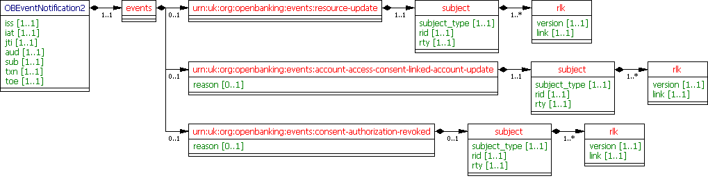
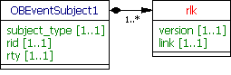
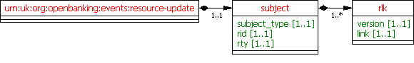
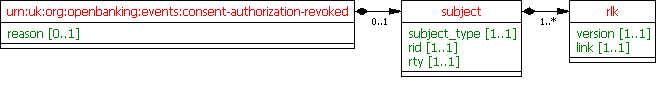
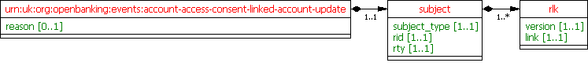

# Event Notifications - v3.1.10 <!-- omit in toc -->

- [Overview](#overview)
- [Endpoints](#endpoints)
  - [Endpoints](#endpoints-2)
    - [POST /event-notifications](#post-event-notifications)
  - [Transport Level Security](#transport-level-security)
- [Data Model](#data-model)
  - [Event Notification - Request](#event-notification---request)
    - [UML Diagram](#uml-diagram)
    - [Notes](#notes)
    - [Data Dictionary](#data-dictionary)
  - [OBEventSubject1](#obeventsubject1)
    - [UML Diagram](#uml-diagram-2)
    - [Notes](#notes-2)
    - [Data Dictionary](#data-dictionary-2)
  - [OBEventResourceUpdate2](#obeventresourceupdate2)
    - [UML Diagram](#uml-diagram-2)
    - [Data Dictionary](#data-dictionary-3)
  - [OBEventConsentAuthorizationRevoked1](#obeventconsentauthorizationrevoked1)
    - [UML Diagram](#uml-diagram-3)
    - [Notes](#notes-2)
    - [Data Dictionary](#data-dictionary-4)
  - [OBEventAccountAccessConsentLinkedAccountUpdate1](#obeventaccountaccessconsentlinkedaccountupdate1)
    - [UML Diagram](#uml-diagram-4)
    - [Notes](#notes-3)
    - [Data Dictionary](#data-dictionary-5)
- [Event Notification Retry Policy](#event-notification-retry-policy)
  - [ASPSP](#aspsp)
  - [TPP](#tpp)
- [Usage Examples](#usage-examples)
  - [Send Event Notification - Resource Update](#send-event-notification---resource-update)
    - [POST Event Notification Request](#post-event-notification-request)
    - [POST Event Notification Response](#post-event-notification-response)
  - [Send Event Notification - CBPII Consent Authorisation Revoked](#send-event-notification---cbpii-consent-authorisation-revoked)
    - [POST Event Notification Request](#post-event-notification-request-2)
    - [POST Event Notification Response](#post-event-notification-response-2)
  - [Send Event Notification - AIS Consent Authorisation Revoked](#send-event-notification---ais-consent-authorisation-revoked)
    - [POST Event Notification Request](#post-event-notification-request-3)
    - [POST Event Notification Response](#post-event-notification-response-3)

## Overview

The Event Notification resource is used by a ASPSP to notify a TPP of an event.

This resource description should be read in conjunction with a compatible Real Time Event Notification Profile.

## Endpoints

An ASPSP will send event notifications to a TPP using the event-notification resource.

### Endpoints

| Resource |HTTP Operation |Endpoint |Mandatory ? |Scope |Grant Type |Message Signing |Idempotency Key |Request Object |Response Object |
| --- |--- |--- |--- |--- |--- |--- |--- |--- |--- |
| event-notification |POST |POST /event-notifications |Optional |n/a |n/a |Signed Request |No |OBEventNotification1 | |


Notes:

* A TPP **must** make available an event notification endpoint to receive event notifications.
* A TPP **must** acknowledge an event notification with a 202 HTTP response and include the provided `x-fapi-interaction-id`.

#### POST /event-notifications

The API endpoint allows the ASPSP to send an **event-notification** resource to a TPP.

### Transport Level Security

TPP hosted endpoints **must** be protected using TLS 1.2, as per the FAPI R/W specification.

TPP hosted endpoints **must** be protected using a network certificate issued by a Trust Anchor supported by the ASPSP.

MA-TLS is not applicable to TPP hosted endpoints.

## Data Model

### Event Notification - Request

The OBEventNotification2 object will be used for a call to:

* POST /event-notifications

Note, the OBEventNotification2 object is aligned with the Security Event Token (https://tools.ietf.org/html/rfc8417). It acts as a wrapper for events contained within the events claim.

#### UML Diagram



#### Notes

- The `rid`, `rty` and `rlk` claims are prefixed with the OB namespace `http://openbanking.org.uk` in the data model. The namespace has been removed from the diagram for clarity.

#### Data Dictionary

| Name |Occurrence |XPath |EnhancedDefinition |Class |Codes |Pattern |
| --- |--- |--- |--- |--- |--- |--- |
| OBEventNotification2 |OBEventNotification2 | | |OBEventNotification2 | | |
| iss |1..1 |OBEventNotification2/iss |Issuer. |xs:anyURI | | |
| iat |1..1 |OBEventNotification2/iat |Issued At. |xs:int | | |
| jti |1..1 |OBEventNotification2/jti |JWT ID. |Max128Text | | |
| aud |1..1 |OBEventNotification2/aud |Audience. |Max128Text | | |
| sub |1..1 |OBEventNotification2/sub |Subject. |xs:anyURI | | |
| txn |1..1 |OBEventNotification2/txn |Transaction Identifier. |Max128Text | | |
| toe |1..1 |OBEventNotification2/toe |Time of Event. |xs:int | | |
| events |1..1 |OBEventNotification2/events |Events. |OBEvent2 | | |
| `urn:uk:org:openbanking:events:resource-update` |0..1 |`OBEventNotification2/events/urn:uk:org:openbanking:events:resource-update` |Resource-Update Event. |OBEventResourceUpdate2 | | |
| `urn:uk:org:openbanking:events:account-access-consent-linked-account-update` |0..1 |`OBEventNotification2/events/urn:uk:org:openbanking:events:account-access-consent-linked-account-update` |An event that indicates an account linked to a consent has move in/out of scope of the consent. |OBEventAccountAccessConsentLinkedAccountUpdate1 | | |
| `urn:uk:org:openbanking:events:consent-authorization-revoked` |0..1 |`OBEventNotification2/events/urn:uk:org:openbanking:events:consent-authorization-revoked` |An event that indicates a consent resource has had its authorisation revoked. |OBEventConsentAuthorizationRevoked1 | | |

### OBEventSubject1

This section describes the OBEventSubject1 class which is used in the OBEventResourceUpdate2, OBEventConsentAuthorizationRevoked1 and OBEventAccountAccessConsentLinkedAccountUpdate1 classes.

#### UML Diagram



#### Notes

- The `rid`, `rty` and `rlk` claims are prefixed with the OB namespace `http://openbanking.org.uk` in the data model. The namespace has been removed from the diagram for clarity.

- The array of resource links (`http://openbanking.org.uk/rlk`) **must** contain links to all supported versions of the resource.

#### Data Dictionary

| Name |Occurrence |XPath |Enhanced Definition |Class |Codes |Pattern |
| --- |--- |--- |--- |--- |--- |--- |
| OBEventSubject1 | | | |OBEventSubject1 | | |
| subject_type |1..1 |OBEventSubject1/subject_type |Subject type for the updated resource. |Max128Text |http://openbanking.org.uk/rid_http://openbanking.org.uk/rty | |
| http://openbanking.org.uk/rid |1..1 |OBEventSubject1/http://openbanking.org.uk/rid |Resource Id for the updated resource. |Max128Text | | |
| http://openbanking.org.uk/rty |1..1 |OBEventSubject1/http://openbanking.org.uk/rty |Resource Type for the updated resource. |Max128Text | | |
| http://openbanking.org.uk/rlk |1..n |OBEventSubject1/http://openbanking.org.uk/rlk |Resource links to other available versions of the resource. |OBEventLink1 | | |
| version |1..1 |OBEventSubject1/http://openbanking.org.uk/rlk/version |Resource version. |Max10Text | | |
| link |1..1 |OBEventSubject1/http://openbanking.org.uk/rlk/link |Resource link. |xs:anyURI | | |

### OBEventResourceUpdate2

This section describes the OBEventResourceUpdate2 class which is used in the OBEventNotification2 resource.

#### UML Diagram



#### Data Dictionary

| Name |Occurrence |XPath |Enhanced Definition |Class |Codes |Pattern |
| --- |--- |--- |--- |--- |--- |--- |
| `urn:uk:org:openbanking:events:resource-update` | | |An event that indicates a resource has been updated. |OBEventResourceDescriptor1 | | |
| subject |1..1 |`urn:uk:org:openbanking:events:resource-update/subject` |The subject of the event. |OBEventSubject1 | | |

### OBEventConsentAuthorizationRevoked1

This section describes the OBEventConsentAuthorizationRevoked1 class which is used in the OBEventNotification2 resource.

#### UML Diagram



#### Notes

For the OBEventConsentAuthorizationRevoked1 object:  

- The subject claim **must** be populated if the Event Notification does not include a `urn:uk:org:openbanking:events:resource-update` event.

#### Data Dictionary

| Name |Occurrence |XPath |Enhanced Definition |Class |Codes |Pattern |
| --- |--- |--- |--- |--- |--- |--- |
| `urn:uk:org:openbanking:events:consent-authorization-revoked` | | |An event that indicates a consent resource has had its authorisation revoked. |OBEventConsentAuthorizationRevoked1 | | |
| reason |0..1 |`urn:uk:org:openbanking:events:consent-authorization-revoked/reason` |Reason for the Consent Authorization Revoked event. |OBExternalEventConsentAuthorizationRevokedReason1Code | | |
| subject |0..1 |`urn:uk:org:openbanking:events:consent-authorization-revoked/subject` |The subject of the event. |OBEventSubject1 | | |

### OBEventAccountAccessConsentLinkedAccountUpdate1

This section describes the OBEventAccountAccessConsentLinkedAccountUpdate1 class which is used in the OBEventNotification2 resource.

#### UML Diagram



#### Notes

For the OBEventAccountAccessConsentLinkedAccountUpdate object: 

- The http://openbanking.org.uk/rty claim **must** be populated with "account-access-consent".

#### Data Dictionary

| Name |Occurrence |XPath |Enhanced Definition |Class |Codes |Pattern |
| --- |--- |--- |--- |--- |--- |--- |
| `urn:uk:org:openbanking:events:account-access-consent-linked-account-update` | | |An event that indicates an account linked to a consent has move in/out of scope of the consent. |OBEventAccountAccessConsentLinkedAccountUpdate1 | | |
| reason |0..1 |`urn:uk:org:openbanking:events:account-access-consent-linked-account-update/reason` |Reason for the Account Access Consent Linked Account Update event. |OBExternalEventAccountAccessConsentLinkedAccountUpdateReason1Code | | |
| subject |1..1 |`urn:uk:org:openbanking:events:account-access-consent-linked-account-update/subject` |The subject of the event. |OBEventSubject1 | | |

## Event Notification Retry Policy

### ASPSP

An ASPSP's Event Notification Retry Policy defines behaviour when an event notification is unacknowledged or the ASPSP receives a 5xx error.

* An Event Notification Retry Policy **must** define an Exponential Backoff Policy to calculate the Retry Time Interval.
* An Event Notification Retry Policy **must** define the Maximum Number of Retries an ASPSP will make before declaring the TPP Event Notification endpoint unresponsive and ceasing further attempts.
* An Event Notification Retry Policy **must** define the Maximum Time Interval for Retries, after which an ASPSP will declare the TPP Event Notification endpoint unresponsive and cease further attempts.

### TPP

A TPP **may** make GET requests for its resources if its `/event-notifications` endpoint was unavailable for the Maximum Time Interval for Retries, as defined in an ASPSP's Event Notification Retry Policy.

## Usage Examples

### Send Event Notification - Resource Update

#### POST Event Notification Request

```
POST /event-notifications HTTP/1.1
x-fapi-interaction-id: 14ba1762-a316-4a87-8d6e-5bfbefaf01d7
Content-Type: application/jwt

eyJhbGciOiJIUzI1NiIsInR5cCI6IkpXVCJ9.eyJpc3MiOiJodHRwczovL2V4YW1wbGViYW5rLmNvbS8iLCJpYXQiOiIxNTE2MjM5MDIyIiwianRpIjoiYjQ2MGEwN2MtNDk2Mi00M2QxLTg1ZWUtOWRjMTBmYmI4ZjZjIiwic3ViIjoiaHR0cHM6Ly9leGFtcGxlYmFuay5jb20vYXBpL29wZW4tYmFua2luZy92My4wL3Bpc3AvZG9tZXN0aWMtcGF5bWVudHMvcG10LTcyOTAtMDAzIiwiYXVkIjoiN3VteDVuVFIzMzgxMVF5UWZpIiwiZXZlbnRzIjp7InVybjp1azpvcmc6b3BlbmJhbmtpbmc6ZXZlbnRzOnJlc291cmNlLXVwZGF0ZSI6eyJzdWJqZWN0Ijp7InN1YmplY3RfdHlwZSI6Imh0dHA6Ly9vcGVuYmFua2luZy5vcmcudWsvcmlkX2h0dHA6Ly9vcGVuYmFua2luZy5vcmcudWsvcnR5IiwiaHR0cDovL29wZW5iYW5raW5nLm9yZy51ay9yaWQiOiJwbXQtNzI5MC0wMDMiLCJodHRwOi8vb3BlbmJhbmtpbmcub3JnLnVrL3J0eSI6ImRvbWVzdGljLXBheW1lbnQiLCJodHRwOi8vb3BlbmJhbmtpbmcub3JnLnVrL3JsayI6W3sidmVyc2lvbiI6InYzLjAiLCJsaW5rIjoiaHR0cHM6Ly9leGFtcGxlYmFuay5jb20vYXBpL29wZW4tYmFua2luZy92My4wL3Bpc3AvZG9tZXN0aWMtcGF5bWVudHMvcG10LTcyOTAtMDAzIn0seyJ2ZXJzaW9uIjoidjEuMSIsImxpbmsiOiJodHRwczovL2V4YW1wbGViYW5rLmNvbS9hcGkvb3Blbi1iYW5raW5nL3YxLjEvcGF5bWVudHMvcG10LTcyOTAtMDAzIn1dfX19LCJ0eG4iOiJkZmM1MTYyOC0zNDc5LTRiODEtYWQ2MC0yMTBiNDNkMDIzMDYiLCJ0b2UiOiIxNTE2MjM5MDIyIn0.-coUJsJVycbZufiWHi71TIQsCjP4gj9uZ4FOsNEysZ4
```

Decoded JWT Body - Event Notification Payload

```json
{
  "iss": "https://examplebank.com/",
  "iat": 1516239022,
  "jti": "b460a07c-4962-43d1-85ee-9dc10fbb8f6c",
  "sub": "https://examplebank.com/api/open-banking/v3.1/aisp/account-access-consents/aac-1234-007",
  "aud": "7umx5nTR33811QyQfi",
  "events": {
    "urn:uk:org:openbanking:events:resource-update": {
      "subject": {
        "subject_type": "http://openbanking.org.uk/rid_http://openbanking.org.uk/rty",
        "http://openbanking.org.uk/rid": "aac-1234-007",
        "http://openbanking.org.uk/rty": "account-access-consent",
        "http://openbanking.org.uk/rlk": [{
            "version": "v3.1",
            "link": "https://examplebank.com/api/open-banking/v3.1/aisp/account-access-consents/aac-1234-007"
          }
        ]
      }
    }
  },
  "txn": "dfc51628-3479-4b81-ad60-210b43d02306",
  "toe": 1516239022
}
```

#### POST Event Notification Response

```
HTTP/1.1 202 Accepted
x-fapi-interaction-id: 14ba1762-a316-4a87-8d6e-5bfbefaf01d7
```

### Send Event Notification - CBPII Consent Authorisation Revoked

In case of Funds Confirmation Consent/Authorization revocation, the state of the Consent resource is updated. This triggers following two events:

* consent-authorization-revoked and,
* resource-update.

#### POST Event Notification Request

```
POST /event-notifications HTTP/1.1
x-fapi-interaction-id: db54268f-2cc7-47e3-bf3c-4b5a7d08a614
Content-Type: application/jwt

eyJhbGciOiJIUzI1NiIsInR5cCI6IkpXVCJ9.eyJpc3MiOiJodHRwczovL2V4YW1wbGViYW5rLmNvbS8iLCJpYXQiOjE1MTYyMzkwMjIsImp0aSI6ImI0NjBhMDdjLTQ5NjItNDNkMS04NWVlLTlkYzEwZmJiOGY2YyIsInN1YiI6Imh0dHBzOi8vZXhhbXBsZWJhbmsuY29tL2FwaS9vcGVuLWJhbmtpbmcvdjMuMS9jYnBpaS9mdW5kcy1jb25maXJtYXRpb24tY29uc2VudHMvODgzNzkiLCJhdWQiOiI3dW14NW5UUjMzODExUXlRZmkiLCJldmVudHMiOnsidXJuOnVrOm9yZzpvcGVuYmFua2luZzpldmVudHM6cmVzb3VyY2UtdXBkYXRlIjp7InN1YmplY3QiOnsic3ViamVjdF90eXBlIjoiaHR0cDovL29wZW5iYW5raW5nLm9yZy51ay9yaWRfaHR0cDovL29wZW5iYW5raW5nLm9yZy51ay9ydHkiLCJodHRwOi8vb3BlbmJhbmtpbmcub3JnLnVrL3JpZCI6Ijg4Mzc5IiwiaHR0cDovL29wZW5iYW5raW5nLm9yZy51ay9ydHkiOiJmdW5kcy1jb25maXJtYXRpb24tY29uc2VudHMiLCJodHRwOi8vb3BlbmJhbmtpbmcub3JnLnVrL3JsayI6W3sidmVyc2lvbiI6InYzLjEiLCJsaW5rIjoiaHR0cHM6Ly9leGFtcGxlYmFuay5jb20vYXBpL29wZW4tYmFua2luZy92My4xL2NicGlpL2Z1bmRzLWNvbmZpcm1hdGlvbi1jb25zZW50cy84ODM3OSJ9XX19LCJ1cm46dWs6b3JnOm9wZW5iYW5raW5nOmV2ZW50czpjb25zZW50LWF1dGhvcml6YXRpb24tcmV2b2tlZCI6e319LCJ0eG4iOiJkZmM1MTYyOC0zNDc5LTRiODEtYWQ2MC0yMTBiNDNkMDIzMDYiLCJ0b2UiOjE1MTYyMzkwMjJ9.jKq6U1jKvoEF5mFAgtlJxtzaTZ2VJFsm8NoXoLOFDPc
```

Decoded JWT Body - Event Notification Payload

```json
{
  "iss": "https://examplebank.com/",
  "iat": 1516239022,
  "jti": "b460a07c-4962-43d1-85ee-9dc10fbb8f6c",
  "sub": "https://examplebank.com/api/open-banking/v3.1/cbpii/funds-confirmation-consents/88379",
  "aud": "7umx5nTR33811QyQfi",
  "events": {
    "urn:uk:org:openbanking:events:resource-update": {
      "subject": {
        "subject_type": "http://openbanking.org.uk/rid_http://openbanking.org.uk/rty",
        "http://openbanking.org.uk/rid": "88379",
        "http://openbanking.org.uk/rty": "funds-confirmation-consents",
        "http://openbanking.org.uk/rlk": [
          {
            "version": "v3.1",
            "link": "https://examplebank.com/api/open-banking/v3.1/cbpii/funds-confirmation-consents/88379"
          }
        ]
      }
    },
    "urn:uk:org:openbanking:events:consent-authorization-revoked": {}
  },
  "txn": "dfc51628-3479-4b81-ad60-210b43d02306",
  "toe": 1516239022
}
```

#### POST Event Notification Response

```
HTTP/1.1 202 Accepted
x-fapi-interaction-id: db54268f-2cc7-47e3-bf3c-4b5a7d08a614
```

### Send Event Notification - AIS Consent Authorisation Revoked

In case of Account Information Access/Authorization revocation, the state of the Consent resource is **not** updated. This triggers only one event for the underlying consent resource:

* consent-authorization-revoked

#### POST Event Notification Request

```
POST /event-notifications HTTP/1.1
x-fapi-interaction-id: db54268f-2cc7-47e3-bf3c-4b5a7d08a614
Content-Type: application/jwt

eyJhbGciOiJIUzI1NiIsInR5cCI6IkpXVCJ9.eyJpc3MiOiJodHRwczovL2V4YW1wbGViYW5rLmNvbS8iLCJpYXQiOjE1MTYyMzkwMjIsImp0aSI6ImI0NjBhMDdjLTQ5NjItNDNkMS04NWVlLTlkYzEwZmJiOGY2YyIsInN1YiI6Imh0dHBzOi8vZXhhbXBsZWJhbmsuY29tL2FwaS9vcGVuLWJhbmtpbmcvdjMuMS9haXNwL2FjY291bnQtYWNjZXNzLWNvbnNlbnRzL2FhYy0xMjM0LTAwNyIsImF1ZCI6Ijd1bXg1blRSMzM4MTFReVFmaSIsImV2ZW50cyI6eyJ1cm46dWs6b3JnOm9wZW5iYW5raW5nOmV2ZW50czpjb25zZW50LWF1dGhvcml6YXRpb24tcmV2b2tlZCI6eyJzdWJqZWN0Ijp7InN1YmplY3RfdHlwZSI6Imh0dHA6Ly9vcGVuYmFua2luZy5vcmcudWsvcmlkX2h0dHA6Ly9vcGVuYmFua2luZy5vcmcudWsvcnR5IiwiaHR0cDovL29wZW5iYW5raW5nLm9yZy51ay9yaWQiOiJhYWMtMTIzNC0wMDciLCJodHRwOi8vb3BlbmJhbmtpbmcub3JnLnVrL3J0eSI6ImFjY291bnQtYWNjZXNzLWNvbnNlbnRzIiwiaHR0cDovL29wZW5iYW5raW5nLm9yZy51ay9ybGsiOlt7InZlcnNpb24iOiJ2My4xIiwibGluayI6Imh0dHBzOi8vZXhhbXBsZWJhbmsuY29tL2FwaS9vcGVuLWJhbmtpbmcvdjMuMS9haXNwL2FjY291bnQtYWNjZXNzLWNvbnNlbnRzL2FhYy0xMjM0LTAwNyJ9XX19fSwidHhuIjoiZGZjNTE2MjgtMzQ3OS00YjgxLWFkNjAtMjEwYjQzZDAyMzA2IiwidG9lIjoxNTE2MjM5MDIyfQ.aBWXTb4_zNxY5u4TuyuAYCtHMFXntJeSnNBw6jFySF8
```

Decoded JWT Body - Event Notification Payload

```json
{
	"iss": "https://examplebank.com/",
	"iat": 1516239022,
	"jti": "b460a07c-4962-43d1-85ee-9dc10fbb8f6c",
	"sub": "https://examplebank.com/api/open-banking/v3.1/aisp/account-access-consents/aac-1234-007",
	"aud": "7umx5nTR33811QyQfi",
	"events": {
		"urn:uk:org:openbanking:events:consent-authorization-revoked": {
			"subject": {
				"subject_type": "http://openbanking.org.uk/rid_http://openbanking.org.uk/rty",
				"http://openbanking.org.uk/rid": "aac-1234-007",
				"http://openbanking.org.uk/rty": "account-access-consents",
				"http://openbanking.org.uk/rlk": [{
						"version": "v3.1",
						"link": "https://examplebank.com/api/open-banking/v3.1/aisp/account-access-consents/aac-1234-007"
					}
				]
			}
      }
   },
	"txn": "dfc51628-3479-4b81-ad60-210b43d02306",
	"toe": 1516239022
}
```

#### POST Event Notification Response

```
HTTP/1.1 202 Accepted
x-fapi-interaction-id: db54268f-2cc7-47e3-bf3c-4b5a7d08a614
```
