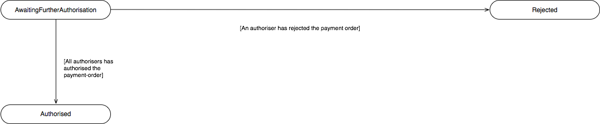

# International Payments - v3.1.10 <!-- omit in toc -->

- [Overview](#overview)
- [Endpoints](#endpoints)
  - [POST /international-payments](#post-international-payments)
    - [Status](#status)
  - [GET /international-payments/{InternationalPaymentId}](#get-international-payments-internationalpaymentid)
    - [Status](#status-2)
  - [GET /international-payments/{InternationalPaymentId}/payment-details](#get-international-payments-internationalpaymentid-payment-details)
    - [Status](#status-3)
  - [State Model](#state-model)
    - [Payment Order](#payment-order)
      - [Multiple Authorisation](#multiple-authorisation)
- [Data Model](#data-model)
  - [Reused Classes](#reused-classes)
    - [OBInternational3](#obinternational3)
    - [OBExchangeRate2](#obexchangerate2)
  - [International Payment - Request](#international-payment-request)
    - [UML Diagram](#uml-diagram)
    - [Notes](#notes)
    - [Data Dictionary](#data-dictionary)
  - [International Payment - Response](#international-payment-response)
    - [UML Diagram](#uml-diagram-2)
    - [Notes](#notes-2)
    - [Data Dictionary](#data-dictionary-2)
  - [International Payment Order - Payment Details - Response](#international-payment-order-payment-details-response)
    - [UML Diagram](#uml-diagram-3)
    - [Data Dictionary](#data-dictionary-3)

## Overview

The International Payments resource is used by a PISP to initiate an International Payment.

This resource description should be read in conjunction with a compatible Payment Initiation API Profile.

## Endpoints

| Resource |HTTP Operation |Endpoint |Mandatory ? |Scope |Grant Type |Message Signing |Idempotency Key |Request Object |Response Object |
| -------- |-------------- |-------- |----------- |----- |---------- |--------------- |--------------- |-------------- |--------------- |
| international-payments |POST |POST /international-payments |Conditional |payments |Authorization Code |Signed Request Signed Response |Yes |OBWriteInternational3 |OBWriteInternationalResponse5 |
| international-payments |GET |GET /international-payments/{InternationalPaymentId} |Mandatory (if resource POST implemented) |payments |Client Credentials |Signed Response |No |NA |OBWriteInternationalResponse5 |
| payment-details |GET |GET /international-payments/{InternationalPaymentId}/payment-details |Optional |payments |Client Credentials |Signed Response |No |NA |OBWritePaymentDetailsResponse1 |

### POST /international-payments

Once the international-payment-consent has been authorised by the PSU, the PISP can proceed to submit the international-payment for processing:

* This is done by making a POST request to the **international-payments** endpoint.
* This request is an instruction to the ASPSP to begin the international single immediate payment journey. The international payment must be submitted immediately, however, there are some scenarios where the international payment may not be executed immediately (e.g. busy periods at the ASPSP).
* The PISP **must** ensure that the Initiation and Risk sections of the international-payment match the corresponding Initiation and Risk sections of the international-payment-consent resource. If the two do not match, the ASPSP **must not** process the request and **must** respond with a 400 (Bad Request).
* Any operations on the international-payment resource will not result in a Status change for the international-payment resource.

#### Status

An international-payment can only be created if its corresponding international-payment-consent resource has the status of "Authorised". 

The international-payment resource that is created successfully must have one of the following PaymentStatusCode code-set enumerations:

| Status |
| --- |
| Pending |
| Rejected |
| AcceptedSettlementInProcess |
| AcceptedSettlementCompleted |
| AcceptedWithoutPosting |
| AcceptedCreditSettlementCompleted |

### GET /international-payments/{InternationalPaymentId}

A PISP can retrieve the international-payment to check its status.

#### Status

The international-payment resource must have one of the following PaymentStatusCode code-set enumerations:

| Status |
| --- |
| Pending |
| Rejected |
| AcceptedSettlementInProcess |
| AcceptedSettlementCompleted|
| AcceptedWithoutPosting |
| AcceptedCreditSettlementCompleted |

### GET /international-payments/{InternationalPaymentId}/payment-details

A PISP can retrieve the Details of the underlying payment transaction via this endpoint. This resource allows ASPSPs to return richer list of Payment Statuses, and if available payment scheme related statuses.

#### Status

The international-payments - payment-details must have one of the following PaymentStatusCode code-set enumerations:

| Status |
| ------ |
| Accepted |
| AcceptedCancellationRequest |
| AcceptedTechnicalValidation |
| AcceptedCustomerProfile |
| AcceptedFundsChecked |
| AcceptedWithChange |
| Pending |
| Rejected |
| AcceptedSettlementInProcess |
| AcceptedSettlementCompleted |
| AcceptedWithoutPosting |
| AcceptedCreditSettlementCompleted |
| Cancelled |
| NoCancellationProcess |
| PartiallyAcceptedCancellationRequest |
| PartiallyAcceptedTechnicalCorrect |
| PaymentCancelled |
| PendingCancellationRequest |
| Received |
| RejectedCancellationRequest |

### State Model

#### Payment Order

The state model for the international-payment resource follows the behaviour and definitions for the ISO 20022 PaymentStatusCode code-set.

The definitions for the Status:

| |Status |Payment Status Description |
| --- |------ |-------------------------- |
| 1 |Pending |Payment initiation or individual transaction included in the payment initiation is pending. Further checks and status update will be performed. |
| 2 |Rejected |Payment initiation or individual transaction included in the payment initiation has been rejected. |
| 3 |AcceptedSettlementInProcess |All preceding checks such as technical validation and customer profile were successful and therefore the payment initiation has been accepted for execution. |
| 4 |AcceptedSettlementCompleted |Settlement on the debtor's account has been completed. |
| 5 |AcceptedWithoutPosting |Payment instruction included in the credit transfer is accepted without being posted to the creditor customer’s account. |
| 6 |AcceptedCreditSettlementCompleted |Settlement on the creditor's account has been completed. |

##### Multiple Authorisation

If the payment-order requires multiple authorisations, the Status of the multiple authorisations will be updated in the MultiAuthorisation object.

The definitions for the Status:

| |Status |Status Description |
| --- |------ |------------------ |
| 1 |AwaitingFurtherAuthorisation |The payment-order resource is awaiting further authorisation. |
| 2 |Rejected |The payment-order resource has been rejected by an authoriser. |
| 3 |Authorised |The payment-order resource has been successfully authorised by all required authorisers. |

## Data Model

The data dictionary section gives the detail on the payload content for the International Payment API flows.

### Reused Classes

#### OBInternational3

The OBInternational3 class is defined in the [international-payment-consents](./international-payment-consents.md#obinternational3) page.

#### OBExchangeRate2

The OBExchangeRate2 class is defined in the [international-payment-consents](./international-payment-consents.md#obexchangerate2) page.

### International Payment - Request

The OBWriteInternational3 object will be used for a call to:

* POST /international-payments

#### UML Diagram

#### Notes 

The international-payment **request** object contains the: 

* ConsentId.
* The full Initiation and Risk objects from the international-payment request.
* The **Initiation** and **Risk** sections of the international-payment request **must** match the **Initiation** and **Risk** sections of the corresponding international-payment-consent request.

#### Data Dictionary

| Name |Occurrence |XPath |EnhancedDefinition |Class |Codes |Pattern |
| ---- |---------- |----- |------------------ |----- |----- |------- |
| OBWriteInternational3 |OBWriteInternational3 | |OBWriteInternational3 | | | |
| Data |1..1 |OBWriteInternational3/Data | |OBWriteDataInternational3 | | |
| ConsentId |1..1 |OBWriteInternational3/Data/ConsentId |OB: Unique identification as assigned by the ASPSP to uniquely identify the consent resource. |Max128Text | | |
| Initiation |1..1 |OBWriteInternational3/Data/Initiation |The Initiation payload is sent by the initiating party to the ASPSP. It is used to request movement of funds from the debtor account to a creditor for a single international payment. |OBInternational3 | | |
| Risk |1..1 |OBWriteInternational3/Risk |The Risk section is sent by the initiating party to the ASPSP. It is used to specify additional details for risk scoring for Payments. |OBRisk1 | | |

### International Payment - Response

The OBWriteInternationalResponse5 object will be used for a response to a call to:

* POST /international-payments
* GET /international-payments/{InternationalPaymentId}

#### UML Diagram

#### Notes 

The international-payment **response** object contains the:

* InternationalPaymentId.
* ConsentId.
* CreationDateTime of the international-payment resource.
* Status and StatusUpdateDateTime of the international-payment resource.
* ExpectedExecutionDateTime for the international-payment resource.
* ExpectedSettlementDateTime for the international-payment resource.
* Refund account details, if requested by PISP as part of the international-payment-consents resource.
* The Charges and ExchangeRateInformation in the international-payment-consent response from the ASPSP.
* The Initiation object from the international-payment-consent.
* The MultiAuthorisation object if the international-payment resource requires multiple authorisations.
* An ASPSP should conditionally provide `Debtor/Name` in the Payment Order Response, even when the Payer didn't provide the Debtor Account via PISP.

#### Data Dictionary

| Name |Occurrence |XPath |EnhancedDefinition |Class |Codes |Pattern |
| ---- |---------- |----- |------------------ |----- |----- |------- |
| OBWriteInternationalResponse5 | |OBWriteInternationalResponse5 | |OBWriteInternationalResponse5 | | |
| Data |1..1 |OBWriteInternationalResponse5/Data | |OBWriteDataInternationalResponse6 | | |
| InternationalPaymentId |1..1 |OBWriteInternationalResponse5/Data/InternationalPaymentId |OB: Unique identification as assigned by the ASPSP to uniquely identify the international payment resource. |Max40Text | | |
| ConsentId |1..1 |OBWriteInternationalResponse5/Data/ConsentId |OB: Unique identification as assigned by the ASPSP to uniquely identify the consent resource. |Max128Text | | |
| CreationDateTime |1..1 |OBWriteInternationalResponse5/Data/CreationDateTime |Date and time at which the resource was created. |ISODateTime | | |
| Status |1..1 |OBWriteInternationalResponse5/Data/Status |Specifies the status of the payment information group. |OBTransactionIndividualStatus1Code |AcceptedCreditSettlementCompleted AcceptedWithoutPosting AcceptedSettlementCompleted AcceptedSettlementInProcess Pending Rejected | |
| StatusUpdateDateTime |1..1 |OBWriteInternationalResponse5/Data/StatusUpdateDateTime |Date and time at which the resource status was updated. |ISODateTime | | |
| ExpectedExecutionDateTime |0..1 |OBWriteInternationalResponse5/Data/ExpectedExecutionDateTime |Expected execution date and time for the payment resource. |ISODateTime | | |
| ExpectedSettlementDateTime |0..1 |OBWriteInternationalResponse5/Data/ExpectedSettlementDateTime |Expected settlement date and time for the payment resource. |ISODateTime | | |
| Refund |0..1 |OBWriteInternationalResponse5/Data/Refund |Unambiguous identification of the refund account to which a refund will be made as a result of the transaction. |OBInternationalRefundAccount1 | | |
| Charges |0..n |OBWriteInternationalResponse5/Data/Charges |Set of elements used to provide details of a charge for the payment initiation. |OBCharge2 | | |
| ExchangeRateInformation |0..1 |OBWriteInternationalResponse5/Data/ExchangeRateInformation |Further detailed information on the exchange rate that has been used in the payment transaction. |OBExchangeRate2 | | |
| Initiation |1..1 |OBWriteInternationalResponse5/Data/Initiation |The Initiation payload is sent by the initiating party to the ASPSP. It is used to request movement of funds from the debtor account to a creditor for a single international payment. |OBInternational3 | | |
| MultiAuthorisation |0..1 |OBWriteInternationalResponse5/Data/MultiAuthorisation |The multiple authorisation flow response from the ASPSP. |OBMultiAuthorisation1 | | |
| Debtor |0..1 |OBWriteInternationalResponse5/Data/Debtor |Set of elements used to identify a person or an organisation. | | | |
| SchemeName |0..1 |OBWriteInternationalResponse5/Data/Debtor/SchemeName |Name of the identification scheme, in a coded form as published in an external list. |OBExternalAccountIdentification4Code | | |
| Identification |0..1 |OBWriteInternationalResponse5/Data/Debtor/Identification |Identification assigned by an institution to identify an account. This identification is known by the account owner. |Max256Text | | |
| Name |0..1 |OBWriteInternationalResponse5/Data/Debtor/Name |The account name is the name or names of the account owner(s) represented at an account level, as displayed by the ASPSP's online channels. Note, the account name is not the product name or the nickname of the account. |Max350Text | | |
| SecondaryIdentification |0..1 |OBWriteInternationalResponse5/Data/Debtor/SecondaryIdentification |This is secondary identification of the account, as assigned by the account servicing institution. This can be used by building societies to additionally identify accounts with a roll number (in addition to a sort code and account number combination). |Max34Text | | |

### International Payment Order - Payment Details - Response

The OBWritePaymentDetailsResponse1 object will be used for a response to a call to:

* GET /international-payments/{InternationalPaymentId}/payment-details

#### UML Diagram

#### Data Dictionary

| Name |Occurrence |XPath |EnhancedDefinition |Class |Codes |Pattern |
| ---- |---------- |----- |------------------ |----- |----- |------- |
| OBWritePaymentDetailsResponse1 | |OBWritePaymentDetailsResponse1 | |OBWritePaymentDetailsResponse1 | | |
| Data |1..1 |OBWritePaymentDetailsResponse1/Data | |OBWriteDataPaymentOrderStatusResponse1 | | |
| PaymentStatus |0..unbounded |OBWritePaymentDetailsResponse1/Data/PaymentStatus |Payment status details. |OBWritePaymentDetails1 | | |
