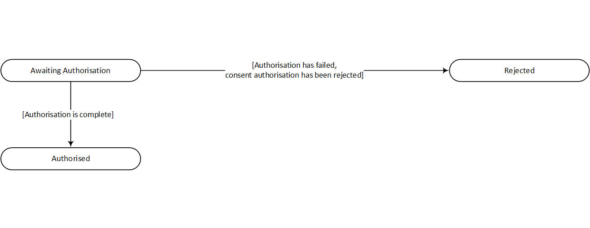

# Domestic VRP consents - v3.1.10 <!-- omit in toc -->

- [Overview](#overview)
- [Endpoints](#endpoints)
  - [POST /domestic-vrp-consents](#post-domestic-vrp-consents)
  - [GET /domestic-vrp-consents/{ConsentId}](#get-domestic-vrp-consentsconsentid)
  - [DELETE /domestic-vrp-consents/{ConsentId}](#delete-domestic-vrp-consentsconsentid)
  - [POST /domestic-vrp-consents/{ConsentId}/funds-confirmation](#post-domestic-vrp-consentsconsentidfunds-confirmation)
- [State Model - VRP consents](#state-model---vrp-consents)
- [Data Model](#data-model)
  - [OBCashAccountDebtorWithName](#obcashaccountdebtorwithname)
  - [OBCashAccountCreditor3](#obcashaccountcreditor3)
  - [OBBranchAndFinancialInstitutionIdentification6](#obbranchandfinancialinstitutionidentification6)
  - [OBDomesticVRPInitiation](#obdomesticvrpinitiation)
  - [OBDomesticVRPControlParameters](#obdomesticvrpcontrolparameters)
    - [Examples of Periodic Limits](#examples-of-periodic-limits)
      - [Example 1](#example-1)
      - [Example 2](#example-2)
      - [Example 3](#example-3)
      - [Example 4](#example-4)
  - [OBRisk1](#obrisk1)
  - [OBDomesticVRPConsentRequest](#obdomesticvrpconsentrequest)
  - [OBDomesticVRPConsentResponse](#obdomesticvrpconsentresponse)
  - [OBVRPFundsConfirmationRequest](#obvrpfundsconfirmationrequest)
  - [OBVRPFundsConfirmationResponse](#obvrpfundsconfirmationresponse)
- [Usage Examples](#usage-examples)
  
## Overview

The Domestic VRP Consents resource is used by a TPP to register a consent to initiate one or more of domestic payments within the control parameters agreed with the PSU.

This resource description should be read in conjunction with a compatible Variable Recurring Payments API Profile.

The PISP must call the end-point with the appropriate scope that they have been assigned.
The ASPSP may use the scope to limit to functionality to sweeping or non-sweeping usage of the VRP.

## Endpoints

| Resource | Operation |Endpoint |Mandatory  |Scope |Grant Type |Message Signing |Idempotency Key |Request Object |Response Object |
| -------- |-------------- |-------- |----------- |----- |---------- |--------------- |--------------- |-------------- |--------------- |
|domestic-vrp-consents |POST |POST /domestic-vrp-consents |Mandatory | payments |Client Credentials |Signed Request Signed Response |Yes | OBDomesticVRPConsentRequest |OBDomesticVRPConsentResponse |
|domestic-vrp-consents |GET |GET /domestic-vrp-consents/{ConsentId} |Mandatory | payments |Client Credentials |Signed Response |No |NA |OBDomesticVRPConsentResponse |
|domestic-vrp-consents |DELETE |DELETE /domestic-vrp-consents/{ConsentId} |Mandatory | payments |Client Credentials | NA |No |NA |None |
|domestic-vrp-consents |POST |POST /domestic-vrp-consents/{ConsentId}/funds-confirmation |Mandatory | payments |Authorization Code |Signed Request Signed Response |No |OBVRPFundsConfirmationRequest |OBVRPFundsConfirmationResponse |

### POST /domestic-vrp-consents

The API endpoint allows the TPP to ask an ASPSP to create a new `domestic-vrp-consents` resource.

The request payload may contain Debtor Accounts, but the PSU may not have been identified by the ASPSP.

The endpoint allows the TPP to send a copy of the consent (between PSU and TPP) to the ASPSP for the PSU to authorise.

The ASPSP creates the resource and responds with a unique ConsentId to refer to the resource.

The default/initial Status of the resource is set to `AwaitingAuthorisation`.

If the parameters specified by the TPP in this resource are not valid, or fail any rules, the ASPSP must return a 400 Bad Request. In such a situation a resource is not created.

The ASPSP **must** allow a PSU to have multiple VRP consents for a given account. This could include multiple consents with the same PISP.

The ASPSP **must** reject a consent request that has `Data.ControlParameters.SupplementaryData` that it cannot process.

### GET /domestic-vrp-consents/{ConsentId}

A TPP can retrieve a VRP consent resource that they have created to check its status at any point of time using this API.

### DELETE /domestic-vrp-consents/{ConsentId}

A TPP can delete a VRP consent resource that they have created by calling this API.

### POST /domestic-vrp-consents/{ConsentId}/funds-confirmation

This API endpoint allows the TPP to ask an ASPSP to confirm funds on the `DebtorAccount` associated with the `domestic-vrp-consent`.

An ASPSP can only respond to a funds confirmation request if the resource has a Status of `Authorised`.

If resource has any other Status, the ASPSP must respond with a 400 (Bad Request) and a `UK.OBIE.Resource.InvalidConsentStatus` error code.

## State Model - VRP consents

The state model for the VRP consents resource follows the generic consent state model. However, it does not use the `Consumed` status.



All `domestic-vrp-consents` start off with a state of `AwaitingAuthorisation`

Once the PSU authorises the resource - the state of the resource will be set to `Authorised`.

If the PSU rejects the consent, the state will be set to `Rejected`.

The available status codes for the VRP consents resource are:

- AwaitingAuthorisation
- Rejected
- Authorised

The definitions for the Status:

|     | Status                | Status Description                                                            |
|-----|-----------------------|-------------------------------------------------------------------------------|
| 1   | AwaitingAuthorisation | The consent resource is awaiting PSU authorisation.                           |
| 2   | Rejected              | The consent resource has been rejected.                                       |
| 3   | Authorised            | The consent resource has been successfully authorised.                        |

## Data Model

The data dictionary section gives the detail on the payload content for the VRP consent API flows.

### OBCashAccountDebtorWithName


| Name |Path |Definition | Type |
| ---- |-----|---------- |------|
| __SchemeName__ (1..1) | `SchemeName` | Name of the identification scheme, in a coded form as published in an external list. | Namespaced Enumeration OBExternalAccountIdentification4Code
| __Identification__ (1..1) | `Identification` | Identification assigned by an institution to identify an account. This identification is known by the account owner. | Max256Text
| __Name__ (1..1) | `Name` | Name of the account, as assigned by the account servicing institution.  Usage: The account name is the name or names of the account owner(s) represented at an account level. The account name is not the product name or the nickname of the account. | Max70Text  
| __SecondaryIdentification__ (0..1) | `SecondaryIdentification` | This is secondary identification of the account, as assigned by the account servicing institution.  This can be used by building societies to additionally identify accounts with a roll number (in addition to a sort code and account number combination) | Max34Text

### OBCashAccountCreditor3


| Name |Path |Definition | Type |
| ---- |-----|---------- |------|
| __SchemeName__ (1..1) | `SchemeName` | Name of the identification scheme, in a coded form as published | 
| __Identification__ (1..1) | `Identification` |Identification assigned by an institution to identify an account. This identification is known by the account owner.   |Max256Text
| __Name__ (1..1) | `Name` |Name of the account, as assigned by the account servicing institution, in consent with the account owner in order to provide an additional means of identification of the account.  Usage: The account name is different from the account owner name. The account name is used in certain user communities to provide a means of identifying the account, in addition to the account owner's identity and the account number. OB: No name validation is expected for confirmation of payee.|Max70Text  
| __SecondaryIdentification__ (0..1) | `SecondaryIdentification` |This is secondary identification of the account, as assigned by the account servicing institution.  This can be used by building societies to additionally identify accounts with a roll number__ (in addition to a sort code and account number combination).             |Max34Text

### OBBranchAndFinancialInstitutionIdentification6


| Name |Path |Definition | Type |
| ---- |-----|---------- |------|
| __SchemeName__ (0..1) | `SchemeName` |Name of the identification scheme, in a coded form as published in an external list. |OBExternalFinancialInstitutionIdentification4Code
| __Identification__ (0..1) | `Identification` |Unique and unambiguous identification of a financial institution or a branch of a financial institution.  | Max35Text  
| __Name__ (0..1) | `Name` | Name by which an agent is known and which is usually used to identify that agent. | Max140Text
| __PostalAddress__ (0..1) | `PostalAddress` |Information that locates and identifies a specific address, as defined by postal services.| OBPostalAddress6
| __AddressType__ (0..1) | `PostalAddress. AddressType` |Identifies the nature of the postal address. |OBAddressTypeCode  |Business Correspondence DeliveryTo MailTo POBox Postal Residential Statement
| __Department__ (0..1) | `PostalAddress. Department` |Identification of a division of a large organisation or building. | Max70Text  
| __SubDepartment__ (0..1) | `PostalAddress. SubDepartment` |Identification of a sub-division of a large organisation or building. |Max70Text
| __StreetName__ (0..1) | `PostalAddress. StreetName`   |Name of a street or thoroughfare.    |Max70Text  
| __BuildingNumber__ (0..1) | `PostalAddress. BuildingNumber` |Number that identifies the position of a building on a street.   |Max16Text  
| __PostCode__ (0..1) | `PostalAddress. PostCode` |Identifier consisting of a group of letters and. or numbers that is added to a postal address to assist the sorting of mail.    |Max16Text  
| __TownName__ (0..1) | `PostalAddress. TownName` |Name of a built-up area, with defined boundaries, and a local government. |Max35Text  
| __CountrySubDivision__ (0..1) | `PostalAddress. CountrySubDivision` |Identifies a subdivision of a country such as state, region, county.      |Max35Text  
| __Country__ (0..1) | `PostalAddress. Country` | Nation with its own government.      |CountryCode
| __AddressLine__  (0..7) | `PostalAddress. AddressLine` |Information that locates and identifies a specific address, as defined by postal services, presented in free format text.      |Max70Text  

### OBDomesticVRPInitiation


| Name |Path |Definition | Type |
| ---- |-----|---------- |------|
| __DebtorAccount__ (0..1) | `DebtorAccount` | Unambiguous identification of the account of the debtor to which a debit entry will be made as a result of the transaction. | [OBCashAccountDebtorWithName](#OBCashAccountDebtorWithName)
| __CreditorAgent__ (0..1) | `CreditorAgent` | Financial institution servicing an account for the creditor.     | OBBranchAndFinancialInstitutionIdentification6
| __CreditorAccount__ (0..1) | `CreditorAccount`   |Unambiguous identification of the account of the creditor to which a credit entry will be posted as a result of the payment transaction.       |OBCashAccountCreditor3
| __RemittanceInformation__ (0..1) | `RemittanceInformation`   | Information supplied to enable the matching of an entry with the items that the transfer is intended to settle, such as commercial invoices in an accounts' receivable system. | Max140Text
| __Unstructured__ (0..1) | `RemittanceInformation. Unstructured`   | Information supplied to enable the matching of an entry with the items that the transfer is intended to settle, such as commercial invoices in an accounts' receivable system | OBRemittanceInformation1
| __Reference__ (0..1) | `RemittanceInformation. Reference`   | Unique reference, as assigned by the creditor, to unambiguously refer to the payment transaction. Usage: If available, the initiating party should provide this reference in the structured remittance information, to enable reconciliation by the creditor upon receipt of the amount of money. If the business context requires the use of a creditor reference or a payment remit identification, and only one identifier can be passed through the end-to-end chain, the creditor's reference or payment remittance identification should be quoted in the end-to-end transaction identification. | Max35Text

### OBDomesticVRPControlParameters

The VRP consent is a common class used in `domestic-payment-consents` requests and responses


| Name                                | Path                                                   | Definition                                                                                                                                                                                                                                                                       | Type                                                |
|-------------------------------------|--------------------------------------------------------|----------------------------------------------------------------------------------------------------------------------------------------------------------------------------------------------------------------------------------------------------------------------------------|-----------------------------------------------------|
| __ValidFromDateTime__ (0..1)        | `ValidFromDateTime`                                    | Start date time for which the consent remains valid. <br>The time element of the date should be disregarded in computing the date range and pro-rating.                                                                                                                          | ISODateTime                                         |
| __ValidToDateTime__ (0..1)          | `ValidToDateTime`                                      | End date time for which the consent remains valid.     <br>The time element of the date should be disregarded in computing the date range and pro-rating.                                                                                                                        | ISODateTime                                         |
| __MaximumIndividualAmount__ (1..1)  | `ControlParameters. MaximumIndividualAmount`           | Maximum amount that can be specified in a payment instruction under this VRP consent                                                                                                                                                                                             | ActiveOrHistoricCurrencyAndAmount                   |
| __Amount__ (1..1)                   | `ControlParameters. MaximumIndividualAmount. Amount`   | A number of monetary units specified in an active currency where the unit of currency is explicit and compliant with ISO 4217.                                                                                                                                                   |                                                     |
| __Currency__ (1..1)                 | `ControlParameters. MaximumIndividualAmount. Currency` | A code allocated to a currency by a Maintenance Agency under an international identification scheme, as described in the latest edition of the international standard ISO 4217 "Codes for the representation of currencies and funds".                                           | ActiveOrHistoricCurrencyCode                        |
| __PeriodicLimits__ (1..*)           | `ControlParameters. PeriodicLimits`                    | Maximum amount that can be specified in all payment instructions in a given period under this VRP consent. If the `PeriodAlignment` is `Calendar`, the limit is pro-rated in the first period to the remaining number of days                                                    |                                                     |
| __PeriodType__ (1..1)               | `ControlParameters. PeriodicLimits. PeriodType`        | Period type for this period limit                                                                                                                                                                                                                                                | Day, Week, Fortnight, Month, Half-year, Year        |
| __PeriodAlignment__ (1..1)          | `ControlParameters. PeriodicLimits. PeriodAlignment`   | Specifies whether the period starts on the date of consent creation or lines up with a calendar. As the ISO calendar does not support or provide any guidance on when a fortnight should start, hence for a `PeriodType` of `Fortnight` the `PeriodAlignment` must be `Consent`. | Consent, Calendar                                   |
| __Amount__ (1..1)                   | `ControlParameters. PeriodicLimits. Amount`            | A number of monetary units specified in an active currency where the unit of currency is explicit and compliant with ISO 4217.                                                                                                                                                   |                                                     |
| __Currency__ (1..1)                 | `ControlParameters. PeriodicLimits. Currency`          | A code allocated to a currency by a Maintenance Agency under an international identification scheme, as described in the latest edition of the international standard ISO 4217 "Codes for the representation of currencies and funds".                                           | ActiveOrHistoricCurrencyCode                        |
| __VRPType__ (1..*)                  | `ControlParameters. VRPType`                           | The types of payments that can be made under this VRP consent. This can be used to indicate whether this include sweeping payment or other ecommerce payments.                                                                                                                   | OBVRPConsentType - Namespaced Enumeration           |
| __PSUAuthenticationMethods__ (1..M) | `ControlParameters. PSUAuthenticationMethods`          | Indicates that the PSU authentication methods supported.                                                                                                                                                                                                                         | OBVRPAuthenticationMethods - Namespaced Enumeration |
| __PSUInteractionTypes__ (0..M)      | `ControlParameters. PSUInteractionTypes`               | Indicates interaction type, currently if customer is present or not present.                                                                                                                                                                                                                         | OBVRPInteractionTypes                               |
| __SupplementaryData__ (0..1)        | `ControlParameters. SupplementaryData`                 | Additional information that can not be captured in the structured fields and/or any other specific block                                                                                                                                                                         | *                                                   |

#### Examples of Periodic Limits

##### Example 1
``` json

// created on 06-Jun-2021
{
  "PeriodType": "Month",
  "PeriodAlignment": "Calendar",
  "Amount": "300.00",
  "Currency": "GBP"
}
```

| Period | Start | End | Applicable Limit
|--------|-------|------|-----|
| 1      | 06-Jun-2021 | 30-Jun-2021 | 250.00 GBP |
| 2      | 01-Jul-2021 | 31-Jul-2021 | 300.00 GBP |
| 3      | 01-Aug-2021 | 31-Aug-2021 | 300.00 GBP |

##### Example 2

``` json
// created on 05-Jun-2021
{
  "PeriodType": "Month",
  "PeriodAlignment": "Consent",
  "Amount": "500.00",
  "Currency": "GBP"
}
```

| Period | Start | End | Applicable Limit
|--------|-------|------|----|
| 1      | 05-Jun-2021 | 04-Jul-2021 | 500.00 GBP |
| 2      | 05-Jul-2021 | 04-Jul-2021 | 500.00 GBP |
| 3      | 05-Aug-2021 | 04-Sep-2021 | 500.00 GBP |

##### Example 3

``` json
// created on 05-Jun-2021
{
  "PeriodType": "Year",
  "PeriodAlignment": "Calendar",
  "Amount": "500.00",
  "Currency": "GBP"
}
```

| Period | Start | End | Applicable Limit
|--------|-------|------|-----|
| 1      | 06-Jun-2021 | 31-Dec-2021 | 286.30 GBP (500 x 209 / 365) |
| 2      | 01-Jan-2022 | 31-Dec-2022 | 500.00 GBP |
| 3      | 01-Jan-2023 | 31-Dec-2023 | 500.00 GBP |

##### Example 4

``` json
// created on 05-Jun-2021
{
  "PeriodType": "Year",
  "PeriodAlignment": "Consent",
  "Amount": "500.00",
  "Currency": "GBP"
}
```

| Period | Start | End | Applicable Limit
|--------|-------|------|-----|
| 1      | 05-Jun-2021 | 04-Jun-2022 | 500.00 GBP |
| 2      | 05-Jun-2022 | 04-Jun-2023 | 500.00 GBP |
| 3      | 05-Jun-2023 | 04-Jun-2024 | 500.00 GBP |


### OBRisk1

The Risk block is a common class used in requests and responses


##### Data Dictionary

| Name                             | Occurrence | XPath                                      | EnhancedDefinition                                                                                                                                                                                                             | Class                              | Codes                                                                                                                                                                                                                                                                                                                   | Pattern |
|----------------------------------|------------|--------------------------------------------|--------------------------------------------------------------------------------------------------------------------------------------------------------------------------------------------------------------------------------|------------------------------------|-------------------------------------------------------------------------------------------------------------------------------------------------------------------------------------------------------------------------------------------------------------------------------------------------------------------------|---------|
| OBRisk1                          |            | OBRisk1                                    | The Risk section is sent by the initiating party to the ASPSP. It is used to specify additional details for risk scoring for Payments.                                                                                         | OBRisk1                            |                                                                                                                                                                                                                                                                                                                         |         |
| PaymentContextCode               | 0..1       | OBRisk1/PaymentContextCode                 | Specifies the payment context <br> Usage of BillPayment, EcommerceGoods, EcommerceServices, Other, PartyToParty is strongly discouraged. These items are deprecated and will be removed in the future version of the Standard. | OBExternalPaymentContext1Code      | <br>BillingGoodsAndServicesInAdvance <br>BillingGoodsAndServicesInArrears <br>PispPayee <br>EcommerceMerchantInitiatedPayment <br>FaceToFacePointOfSale <br>TransferToSelf <br>TransferToThirdParty  <br><br>**Deprecated values:** <br>BillPayment <br>EcommerceGoods <br>EcommerceServices <br>Other <br>PartyToParty |         |
| MerchantCategoryCode             | 0..1       | OBRisk1/MerchantCategoryCode               | **`@DEPRECATED`** Category code conform to ISO 18245, related to the type of services or goods the merchant provides for the transaction.                                                                                      | Min3Max4Text                       |                                                                                                                                                                                                                                                                                                                         |         |
| MerchantCustomerIdentification   | 0..1       | OBRisk1/MerchantCustomerIdentification     | The unique customer identifier of the PSU with the merchant.                                                                                                                                                                   | Max70Text                          |                                                                                                                                                                                                                                                                                                                         |         |
| ContractPresentInidicator        | 0..1       | OBRisk1/ContractPresentInidicator          | Indicates if Payee has a contractual relationship with the PISP.                                                                                                                                                               | Boolean                            |                                                                                                                                                                                                                                                                                                                         |         |
| BeneficiaryPrepopulatedIndicator | 0..1       | OBRisk1/BeneficiaryPrepopulatedIndicator   | Indicates if PISP has immutably prepopulated payment details in for the PSU.                                                                                                                                                   | Boolean                            |                                                                                                                                                                                                                                                                                                                         |         |
| PaymentPurposeCode               | 0..1       | OBRisk1/PaymentPurposeCode                 | Category code, related to the type of services or goods that corresponds to the underlying purpose of the payment that conforms to Recommended UK Purpose Code in ISO 20022 Payment Messaging List.                            | Min3Max4Text                       |                                                                                                                                                                                                                                                                                                                         |         |
| BeneficiaryAccountType           | 0..1       | OBRisk1/BeneficiaryAccountType             | To be provided if the AccountType is known.                                                                                                                                                                                    | OBExternalExtendedAccountType1Code | Personal<br>JointPersonal<br>PersonalSavingsAccount<br>Business<br>BusinessSavingsAccount<br>Charity<br>Collection<br>Corporate<br>Government<br>Ewallet<br>Investment<br>ISA<br>Premier<br>Wealth<br>Pension<br>                                                                                                       |         |
| DeliveryAddress                  | 0..1       | OBRisk1/DeliveryAddress                    | Information that locates and identifies a specific address, as defined by postal services or in free format text.                                                                                                              | PostalAddress2Lines                |                                                                                                                                                                                                                                                                                                                         |         |
| AddressLine                      | 0..2       | OBRisk1/DeliveryAddress/AddressLine        | Information that locates and identifies a specific address, as defined by postal services, that is presented in free format text.                                                                                              | Max70Text                          |                                                                                                                                                                                                                                                                                                                         |         |
| StreetName                       | 0..1       | OBRisk1/DeliveryAddress/StreetName         | Name of a street or thoroughfare.                                                                                                                                                                                              | Max70Text                          |                                                                                                                                                                                                                                                                                                                         |         |
| BuildingNumber                   | 0..1       | OBRisk1/DeliveryAddress/BuildingNumber     | Number that identifies the position of a building on a street.                                                                                                                                                                 | Max16Text                          |                                                                                                                                                                                                                                                                                                                         |         |
| PostCode                         | 0..1       | OBRisk1/DeliveryAddress/PostCode           | Identifier consisting of a group of letters and/or numbers that is added to a postal address to assist the sorting of mail.                                                                                                    | Max16Text                          |                                                                                                                                                                                                                                                                                                                         |         |
| TownName                         | 1..1       | OBRisk1/DeliveryAddress/TownName           | Name of a built-up area, with defined boundaries, and a local government.                                                                                                                                                      | Max35Text                          |                                                                                                                                                                                                                                                                                                                         |         |
| CountrySubDivision               | 0..1       | OBRisk1/DeliveryAddress/CountrySubDivision | Identifies a subdivision of a country, for instance state, region, county.                                                                                                                                                     | Max35Text                          |                                                                                                                                                                                                                                                                                                                         |         |
| Country                          | 1..1       | OBRisk1/DeliveryAddress/Country            | Nation with its own government, occupying a particular territory.                                                                                                                                                              | CountryCode                        | ^[A-Z]{2,2}$                                                                                                                                                                                                                                                                                                            |         |

### OBDomesticVRPConsentRequest


| Name |Path |Definition | Type |
| ---- |-----|---------- |------|
| __Data__ (0..1) | `Data`
| __Data. ReadRefundAccount__ (0..1) | `Data. ReadRefundAccount` | Indicates whether the `RefundAccount` object should be included in the response | Yes No
| __ControlParameters__ (1..1) | `Data. ControlParameters` | The control parameters under which this VRP must operate | [OBDomesticVRPControlParameters](#OBDomesticVRPControlParameters)
| __Initiation__ (1..1) | `Data. Initiation` | The parameters of the VRP consent that should remain unchanged for each payment under this VRP | [OBDomesticVRPInitiation](#OBDomesticVRPInitiation)
| __Risk__ (1..1) | `Risk` | The consent payload is sent by the initiating party to the ASPSP. It is used to request a consent to move funds from the debtor account to a creditor. | OBRisk

### OBDomesticVRPConsentResponse


| Name |Path |Definition | Type |
| ---- |-----|---------- |------|
| __Data__ (1..1) | `Data`
| __ConsentId__  (1..1)| `Data. ConsentId` | Unique identification as assigned by the ASPSP to uniquely identify the consent resource.      | Max128Text
| __Data. ReadRefundAccount__ (0..1) | `Data. ReadRefundAccount` | Indicates whether the `RefundAccount` object should be included in the response | Yes No
| __CreationDateTime__ (1..1)| `Data. CreationDateTime` | Date and time at which the resource was created.|ISODateTime
| __Status__ (1..1) | `Data. Status` | Specifies the status of resource in code form.  |Authorised AwaitingAuthorisation Rejected
| __StatusUpdateDateTime__ (1..1)| `Data. StatusUpdateDateTime` |Date and time at which the resource status was updated.  | ISODateTime  
| __ControlParameters__ (1..1) | `Data. ControlParameters` | The control parameters under which this VRP must operate | [OBDomesticVRPControlParameters](#OBDomesticVRPControlParameters)
| __Initiation__ (1..1) | `Data. Initiation` | The parameters of the VRP consent that should remain unchanged for each payment under this VRP |  [OBDomesticVRPInitiation](#OBDomesticVRPInitiation)
| __DebtorAccount__ (0..1) | `Data.DebtorAccount` | The approved DebtorAccount that the payment can be made from. THe value must be populated for GET responses once the consent is approved. | OBCashAccountDebtorWithName
| __Risk__ (1..1) | `Risk` | The consent payload is sent by the initiating party to the ASPSP. It is used to request a consent to move funds from the debtor account to a creditor. | OBRisk

### OBVRPFundsConfirmationRequest

The OBVRPFundsConfirmationRequest object must be used to request funds availability for a specific amount in the Debtor Account included in the VRP consents.


| Name |Path |Definition | Type |
| ---- |-----|---------- |------|
| __Data__ (1..1) | `Data`
| __ConsentId__ (1..1) | `Data. ConsentId` |Unique identification as assigned by the ASPSP to uniquely identify the funds confirmation consent resource.      | Max128Text
| __Reference__ (0..1) | `Data. Reference` | Unique reference, as assigned by the PISP, to unambiguously refer to the request related to the payment transaction. This must be the same value as the `Reference` field in the consent. |Max35Text
| __InstructedAmount__ (1..1) | `Data. InstructedAmount` | Amount of money to be confirmed as available funds in the debtor account. Contains an Amount and a Currency.      |OBActiveOrHistoricCurrencyAndAmount
| __Amount__ (1..1) | `Data. InstructedAmount. Amount`| A number of monetary units specified in an active currency where the unit of currency is explicit and compliant with ISO 4217.
| __Currency__ (1..1) | `Data. InstructedAmount. Currency`       |A code allocated to a currency by a Maintenance Agency under an international identification scheme, as described in the latest edition of the international standard ISO 4217 "Codes for the representation of currencies and funds". |ActiveOrHistoricCurrencyCode `^[A-Z]{3,3}$`

### OBVRPFundsConfirmationResponse

The OBVRPFundsConfirmationResponse object will be used for a response to a call to:

- POST /domestic-vrp-consents/{ConsentId}/funds-confirmation


The confirmation of funds response contains the result of a funds availability check.

| Name |Path |Definition | Type |
| ---- |-----|---------- |------|
| __Data__ (1..1)  | `Data` |
| __FundsConfirmationId__ (1..1)  | `Data. FundsConfirmationId`  |Unique identification as assigned by the ASPSP to uniquely identify the funds confirmation resource.|Max40Text
| __ConsentId__ (1..1)  | `Data. ConsentId`   |Unique identification as assigned by the ASPSP to uniquely identify the funds confirmation consent resource.   |Max128Text
| __CreationDateTime__ (1..1)  | `Data. CreationDateTime`     |Date and time at which the resource was created. |ISODateTime
| __Reference__ (0..1)  | `Data. Reference`   |Unique reference, as assigned by the PISP, to unambiguously refer to the request related to the payment transaction.   |Max35Text
| __FundsAvailableResult__ (1..1)  | `Data. FundsAvailableResult` |Result of a funds availability check.     |OBPAFundsAvailableResult1
| __FundsAvailableDateTime__  (1..1)  | `Data. FundsAvailableResult. FundsAvailableDateTime`       |Date and time at which the funds availability check was generated.     |ISODateTime
| __FundsAvailable__ (1..1)  | `Data. FundsAvailableResult. FundsAvailable`      |Availaility result, clearly indicating the availability of funds given the Amount in the request.   | Available  NotAvailable      |   |
| __InstructedAmount__ (1..1)  | `Data. InstructedAmount`     |Amount of money to be confirmed as available funds in the debtor account. Contains an Amount and a Currency.   |OBActiveOrHistoricCurrencyAndAmount
| __Amount__ (1..1)  | `Data. InstructedAmount. Amount`     |A number of monetary units specified in an active currency where the unit of currency is explicit and compliant with ISO 4217.
| __Currency__ (1..1)  | `Data. InstructedAmount. Currency`   |A code allocated to a currency by a Maintenance Agency under an international identification scheme, as described in the latest edition of the international standard ISO 4217 "Codes for the representation of currencies and funds".      |ActiveOrHistoricCurrencyCode

## Usage Examples

See [Usage Examples](../../references/usage-examples/vrp-usage-examples.md)
