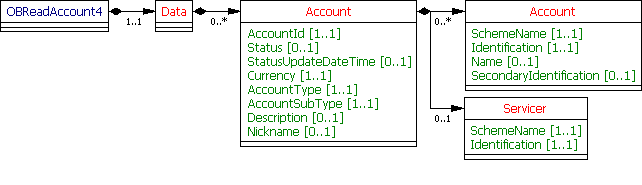

# Accounts - v3.1.2

1. [Overview](#overview)
2. [Endpoints](#endpoints)
   1. [GET /accounts](#get-accounts)
   2. [GET /accounts/{AccountId}](#get-accountsaccountid)
3. [Data Model](#data-model)
   1. [Resource Definition](#resource-definition)
   2. [UML Diagram](#uml-diagram)
   3. [Notes](#notes)
   4. [Permission Codes](#permission-codes)
   5. [Data Dictionary](#data-dictionary)
4. [Usage Examples](#usage-examples)
   1. [Bulk - Detail Permission](#bulk---detail-permission)
      1. [Get Accounts Request](#get-accounts-request)
      2. [Get Accounts Response](#get-accounts-response)
   2. [Specific Account - Detail Permission](#specific-account---detail-permission)
      1. [Get Accounts Request](#get-accounts-request-1)
      2. [Get Accounts Response](#get-accounts-response-1)
   3. [Bulk - Basic Permission](#bulk---basic-permission)
      1. [Get Accounts Request](#get-accounts-request-2)
      2. [Get Accounts Response](#get-accounts-response-2)

## Overview

The accounts resource is used by an AISP to retrieve full list of accounts and account infromation that the PSU has authorised to access.

This resource description should be read in conjunction with a compatible Account Information Services API Profile.

## Endpoints

Endpoints for the resource - and available methods.

|  |Resource |HTTP Operation |Endpoint |Mandatory? |Scope |Grant Type |Idempotency Key |Parameters |Request Object |Response Object |
| --- |--- |--- |--- |--- |--- |--- |--- |--- |--- |--- |
| 1 |accounts |GET |GET /accounts |Mandatory |accounts |Authorization Code |No |Pagination | |OBReadAccount4 |
| 2 |accounts |GET |GET /accounts/{AccountId} |Mandatory |accounts |Authorization Code |No | | |OBReadAccount4 |

### GET /accounts

*First Step
The first step for an AISP after an account-request is authorised - is to call the GET /accounts endpoint.*

An AISP will be given the full list of accounts (the AccountId(s)) that the PSU has authorised the AISP to access. The AccountId(s) returned may then be used to retrieve other resources for a specific AccountId. The selection of authorised accounts happens  **only**  at the ASPSP's interface.

### GET /accounts/{AccountId}

An AISP  **may**  retrieve the account information resources for the AccountId (which is retrieved in the call to GET /accounts).

## Data Model

The OBReadAccount4 object will be used for the call to:

* GET /accounts/{AccountId}
* GET /accounts

### Resource Definition

This resource represents the account to which credit and debit entries are made.
Each account resource will have a unique and immutable AccountId.

### UML Diagram



### Notes

* The **Account** and **Servicer** structure has been designed to: 
    * Reflect the DebtorAccount and DebtorAgent (and similarly for CreditorAccount and CreditorAgent) structures in the PISP use case. 
    * Having a SchemeName for the Account and Servicer blocks means we can be flexible to accommodate multiple types of accounts.
* For common Domestic UK identification schemes: 
    * Account/Account 
        * Where "UK.OBIE.SortCodeAccountNumber" is specified as the SchemeName, the Identification field **must** be populated with the 6 digit Sort Code and 8 digit Account Number (a 14 digit field). 
        * Where "UK.OBIE.IBAN" is specified as the SchemeName, the Identification field must be populated with the full IBAN. 
        * Where "UK.OBIE.PAN" is specified as the SchemeName, the Identification field **must** be populated with the primary PAN linked to the account. An ASPSP **may** choose to mask digits returned in the Identification field. 
    * Account/Servicer 
        * Where "UK.OBIE.BICFI" is populated as the SchemeName, the Identification field **must** be populated with the BIC.
* The SecondaryIdentification field is used to identify an account in addition to the primary Account/Identification field. SecondaryIdentification may be populated with a roll number for building societies, or a currency code where an account has multiple currency sub-accounts.

### Permission Codes

The resource differs depending on the permissions (ReadAccountsBasic and ReadAccountsDetail) used to access the resource. In the event that the resource is accessed with both ReadAccountsBasic and ReadAccountsDetail, the most detailed level (ReadAccountsDetail) must be used.

* These objects **must not** be returned **without** the **ReadAccountsDetail** permission: 
    * OBReadAccount4/Data/Account/Account 
    * OBReadAccount4/Data/Account/Servicer
* If the **ReadAccountsDetail** is granted by the PSU: 
    * OBReadAccount4/Data/Account/Account **must** be returned (1..n) 
    * OBReadAccount4/Data/Account/Servicer **may** be returned if applicable to the account and ASPSP (0..1)

If the ReadPAN permission is granted by the PSU, the ASPSP may choose to populate the OBReadAccount4/Data/Account/Account/Identification with the unmasked PAN (if the PAN is being populated in the response).

### Data Dictionary

| Name |Occurrence |XPath |EnhancedDefinition |Class |Codes |Pattern |
| --- |--- |--- |--- |--- |--- |--- |
| OBReadAccount4 | |OBReadAccount4 | |OBReadAccount4 | | |
| Data |1..1 |OBReadAccount4/Data | |OBReadDataAccount4 | | |
| Account |0..n |OBReadAccount4/Data/Account |Unambiguous identification of the account to which credit and debit entries are made. |OBAccount4 | | |
| AccountId |1..1 |OBReadAccount4/Data/Account/AccountId |A unique and immutable identifier used to identify the account resource. This identifier has no meaning to the account owner. |Max40Text | | |
| Status |0..1 |OBReadAccount4/Data/Account/Status |Specifies the status of account resource in code form. |OBAccountStatus1Code |Enabled Disabled Deleted ProForma Pending | |
| StatusUpdateDateTime |0..1 |OBReadAccount4/Data/Account/StatusUpdateDateTime |Date and time at which the resource status was updated. |ISODateTime | | |
| Currency |1..1 |OBReadAccount4/Data/Account/Currency |Identification of the currency in which the account is held. Usage: Currency should only be used in case one and the same account number covers several currencies and the initiating party needs to identify which currency needs to be used for settlement on the account. |ActiveOrHistoricCurrencyCode | |^[A-Z]{3,3}$ |
| AccountType |1..1 |OBReadAccount4/Data/Account/AccountType |Specifies the type of account (personal or business). |OBExternalAccountType1Code |Business Personal | |
| AccountSubType |1..1 |OBReadAccount4/Data/Account/AccountSubType |Specifies the sub type of account (product family group). |OBExternalAccountSubType1Code |ChargeCard CreditCard CurrentAccount EMoney Loan Mortgage PrePaidCard Savings | |
| Description |0..1 |OBReadAccount4/Data/Account/Description |Specifies the description of the account type. |Max35Text | | |
| Nickname |0..1 |OBReadAccount4/Data/Account/Nickname |The nickname of the account, assigned by the account owner in order to provide an additional means of identification of the account. |Max70Text | | |
| Account |0..n |OBReadAccount4/Data/Account/Account |Provides the details to identify an account. |OBCashAccount5 | | |
| SchemeName |1..1 |OBReadAccount4/Data/Account/Account/SchemeName |Name of the identification scheme, in a coded form as published in an external list. |OBExternalAccountIdentification4Code | | |
| Identification |1..1 |OBReadAccount4/Data/Account/Account/Identification |Identification assigned by an institution to identify an account. This identification is known by the account owner. |Max256Text | | |
| Name |0..1 |OBReadAccount4/Data/Account/Account/Name |The account name is the name or names of the account owner(s) represented at an account level, as displayed by the ASPSP's online channels. Note, the account name is not the product name or the nickname of the account. |Max70Text | | |
| SecondaryIdentification |0..1 |OBReadAccount4/Data/Account/Account/SecondaryIdentification |This is secondary identification of the account, as assigned by the account servicing institution. This can be used by building societies to additionally identify accounts with a roll number (in addition to a sort code and account number combination). |Max34Text | | |
| Servicer |0..1 |OBReadAccount4/Data/Account/Servicer |Party that manages the account on behalf of the account owner, that is manages the registration and booking of entries on the account, calculates balances on the account and provides information about the account. |OBBranchAndFinancialInstitutionIdentification5 | | |
| SchemeName |1..1 |OBReadAccount4/Data/Account/Servicer/SchemeName |Name of the identification scheme, in a coded form as published in an external list. |OBExternalFinancialInstitutionIdentification4Code | | |
| Identification |1..1 |OBReadAccount4/Data/Account/Servicer/Identification |Unique and unambiguous identification of the servicing institution. |Max35Text | | |

## Usage Examples

### Bulk - Detail Permission

The call to GET /accounts is the first step after an account-request is authorised. This will allow the AISP to discover which accounts (and AccountId values) are associated with the authorisation of consent.
In this scenario, AccountId 22289 has a building society roll number; and AccountId 31820 does not.
The  **ReadAccountsDetail**  permission has been granted.

#### Get Accounts Request

```
GET /accounts HTTP/1.1
Authorization: Bearer Az90SAOJklae
x-fapi-auth-date: Sun, 10 Sep 2017 19:43:31 GMT
x-fapi-customer-ip-address: 104.25.212.99
x-fapi-interaction-id: 93bac548-d2de-4546-b106-880a5018460d
Accept: application/json
```

#### Get Accounts Response

```
HTTP/1.1 200 OK
x-fapi-interaction-id: 93bac548-d2de-4546-b106-880a5018460d
Content-Type: application/json
```

```json
{
  "Data": {
    "Account": [
      {
        "AccountId": "22289",
		"Status": "Enabled",
		"StatusUpdateDateTime": "2019-01-01T06:06:06+00:00",
        "Currency": "GBP",
        "AccountType": "Personal",
        "AccountSubType": "CurrentAccount",
        "Nickname": "Bills",
        "Account": [
			{
	          	"SchemeName": "UK.OBIE.SortCodeAccountNumber",
          		"Identification": "80200110203345",
    	    	"Name": "Mr Kevin",
        	  	"SecondaryIdentification": "00021"
        	}
		]
      },
      {
        "AccountId": "31820",
		"Status": "Enabled",
		"StatusUpdateDateTime": "2018-01-01T06:06:06+00:00",
        "Currency": "GBP",
        "AccountType": "Personal",
        "AccountSubType": "CurrentAccount",
        "Nickname": "Household",
        "Account": [
			{
          		"SchemeName": "UK.OBIE.SortCodeAccountNumber",
          		"Identification": "80200110203348",
          		"Name": "Mr Kevin"
        	}
		]
      }
    ]
  },
  "Links": {
    "Self": "https://api.alphabank.com/open-banking/v3.1/aisp/accounts/"
  },
  "Meta": {
    "TotalPages": 1
  }
}
```

### Specific Account - Detail Permission

An AISP may also retrieve the account resource details specifically for AccountId 22289.
The  **ReadAccountsDetail**  permission has been granted.

#### Get Accounts Request

```
GET /accounts/22289 HTTP/1.1
Authorization: Bearer Az90SAOJklae
x-fapi-auth-date: Sun, 10 Sep 2017 19:43:31 GMT
x-fapi-customer-ip-address: 104.25.212.99
x-fapi-interaction-id: 93bac548-d2de-4546-b106-880a5018460d
Accept: application/json
```

#### Get Accounts Response

```
HTTP/1.1 200 OK
x-fapi-interaction-id: 93bac548-d2de-4546-b106-880a5018460d
Content-Type: application/json
```
```json
{
  "Data": {
    "Account": [
      {
        "AccountId": "22289",
		"Status": "Enabled",
		"StatusUpdateDateTime": "2019-01-01T06:06:06+00:00",
        "Currency": "GBP",
        "AccountType": "Personal",
        "AccountSubType": "CurrentAccount",
        "Nickname": "Bills",
        "Account": [
			{
          		"SchemeName": "UK.OBIE.SortCodeAccountNumber",
          		"Identification": "80200110203345",
          		"Name": "Mr Kevin",
          		"SecondaryIdentification": "00021"
        	}
		]
      }
    ]
  },
  "Links": {
    "Self": "https://api.alphabank.com/open-banking/v3.1/aisp/accounts/22289"
  },
  "Meta": {
    "TotalPages": 1
  }
}
```

### Bulk - Basic Permission

The  **ReadAccountsBasic** permission has been granted.

#### Get Accounts Request

```
GET /accounts HTTP/1.1
Authorization: Bearer Az90SAOJklae
x-fapi-auth-date:  Sun, 10 Sep 2017 19:43:31 GMT
x-fapi-customer-ip-address: 104.25.212.99
x-fapi-interaction-id: 93bac548-d2de-4546-b106-880a5018460d
Accept: application/json
```

#### Get Accounts Response

```
HTTP/1.1 200 OK
x-fapi-interaction-id: 93bac548-d2de-4546-b106-880a5018460d
Content-Type: application/json
```

```json
{
  "Data": {
    "Account": [
      {
        "AccountId": "22289",
		"Status": "Enabled",
		"StatusUpdateDateTime": "2019-01-01T06:06:06+00:00",
        "Currency": "GBP",
        "AccountType": "Personal",
        "AccountSubType": "CurrentAccount",
        "Nickname": "Bills"
      },
      {
        "AccountId": "31820",
		"Status": "Enabled",
		"StatusUpdateDateTime": "2018-01-01T06:06:06+00:00",
        "Currency": "GBP",
        "AccountType": "Personal",
        "AccountSubType": "CurrentAccount",
        "Nickname": "Household"
      }
    ]
  },
  "Links": {
    "Self": "https://api.alphabank.com/open-banking/v3.1/aisp/accounts/"
  },
  "Meta": {
    "TotalPages": 1
  }
}
```