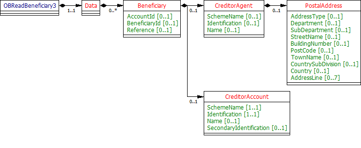

# Beneficiaries - v3.1.2

1. [Overview](#overview)
2. [Endpoints](#endpoints)
   1. [GET/accounts/{AccountId}/beneficiaries](#getaccountsaccountidbeneficiaries)
   2. [GET /beneficiaries](#get-beneficiaries)
3. [Data Model](#data-model)
   1. [Resource Definition](#resource-definition)
   2. [UML Diagram](#uml-diagram)
   3. [Notes](#notes)
   4. [Permission Codes](#permission-codes)
   5. [Data Dictionary](#data-dictionary)
4. [Usage Examples](#usage-examples)
   1. [Specific Account](#specific-account)
      1. [Get Account Beneficiaries Request](#get-account-beneficiaries-request)
   2. [Bulk](#bulk)
      1. [Get Beneficiaries Request](#get-beneficiaries-request)
      2. [Get Beneficiaries Response](#get-beneficiaries-response)

## Overview

The beneficiaries resource is used by an AISP to retrieve the account beneficiaries information for a specific AccountId or to retrieve the beneficiaries' information in bulk for account(s) that the PSU has authorised to access.

This resource description should be read in conjunction with a compatible Account Information Services API Profile.

## Endpoints

Endpoints for the resource and available methods.

|  |Resource |HTTP Operation |Endpoint |Mandatory? |Scope |Grant Type |Idempotency Key |Parameters |Request Object |Response Object |
| --- |--- |--- |--- |--- |--- |--- |--- |--- |--- |--- |
| 1 |beneficiaries |GET |GET /accounts/{AccountId}/beneficiaries |Conditional |accounts |Authorization Code |No | | |OBReadBeneficiary3 |
| 2 |beneficiaries |GET |GET /beneficiaries |Optional |accounts |Authorization Code |No |Pagination | |OBReadBeneficiary3 |

### GET/accounts/{AccountId}/beneficiaries

An AISP may retrieve the account beneficiaries information resource for a specific AccountId (which is retrieved in the call to GET /accounts).

### GET /beneficiaries

If an ASPSP has implemented the bulk retrieval endpoints for beneficiaries, an AISP may optionally retrieve the beneficiaries' information in bulk.
This endpoint will retrieve the beneficiaries' resources for all authorised accounts linked to a specific account-request.

## Data Model

The OBReadBeneficiary3 object will be used for the call to: 
* GET /accounts/{AccountId}/beneficiaries
* GET /beneficiaries

### Resource Definition

A resource that contains a set of elements that describes the list of trusted beneficiaries linked to a specific account (AccountId).

An account (AccountId) may have no trusted beneficiaries set up, or may have multiple beneficiaries set up.

In the case an ASPSP manages beneficiaries at a customer level (logged in user), instead of account level:

* If a PSU selects multiple accounts for authorisation, then their beneficiaries apply consistently to all selected accounts (i.e., in the bulk endpoint /beneficiaries).
* If a different PSU selects the same accounts, a different set of beneficiaries could be returned.

This is the expected behaviour of the beneficiaries' endpoints, in the case an ASPSP manages beneficiaries at a customer level:

* The bulk endpoint /beneficiaries will return the unique list of beneficiaries against the PSU. In this case, the AccountId in the OBReadBeneficiary3 payload would be set to NULL / empty (even if the PSU only has one account).
* The selected account endpoint /accounts/{AccountId}/beneficiaries will return the beneficiaries that **may** be accessible to the AccountId, based on the PSU. In this case, the AccountId will be populated in the payload.

### UML Diagram



### Notes

* The CreditorAccount is used consistently throughout the Account Information APIs to identify an account
* Due to internationalisation requirements: 
    * The CreditorAgent object may be used to represent either (1) the BIC (with UK.OBIE.BICFI in the SchemeName field and the BIC in the Identification field), or (2) the Name and Address details for the financial institution. 
    * The CreditorAccount/Identification field may be used to represent a non-UK specific branch and account numbering scheme with "UK.OBIE.SortCodeAccountNumber" being populated in the CreditorAccount/SchemeName.
* For the /accounts/{AccountId}/beneficiaries endpoint, the CreditorAccount and CreditorAgent blocks represent the account of the beneficiary that is receiving funds (so has been named the CreditorAccount for consistency with the PISP use case).

### Permission Codes

The resource differs depending on the permissions (ReadBeneficiariesBasic and ReadBeneficiariesDetail) used to access the resource. In the event that the resource is accessed with both ReadBeneficiariesBasic and ReadBeneficiariesDetail, the most detailed level (ReadBeneficiariesDetail) must be used.
* These objects **must not** be returned **without** the **ReadBeneficiariesDetail** permission: 
    * OBReadBeneficiary3/Data/Beneficiary/CreditorAgent 
    * OBReadBeneficiary3/Data/Beneficiary/CreditorAccount
* If the **ReadBeneficiariesDetail** is granted by the PSU:     
    * OBReadBeneficiary3/Data/Beneficiary/CreditorAgent **may** be returned if applicable to the account and ASPSP (0..1) 
    * OBReadBeneficiary3/Data/Beneficiary/CreditorAccount **must** be returned (1..1)

If the ReadPAN permission is granted by the PSU, the ASPSP may choose to populate the OBReadBeneficiary3/Data/Beneficiary/CreditorAccount/Identification with the unmasked PAN (if the PAN is being populated in the response).

### Data Dictionary

| Name |Occurrence |XPath |EnhancedDefinition |Class |Codes |Pattern |
| --- |--- |--- |--- |--- |--- |--- |
| OBReadBeneficiary3 | |OBReadBeneficiary3 | |OBReadBeneficiary3 | | |
| Data |1..1 |OBReadBeneficiary3/Data | |OBReadDataBeneficiary3 | | |
| Beneficiary |0..n |OBReadBeneficiary3/Data/Beneficiary | |OBBeneficiary3 | | |
| AccountId |0..1 |OBReadBeneficiary3/Data/Beneficiary/AccountId |A unique and immutable identifier used to identify the account resource. This identifier has no meaning to the account owner. |Max40Text | | |
| BeneficiaryId |0..1 |OBReadBeneficiary3/Data/Beneficiary/BeneficiaryId |A unique and immutable identifier used to identify the beneficiary resource. This identifier has no meaning to the account owner. |Max40Text | | |
| Reference |0..1 |OBReadBeneficiary3/Data/Beneficiary/Reference |Unique reference, as assigned by the creditor, to unambiguously refer to the payment transaction. Usage: If available, the initiating party should provide this reference in the structured remittance information, to enable reconciliation by the creditor upon receipt of the amount of money. If the business context requires the use of a creditor reference or a payment remit identification, and only one identifier can be passed through the end-to-end chain, the creditor's reference or payment remittance identification should be quoted in the end-to-end transaction identification. |Max35Text | | |
| CreditorAgent |0..1 |OBReadBeneficiary3/Data/Beneficiary/CreditorAgent |Party that manages the account on behalf of the account owner, that is manages the registration and booking of entries on the account, calculates balances on the account and provides information about the account. This is the servicer of the beneficiary account. |OBBranchAndFinancialInstitutionIdentification6 | | |
| SchemeName |0..1 |OBReadBeneficiary3/Data/Beneficiary/CreditorAgent/SchemeName |Name of the identification scheme, in a coded form as published in an external list. |OBExternalFinancialInstitutionIdentification4Code | | |
| Identification |0..1 |OBReadBeneficiary3/Data/Beneficiary/CreditorAgent/Identification |Unique and unambiguous identification of the servicing institution. |Max35Text | | |
| Name |0..1 |OBReadBeneficiary3/Data/Beneficiary/CreditorAgent/Name |Name by which an agent is known and which is usually used to identify that agent. |Max140Text | | |
| PostalAddress |0..1 |OBReadBeneficiary3/Data/Beneficiary/CreditorAgent/PostalAddress |Information that locates and identifies a specific address, as defined by postal services. |OBPostalAddress6 | | |
| AddressType |0..1 |OBReadBeneficiary3/Data/Beneficiary/CreditorAgent/PostalAddress/AddressType |Identifies the nature of the postal address. |OBAddressTypeCode |Business Correspondence DeliveryTo MailTo POBox Postal Residential Statement | |
| Department |0..1 |OBReadBeneficiary3/Data/Beneficiary/CreditorAgent/PostalAddress/Department |Identification of a division of a large organisation or building. |Max70Text | | |
| SubDepartment |0..1 |OBReadBeneficiary3/Data/Beneficiary/CreditorAgent/PostalAddress/SubDepartment |Identification of a sub-division of a large organisation or building. |Max70Text | | |
| StreetName |0..1 |OBReadBeneficiary3/Data/Beneficiary/CreditorAgent/PostalAddress/StreetName |Name of a street or thoroughfare. |Max70Text | | |
| BuildingNumber |0..1 |OBReadBeneficiary3/Data/Beneficiary/CreditorAgent/PostalAddress/BuildingNumber |Number that identifies the position of a building on a street. |Max16Text | | |
| PostCode |0..1 |OBReadBeneficiary3/Data/Beneficiary/CreditorAgent/PostalAddress/PostCode |Identifier consisting of a group of letters and/or numbers that is added to a postal address to assist the sorting of mail. |Max16Text | | |
| TownName |0..1 |OBReadBeneficiary3/Data/Beneficiary/CreditorAgent/PostalAddress/TownName |Name of a built-up area, with defined boundaries, and a local government. |Max35Text | | |
| CountrySubDivision |0..1 |OBReadBeneficiary3/Data/Beneficiary/CreditorAgent/PostalAddress/CountrySubDivision |Identifies a subdivision of a country such as state, region, county. |Max35Text | | |
| Country |0..1 |OBReadBeneficiary3/Data/Beneficiary/CreditorAgent/PostalAddress/Country |Nation with its own government. |CountryCode | |^[A-Z]{2,2}$ |
| AddressLine |0..7 |OBReadBeneficiary3/Data/Beneficiary/CreditorAgent/PostalAddress/AddressLine |Information that locates and identifies a specific address, as defined by postal services, presented in free format text. |Max70Text | | |
| CreditorAccount |0..1 |OBReadBeneficiary3/Data/Beneficiary/CreditorAccount |Provides the details to identify the beneficiary account. |OBCashAccount5 | | |
| SchemeName |1..1 |OBReadBeneficiary3/Data/Beneficiary/CreditorAccount/SchemeName |Name of the identification scheme, in a coded form as published in an external list. |OBExternalAccountIdentification4Code | | |
| Identification |1..1 |OBReadBeneficiary3/Data/Beneficiary/CreditorAccount/Identification |Identification assigned by an institution to identify an account. This identification is known by the account owner. |Max256Text | | |
| Name |0..1 |OBReadBeneficiary3/Data/Beneficiary/CreditorAccount/Name |The account name is the name or names of the account owner(s) represented at an account level, as displayed by the ASPSP's online channels. Note, the account name is not the product name or the nickname of the account. |Max70Text | | |
| SecondaryIdentification |0..1 |OBReadBeneficiary3/Data/Beneficiary/CreditorAccount/SecondaryIdentification |This is secondary identification of the account, as assigned by the account servicing institution. This can be used by building societies to additionally identify accounts with a roll number (in addition to a sort code and account number combination). |Max34Text | | |

## Usage Examples

### Specific Account

#### Get Account Beneficiaries Request

```
GET /accounts/22289/beneficiaries HTTP/1.1
Authorization: Bearer Az90SAOJklae
x-fapi-auth-date:  Sun, 10 Sep 2017 19:43:31 GMT
x-fapi-customer-ip-address: 104.25.212.99
x-fapi-interaction-id: 93bac548-d2de-4546-b106-880a5018460d
Accept: application/json
```

 #### Get Account Beneficiaries Response

```
HTTP/1.1 200 OK
x-fapi-interaction-id: 93bac548-d2de-4546-b106-880a5018460d
Content-Type: application/json
```

```json
{
  "Data": {
    "Beneficiary": [
      {
        "AccountId": "22289",
        "BeneficiaryId": "Ben1",
        "Reference": "Towbar Club",
        "CreditorAccount": {
          "SchemeName": "UK.OBIE.SortCodeAccountNumber",
          "Identification": "80200112345678",
          "Name": "Mrs Juniper"
        }
      }
    ]
  },
  "Links": {
    "Self": "https://api.alphabank.com/open-banking/v3.1/aisp/accounts/22289/beneficiaries/"
  },
  "Meta": {
    "TotalPages": 1
  }
}
```

### Bulk

#### Get Beneficiaries Request

```
GET /beneficiaries HTTP/1.1
Authorization: Bearer Az90SAOJklae
x-fapi-auth-date:  Sun, 10 Sep 2017 19:43:31 GMT
x-fapi-customer-ip-address: 104.25.212.99
x-fapi-interaction-id: 93bac548-d2de-4546-b106-880a5018460d
Accept: application/json
```

#### Get Beneficiaries Response

```
HTTP/1.1 200 OK
x-fapi-interaction-id: 93bac548-d2de-4546-b106-880a5018460d
Content-Type: application/json
```

```json
{
  "Data": {
    "Beneficiary": [
      {
        "AccountId": "22289",
        "BeneficiaryId": "Ben1",
        "Reference": "Towbar Club",
        "CreditorAccount": {
          "SchemeName": "UK.OBIE.SortCodeAccountNumber",
          "Identification": "80200112345678",
          "Name": "Mrs Juniper"
        }
      },
      {
        "AccountId": "31820",
        "BeneficiaryId": "Ben37",
        "Reference": "Golf Club",
        "CreditorAccount": {
          "SchemeName": "UK.OBIE.SortCodeAccountNumber",
          "Identification": "87562298675421",
          "Name": "Mr Large"
        }
      }
    ]
  },
  "Links": {
    "Self": "https://api.alphabank.com/open-banking/v3.1/aisp/beneficiaries/"
  },
  "Meta": {
    "TotalPages": 1
  }
}
```