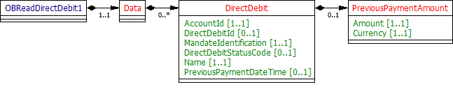

# Direct Debits - v3.1.2

1. [Overview](#overview)
2. [Endpoints](#endpoints)
   1. [GET /accounts/{AccountId}/direct-debits](#get-accountsaccountiddirect-debits)
   2. [GET /direct-debits](#get-direct-debits)
3. [Data Model](#data-model)
   1. [Resource Definition](#resource-definition)
   2. [UML Diagram](#uml-diagram)
   3. [Permission Codes](#permission-codes)
   4. [Data Dictionary](#data-dictionary)
4. [Usage Examples](#usage-examples)
   1. [Specific Account](#specific-account)
      1. [Get Accounts Direct Debits Request](#get-accounts-direct-debits-request)
      2. [Get Accounts Direct Debits Response](#get-accounts-direct-debits-response)
   2. [Bulk](#bulk)
      1. [Get Direct Debits Request](#get-direct-debits-request)
      2. [Get Direct Debits Response](#get-direct-debits-response)

## Overview

The direct-debits resource is used by an AISP to retrieve the direct debits for a specific account identified by AccountId or to retrieve direct debits for all accounts that the PSU has consented to. 

This resource description should be read in conjunction with a compatible Account Information Services API Profile.

## Endpoints

Endpoints for the resource and available methods.

|  |Resource |HTTP Operation |Endpoint |Mandatory? |Scope |Grant Type |Idempotency Key |Parameters |Request Object |Response Object |
| --- |--- |--- |--- |--- |--- |--- |--- |--- |--- |--- |
| 1 |direct-debits |GET |GET /accounts/{AccountId}/direct-debits |Conditional |accounts |Authorization Code |No | | |OBReadDirectDebit1 |
| 2 |direct-debits |GET |GET /direct-debits |Optional |accounts |Authorization Code |No |Pagination | |OBReadDirectDebit1 |

### GET /accounts/{AccountId}/direct-debits

An ASPSP must provide this endpoint for AISPs to retrieve the direct-debits for a specific account identified by AccountId.

### GET /direct-debits

An ASPSP may provide this endpoint for AISPs to retrieve direct-debits for all accounts that the PSU has consented to. This will retrieve the direct-debit resources for all authorised accounts linked to the account-request.

## Data Model

### Resource Definition

A resource that contains a set of elements that describes the list of direct debits that have been set up on a specific account (AccountId).
An account (AccountId) may have no direct debits set up, or may have multiple direct debits set up.

### UML Diagram



### Permission Codes

The resource requires the ReadDirectDebits permission. The resource response payload does not differ depending on the permissions granted.

### Data Dictionary

| Name |Occurrence |XPath |EnhancedDefinition |Class |Codes |Pattern |
| --- |--- |--- |--- |--- |--- |--- |
| OBReadDirectDebit1 | |OBReadDirectDebit1 | |OBReadDirectDebit1 | | |
| Data |1..1 |OBReadDirectDebit1/Data | |OBReadDataDirectDebit1 | | |
| DirectDebit |0..n |OBReadDirectDebit1/Data/DirectDebit |Account to or from which a cash entry is made. |OBDirectDebit1 | | |
| AccountId |1..1 |OBReadDirectDebit1/Data/DirectDebit/AccountId |A unique and immutable identifier used to identify the account resource. This identifier has no meaning to the account owner. |Max40Text | | |
| DirectDebitId |0..1 |OBReadDirectDebit1/Data/DirectDebit/DirectDebitId |A unique and immutable identifier used to identify the direct debit resource. This identifier has no meaning to the account owner. |Max40Text | | |
| MandateIdentification |1..1 |OBReadDirectDebit1/Data/DirectDebit/MandateIdentification |Direct Debit reference. For AUDDIS service users provide Core Reference. For non AUDDIS service users provide Core reference if possible or last used reference. |Max35Text | | |
| DirectDebitStatusCode |0..1 |OBReadDirectDebit1/Data/DirectDebit/DirectDebitStatusCode |Specifies the status of the direct debit in code form. |OBExternalDirectDebitStatus1Code |Active Inactive | |
| Name |1..1 |OBReadDirectDebit1/Data/DirectDebit/Name |Name of Service User. |Max70Text | | |
| PreviousPaymentDateTime |0..1 |OBReadDirectDebit1/Data/DirectDebit/PreviousPaymentDateTime |Date of most recent direct debit collection. |ISODateTime | | |
| PreviousPaymentAmount |0..1 |OBReadDirectDebit1/Data/DirectDebit/PreviousPaymentAmount |The amount of the most recent direct debit collection. |OBActiveOrHistoricCurrencyAndAmount | | |
| Amount |1..1 |OBReadDirectDebit1/Data/DirectDebit/PreviousPaymentAmount/Amount |A number of monetary units specified in an active currency where the unit of currency is explicit and compliant with ISO 4217. |OBActiveCurrencyAndAmount_SimpleType | |^\d{1,13}\.\d{1,5}$ |
| Currency |1..1 |OBReadDirectDebit1/Data/DirectDebit/PreviousPaymentAmount/Currency |A code allocated to a currency by a Maintenance Agency under an international identification scheme, as described in the latest edition of the international standard ISO 4217 "Codes for the representation of currencies and funds". |ActiveOrHistoricCurrencyCode | |^[A-Z]{3,3}$ |

## Usage Examples

### Specific Account

#### Get Accounts Direct Debits Request

```
GET /accounts/22289/direct-debits HTTP/1.1
Authorization: Bearer Az90SAOJklae
x-fapi-auth-date:  Sun, 10 Sep 2017 19:43:31 GMT
x-fapi-customer-ip-address: 104.25.212.99
x-fapi-interaction-id: 93bac548-d2de-4546-b106-880a5018460d
Accept: application/json
```

#### Get Accounts Direct Debits Response

```
HTTP/1.1 200 OK
x-fapi-interaction-id: 93bac548-d2de-4546-b106-880a5018460d
Content-Type: application/json
```

```json
{
  "Data": {
    "DirectDebit": [
      {
        "AccountId": "22289",
        "DirectDebitId": "DD03",
        "MandateIdentification": "Caravanners",
        "DirectDebitStatusCode": "Active",
        "Name": "Towbar Club 3 - We Love Towbars",
        "PreviousPaymentDateTime": "2017-04-05T10:43:07+00:00",
        "PreviousPaymentAmount": {
          "Amount": "0.57",
          "Currency": "GBP"
        }
      }
    ]
  },
  "Links": {
    "Self": "https://api.alphabank.com/open-banking/v3.1/aisp/accounts/22289/direct-debits/"
  },
  "Meta": {
    "TotalPages": 1
  }
}
```

### Bulk

#### Get Direct Debits Request

```
GET /direct-debits HTTP/1.1
Authorization: Bearer Az90SAOJklae
x-fapi-auth-date:  Sun, 10 Sep 2017 19:43:31 GMT
x-fapi-customer-ip-address: 104.25.212.99
x-fapi-interaction-id: 93bac548-d2de-4546-b106-880a5018460d
Accept: application/json
```

#### Get Direct Debits Response

```
HTTP/1.1 200 OK
x-fapi-interaction-id: 93bac548-d2de-4546-b106-880a5018460d
Content-Type: application/json
```

```json
{
  "Data": {
    "DirectDebit": [
      {
        "AccountId": "22289",
        "DirectDebitId": "DD03",
        "MandateIdentification": "Caravanners",
        "DirectDebitStatusCode": "Active",
        "Name": "Towbar Club 3 - We Love Towbars",
        "PreviousPaymentDateTime": "2017-04-05T10:43:07+00:00",
        "PreviousPaymentAmount": {
          "Amount": "0.57",
          "Currency": "GBP"
        }
      },
      {
        "AccountId": "31820",
        "DirectDebitId": "DD77",
        "MandateIdentification": "Golfers",
        "DirectDebitStatusCode": "Active",
        "Name": "Golf Club",
        "PreviousPaymentDateTime": "2017-05-06T09:00:00+00:00",
        "PreviousPaymentAmount": {
          "Amount": "22.30",
          "Currency": "GBP"
        }
      }
    ]
  },
  "Links": {
    "Self": "https://api.alphabank.com/open-banking/v3.1/aisp/direct-debits/"
  },
  "Meta": {
    "TotalPages": 1
  }
}
```