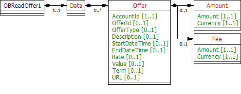

# Offers - v3.1.2

1. [Overview](#overview)
2. [Endpoints](#endpoints)
   1. [GET /accounts/{AccountId}/offers](#get-accountsaccountidoffers)
   2. [GET /offers](#get-offers)
3. [Data Model](#data-model)
   1. [Resource Definition](#resource-definition)
   2. [UML Diagram](#uml-diagram)
   3. [Notes](#notes)
   4. [Permission Codes](#permission-codes)
   5. [Data Dictionary](#data-dictionary)
4. [Usage Examples](#usage-examples)
   1. [Specific Account](#specific-account)
      1. [Get Offers Request](#get-offers-request)
      2. [Response: Get Offers Response](#response-get-offers-response)
   2. [Bulk](#bulk)
      1. [Request: Get Offers Request](#request-get-offers-request)
      2. [Response: Get Offers Response](#response-get-offers-response-1)

## Overview

The offers resource is used by an AISP to retrieve the offers available for a specific AccountId or to retrieve the offers detail in bulk for all accounts that the PSU has consented to. 

This resource description should be read in conjunction with a compatible Account Information Services API Profile.

## Endpoints

Endpoints for the resource and available methods.

|  |Resource |HTTP Operation |Endpoint |Mandatory? |Scope |Grant Type |Idempotency Key |Parameters |Request Object |Response Object |
| --- |--- |--- |--- |--- |--- |--- |--- |--- |--- |--- |
| 1 |offers |GET |GET /accounts/{AccountId}/offers |Conditional |accounts |Authorization Code |No | | |OBReadOffer1 |
| 2 |offers |GET |GET /offers |Optional |accounts |Authorization Code |No |Pagination | |OBReadOffer1 |

### GET /accounts/{AccountId}/offers

An AISP  **may**  retrieve the offers resource for a specific AccountId (which is retrieved in the call to GET /accounts).

### GET /offers

If an ASPSP has implemented the bulk retrieval endpoints, an AISP  **may**  optionally retrieve the offers in bulk. 
This will retrieve the resources for all authorised accounts linked to the account-request.

## Data Model

The OBReadOffer1 object will be used for the call to: 

* GET /accounts/{AccountId}/offers
* GET /offers

### Resource Definition

A resource that contains a set of elements that describes the list of offers available to a specific account (AccountId).

* Generic features (and pricing) for the account product will be not be available via the **offers** resources. These generic features will be available via the **product** resource.
* The outcome of any offer (or product feature) uptake will not be reported via the **offers** resource. The benefits, interest, cash-back for any account will be available via the **statements** resource (if this is available to PSUs in the existing ASPSP online channel).

An account (AccountId) may have no offers available, or may have multiple offers available.

### UML Diagram



### Notes

* Offers (or promotions) for a specific AccountId, which may be viewable in the ASPSP online banking interface, may have a complicated offer structure (which cannot be expressed using a flat Amount, Fee, Rate, or Value structure). In this case, the ASPSP must use the Description field to describe the nature of the offer in free-text

### Permission Codes

The resource requires the ReadOffers permission. The resource response payload does not differ depending on the permissions granted.

### Data Dictionary

| Name |Occurrence |XPath |EnhancedDefinition |Class |Codes |Pattern |
| --- |--- |--- |--- |--- |--- |--- |
| OBReadOffer1 | |OBReadOffer1 | |OBReadOffer1 | | |
| Data |1..1 |OBReadOffer1/Data | |OBReadDataOffer1 | | |
| Offer |0..n |OBReadOffer1/Data/Offer | |OBOffer1 | | |
| AccountId |1..1 |OBReadOffer1/Data/Offer/AccountId |A unique and immutable identifier used to identify the account resource. This identifier has no meaning to the account owner. |Max40Text | | |
| OfferId |0..1 |OBReadOffer1/Data/Offer/OfferId |A unique and immutable identifier used to identify the offer resource. This identifier has no meaning to the account owner. |Max40Text | | |
| OfferType |0..1 |OBReadOffer1/Data/Offer/OfferType |Offer type, in a coded form. |OBExternalOfferType1Code |BalanceTransfer LimitIncrease MoneyTransfer Other PromotionalRate | |
| Description |0..1 |OBReadOffer1/Data/Offer/Description |Further details of the offer. |Max500Text | | |
| StartDateTime |0..1 |OBReadOffer1/Data/Offer/StartDateTime |Date and time at which the offer starts. |ISODateTime | | |
| EndDateTime |0..1 |OBReadOffer1/Data/Offer/EndDateTime |Date and time at which the offer ends. |ISODateTime | | |
| Rate |0..1 |OBReadOffer1/Data/Offer/Rate |Rate associated with the offer type. |Max10Text | |^(-?\d{1,3}){1}(\.\d{1,4}){0,1}$ |
| Value |0..1 |OBReadOffer1/Data/Offer/Value |Value associated with the offer type. |Number | | |
| Term |0..1 |OBReadOffer1/Data/Offer/Term |Further details of the term of the offer. |Max500Text | | |
| URL |0..1 |OBReadOffer1/Data/Offer/URL |URL (Uniform Resource Locator) where documentation on the offer can be found |Max256Text | | |
| Amount |0..1 |OBReadOffer1/Data/Offer/Amount |Amount of money associated with the offer type. |OBActiveOrHistoricCurrencyAndAmount | | |
| Amount |1..1 |OBReadOffer1/Data/Offer/Amount/Amount |A number of monetary units specified in an active currency where the unit of currency is explicit and compliant with ISO 4217. |OBActiveCurrencyAndAmount_SimpleType | |^\d{1,13}\.\d{1,5}$ |
| Currency |1..1 |OBReadOffer1/Data/Offer/Amount/Currency |A code allocated to a currency by a Maintenance Agency under an international identification scheme, as described in the latest edition of the international standard ISO 4217 "Codes for the representation of currencies and funds". |ActiveOrHistoricCurrencyCode | |^[A-Z]{3,3}$ |
| Fee |0..1 |OBReadOffer1/Data/Offer/Fee |Fee associated with the offer type. |OBActiveOrHistoricCurrencyAndAmount | | |
| Amount |1..1 |OBReadOffer1/Data/Offer/Fee/Amount |A number of monetary units specified in an active currency where the unit of currency is explicit and compliant with ISO 4217. |OBActiveCurrencyAndAmount_SimpleType | |^\d{1,13}\.\d{1,5}$ |
| Currency |1..1 |OBReadOffer1/Data/Offer/Fee/Currency |A code allocated to a currency by a Maintenance Agency under an international identification scheme, as described in the latest edition of the international standard ISO 4217 "Codes for the representation of currencies and funds". |ActiveOrHistoricCurrencyCode | |^[A-Z]{3,3}$ |

## Usage Examples

### Specific Account

#### Get Offers Request

```
GET /accounts/22289/offers HTTP/1.1
Authorization: Bearer Az90SAOJklae
x-fapi-auth-date:  Sun, 10 Sep 2017 19:43:31 GMT
x-fapi-customer-ip-address: 104.25.212.99
x-fapi-interaction-id: 93bac548-d2de-4546-b106-880a5018460d
Accept: application/json
```

#### Response: Get Offers Response

```
HTTP/1.1 200 OK
x-fapi-interaction-id: 93bac548-d2de-4546-b106-880a5018460d
Content-Type: application/json
```

```json
{
  "Data": {
    "Offer": [
      {
        "AccountId": "22289",
        "OfferId": "Offer1",
        "OfferType": "LimitIncrease",
        "Description": "Credit limit increase for the account up to £10000.00",
        "Amount": {
          "Amount": "10000.00",
          "Currency": "GBP"
        }
      },
      {
        "AccountId": "22289",
        "OfferId": "Offer2",
        "OfferType": "BalanceTransfer",
        "Description": "Balance transfer offer up to £2000",
        "Amount": {
          "Amount": "2000.00",
          "Currency": "GBP"
        }
      }      
    ]
  },
  "Links": {
    "Self": "https://api.alphabank.com/open-banking/v3.1/aisp/accounts/22289/offers/"
  },
  "Meta": {
    "TotalPages": 1
  }
}
```

### Bulk

#### Request: Get Offers Request

```
GET /offers HTTP/1.1
Authorization: Bearer Az90SAOJklae
x-fapi-auth-date:  Sun, 10 Sep 2017 19:43:31 GMT
x-fapi-customer-ip-address: 104.25.212.99
x-fapi-interaction-id: 93bac548-d2de-4546-b106-880a5018460d
Accept: application/json
```

#### Response: Get Offers Response

```
HTTP/1.1 200 OK
x-fapi-interaction-id: 93bac548-d2de-4546-b106-880a5018460d
Content-Type: application/json
```

```json
{
  "Data": {
    "Offer": [
      {
        "AccountId": "22289",
        "OfferId": "Offer1",
        "OfferType": "LimitIncrease",
        "Description": "Credit limit increase for the account up to £10000.00",
        "Amount": {
          "Amount": "10000.00",
          "Currency": "GBP"
        }
      },
      {
        "AccountId": "22289",
        "OfferId": "Offer2",
        "OfferType": "BalanceTransfer",
        "Description": "Balance transfer offer up to £2000",
        "Amount": {
          "Amount": "2000.00",
          "Currency": "GBP"
        }
      },
      {
        "AccountId": "32515",
        "OfferId": "Offer3",
        "OfferType": "LimitIncrease",
        "Description": "Credit limit increase for the account up to £50000.00",
        "Amount": {
          "Amount": "50000.00",
          "Currency": "GBP"
        }
      }   
    ]
  },
  "Links": {
    "Self": "https://api.alphabank.com/open-banking/v3.1/aisp/offers/"
  },
  "Meta": {
    "TotalPages": 1
  }
}
``` 