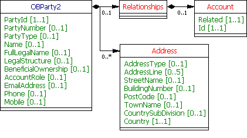
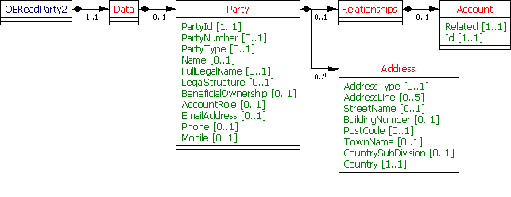

# Parties - v3.1.2

1. [Overview](#overview)
2. [Endpoints](#endpoints)
   1. [GET /accounts/{AccountId}/parties](#get-accountsaccountidparties)
   2. [GET /accounts/{AccountId}/party](#get-accountsaccountidparty)
   3. [GET /party](#get-party)
3. [Data Model](#data-model)
   1. [Reused Classes](#reused-classes)
      1. [OBParty2](#obparty2)
            1. [UML Diagram](#uml-diagram)
            2. [Notes](#notes)
            3. [Data Dictionary](#data-dictionary)
   2. [OBReadParty2](#obreadparty2)
      1. [UML Diagram](#uml-diagram-1)
      2. [Data Dictionary](#data-dictionary-1)
   3. [OBReadParty3](#obreadparty3)
      1. [UML Diagram](#uml-diagram-2)
      2. [Data Dictionary](#data-dictionary-2)
   4. [Permission Codes](#permission-codes)
4. [Usage Examples](#usage-examples)
   1. [All Parties](#all-parties)
      1. [Get Account Parties Request](#get-account-parties-request)
      2. [Get Account Parties Response](#get-account-parties-response)
   2. [All Parties](#all-parties-1)
      1. [Get Parties Request](#get-parties-request)
      2. [Get Parties Response](#get-parties-response)
   3. [Account Owner](#account-owner)
      1. [Get Account Party Request](#get-account-party-request)
   4. [Authorised User](#authorised-user)
      1. [Get Party Request](#get-party-request)

## Overview

The parties resource is used by an AISP to retrieve the details on the account owner(s)/holder(s) and operator(s) for a specific account identified by AccountId. 

The party resource is used by an AISP to retrieve the details on the account owner/holder for a specific account identified by AccountId:

* In the case of a business, this will be the details of the business
* In the case of a joint account, this will be the party that has given authorisation to the AISP to view the account.  

This resource description should be read in conjunction with a compatible Account Information Services API Profile.

## Endpoints

Endpoints for the resource and available methods.

|  |Resource |HTTP Operation |Endpoint |Mandatory? |Scope |Grant Type |Idempotency Key |Parameters |Request Object |Response Object |
| --- |--- |--- |--- |--- |--- |--- |--- |--- |--- |--- |
| 1 |parties |GET |GET /accounts/{AccountId}/parties |Conditional |accounts |Authorization Code |No | | |OBReadParty3 |
| 2 |parties |GET |GET /accounts/{AccountId}/party |Conditional |accounts |Authorization Code |No | | |OBReadParty2 |
| 3 |parties |GET |GET /party |Conditional |accounts |Authorization Code |No | | |OBReadParty2 |

### GET /accounts/{AccountId}/parties

If the ASPSP has chosen to implement the /accounts/{AccountId}/parties endpoint, the ASPSP may return details on the account owner(s)/holder(s) and operator(s).

### GET /accounts/{AccountId}/party

If the ASPSP has chosen to implement the /accounts/{AccountId}/party endpoint, the ASPSP  **must**  return details on the account owner/holder:

* In the case of a business, this will be the details of the business
* In the case of a joint account, this will be the party that has given authorisation to the AISP to view the account.

### GET /party

If the ASPSP has chosen to implement the /party endpoint, the ASPSP  **must**  return details on the user that has authorised the account-access-consent with the ASPSP:

* In the case of a business account, this will be the details of the party that has given authorisation to the AISP to view the account.
* In the case of a joint account, this will be the party that has given authorisation to the AISP to view the account.

## Data Model

The data dictionary section gives the detail on the payload content for the Party endpoints.

### Reused Classes

#### OBParty2

This section describes theOBParty2class which is reused as the Party resource in the OBReadParty2 and OBReadParty3 payloads.
The Party resource contains a set of elements that describes a party. The party may be linked to a specific account.

###### UML Diagram



###### Notes

* Each ASPSP must determine appropriate format for the full legal name. This format should be documented on ASPSP developer portals.

###### Data Dictionary

| Name |Occurence |XPath |EnhancedDefinition |Class |Codes |Pattern |
| --- |--- |--- |--- |--- |--- |--- |
| OBParty2 | |OBParty2 | |OBParty2 | | |
| PartyId |1..1 |OBParty2/PartyId |A unique and immutable identifier used to identify the customer resource. This identifier has no meaning to the account owner. |Max40Text | | |
| PartyNumber |0..1 |OBParty2/PartyNumber |Number assigned by an agent to identify its customer. |Max35Text | | |
| PartyType |0..1 |OBParty2/PartyType |Party type |OBExternalPartyType1Code |Delegate Joint Sole | |
| Name |0..1 |OBParty2/Name |Name by which a party is known and which is usually used to identify that party. |Max70Text | | |
| FullLegalName |0..1 |OBParty2/FullLegalName |The full legal name of the party. |Max350Text | | |
| LegalStructure |0..1 |OBParty2/LegalStructure |Legal standing of the party. |OBExternalLegalStructureType1Code | | |
| BeneficialOwnership |0..1 |OBParty2/BeneficialOwnership |A flag to indicate a party's beneficial ownership of the related account. |xs:boolean | | |
| AccountRole |0..1 |OBParty2/AccountRole |A party's role with respect to the related account. |OBExternalAccountRole1Code | | |
| EmailAddress |0..1 |OBParty2/EmailAddress |Address for electronic mail (e-mail). |Max256Text | | |
| Phone |0..1 |OBParty2/Phone |Collection of information that identifies a phone number as defined by telecom services. |PhoneNumber | |\+[0-9]{1,3}-[0-9()+\-]{1,30} |
| Mobile |0..1 |OBParty2/Mobile |Collection of information that identifies a mobile phone number as defined by telecom services. |PhoneNumber | |\+[0-9]{1,3}-[0-9()+\-]{1,30} |
| Relationships |0..1 |OBParty2/Relationships |The Party's relationships with other resources. |OBPartyRelationships1 | | |
| Account |0..1 |OBParty2/Relationships/Account |Relationship to the Account resource. |OBRelationship1 | | |
| Related |1..1 |OBParty2/Relationships/Account/Related |Absolute URI to the related resource. |xs:anyURI | | |
| Id |1..1 |OBParty2/Relationships/Account/Id |Unique identification as assigned by the ASPSP to uniquely identify the related resource. |Max40Text | | |
| Address |0..n |OBParty2/Address |Postal address of a party. |OBPostalAddress8 | | |
| AddressType |0..1 |OBParty2/Address/AddressType |Identifies the nature of the postal address. |OBAddressTypeCode |Business Correspondence DeliveryTo MailTo POBox Postal Residential Statement | |
| AddressLine |0..5 |OBParty2/Address/AddressLine |Information that locates and identifies a specific address, as defined by postal services, that is presented in free format text. |Max70Text | | |
| StreetName |0..1 |OBParty2/Address/StreetName |Name of a street or thoroughfare. |Max70Text | | |
| BuildingNumber |0..1 |OBParty2/Address/BuildingNumber |Number that identifies the position of a building on a street. |Max16Text | | |
| PostCode |0..1 |OBParty2/Address/PostCode |Identifier consisting of a group of letters and/or numbers that is added to a postal address to assist the sorting of mail. |Max16Text | | |
| TownName |0..1 |OBParty2/Address/TownName |Name of a built-up area, with defined boundaries, and a local government. |Max35Text | | |
| CountrySubDivision |0..1 |OBParty2/Address/CountrySubDivision |Identifies a subdivision of a country eg, state, region, county. |Max35Text | | |
| Country |1..1 |OBParty2/Address/Country |Nation with its own government, occupying a particular territory. |CountryCode | |^[A-Z]{2,2}$ |

### OBReadParty2

The OBReadParty2 object will be used for the call to: 

* GET /accounts/{AccountId}/party
* GET /party

The response to GET /accounts/{AccountId}/party and GET /party (if available)  **must**  contain at most one party.

#### UML Diagram



#### Data Dictionary

| Name |Occurrence |XPath |EnhancedDefinition |Class |Codes |Pattern |
| --- |--- |--- |--- |--- |--- |--- |
| OBReadParty2 | |OBReadParty2 | |OBReadParty2 | | |
| Data |1..1 |OBReadParty2/Data | |OBReadDataParty2 | | |
| Party |0..1 |OBReadParty2/Data/Party | |OBParty2 | | |


### OBReadParty3

The OBReadParty3 object will be used for the call to: 

* GET /accounts/{AccountId}/parties

The response to GET /accounts/{AccountId}/parties  **may**  contain multiple parties.

#### UML Diagram


#### Data Dictionary

| Name |Occurrence |XPath |EnhancedDefinition |Class |Codes |Pattern |
| --- |--- |--- |--- |--- |--- |--- |
| OBReadParty3 | |OBReadParty3 | |OBReadParty3 | | |
| Data |1..1 |OBReadParty3/Data | |OBReadDataParty3 | | |
| Party |0..n |OBReadParty3/Data/Party | |OBParty2 | | |

### Permission Codes

The ReadPartypermission is required to access GET /accounts/{AccountId}/party or GET /accounts/{AccountId}/parties. The resource response payload does not differ depending on the permissions granted.

The ReadPartyPSU permission is required to access GET /party. The resource response payload does not differ depending on the permissions granted.

## Usage Examples

### All Parties

#### Get Account Parties Request

```
GET /accounts/22289/parties HTTP/1.1
Authorization: Bearer Az90SAOJklae
x-fapi-auth-date:  Sun, 10 Sep 2017 19:43:31 GMT
x-fapi-customer-ip-address: 104.25.212.99
x-fapi-interaction-id: 93bac548-d2de-4546-b106-880a5018460d
Accept: application/json
```

#### Get Account Parties Response

```
HTTP/1.1 200 OK
x-fapi-interaction-id: 93bac548-d2de-4546-b106-880a5018460d
Content-Type: application/json
```

```json
{
    "Data": {
        "Party": [
            {
                "PartyId": "PABC123",
                "PartyType": "Sole",
                "Name": "Semiotec",
                "FullLegalName": "Semiotec Limited",
                "LegalStructure": "UK.OBIE.PrivateLimitedCompany",
                "BeneficialOwnership": true,
                "AccountRole": "UK.OBIE.Principal",
                "EmailAddress": "contact@semiotec.co.jp",
                "Relationships": {
                    "Account": {
                        "Related": "https://api.alphabank.com/open-banking/v4.0/aisp/accounts/22289",
                        "Id": "22289"
                    }
                },
                "Address": [
                    {
                        "AddressType": "Business",
                        "StreetName": "Street",
                        "BuildingNumber": "15",
                        "PostCode": "NW1 1AB",
                        "TownName": "London",
                        "Country": "GB"
                    }
                ]
            },
            {
                "PartyId": "PXSIF023",
                "PartyNumber": "0000007456",
                "PartyType": "Delegate",
                "Name": "Kevin Atkinson",
                "FullLegalName": "Mr Kevin Bartholmew Atkinson",
                "LegalStructure": "UK.OBIE.Individual",
                "BeneficialOwnership": false,
                "AccountRole": "UK.OBIE.Administrator",
                "EmailAddress": "kev@semiotec.co.jp",
                "Relationships": {
                    "Account": {
                        "Related": "https://api.alphabank.com/open-banking/v4.0/aisp/accounts/22289",
                        "Id": "22289"
                    }
                }
            }
        ]
    },
    "Links": {
        "Self": "https://api.alphabank.com/open-banking/v4.0/aisp/accounts/22289/parties"
    },
    "Meta": {
        "TotalPages": 1
    }
}
```

### All Parties

#### Get Parties Request

```
GET /accounts/89019/parties HTTP/1.1
Authorization: Bearer k4tsuc4r1
x-fapi-auth-date:  Sun, 10 Sep 2018 19:43:31 GMT
x-fapi-customer-ip-address: 104.25.212.99
x-fapi-interaction-id: 0761c465-0f8c-43d1-8952-f2cd7fa1aa8b
Accept: application/json
```

#### Get Parties Response

```
HTTP/1.1 200 OK
x-fapi-interaction-id: 0761c465-0f8c-43d1-8952-f2cd7fa1aa8b
Content-Type: application/json
```

```json
{
    "Data": {
        "Party": [
            {
                "PartyId": "1982001",
                "PartyNumber": "20202001",
                "PartyType": "Sole",
                "Name": "Roses and Thorns Limited",
                "FullLegalName": "Roses and Thorns Limited",
                "LegalStructure": "UK.OBIE.PrivateLimitedCompany",
                "BeneficialOwnership": true,
                "AccountRole": "UK.OBIE.Principal",
                "EmailAddress": "speakup@rosesandthorns.co.uk",
                "Phone": "++4455565411099",
                "Mobile": "+4455565411098",
                "Relationships": [
                    {
                        "Related": "https://api.alphabank.com/open-banking/v4.0/aisp/accounts/89019",
                        "Id": "89019"
                    }
                ],
                "Address": [
                    {
                        "AddressType": "Business",
                        "StreetName": "Thomas More Square",
                        "BuildingNumber": "2",
                        "PostCode": "E1W 1YN",
                        "TownName": "London",
                        "Country": "GB"
                    }
                ]
            },
            {
                "PartyId": "1982002",
                "PartyNumber": "20202002",
                "Name": "Neil Example",
                "FullLegalName": "Mr Neil Paul Example",
                "LegalStructure": "UK.OBIE.Individual",
                "BeneficialOwnership": false,
                "AccountRole": "UK.OBIE.SeniorManagingOfficial",
                "EmailAddress": "neil@rosesandthorns.co.uk",
                "Phone": "+4455565411097",
                "Mobile": "+4455565411096",
                "Relationships": [
                    {
                        "Related": "https://api.alphabank.com/open-banking/v4.0/aisp/accounts/89019",
                        "Id": "89019"
                    }
                ],
                "Address": [
                    {
                        "AddressType": "Residential",
                        "StreetName": "Thomas More Square",
                        "BuildingNumber": "1",
                        "PostCode": "E1W 1YN",
                        "TownName": "London",
                        "Country": "GB"
                    }
                ]
            }
        ]
    },
    "Links": {
        "Self": "https://api.alphabank.com/open-banking/v4.0/aisp/accounts/89019/parties"
    },
    "Meta": {
        "TotalPages": 1
    }
}
```

### Account Owner

#### Get Account Party Request

```
GET /accounts/22289/party HTTP/1.1
Authorization: Bearer Az90SAOJklae
x-fapi-auth-date:  Sun, 10 Sep 2017 19:43:31 GMT
x-fapi-customer-ip-address: 104.25.212.99
x-fapi-interaction-id: 7f570e68-c7f0-44e2-a934-a854d2ca8cca
Accept: application/json
```

 #### Get Account Party Response

```
HTTP/1.1 200 OK
x-fapi-interaction-id: 7f570e68-c7f0-44e2-a934-a854d2ca8cca
Content-Type: application/json
```

```json
{
  "Data": {
    "Party": {
      "PartyId": "PABC123",
      "PartyType": "Sole",
      "Name": "Semiotec",
      "Email": "contact@semiotec.co.jp",
	  "Address": {
		"AddressType": "Business",
		"StreetName": "Street",
		"BuildingNumber": "15",
		"PostCode": "NW1 1AB",
		"TownName": "London",
		"Country": "GB"
      }
    }
  },
  "Links": {
    "Self": "https://api.alphabank.com/open-banking/v4.0/aisp/accounts/22289/party/"
  },
  "Meta": {
    "TotalPages": 1
  }
}
```

### Authorised User

#### Get Party Request

```
GET /party HTTP/1.1
Authorization: Bearer Az90SAOJklae
x-fapi-auth-date:  Sun, 10 Sep 2017 19:43:31 GMT
x-fapi-customer-ip-address: 104.25.212.99
x-fapi-interaction-id: 7903ae4f-bbdf-4291-bb23-bd44daf7bc24
Accept: application/json
```

 #### Get Party Response

```
HTTP/1.1 200 OK
x-fapi-interaction-id: 7903ae4f-bbdf-4291-bb23-bd44daf7bc24
Content-Type: application/json
```

```json
{
  "Data": {
    "Party": {
      "PartyId": "PXSIF023",
      "PartyType": "Delegate",
      "Name": "Mr D User",
      "EmailAddress": "d.user@semiotec.co.jp"
    }
  },
  "Links": {
    "Self": "https://api.alphabank.com/open-banking/v4.0/aisp/party/"
  },
  "Meta": {
    "TotalPages": 1
  }
}
```