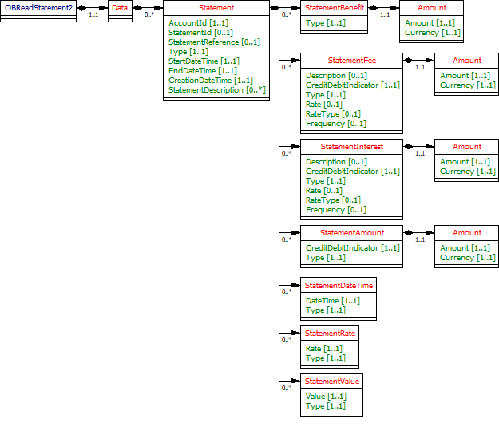

# Statements - v3.1.2

1. [Overview](#overview)
2. [Endpoints](#endpoints)
   1. [GET /accounts/{AccountId}/statements](#get-accountsaccountidstatements)
   2. [GET /accounts/{AccountId}/statements/{StatementId}](#get-accountsaccountidstatementsstatementid)
   3. [GET /accounts/{AccountId}/statements/{StatementId}/file](#get-accountsaccountidstatementsstatementidfile)
   4. [GET /accounts/{AccountId}/statements/{StatementId}/transactions](#get-accountsaccountidstatementsstatementidtransactions)
   5. [GET /statements](#get-statements)
3. [Data Model](#data-model)
   1. [Resource Definition](#resource-definition)
   2. [UML Diagram](#uml-diagram)
   3. [Notes](#notes)
   4. [Filtering](#filtering)
      1. [Filtering Examples](#filtering-examples)
   5. [Permission Codes](#permission-codes)
   6. [Data Dictionary](#data-dictionary)
4. [Usage Examples](#usage-examples)
   1. [Specific Account](#specific-account)
      1. [Get Account Statements Request](#get-account-statements-request)
      2. [Get Account Statements Response](#get-account-statements-response)
   2. [Bulk](#bulk)
      1. [Get Statements Request](#get-statements-request)
      2. [Get Statements Response](#get-statements-response)

## Overview

The statements resource is used by an AISP to retrieve the 

* statements information
* statement information for a StatementId in json and non-json(file) format.
* transactions for a selected StatementId

for a specific account identified by AccountId or retrieve statement information for all accounts that the PSU has consented to.

This resource description should be read in conjunction with a compatible Account Information Services API Profile.

## Endpoints

Endpoints for the resource and available methods.

|  |Resource |HTTP Operation |Endpoint |Mandatory? |Scope |Grant Type |Idempotency Key |Parameters |Request Object |Response Object |
| --- |--- |--- |--- |--- |--- |--- |--- |--- |--- |--- |
| 1 |statements |GET |GET /accounts/{AccountId}/statements |Conditional |accounts |Authorization Code |No |Pagination Filtering | |OBReadStatement2 |
| 2 |statements |GET |GET /accounts/{AccountId}/statements/{StatementId} |Conditional |accounts |Authorization Code |No |Pagination | |OBReadStatement2 |
| 3 |statements |GET |GET /accounts/{AccountId}/statements/{StatementId}/file |Optional |accounts |Authorization Code |No | | |File |
| 4 |transactions |GET |GET /accounts/{AccountId}/statements/{StatementId}/transactions |Conditional |accounts |Authorization Code |No |Pagination | |OBReadTransaction5 |
| 5 |statements |GET |GET /statements |Optional |accounts |Authorization Code |No |Pagination Filtering | |OBReadStatement2 |

### GET /accounts/{AccountId}/statements

An ASPSP may provide this endpoint for AISPs to retrieve the statements information resource for the AccountId (which is retrieved in the call to GET /accounts).

### GET /accounts/{AccountId}/statements/{StatementId}

An ASPSP may provide this endpoint for AISPs to retrieve the statement information resource for a specific statement in the AccountId (which is retrieved in the call to GET /accounts).

### GET /accounts/{AccountId}/statements/{StatementId}/file

An ASPSP may provide this endpoint for AISPs to retrieve a non-json representation of a specific statement.

### GET /accounts/{AccountId}/statements/{StatementId}/transactions

An ASPSP may provide this endpoint for AISPs to retrieve transactions that appear on the selected statement.
The data model for the returned objects is documented in the  **transactions**  resource.

### GET /statements

An ASPSP may provide this endpoint for AISPs to retrieve statement information for all accounts that the PSU has consented to. This will retrieve the statement resources for all authorised accounts linked to the account-request.

## Data Model

The OBReadStatement2 object will be used for the call to:

* GET /statements
* GET /accounts/{AccountId}/statements
* GET /accounts/{AccountId}/statements/{StatementId}

The call to

* GET /accounts/{AccountId}/statements/{StatementId}/file

will return unstructured data in binary (e.g., pdf, doc) or text (e.g., csv) formats. This will be specified in the Accept header by the AISP.

The OBReadTransaction3 object (documented in the transactions resource) will be used the call to:

* GET /accounts/{AccountId}/statements/{StatementId}/transactions

### Resource Definition

A resource that describes summary details for an account statement period.
For a specific date range, an account (AccountId) may have no statements, or may have multiple statements.
The /statements endpoint (if implemented by the ASPSP) **must** return all statements within the requested date range for all accounts selected during the authorisation of the account-request.
If an AISP would like to access a specific statement (StatementId) to retrieve a formal statement download or transactions for a specific statement - the AISP **must** specify the account (the AccountId) via the URI request path i.e., via:

* GET /accounts/{AccountId}/statements/{StatementId}/file - to download the statement.
* GET /accounts/{AccountId}/statements/{StatementId}/transactions - to return the transactions relating to a statement.

### UML Diagram



### Notes

* The statements resource **must** only be used for data that can be returned for a statement period.
* StartDateTime, EndDateTime and CreationDateTime are mandatory for the statements resource. If an ASPSP does not display these dates in an online channel, the ASPSP must populate these dates with sensible values. E.g., the StartDateTime could be the day after the previous statement EndDateTime, and the CreationDateTime could be the day after the EndDateTime.

### Filtering

Limited support for filtering is provided on the  **statements** resource.

| Name |Occurrence |Enhanced Definition |Class |
| --- |--- |--- |--- |
| fromStatementDateTime |0..1 |Specifies start date and time for filtering of the Statements on the Statement/StartDateTime field. If this is not populated, the start date will be open ended |ISODateTime |
| toStatementDateTime |0..1 |Specifies end date and time for filtering of the Statements on the Statement/StartDateTime field. If this is not populated, the end date will be open ended |ISODateTime |

The ASPSP must treat the following as valid input:

* non-working days (e.g. a Sunday or a Bank holiday) or any other days on which no transactions are recorded
* dates that fall outside the range for which transaction information is provided through APIs
* dates that fall outside the range for which a consent authorisation is available.

In the above situations, the ASPSP must return statements where the StartDateTime and EndDateTime are both between the  **fromStatementDateTime**  and **toStatementDateTime** parameters.

#### Filtering Examples

```
// All statements from 1st Jan, 2015
GET /statements?fromStatementDateTime=2015-01-01T00:00:00
 
// All statements in 2016
GET /statements?fromStatementDateTime=2016-01-01T00:00:00&amp;toStatementDateTime=2016-12-31T23:59:59
 
// All statements in a specific account up to 31-Mar-2017
GET /accounts/1/statements?toStatementDateTime=2017-03-31T23:59:59
```

### Permission Codes

The resource differs depending on the permissions (ReadStatementsBasic and ReadStatementsDetail) used to access resource (the OBReadStatement2 object). In the event the resource is accessed with both ReadStatementsBasic and ReadStatementsDetail, the most detailed level (ReadStatementsDetail) must be used.

* These objects **must not** be returned **without** the **ReadStatementsDetail** permission:
* OBReadStatement2/Data/Statement/StatementAmount
* Calls to GET /accounts/{AccountId}/statements/{StatementId}/file

* If the **ReadStatementsDetail** is granted by the PSU: 
    * OBReadStatement2/Data/Statement/StatementAmount **may** be returned if applicable to the statement and ASPSP (0..n)

For the call toGET /accounts/{AccountId}/statements/{StatementId}/transactions:

* The **ReadTransactionsBasic or** **ReadTransactionsDetail** (in addition to the appropriate **ReadTransactionsCredits** and/or **ReadTransactionsDebits** ) permission codes will be required. The ASPSP must apply the same access to GET /accounts/{AccountId}/statements/{StatementId}/transactions as GET /accounts/{AccountId}/transactions
* If the ReadPAN permission is granted by the PSU - the ASPSP may choose to populate the unmasked PAN - if the PAN is being populated in the response for these fields: 
    * OBReadTransaction3/Data/Transaction/CreditorAgent/Identification 
    * OBReadTransaction3/Data/Transaction/DebtorAccount/Identification 
    * OBReadTransaction3/Data/Transaction/CardInstrument/Identification


### Data Dictionary

| Name |Occurrence |XPath |EnhancedDefinition |Class |Codes |Pattern |
| --- |--- |--- |--- |--- |--- |--- |
| OBReadStatement2 | |OBReadStatement2 | |OBReadStatement2 | | |
| Data |1..1 |OBReadStatement2/Data | |OBReadDataStatement2 | | |
| Statement |0..n |OBReadStatement2/Data/Statement |Provides further details on a statement resource. |OBStatement2 | | |
| AccountId |1..1 |OBReadStatement2/Data/Statement/AccountId |A unique and immutable identifier used to identify the account resource. This identifier has no meaning to the account owner. |Max40Text | | |
| StatementId |0..1 |OBReadStatement2/Data/Statement/StatementId |Unique identifier for the statement resource within an servicing institution. This identifier is both unique and immutable. |Max40Text | | |
| StatementReference |0..1 |OBReadStatement2/Data/Statement/StatementReference |Unique reference for the statement. This reference may be optionally populated if available. |Max35Text | | |
| Type |1..1 |OBReadStatement2/Data/Statement/Type |Statement type, in a coded form. |OBExternalStatementType1Code |AccountClosure AccountOpening Annual Interim RegularPeriodic | |
| StartDateTime |1..1 |OBReadStatement2/Data/Statement/StartDateTime |Date and time at which the statement period starts. |ISODateTime | | |
| EndDateTime |1..1 |OBReadStatement2/Data/Statement/EndDateTime |Date and time at which the statement period ends. |ISODateTime | | |
| CreationDateTime |1..1 |OBReadStatement2/Data/Statement/CreationDateTime |Date and time at which the resource was created. |ISODateTime | | |
| StatementDescription |0..n |OBReadStatement2/Data/Statement/StatementDescription |Other descriptions that may be available for the statement resource. |Max500Text | | |
| StatementBenefit |0..n |OBReadStatement2/Data/Statement/StatementBenefit |Set of elements used to provide details of a benefit or reward amount for the statement resource. |OBStatementBenefit1 | | |
| Type |1..1 |OBReadStatement2/Data/Statement/StatementBenefit/Type |Benefit type, in a coded form. |OBExternalStatementBenefitType1Code | | |
| Amount |1..1 |OBReadStatement2/Data/Statement/StatementBenefit/Amount |Amount of money associated with the statement benefit type. |OBActiveOrHistoricCurrencyAndAmount | | |
| Amount |1..1 |OBReadStatement2/Data/Statement/StatementBenefit/Amount/Amount |A number of monetary units specified in an active currency where the unit of currency is explicit and compliant with ISO 4217. |OBActiveCurrencyAndAmount_SimpleType | |^\d{1,13}\.\d{1,5}$ |
| Currency |1..1 |OBReadStatement2/Data/Statement/StatementBenefit/Amount/Currency |A code allocated to a currency by a Maintenance Agency under an international identification scheme, as described in the latest edition of the international standard ISO 4217 "Codes for the representation of currencies and funds". |ActiveOrHistoricCurrencyCode | |^[A-Z]{3,3}$ |
| StatementFee |0..n |OBReadStatement2/Data/Statement/StatementFee |Set of elements used to provide details of a fee for the statement resource. |OBStatementFee2 | | |
| Description |0..1 |OBReadStatement2/Data/Statement/StatementFee/Description |Description that may be available for the statement fee. |Max128Text | | |
| CreditDebitIndicator |1..1 |OBReadStatement2/Data/Statement/StatementFee/CreditDebitIndicator |Indicates whether the amount is a credit or a debit. Usage: A zero amount is considered to be a credit amount. |OBCreditDebitCode |Credit Debit | |
| Type |1..1 |OBReadStatement2/Data/Statement/StatementFee/Type |Fee type, in a coded form. |OBExternalStatementFeeType1Code | | |
| Rate |0..1 |OBReadStatement2/Data/Statement/StatementFee/Rate |Rate charged for Statement Fee (where it is charged in terms of a rate rather than an amount) |OBRate1 | | |
| RateType |0..1 |OBReadStatement2/Data/Statement/StatementFee/RateType |Description that may be available for the statement fee rate type. |OBExternalStatementFeeRateType1Code |UK.OBIE.AER UK.OBIE.EAR | |
| Frequency |0..1 |OBReadStatement2/Data/Statement/StatementFee/Frequency |How frequently the fee is applied to the Account. |OBExternalStatementFeeFrequency1Code |UK.OBIE.ChargingPeriod UK.OBIE.PerTransactionAmount UK.OBIE.PerTransactionPercentage UK.OBIE.Quarterly UK.OBIE.StatementMonthly UK.OBIE.Weekly | |
| Amount |1..1 |OBReadStatement2/Data/Statement/StatementFee/Amount |Amount of money associated with the statement fee type. |OBActiveOrHistoricCurrencyAndAmount | | |
| Amount |1..1 |OBReadStatement2/Data/Statement/StatementFee/Amount/Amount |A number of monetary units specified in an active currency where the unit of currency is explicit and compliant with ISO 4217. |OBActiveCurrencyAndAmount_SimpleType | |^\d{1,13}\.\d{1,5}$ |
| Currency |1..1 |OBReadStatement2/Data/Statement/StatementFee/Amount/Currency |A code allocated to a currency by a Maintenance Agency under an international identification scheme, as described in the latest edition of the international standard ISO 4217 "Codes for the representation of currencies and funds". |ActiveOrHistoricCurrencyCode | |^[A-Z]{3,3}$ |
| StatementInterest |0..n |OBReadStatement2/Data/Statement/StatementInterest |Set of elements used to provide details of a generic interest amount related to the statement resource. |OBStatementInterest2 | | |
| Description |0..1 |OBReadStatement2/Data/Statement/StatementInterest/Description |Description that may be available for the statement interest. |Max128Text | | |
| CreditDebitIndicator |1..1 |OBReadStatement2/Data/Statement/StatementInterest/CreditDebitIndicator |Indicates whether the amount is a credit or a debit. Usage: A zero amount is considered to be a credit amount. |OBCreditDebitCode |Credit Debit | |
| Type |1..1 |OBReadStatement2/Data/Statement/StatementInterest/Type |Interest amount type, in a coded form. |OBExternalStatementInterestType1Code | | |
| Rate |0..1 |OBReadStatement2/Data/Statement/StatementInterest/Rate |Rate for Statement Interest (where it is applicable in terms of a rate rather than an amount) |OBRate1 | | |
| RateType |0..1 |OBReadStatement2/Data/Statement/StatementInterest/RateType |Description that may be available for the statement Interest rate type. |OBExternalStatementInterestRateType1Code |UK.OBIE.BOEBaseRate UK.OBIE.FixedRate UK.OBIE.Gross UK.OBIE.LoanProviderBaseRate UK.OBIE.Net | |
| Frequency |0..1 |OBReadStatement2/Data/Statement/StatementInterest/Frequency |How frequently the Interest Rate is applied to the Account. |OBExternalStatementInterestFrequency1Code |UK.OBIE.Daily UK.OBIE.HalfYearly UK.OBIE.Monthly UK.OBIE.PerStatementDate UK.OBIE.Quarterly UK.OBIE.Weekly UK.OBIE.Yearly | |
| Amount |1..1 |OBReadStatement2/Data/Statement/StatementInterest/Amount |Amount of money associated with the statement interest amount type. |OBActiveOrHistoricCurrencyAndAmount | | |
| Amount |1..1 |OBReadStatement2/Data/Statement/StatementInterest/Amount/Amount |A number of monetary units specified in an active currency where the unit of currency is explicit and compliant with ISO 4217. |OBActiveCurrencyAndAmount_SimpleType | |^\d{1,13}\.\d{1,5}$ |
| Currency |1..1 |OBReadStatement2/Data/Statement/StatementInterest/Amount/Currency |A code allocated to a currency by a Maintenance Agency under an international identification scheme, as described in the latest edition of the international standard ISO 4217 "Codes for the representation of currencies and funds". |ActiveOrHistoricCurrencyCode | |^[A-Z]{3,3}$ |
| StatementAmount |0..n |OBReadStatement2/Data/Statement/StatementAmount |Set of elements used to provide details of a generic amount for the statement resource. |OBStatementAmount1 | | |
| CreditDebitIndicator |1..1 |OBReadStatement2/Data/Statement/StatementAmount/CreditDebitIndicator |Indicates whether the amount is a credit or a debit. Usage: A zero amount is considered to be a credit amount. |OBCreditDebitCode |Credit Debit | |
| Type |1..1 |OBReadStatement2/Data/Statement/StatementAmount/Type |Amount type, in a coded form. |OBExternalStatementAmountType1Code | | |
| Amount |1..1 |OBReadStatement2/Data/Statement/StatementAmount/Amount |Amount of money associated with the amount type. |OBActiveOrHistoricCurrencyAndAmount | | |
| Amount |1..1 |OBReadStatement2/Data/Statement/StatementAmount/Amount/Amount |A number of monetary units specified in an active currency where the unit of currency is explicit and compliant with ISO 4217. |OBActiveCurrencyAndAmount_SimpleType | |^\d{1,13}\.\d{1,5}$ |
| Currency |1..1 |OBReadStatement2/Data/Statement/StatementAmount/Amount/Currency |A code allocated to a currency by a Maintenance Agency under an international identification scheme, as described in the latest edition of the international standard ISO 4217 "Codes for the representation of currencies and funds". |ActiveOrHistoricCurrencyCode | |^[A-Z]{3,3}$ |
| StatementDateTime |0..n |OBReadStatement2/Data/Statement/StatementDateTime |Set of elements used to provide details of a generic date time for the statement resource. |OBStatementDateTime1 | | |
| DateTime |1..1 |OBReadStatement2/Data/Statement/StatementDateTime/DateTime |Date and time associated with the date time type. |ISODateTime | | |
| Type |1..1 |OBReadStatement2/Data/Statement/StatementDateTime/Type |Date time type, in a coded form. |OBExternalStatementDateTimeType1Code | | |
| StatementRate |0..n |OBReadStatement2/Data/Statement/StatementRate |Set of elements used to provide details of a generic rate related to the statement resource. |OBStatementRate1 | | |
| Rate |1..1 |OBReadStatement2/Data/Statement/StatementRate/Rate |Rate associated with the statement rate type. |OBExternalStatementRateType1Code | |^(-?\d{1,3}){1}(\.\d{1,4}){0,1}$ |
| Type |1..1 |OBReadStatement2/Data/Statement/StatementRate/Type |Statement rate type, in a coded form. |Max40Text | | |
| StatementValue |0..n |OBReadStatement2/Data/Statement/StatementValue |Set of elements used to provide details of a generic number value related to the statement resource. |OBStatementValue1 | | |
| Value |1..1 |OBReadStatement2/Data/Statement/StatementValue/Value |Value associated with the statement value type. |OBExternalStatementValueType1Code | | |
| Type |1..1 |OBReadStatement2/Data/Statement/StatementValue/Type |Statement value type, in a coded form. |Max40Text | | |

## Usage Examples

### Specific Account

#### Get Account Statements Request

```
GET /accounts/22289/statements HTTP/1.1
Authorization: Bearer Az90SAOJklae
x-fapi-auth-date:  Sun, 10 Sep 2017 19:43:31 GMT
x-fapi-customer-ip-address: 104.25.212.99
x-fapi-interaction-id: 93bac548-d2de-4546-b106-880a5018460d
Accept: application/json
```

#### Get Account Statements Response

```
HTTP/1.1 200 OK
x-fapi-interaction-id: 93bac548-d2de-4546-b106-880a5018460d
Content-Type: application/json
```

```json
{
  "Data": {
    "Statement": [
    {
      "AccountId": "22289",
      "StatementId": "8sfhke-sifhkeuf-97813",
      "StatementReference": "002",
      "Type": "RegularPeriodic",
      "StartDateTime": "2017-08-01T00:00:00+00:00",
      "EndDateTime": "2017-08-31T23:59:59+00:00",
      "CreationDateTime": "2017-09-01T00:00:00+00:00",
      "StatementDescription": ["August 2017 Statement", "One Free Uber Ride"],
      "StatementAmount": [
      {
        "Amount": {
          "Amount": "400.00",
          "Currency": "GBP"
        },
		"CreditDebitIndicator": "Credit",        
		"Type": "ClosingBalance"        
      }, 
      {
        "Amount": {
          "Amount": "600.00",
          "Currency": "GBP"
        },
        "CreditDebitIndicator": "Credit",
        "Type": "PreviousClosingBalance"
      }
      ]
    }, 
    {
      "AccountId": "22289",
      "StatementId": "34hj24u-324h33-31i3p4",
      "StatementReference": "003",
      "Type": "RegularPeriodic",
      "StartDateTime": "2017-09-01T00:00:00+00:00",
      "EndDateTime": "2017-09-30T23:59:59+00:00",
      "CreationDateTime": "2017-10-01T00:00:00+00:00",
      "StatementDescription": ["September 2017 Statement"],
      "StatementAmount": [
      {
        "Amount": {
          "Amount": "200.00",
          "Currency": "GBP"
        },
        "CreditDebitIndicator": "Credit",
        "Type": "PreviousClosingBalance"
      },
      {
        "Amount": {
          "Amount": "400.00",
          "Currency": "GBP"
        },
        "CreditDebitIndicator": "Credit",
        "Type": "PreviousClosingBalance"
      }
      ]
    }],
    "Links": {
      "Self": "https://api.alphabank.com/open-banking/v3.1/aisp/accounts/22289/statements/"
    },
    "Meta": {
      "TotalPages": 1
    }
  }
}
```

### Bulk

#### Get Statements Request

```
GET /statements HTTP/1.1
Authorization: Bearer Az90SAOJklae
x-fapi-auth-date:  Sun, 10 Sep 2017 19:43:31 GMT
x-fapi-customer-ip-address: 104.25.212.99
x-fapi-interaction-id: 93bac548-d2de-4546-b106-880a5018460d
Accept: application/json
```

#### Get Statements Response

```
HTTP/1.1 200 OK
x-fapi-interaction-id: 93bac548-d2de-4546-b106-880a5018460d
Content-Type: application/json
```

```json
{
  "Data": {
    "Statement": [
    {
      "AccountId": "22289",
      "StatementId": "8sfhke-sifhkeuf-97813",
      "StatementReference": "002",
      "Type": "RegularPeriodic",
      "StartDateTime": "2017-08-01T00:00:00+00:00",
      "EndDateTime": "2017-08-31T23:59:59+00:00",
      "CreationDateTime": "2017-09-01T00:00:00+00:00",
      "StatementDescription": ["August 2017 Statement", "One Free Uber Ride"],
      "StatementAmount": [
      {
        "Amount": {
          "Amount": "400.00",
          "Currency": "GBP"
        },
		"CreditDebitIndicator": "Credit",        
		"Type": "ClosingBalance"        
      }, 
      {
        "Amount": {
          "Amount": "600.00",
          "Currency": "GBP"
        },
        "CreditDebitIndicator": "Credit",
        "Type": "PreviousClosingBalance"
      }
      ]
    }, 
    {
      "AccountId": "22289",
      "StatementId": "34hj24u-324h33-31i3p4",
      "StatementReference": "003",
      "Type": "RegularPeriodic",
      "StartDateTime": "2017-09-01T00:00:00+00:00",
      "EndDateTime": "2017-09-30T23:59:59+00:00",
      "CreationDateTime": "2017-10-01T00:00:00+00:00",
      "StatementDescription": ["September 2017 Statement"],
      "StatementAmount": [
      {
        "Amount": {
          "Amount": "200.00",
          "Currency": "GBP"
        },
		"CreditDebitIndicator": "Credit",        
		"Type": "ClosingBalance"        
      }, 
      {
        "Amount": {
          "Amount": "400.00",
          "Currency": "GBP"
        },
        "CreditDebitIndicator": "Credit",
        "Type": "PreviousClosingBalance"
      }
      ]
    }, 
    {
      "AccountId": "32389",
      "StatementId": "9034ee-4ewa4e-342er6",
      "StatementReference": "002",
      "Type": "RegularPeriodic",
      "StartDateTime": "2017-09-01T00:00:00+00:00",
      "EndDateTime": "2017-09-30T23:59:59+00:00",
      "CreationDateTime": "2017-10-01T00:00:00+00:00",
      "StatementAmount": [
      {
        "Amount": {
          "Amount": "2700.00",
          "Currency": "GBP"
        },
		"CreditDebitIndicator": "Credit",        
		"Type": "ClosingBalance"        
      }, 
      {
        "Amount": {
          "Amount": "4060.00",
          "Currency": "GBP"
        },
        "CreditDebitIndicator": "Credit",
        "Type": "PreviousClosingBalance"
      }
      ]
    }
    ],
    "Links": {
      "Self": "https://api.alphabank.com/open-banking/v3.1/aisp/statements/"
    },
    "Meta": {
      "TotalPages": 1
    }
  }
}
```