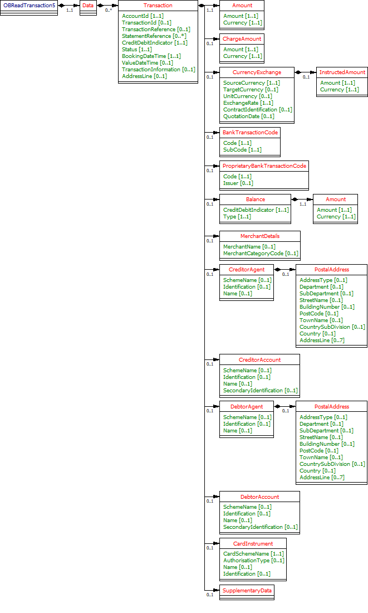

# Transactions - v3.1.2

1. [Overview](#overview)
2. [Endpoints](#endpoints)
   1. [GET /accounts/{AccountId}/transactions](#get-accountsaccountidtransactions)
   2. [GET /transactions](#get-transactions)
3. [Data Model](#data-model)
   1. [Resource Definition](#resource-definition)
   2. [UML Diagram](#uml-diagram)
      1. [Notes](#notes)
   3. [Filtering](#filtering)
      1. [Filtering Examples](#filtering-examples)
   4. [Permission Codes](#permission-codes)
   5. [Data Dictionary](#data-dictionary)
4. [Usage Examples](#usage-examples)
   1. [Specific Account](#specific-account)
      1. [Get Account Transactions Request](#get-account-transactions-request)
      2. [Get Account Transactions Response](#get-account-transactions-response)
   2. [Bulk](#bulk)
      1. [Get Transactions Request](#get-transactions-request)
      2. [Get Transactions Response](#get-transactions-response)
   3. [No Access](#no-access)
      1. [GET Account Transactions Request](#get-account-transactions-request)
      2. [GET Account Transactions Response](#get-account-transactions-response)

## Overview

The transactions resource is used by an AISP to retrieve the  transactions for a specific AccountId or to retrieve the transactions in bulk for account(s) that the PSU has authorised to access.

This resource description should be read in conjunction with a compatible Account Information Services API Profile.

## Endpoints

Endpoints for the resource - and available methods.

|  |Resource |HTTP Operation |Endpoint |Mandatory? |Scope |Grant Type |Idempotency Key |Parameters |Request Object |Response Object |
| --- |--- |--- |--- |--- |--- |--- |--- |--- |--- |--- |
| 1 |transactions |GET |GET /accounts/{AccountId}/transactions |Mandatory |accounts |Authorization Code |No |Pagination Filtering | |OBReadTransaction5 |
| 2 |transactions |GET |GET /transactions |Optional |accounts |Authorization Code |No |Pagination Filtering | |OBReadTransaction5 |

### GET /accounts/{AccountId}/transactions

An AISP  **may**  retrieve the transaction resource for a specific AccountId (which is retrieved in the call to GET /accounts).

### GET /transactions

If an ASPSP has implemented the bulk retrieval endpoints, an AISP  **may**  optionally retrieve the transactions in bulk. 
This will retrieve the resources for all authorised accounts linked to the account-request.

## Data Model

The OBReadTransaction5 object will be used for the call to:

* GET /accounts/{AccountId}/transactions
* GET /transactions
* GET /accounts/{AccountId}/statements/{StatementId}transactions

### Resource Definition

A resource that describes a posting to an account that results in an increase or decrease to a balance.
For a specific date range, an account (AccountId) may have no transactions booked, or may have multiple transactions booked.

### UML Diagram



#### Notes

* The use of the term "Transaction" has been made consistently in the Transaction endpoint payload (instead of "Entry" which is the ISO20022 element name).
* A DateTime element has been used instead of a complex choice element of Date and DateTime. Where time elements do not exist in ASPSP systems, the time portion of the DateTime element will be defaulted to 00:00:00+00:00.
* The BookingDateTime has been set to mandatory as all ASPSPs must provide this field for pagination and filtering. The BookingDateTime is the date the transaction is booked (or posted) and becomes immutable, which is not the date the transaction took place.
* Either the BankTransactionCode (which is the ISO transaction code list), **or** ProprietaryBankTransactionCode, **or** **both** may be populated. While the expectation is that at least one of BankTransactionCode. or ProprietaryBankTransactionCode are populated, we have decided not to enforce this behaviour in the payload structure as this would require nesting elements and introducing complex choice elements.
* The BankTransactionCode (ISO) code-list is documented on the ISO20022 website: https://www.iso20022.org/external_code_list.page; and External Code Sets spreadsheet. 
    * The ISO 20022 BankTransactionCode Code and SubCode are specified as 4 letter codes. However, the principle we have applied for the code lists is to have longer more descriptive codes. 
    * The BankTransactionCode Code and SubCode will be populated with the long form description of the ISO 20022 code, with delimiters removed. E.g., the Family Code "CNTR" has a description of "Counter Transactions" which is populated as "CounterTransactions"
* ASPSPs must have the ability to provide transactions through APIs for a period that at least equals the period provided through their online channels.

### Filtering

Limited support for filtering is provided on the  **transactions**  resource.

| Name |Occurrence |Enhanced Definition |Class |
| --- |--- |--- |--- |
| fromBookingDateTime |0..1 |Specifies start date and time for filtering of the Transaction records on the Transaction/BookingDateTime field |ISODateTime |
| toBookingDateTime |0..1 |Specifies end date and time for filtering of the Transaction records on the Transaction/BookingDateTime field. |ISODateTime |

The ASPSP must treat the following as valid input:
* Non-working days (e.g. a Sunday or a Bank holiday) or any other days on which no transactions are recorded.
* Dates that fall outside the range for which transaction information is provided through APIs.
* Dates that fall outside the range for which a consent authorisation is available.
* Timezone may be included in the filter request, but must be ignored by the ASPSP.

In the above situations, the ASPSP must return data for the remaining valid period specified by the filter.

#### Filtering Examples

```
// All transactions from 1st Jan, 2015
GET /transactions?fromBookingDateTime=2015-01-01T00:00:00

// All transactions in 2016
GET /transactions?fromBookingDateTime=2016-01-01T00:00:00&amp;toBookingDateTime=2016-12-31T23:59:59

// All transactions in a specific account up to 31-Mar-2017
GET /accounts/1/transactions?toBookingDateTime=2017-03-31T23:59:59
```

### Permission Codes

The resource differs depending on the permissions (ReadTransactionsBasic and ReadTransactionsDetail) used to access resource. In the event the resource is accessed with both ReadTransactionsBasic and ReadTransactionsDetail, the most detailed level (ReadTransactionsDetail) must be used.

* These objects **must not** be returned **without** the **ReadTransactionsDetail** permission: 
    * OBReadTransaction5/Data/Transaction/TransactionInformation 
    * OBReadTransaction5/Data/Transaction/Balance 
    * OBReadTransaction5/Data/Transaction/MerchantDetails 
    * OBReadTransaction5/Data/Transaction/CreditorAgent 
    * OBReadTransaction5/Data/Transaction/CreditorAccount 
    * OBReadTransaction5/Data/Transaction/DebtorAgent 
    * OBReadTransaction5/Data/Transaction/DebtorAccount
* If the **ReadTransactionsDetail** is granted by the PSU: 
    * OBReadTransaction5/Data/Transaction/TransactionInformation **may** be returned if applicable to the transaction and ASPSP (0..1) 
    * OBReadTransaction5/Data/Transaction/Balance **may** be returned if applicable to the transaction and ASPSP (0..1) 
    * OBReadTransaction5/Data/Transaction/MerchantDetails **may** be returned if applicable to the transaction and ASPSP (0..1) 
    * OBReadTransaction5/Data/Transaction/CreditorAgent **may** be returned if applicable to the transaction and ASPSP (0..1) 
    * OBReadTransaction5/Data/Transaction/CreditorAccount **may** be returned if applicable to the transaction and ASPSP (0..1) 
    * OBReadTransaction5/Data/Transaction/DebtorAgent **may** be returned if applicable to the transaction and ASPSP (0..1) 
    * OBReadTransaction5/Data/Transaction/DebtorAccount **may** be returned if applicable to the transaction and ASPSP (0..1)

If the ReadPAN permission is granted by the PSU - the ASPSP may choose to populate the unmasked PAN - if the PAN is being populated in the response for these fields:

* OBReadTransaction5/Data/Transaction/CreditorAccount/Identification
* OBReadTransaction5/Data/Transaction/DebtorAccount/Identification
* OBReadTransaction5/Data/Transaction/CardInstrument/Identification

### Data Dictionary

| Name |Occurrence |XPath |EnhancedDefinition |Class |Codes |Pattern |
| --- |--- |--- |--- |--- |--- |--- |
| OBReadTransaction5 | |OBReadTransaction5 | |OBReadTransaction5 | | |
| Data |1..1 |OBReadTransaction5/Data | |OBReadDataTransaction5 | | |
| Transaction |0..n |OBReadTransaction5/Data/Transaction |Provides further details on an entry in the report. |OBTransaction5 | | |
| AccountId |1..1 |OBReadTransaction5/Data/Transaction/AccountId |A unique and immutable identifier used to identify the account resource. This identifier has no meaning to the account owner. |Max40Text | | |
| TransactionId |0..1 |OBReadTransaction5/Data/Transaction/TransactionId |Unique identifier for the transaction within an servicing institution. This identifier is both unique and immutable. |Max210Text | | |
| TransactionReference |0..1 |OBReadTransaction5/Data/Transaction/TransactionReference |Unique reference for the transaction. This reference is optionally populated, and may as an example be the FPID in the Faster Payments context. |Max35Text | | |
| StatementReference |0..n |OBReadTransaction5/Data/Transaction/StatementReference |Unique reference for the statement. This reference may be optionally populated if available. |Max35Text | | |
| CreditDebitIndicator |1..1 |OBReadTransaction5/Data/Transaction/CreditDebitIndicator |Indicates whether the transaction is a credit or a debit entry. |OBCreditDebitCode |Credit Debit | |
| Status |1..1 |OBReadTransaction5/Data/Transaction/Status |Status of a transaction entry on the books of the account servicer. |OBEntryStatus1Code |Booked Pending | |
| BookingDateTime |1..1 |OBReadTransaction5/Data/Transaction/BookingDateTime |Date and time when a transaction entry is posted to an account on the account servicer's books. Usage: Booking date is the expected booking date, unless the status is booked, in which case it is the actual booking date. |ISODateTime | | |
| ValueDateTime |0..1 |OBReadTransaction5/Data/Transaction/ValueDateTime |Date and time at which assets become available to the account owner in case of a credit entry, or cease to be available to the account owner in case of a debit transaction entry. Usage: If transaction entry status is pending and value date is present, then the value date refers to an expected/requested value date. For transaction entries subject to availability/float and for which availability information is provided, the value date must not be used. In this case the availability component identifies the number of availability days. |ISODateTime | | |
| TransactionInformation |0..1 |OBReadTransaction5/Data/Transaction/TransactionInformation |Further details of the transaction. This is the transaction narrative, which is unstructured text. |Max500Text | | |
| AddressLine |0..1 |OBReadTransaction5/Data/Transaction/AddressLine |Information that locates and identifies a specific address for a transaction entry, that is presented in free format text. |Max70Text | | |
| Amount |1..1 |OBReadTransaction5/Data/Transaction/Amount |Amount of money in the cash transaction entry. |OBActiveOrHistoricCurrencyAndAmount | | |
| Amount |1..1 |OBReadTransaction5/Data/Transaction/Amount/Amount |A number of monetary units specified in an active currency where the unit of currency is explicit and compliant with ISO 4217. |OBActiveCurrencyAndAmount_SimpleType | |^\d{1,13}\.\d{1,5}$ |
| Currency |1..1 |OBReadTransaction5/Data/Transaction/Amount/Currency |A code allocated to a currency by a Maintenance Agency under an international identification scheme, as described in the latest edition of the international standard ISO 4217 "Codes for the representation of currencies and funds". |ActiveOrHistoricCurrencyCode | |^[A-Z]{3,3}$ |
| ChargeAmount |0..1 |OBReadTransaction5/Data/Transaction/ChargeAmount |Transaction charges to be paid by the charge bearer. |OBActiveOrHistoricCurrencyAndAmount | | |
| Amount |1..1 |OBReadTransaction5/Data/Transaction/ChargeAmount/Amount |A number of monetary units specified in an active currency where the unit of currency is explicit and compliant with ISO 4217. |OBActiveCurrencyAndAmount_SimpleType | |^\d{1,13}\.\d{1,5}$ |
| Currency |1..1 |OBReadTransaction5/Data/Transaction/ChargeAmount/Currency |A code allocated to a currency by a Maintenance Agency under an international identification scheme, as described in the latest edition of the international standard ISO 4217 "Codes for the representation of currencies and funds". |ActiveOrHistoricCurrencyCode | |^[A-Z]{3,3}$ |
| CurrencyExchange |0..1 |OBReadTransaction5/Data/Transaction/CurrencyExchange |Set of elements used to provide details on the currency exchange. |OBCurrencyExchange5 | | |
| SourceCurrency |1..1 |OBReadTransaction5/Data/Transaction/CurrencyExchange/SourceCurrency |Currency from which an amount is to be converted in a currency conversion. |ActiveOrHistoricCurrencyCode | |^[A-Z]{3,3}$ |
| TargetCurrency |0..1 |OBReadTransaction5/Data/Transaction/CurrencyExchange/TargetCurrency |Currency into which an amount is to be converted in a currency conversion. |ActiveOrHistoricCurrencyCode | |^[A-Z]{3,3}$ |
| UnitCurrency |0..1 |OBReadTransaction5/Data/Transaction/CurrencyExchange/UnitCurrency |Currency in which the rate of exchange is expressed in a currency exchange. In the example 1GBP = xxxCUR, the unit currency is GBP. |ActiveOrHistoricCurrencyCode | |^[A-Z]{3,3}$ |
| ExchangeRate |1..1 |OBReadTransaction5/Data/Transaction/CurrencyExchange/ExchangeRate |Factor used to convert an amount from one currency into another. This reflects the price at which one currency was bought with another currency. Usage: ExchangeRate expresses the ratio between UnitCurrency and QuotedCurrency (ExchangeRate = UnitCurrency/QuotedCurrency). |BaseOneRate | | |
| ContractIdentification |0..1 |OBReadTransaction5/Data/Transaction/CurrencyExchange/ContractIdentification |Unique identification to unambiguously identify the foreign exchange contract. |Max35Text | | |
| QuotationDate |0..1 |OBReadTransaction5/Data/Transaction/CurrencyExchange/QuotationDate |Date and time at which an exchange rate is quoted. |ISODateTime | | |
| InstructedAmount |0..1 |OBReadTransaction5/Data/Transaction/CurrencyExchange/InstructedAmount |Amount of money to be moved between the debtor and creditor, before deduction of charges, expressed in the currency as ordered by the initiating party. |OBActiveOrHistoricCurrencyAndAmount | | |
| Amount |1..1 |OBReadTransaction5/Data/Transaction/CurrencyExchange/InstructedAmount/Amount |A number of monetary units specified in an active currency where the unit of currency is explicit and compliant with ISO 4217. |OBActiveCurrencyAndAmount_SimpleType | |^\d{1,13}\.\d{1,5}$ |
| Currency |1..1 |OBReadTransaction5/Data/Transaction/CurrencyExchange/InstructedAmount/Currency |A code allocated to a currency by a Maintenance Agency under an international identification scheme, as described in the latest edition of the international standard ISO 4217 "Codes for the representation of currencies and funds". |ActiveOrHistoricCurrencyCode | |^[A-Z]{3,3}$ |
| BankTransactionCode |0..1 |OBReadTransaction5/Data/Transaction/BankTransactionCode |Set of elements used to fully identify the type of underlying transaction resulting in an entry. |OBBankTransactionCodeStructure1 | | |
| Code |1..1 |OBReadTransaction5/Data/Transaction/BankTransactionCode/Code |Specifies the family within a domain. |ExternalBankTransactionFamily1Code | | |
| SubCode |1..1 |OBReadTransaction5/Data/Transaction/BankTransactionCode/SubCode |Specifies the sub-product family within a specific family. |ExternalBankTransactionSubFamily1Code | | |
| ProprietaryBankTransactionCode |0..1 |OBReadTransaction5/Data/Transaction/ProprietaryBankTransactionCode |Set of elements to fully identify a proprietary bank transaction code. |ProprietaryBankTransactionCodeStructure1 | | |
| Code |1..1 |OBReadTransaction5/Data/Transaction/ProprietaryBankTransactionCode/Code |Proprietary bank transaction code to identify the underlying transaction. |Max35Text | | |
| Issuer |0..1 |OBReadTransaction5/Data/Transaction/ProprietaryBankTransactionCode/Issuer |Identification of the issuer of the proprietary bank transaction code. |Max35Text | | |
| Balance |0..1 |OBReadTransaction5/Data/Transaction/Balance |Set of elements used to define the balance as a numerical representation of the net increases and decreases in an account after a transaction entry is applied to the account. |OBTransactionCashBalance | | |
| CreditDebitIndicator |1..1 |OBReadTransaction5/Data/Transaction/Balance/CreditDebitIndicator |Indicates whether the balance is a credit or a debit balance. Usage: A zero balance is considered to be a credit balance. |OBCreditDebitCode |Credit Debit | |
| Type |1..1 |OBReadTransaction5/Data/Transaction/Balance/Type |Balance type, in a coded form. |OBBalanceType1Code |ClosingAvailable ClosingBooked ClosingCleared Expected ForwardAvailable Information InterimAvailable InterimBooked InterimCleared OpeningAvailable OpeningBooked OpeningCleared PreviouslyClosedBooked | |
| Amount |1..1 |OBReadTransaction5/Data/Transaction/Balance/Amount |Amount of money of the cash balance after a transaction entry is applied to the account.. |OBActiveOrHistoricCurrencyAndAmount | | |
| Amount |1..1 |OBReadTransaction5/Data/Transaction/Balance/Amount/Amount |A number of monetary units specified in an active currency where the unit of currency is explicit and compliant with ISO 4217. |OBActiveCurrencyAndAmount_SimpleType | |^\d{1,13}\.\d{1,5}$ |
| Currency |1..1 |OBReadTransaction5/Data/Transaction/Balance/Amount/Currency |A code allocated to a currency by a Maintenance Agency under an international identification scheme, as described in the latest edition of the international standard ISO 4217 "Codes for the representation of currencies and funds". |ActiveOrHistoricCurrencyCode | |^[A-Z]{3,3}$ |
| MerchantDetails |0..1 |OBReadTransaction5/Data/Transaction/MerchantDetails |Details of the merchant involved in the transaction. |OBMerchantDetails1 | | |
| MerchantName |0..1 |OBReadTransaction5/Data/Transaction/MerchantDetails/MerchantName |Name by which the merchant is known. |Max350Text | | |
| MerchantCategoryCode |0..1 |OBReadTransaction5/Data/Transaction/MerchantDetails/MerchantCategoryCode |Category code conform to ISO 18245, related to the type of services or goods the merchant provides for the transaction. |Min3Max4Text | | |
| CreditorAgent |0..1 |OBReadTransaction5/Data/Transaction/CreditorAgent |Financial institution servicing an account for the creditor. |OBBranchAndFinancialInstitutionIdentification6 | | |
| SchemeName |0..1 |OBReadTransaction5/Data/Transaction/CreditorAgent/SchemeName |Name of the identification scheme, in a coded form as published in an external list. |OBExternalFinancialInstitutionIdentification4Code | | |
| Identification |0..1 |OBReadTransaction5/Data/Transaction/CreditorAgent/Identification |Unique and unambiguous identification of a financial institution or a branch of a financial institution. |Max35Text | | |
| Name |0..1 |OBReadTransaction5/Data/Transaction/CreditorAgent/Name |Name by which an agent is known and which is usually used to identify that agent. |Max140Text | | |
| PostalAddress |0..1 |OBReadTransaction5/Data/Transaction/CreditorAgent/PostalAddress |Information that locates and identifies a specific address, as defined by postal services. |OBPostalAddress6 | | |
| AddressType |0..1 |OBReadTransaction5/Data/Transaction/CreditorAgent/PostalAddress/AddressType |Identifies the nature of the postal address. |OBAddressTypeCode |Business Correspondence DeliveryTo MailTo POBox Postal Residential Statement | |
| Department |0..1 |OBReadTransaction5/Data/Transaction/CreditorAgent/PostalAddress/Department |Identification of a division of a large organisation or building. |Max70Text | | |
| SubDepartment |0..1 |OBReadTransaction5/Data/Transaction/CreditorAgent/PostalAddress/SubDepartment |Identification of a sub-division of a large organisation or building. |Max70Text | | |
| StreetName |0..1 |OBReadTransaction5/Data/Transaction/CreditorAgent/PostalAddress/StreetName |Name of a street or thoroughfare. |Max70Text | | |
| BuildingNumber |0..1 |OBReadTransaction5/Data/Transaction/CreditorAgent/PostalAddress/BuildingNumber |Number that identifies the position of a building on a street. |Max16Text | | |
| PostCode |0..1 |OBReadTransaction5/Data/Transaction/CreditorAgent/PostalAddress/PostCode |Identifier consisting of a group of letters and/or numbers that is added to a postal address to assist the sorting of mail. |Max16Text | | |
| TownName |0..1 |OBReadTransaction5/Data/Transaction/CreditorAgent/PostalAddress/TownName |Name of a built-up area, with defined boundaries, and a local government. |Max35Text | | |
| CountrySubDivision |0..1 |OBReadTransaction5/Data/Transaction/CreditorAgent/PostalAddress/CountrySubDivision |Identifies a subdivision of a country such as state, region, county. |Max35Text | | |
| Country |0..1 |OBReadTransaction5/Data/Transaction/CreditorAgent/PostalAddress/Country |Nation with its own government. |CountryCode | |^[A-Z]{2,2}$ |
| AddressLine |0..7 |OBReadTransaction5/Data/Transaction/CreditorAgent/PostalAddress/AddressLine |Information that locates and identifies a specific address, as defined by postal services, presented in free format text. |Max70Text | | |
| CreditorAccount |0..1 |OBReadTransaction5/Data/Transaction/CreditorAccount |Unambiguous identification of the account of the creditor, in the case of a debit transaction. |OBCashAccount6 | | |
| SchemeName |0..1 |OBReadTransaction5/Data/Transaction/CreditorAccount/SchemeName |Name of the identification scheme, in a coded form as published in an external list. |OBExternalAccountIdentification4Code | | |
| Identification |0..1 |OBReadTransaction5/Data/Transaction/CreditorAccount/Identification |Identification assigned by an institution to identify an account. This identification is known by the account owner. |Max256Text | | |
| Name |0..1 |OBReadTransaction5/Data/Transaction/CreditorAccount/Name |The account name is the name or names of the account owner(s) represented at an account level, as displayed by the ASPSP's online channels. Note, the account name is not the product name or the nickname of the account. |Max70Text | | |
| SecondaryIdentification |0..1 |OBReadTransaction5/Data/Transaction/CreditorAccount/SecondaryIdentification |This is secondary identification of the account, as assigned by the account servicing institution. This can be used by building societies to additionally identify accounts with a roll number (in addition to a sort code and account number combination). |Max34Text | | |
| DebtorAgent |0..1 |OBReadTransaction5/Data/Transaction/DebtorAgent |Financial institution servicing an account for the debtor. |OBBranchAndFinancialInstitutionIdentification6 | | |
| SchemeName |0..1 |OBReadTransaction5/Data/Transaction/DebtorAgent/SchemeName |Name of the identification scheme, in a coded form as published in an external list. |OBExternalFinancialInstitutionIdentification4Code | | |
| Identification |0..1 |OBReadTransaction5/Data/Transaction/DebtorAgent/Identification |Unique and unambiguous identification of a financial institution or a branch of a financial institution. |Max35Text | | |
| Name |0..1 |OBReadTransaction5/Data/Transaction/DebtorAgent/Name |Name by which an agent is known and which is usually used to identify that agent. |Max140Text | | |
| PostalAddress |0..1 |OBReadTransaction5/Data/Transaction/DebtorAgent/PostalAddress |Information that locates and identifies a specific address, as defined by postal services. |OBPostalAddress6 | | |
| AddressType |0..1 |OBReadTransaction5/Data/Transaction/DebtorAgent/PostalAddress/AddressType |Identifies the nature of the postal address. |OBAddressTypeCode |Business Correspondence DeliveryTo MailTo POBox Postal Residential Statement | |
| Department |0..1 |OBReadTransaction5/Data/Transaction/DebtorAgent/PostalAddress/Department |Identification of a division of a large organisation or building. |Max70Text | | |
| SubDepartment |0..1 |OBReadTransaction5/Data/Transaction/DebtorAgent/PostalAddress/SubDepartment |Identification of a sub-division of a large organisation or building. |Max70Text | | |
| StreetName |0..1 |OBReadTransaction5/Data/Transaction/DebtorAgent/PostalAddress/StreetName |Name of a street or thoroughfare. |Max70Text | | |
| BuildingNumber |0..1 |OBReadTransaction5/Data/Transaction/DebtorAgent/PostalAddress/BuildingNumber |Number that identifies the position of a building on a street. |Max16Text | | |
| PostCode |0..1 |OBReadTransaction5/Data/Transaction/DebtorAgent/PostalAddress/PostCode |Identifier consisting of a group of letters and/or numbers that is added to a postal address to assist the sorting of mail. |Max16Text | | |
| TownName |0..1 |OBReadTransaction5/Data/Transaction/DebtorAgent/PostalAddress/TownName |Name of a built-up area, with defined boundaries, and a local government. |Max35Text | | |
| CountrySubDivision |0..1 |OBReadTransaction5/Data/Transaction/DebtorAgent/PostalAddress/CountrySubDivision |Identifies a subdivision of a country such as state, region, county. |Max35Text | | |
| Country |0..1 |OBReadTransaction5/Data/Transaction/DebtorAgent/PostalAddress/Country |Nation with its own government. |CountryCode | |^[A-Z]{2,2}$ |
| AddressLine |0..7 |OBReadTransaction5/Data/Transaction/DebtorAgent/PostalAddress/AddressLine |Information that locates and identifies a specific address, as defined by postal services, presented in free format text. |Max70Text | | |
| DebtorAccount |0..1 |OBReadTransaction5/Data/Transaction/DebtorAccount |Unambiguous identification of the account of the debtor, in the case of a credit transaction. |OBCashAccount6 | | |
| SchemeName |0..1 |OBReadTransaction5/Data/Transaction/DebtorAccount/SchemeName |Name of the identification scheme, in a coded form as published in an external list. |OBExternalAccountIdentification4Code | | |
| Identification |0..1 |OBReadTransaction5/Data/Transaction/DebtorAccount/Identification |Identification assigned by an institution to identify an account. This identification is known by the account owner. |Max256Text | | |
| Name |0..1 |OBReadTransaction5/Data/Transaction/DebtorAccount/Name |The account name is the name or names of the account owner(s) represented at an account level, as displayed by the ASPSP's online channels. Note, the account name is not the product name or the nickname of the account. |Max70Text | | |
| SecondaryIdentification |0..1 |OBReadTransaction5/Data/Transaction/DebtorAccount/SecondaryIdentification |This is secondary identification of the account, as assigned by the account servicing institution. This can be used by building societies to additionally identify accounts with a roll number (in addition to a sort code and account number combination). |Max34Text | | |
| CardInstrument |0..1 |OBReadTransaction5/Data/Transaction/CardInstrument |Set of elements to describe the card instrument used in the transaction. |OBTransactionCardInstrument1 | | |
| CardSchemeName |1..1 |OBReadTransaction5/Data/Transaction/CardInstrument/CardSchemeName |Name of the card scheme. |OBExternalCardSchemeType1Code |AmericanExpress Diners Discover MasterCard VISA | |
| AuthorisationType |0..1 |OBReadTransaction5/Data/Transaction/CardInstrument/AuthorisationType |The card authorisation type. |OBExternalCardAuthorisationType1Code |ConsumerDevice Contactless None PIN | |
| Name |0..1 |OBReadTransaction5/Data/Transaction/CardInstrument/Name |Name of the cardholder using the card instrument. |Max70Text | | |
| Identification |0..1 |OBReadTransaction5/Data/Transaction/CardInstrument/Identification |Identification assigned by an institution to identify the card instrument used in the transaction. This identification is known by the account owner, and may be masked. |Max34Text | | |
| SupplementaryData |0..1 |OBReadTransaction5/Data/Transaction/SupplementaryData |Additional information that can not be captured in the structured fields and/or any other specific block. |OBSupplementaryData1 | | |

## Usage Examples

### Specific Account

#### Get Account Transactions Request

```
GET /accounts/22289/transactions HTTP/1.1
Authorization: Bearer Az90SAOJklae
x-fapi-auth-date:  Sun, 10 Sep 2017 19:43:31 GMT
x-fapi-customer-ip-address: 104.25.212.99
x-fapi-interaction-id: 93bac548-d2de-4546-b106-880a5018460d
Accept: application/json
```

#### Get Account Transactions Response

```
HTTP/1.1 200 OK
x-fapi-interaction-id: 93bac548-d2de-4546-b106-880a5018460d
Content-Type: application/json
```

```json
{
  "Data": {
    "Transaction": [
      {
        "AccountId": "22289",
        "TransactionId": "123",
        "TransactionReference": "Ref 1",
        "Amount": {
          "Amount": "10.00",
          "Currency": "GBP"
        },
        "CreditDebitIndicator": "Credit",
        "Status": "Booked",
        "BookingDateTime": "2017-04-05T10:43:07+00:00",
        "ValueDateTime": "2017-04-05T10:45:22+00:00",
        "TransactionInformation": "Cash from Aubrey",
        "BankTransactionCode": {
          "Code": "ReceivedCreditTransfer",
          "SubCode": "DomesticCreditTransfer"
        },
        "ProprietaryBankTransactionCode": {
          "Code": "Transfer",
          "Issuer": "AlphaBank"
        },
        "Balance": {
          "Amount": {
            "Amount": "230.00",
            "Currency": "GBP"
          },
          "CreditDebitIndicator": "Credit",
          "Type": "InterimBooked"
        }
      }
    ]
  },
  "Links": {
    "Self": "https://api.alphabank.com/open-banking/v3.1/aisp/accounts/22289/transactions/"
  },
  "Meta": {
    "TotalPages": 1,
	"FirstAvailableDateTime": "2017-05-03T00:00:00+00:00",
	"LastAvailableDateTime": "2017-12-03T00:00:00+00:00"
  }
}
```

### Bulk

None of the transactions included in the payload are Ecommerce transactions, so MerchantDetails are not included in the examples.

#### Get Transactions Request

```
GET /transactions HTTP/1.1
Authorization: Bearer Az90SAOJklae
x-fapi-auth-date:  Sun, 10 Sep 2017 19:43:31 GMT
x-fapi-customer-ip-address: 104.25.212.99
x-fapi-interaction-id: 93bac548-d2de-4546-b106-880a5018460d
Accept: application/json
```

#### Get Transactions Response

```
HTTP/1.1 200 OK 
x-fapi-interaction-id: 93bac548-d2de-4546-b106-880a5018460d
Content-Type: application/json
```

```json
{
  "Data": {
    "Transaction": [
      {
        "AccountId": "22289",
        "TransactionId": "123",
        "TransactionReference": "Ref 123",
        "Amount": {
          "Amount": "10.00",
          "Currency": "GBP"
        },
        "CreditDebitIndicator": "Credit",
        "Status": "Booked",
        "BookingDateTime": "2017-04-05T10:43:07+00:00",
        "ValueDateTime": "2017-04-05T10:45:22+00:00",
        "TransactionInformation": "Cash from Aubrey",
        "BankTransactionCode": {
          "Code": "ReceivedCreditTransfer",
          "SubCode": "DomesticCreditTransfer"
        },
        "ProprietaryBankTransactionCode": {
          "Code": "Transfer",
          "Issuer": "AlphaBank"
        },
        "Balance": {
          "Amount": {
            "Amount": "230.00",
            "Currency": "GBP"
          },
          "CreditDebitIndicator": "Credit",
          "Type": "InterimBooked"
        }
      },
      {
        "AccountId": "31820",
        "TransactionId": "567",
        "TransactionReference": "Ref 124",
        "Amount": {
          "Amount": "100.00",
          "Currency": "GBP"
        },
        "CreditDebitIndicator": "Debit",
        "Status": "Booked",
        "BookingDateTime": "2017-05-02T14:22:09+00:00",
        "ValueDateTime": "2017-05-02T14:22:09+00:00",
        "TransactionInformation": "Paid the gas bill",
        "AddressLine": "Coventry",
        "BankTransactionCode": {
          "Code": "IssuedCreditTransfer",
          "SubCode": "AutomaticTransfer"
        },
        "ProprietaryBankTransactionCode": {
          "Code": "DirectDebit",
          "Issuer": "AlphaBank"
        },
        "Balance": {
          "Amount": {
            "Amount": "57.36",
            "Currency": "GBP"
          },
          "CreditDebitIndicator": "Debit",
          "Type": "InterimBooked"
        }
      }
    ]
  },
  "Links": {
    "Self": "https://api.alphabank.com/open-banking/v3.1/aisp/transactions"
  },
  "Meta": {
    "TotalPages": 1,
	"FirstAvailableDateTime": "2017-05-03T00:00:00+00:00",
	"LastAvailableDateTime": "2017-12-03T00:00:00+00:00"
  }
}
```

### No Access

In this example, the AISP  **does not**  have access to call the transactions endpoint. This will result in a 403 error.

#### GET Account Transactions Request

```
GET /accounts/22289/transactions HTTP/1.1
Authorization: Bearer Az90SAOJklae
x-fapi-auth-date:  Sun, 10 Sep 2017 19:43:31 GMT
x-fapi-customer-ip-address: 104.25.212.99
x-fapi-interaction-id: 93bac548-d2de-4546-b106-880a5018460d
Accept: application/json
```

#### GET Account Transactions Response

```
HTTP/1.1 403 Forbidden 
x-fapi-interaction-id: 93bac548-d2de-4546-b106-880a5018460d
```