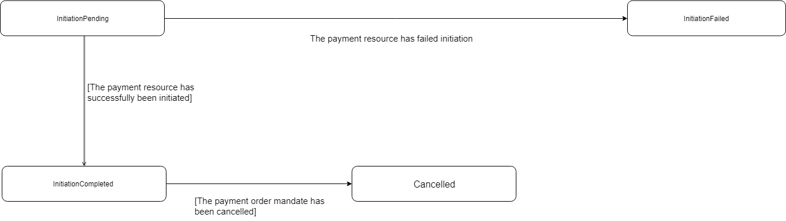
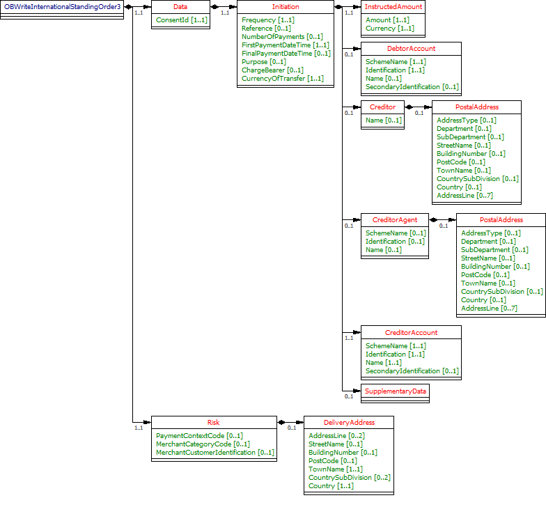
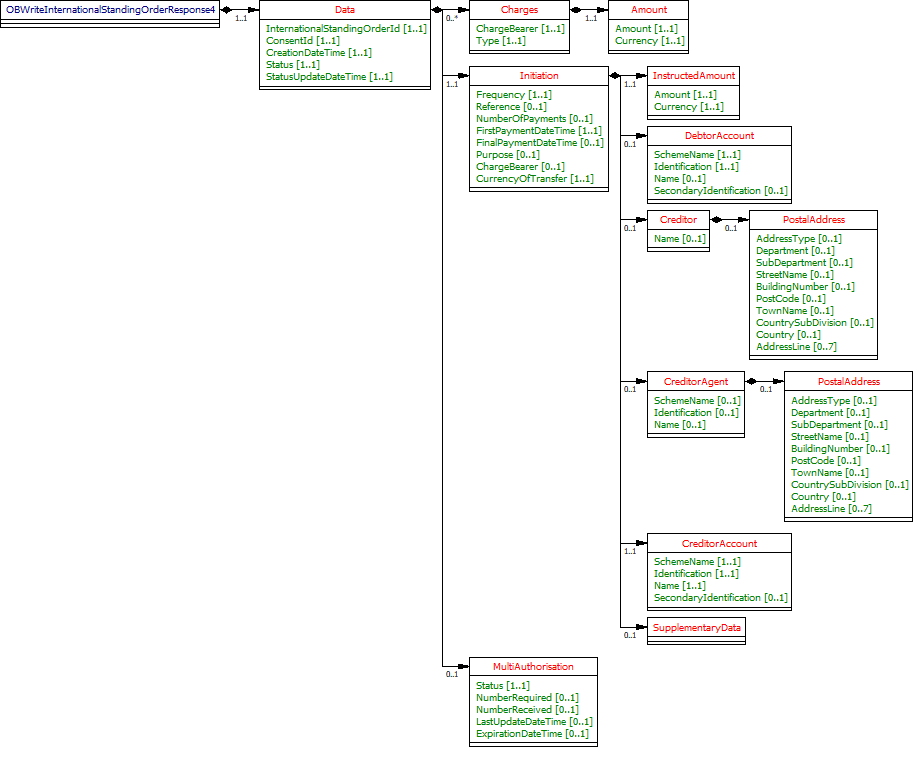

# International Standing Orders - v3.1.2

1. [Overview](#overview)
2. [Endpoints](#endpoints)
   1. [POST /international-standing-orders](#post-international-standing-orders)
      1. [Status](#status)
   2. [GET /international-standing-orders/{InternationalStandingOrderPaymentId}](#get-international-standing-ordersinternationalstandingorderpaymentid)
      1. [Status](#status-1)
   3. [GET /international-standing-orders/{InternationalStandingOrderPaymentId}/payment-details](#get-international-standing-ordersinternationalstandingorderpaymentidpayment-details)
      1. [Status](#status-2)
   4. [State Model](#state-model)
      1. [Payment Order](#payment-order)
         1. [Multiple Authorisation](#multiple-authorisation)
3. [Data Model](#data-model)
   1. [Reused Classes](#reused-classes)
      1. [OBInternationalStandingOrder3](#obinternationalstandingorder3)
   2. [International Standing Order - Request](#international-standing-order---request)
      1. [UML Diagram](#uml-diagram)
      2. [Notes](#notes)
      3. [Data Dictionary](#data-dictionary)
   3. [International Standing Order - Response](#international-standing-order---response)
      1. [UML Diagram](#uml-diagram-1)
      2. [Notes](#notes-1)
      3. [Data Dictionary](#data-dictionary-1)
   4. [International Standing Order - Payment Details - Response](#international-standing-order---payment-details---response)
      1. [UML Diagram](#uml-diagram-2)
      2. [Data Dictionary](#data-dictionary-2)
4. [Usage Examples](#usage-examples)
   1. [POST /international-standing-orders](#post-international-standing-orders-1)
      1. [Request](#request)
      2. [Response](#response)

## Overview

The International Standing Orders resource is used by a PISP to initiate an International Standing Order.

This resource description should be read in conjunction with a compatible Payment Initiation API Profile.

## Endpoints

| Resource |HTTP Operation |Endpoint |Mandatory ? |Scope |Grant Type |Message Signing |Idempotency Key |Request Object |Response Object |
| --- |--- |--- |--- |--- |--- |--- |--- |--- |--- |
| international-standing-orders |POST |POST /international-standing-orders |Conditional |payments |Authorization Code |Signed Request Signed Response |Yes |OBWriteInternationalStandingOrder3 |OBWriteInternationalStandingOrderResponse4 |
| international-standing-orders |GET |GET /international-standing-orders/{InternationalStandingOrderPaymentId} |Mandatory (if resource POST implemented) |payments |Client Credentials |Signed Response |No |NA |OBWriteInternationalStandingOrderResponse4 |
| payment-details |GET |GET /international-standing-orders/{InternationalStandingOrderPaymentId}/payment-details |Optional |payments |Client Credentials |Signed Response |No |NA |OBWritePaymentDetailsResponse1 |

### POST /international-standing-orders

Once the international-standing-order-consent has been authorised by the PSU, the PISP can proceed to submit the international-standing-orders for processing:

* This is done by making a POST request to the **international-standing-orders** endpoint.
* This request is an instruction to the ASPSP to begin the international standing order journey. The PISP must submit the international standing order immediately, however, there are some scenarios where the ASPSP may not warehouse the international standing order immediately (e.g. busy periods at the ASPSP).
* The PISP **must** ensure that the Initiation and Risk sections of the international-standing-orders match the corresponding Initiation and Risk sections of the international-standing-order-consent resource. If the two do not match, the ASPSP **must not** process the request and **must** respond with a 400 (Bad Request).
* Any operations on the international-standing-orders resource will not result in a Status change for the international-standing-orders resource.

#### Status

An international-standing-orders can only be created if its corresponding international-standing-order-consent resource has the status of "Authorised". 

The international-standing-orders resource that is created successfully must have one of the following Status codes:

| Status |
| --- |
| InitiationPending |
| InitiationFailed |
| InitiationCompleted |

### GET /international-standing-orders/{InternationalStandingOrderPaymentId}

A PISP can retrieve the international-standing-orders to check its status.

#### Status

The international-standing-orders resource must have one of the following Status codes:

| Status |
| --- |
| InitiationPending |
| InitiationFailed |
| InitiationCompleted |
| Cancelled |

### GET /international-standing-orders/{InternationalStandingOrderPaymentId}/payment-details

A PISP can retrieve the Details of the underlying payment transaction via this endpoint. This resource allows ASPSPs to return richer list of Payment Statuses, and if available payment scheme related statuses.

#### Status

The international-standing-orders - payment-details must have one of the following PaymentStatusCode code-set enumerations:

| Status |
| --- |
| Accepted |
| AcceptedCancellationRequest |
| AcceptedTechnicalValidation |
| AcceptedCustomerProfile |
| AcceptedFundsChecked |
| AcceptedWithChange |
| Pending |
| Rejected |
| AcceptedSettlementInProcess |
| AcceptedSettlementCompleted |
| AcceptedWithoutPosting |
| AcceptedCreditSettlementCompleted |
| Cancelled |
| NoCancellationProcess |
| PartiallyAcceptedCancellationRequest |
| PartiallyAcceptedTechnicalCorrect |
| PaymentCancelled |
| PendingCancellationRequest |
| Received |
| RejectedCancellationRequest |

### State Model

#### Payment Order

The state model for the international-standing-orders resource describes the initiation status only. I.e., not the subsequent execution of the international-standing-orders.



The definitions for the Status:

|  |Status |Payment Status Description |
| --- |--- |--- |
| 1 |InitiationPending |The initiation of the payment order is pending. |
| 2 |InitiationFailed |The initiation of the payment order has failed. |
| 3 |InitiationCompleted |The initiation of the payment order is complete. |
| 4 |Cancelled |Payment initiation has been successfully cancelled after having received a request for cancellation. |

##### Multiple Authorisation

If the payment-order requires multiple authorisations, the Status of the multiple authorisations will be updated in the MultiAuthorisation object.


The definitions for the Status:

|  |Status |Status Description |
| --- |--- |--- |
| 1 |AwaitingFurtherAuthorisation |The payment-order resource is awaiting further authorisation. |
| 2 |Rejected |The payment-order resource has been rejected by an authoriser. |
| 3 |Authorised |The payment-order resource has been successfully authorised by all required authorisers. |


## Data Model

The data dictionary section gives the detail on the payload content for the International Standing Order API flows.

### Reused Classes

#### OBInternationalStandingOrder3

The OBInternationalStandingOrder3 class is defined in the [international-standing-order-consents](./international-standing-order-consents.md#obinternationalstandingOrder3) page.

### International Standing Order - Request

The OBWriteInternationalStandingOrder3 object will be used for a call to:

* POST /international-standing-orders

#### UML Diagram



#### Notes

The international-standing-orders **request** object contains the: 

* ConsentId.
* The full Initiation and Risk objects from the international-standing-order-consent request.

The **Initiation** and **Risk** sections of the international-standing-orders request **must** match the **Initiation** and **Risk** sections of the corresponding international-standing-order-consent request.

#### Data Dictionary

| Name |Occurrence |XPath |EnhancedDefinition |Class |Codes |Pattern |
| --- |--- |--- |--- |--- |--- |--- |
| OBWriteInternationalStandingOrder3 | |OBWriteInternationalStandingOrder3 | |OBWriteInternationalStandingOrder3 | | |
| Data |1..1 |OBWriteInternationalStandingOrder3/Data | |OBWriteDataInternationalStandingOrder3 | | |
| ConsentId |1..1 |OBWriteInternationalStandingOrder3/Data/ConsentId |OB: Unique identification as assigned by the ASPSP to uniquely identify the consent resource. |Max128Text | | |
| Initiation |1..1 |OBWriteInternationalStandingOrder3/Data/Initiation |The Initiation payload is sent by the initiating party to the ASPSP. It is used to request movement of funds from the debtor account to a creditor for an international standing order. |OBInternationalStandingOrder3 | | |
| Risk |1..1 |OBWriteInternationalStandingOrder3/Risk |The Risk section is sent by the initiating party to the ASPSP. It is used to specify additional details for risk scoring for Payments. |OBRisk1 | | |

### International Standing Order - Response

The OBWriteInternationalStandingOrderResponse4 object will be used for a response to a call to:

* POST /international-standing-orders
* GET /international-standing-orders/{InternationalStandingOrderPaymentId}

#### UML Diagram



#### Notes 

The international-standing-orders **response** object contains the: 

* InternationalStandingOrderPaymentId.
* ConsentId.
* CreationDateTime the international-standing-orders resource was created.
* Status and StatusUpdateDateTime of the international-standing-orders resource.
* The Charges in the international-standing-order-consent response from the ASPSP.
* The Initiation object from the international-standing-order-consent.
* The MultiAuthorisation object if the international-standing-order resource requires multiple authorisations.

#### Data Dictionary

| Name |Occurrence |XPath |EnhancedDefinition |Class |Codes |Pattern |
| --- |--- |--- |--- |--- |--- |--- |
| OBWriteInternationalStandingOrderResponse4 | |OBWriteInternationalStandingOrderResponse4 | |OBWriteInternationalStandingOrderResponse4 | | |
| Data |1..1 |OBWriteInternationalStandingOrderResponse4/Data | |OBWriteDataInternationalStandingOrderResponse4 | | |
| InternationalStandingOrderId |1..1 |OBWriteInternationalStandingOrderResponse4/Data/InternationalStandingOrderId |OB: Unique identification as assigned by the ASPSP to uniquely identify the international standing order resource. |Max40Text | | |
| ConsentId |1..1 |OBWriteInternationalStandingOrderResponse4/Data/ConsentId |OB: Unique identification as assigned by the ASPSP to uniquely identify the consent resource. |Max128Text | | |
| CreationDateTime |1..1 |OBWriteInternationalStandingOrderResponse4/Data/CreationDateTime |Date and time at which the resource was created. |ISODateTime | | |
| Status |1..1 |OBWriteInternationalStandingOrderResponse4/Data/Status |Specifies the status of resource in code form. |OBExternalStatus1Code |InitiationCompleted InitiationFailed InitiationPending Cancelled | |
| StatusUpdateDateTime |1..1 |OBWriteInternationalStandingOrderResponse4/Data/StatusUpdateDateTime |Date and time at which the resource status was updated. |ISODateTime | | |
| Charges |0..n |OBWriteInternationalStandingOrderResponse4/Data/Charges |Set of elements used to provide details of a charge for the payment initiation. |OBCharge2 | | |
| Initiation |1..1 |OBWriteInternationalStandingOrderResponse4/Data/Initiation |The Initiation payload is sent by the initiating party to the ASPSP. It is used to request movement of funds from the debtor account to a creditor for an international standing order. |OBInternationalStandingOrder3 | | |
| MultiAuthorisation |0..1 |OBWriteInternationalStandingOrderResponse4/Data/MultiAuthorisation | |OBMultiAuthorisation1 | | |

### International Standing Order - Payment Details - Response

The OBWritePaymentDetailsResponse1 object will be used for a response to a call to:

* GET /international-standing-orders/{InternationalStandingOrderPaymentId}/payment-details

#### UML Diagram


#### Data Dictionary

| Name |Occurrence |XPath |EnhancedDefinition |Class |Codes |Pattern |
| --- |--- |--- |--- |--- |--- |--- |
| OBWritePaymentDetailsResponse1 | |OBWritePaymentDetailsResponse1 | |OBWritePaymentDetailsResponse1 | | |
| Data |1..1 |OBWritePaymentDetailsResponse1/Data | |OBWriteDataPaymentOrderStatusResponse1 | | |
| PaymentStatus |0..unbounded |OBWritePaymentDetailsResponse1/Data/PaymentStatus |Payment status details. |OBWritePaymentDetails1 | | |

## Usage Examples

### POST /international-standing-orders

#### Request

```
POST /international-standing-orders HTTP/1.1
Authorization: Bearer eYJQLMQLMQLM
x-idempotency-key: FRESNO.1317.GFX.22
x-jws-signature: TGlmZSdzIGEgam91cm5leSBub3QgYSBkZXN0aW5hdGlvbiA=..T2ggZ29vZCBldmVuaW5nIG1yIHR5bGVyIGdvaW5nIGRvd24gPw==
x-fapi-auth-date:  Mon, 01 Jan 2018 02:43:31 GMT
x-fapi-customer-ip-address: 104.25.212.99
x-fapi-interaction-id: 93bac548-d2de-4546-b106-880a5018460d
Content-Type: application/json
Accept: application/json
```

```json
{
  "Data": {
	"ConsentId": "ISOC-100",
    "Initiation": {
	  "Frequency": "EvryWorkgDay",
	  "FirstPaymentDateTime": "2018-06-06T06:06:06+00:00",
	  "FinalPaymentDateTime": "2020-03-20T06:06:06+00:00",
	  "DebtorAccount": {
        "SchemeName": "UK.OBIE.SortCodeAccountNumber",
        "Identification": "11280001234567",
        "Name": "Andrea Frost"
      },
      "CreditorAccount": {
        "SchemeName": "UK.OBIE.IBAN",
        "Identification": "DE89370400440532013000",
        "Name": "Tom Kirkman"
      },
	  "InstructedAmount": {
        "Amount": "20",
        "Currency": "EUR"
	  },
	  "CurrencyOfTansfer":"EUR"
    }
  },
  "Risk": {
    "PaymentContextCode": "PartyToParty"
  }
}
```

#### Response

```
HTTP/1.1 201 Created
x-jws-signature: V2hhdCB3ZSBnb3QgaGVyZQ0K..aXMgZmFpbHVyZSB0byBjb21tdW5pY2F0ZQ0K
x-fapi-interaction-id: 93bac548-d2de-4546-b106-880a5018460d
Content-Type: application/json
```

```json
{
  "Data": {
    "InternationalStandingOrderId": "SO-ISOC-100",
    "ConsentId": "ISOC-100",
    "CreationDateTime": "2018-01-01T06:06:36+00:00",
    "Status": "InitiationCompleted",
    "StatusUpdateDateTime": "2018-01-01T06:36:06+00:00",
    "Initiation": {
      "Frequency": "EvryWorkgDay",
      "FirstPaymentDateTime": "2018-06-06T06:06:06+00:00",
      "FinalPaymentDateTime": "2020-03-20T06:06:06+00:00",
      "DebtorAccount": {
        "SchemeName": "UK.OBIE.SortCodeAccountNumber",
        "Identification": "11280001234567",
        "Name": "Andrea Frost"
      },
      "CreditorAccount": {
        "SchemeName": "UK.OBIE.IBAN",
        "Identification": "DE89370400440532013000",
        "Name": "Tom Kirkman"
      },
      "InstructedAmount": {
        "Amount": "20",
        "Currency": "EUR"
      },
      "CurrencyOfTansfer":"EUR"
    }
  },
  "Risk": {
    "PaymentContextCode": "PartyToParty"
  },
  "Links": {
    "Self": "https://api.alphabank.com/open-banking/v3.1/pisp/international-standing-orders/SO-ISOC-100"
  },
  "Meta": {}
}
```