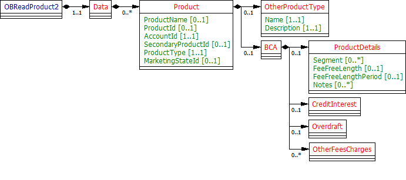
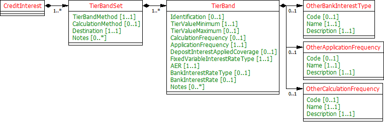
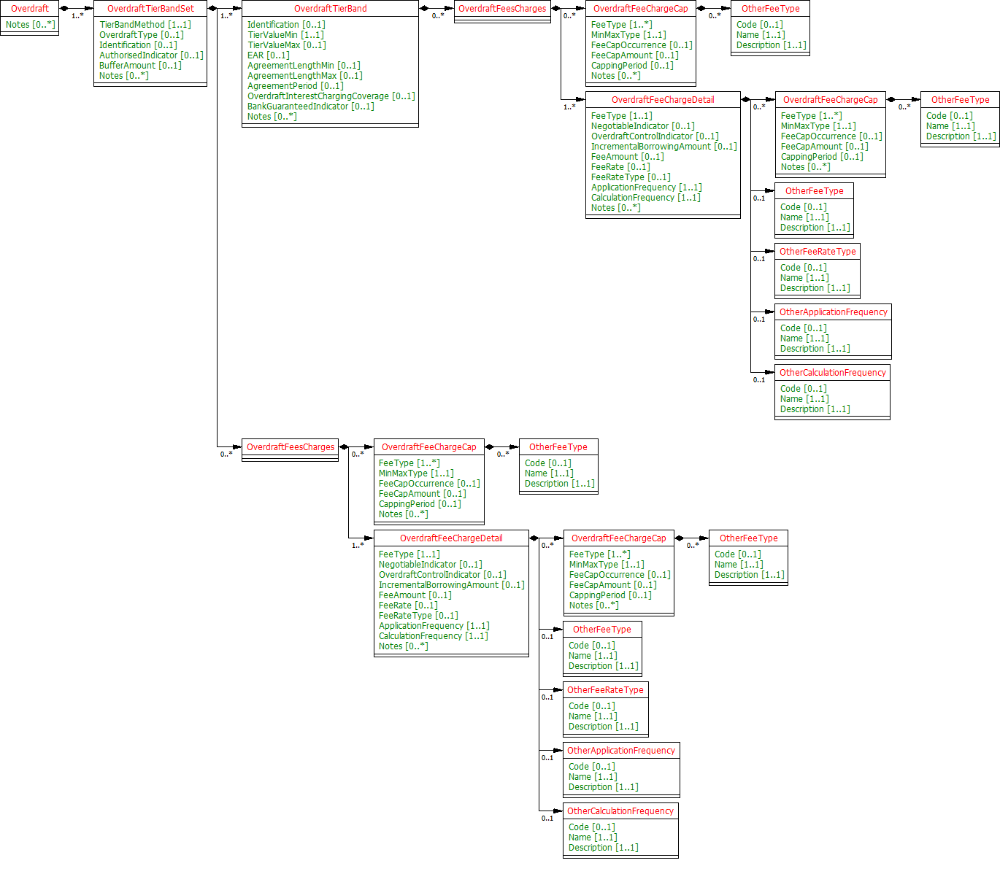
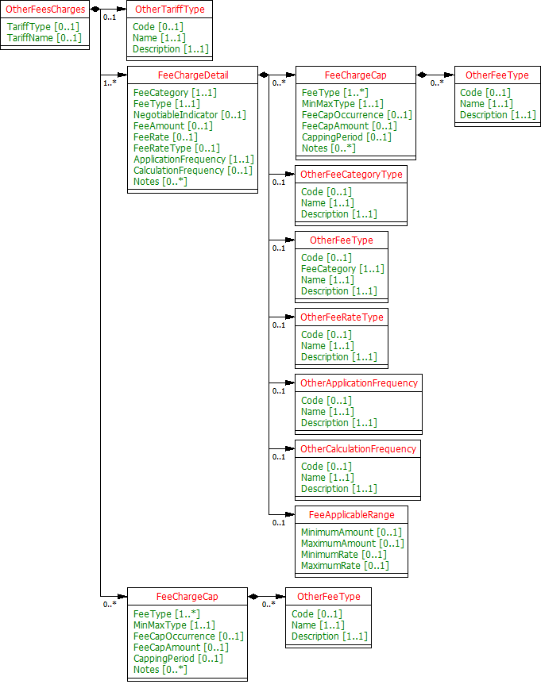
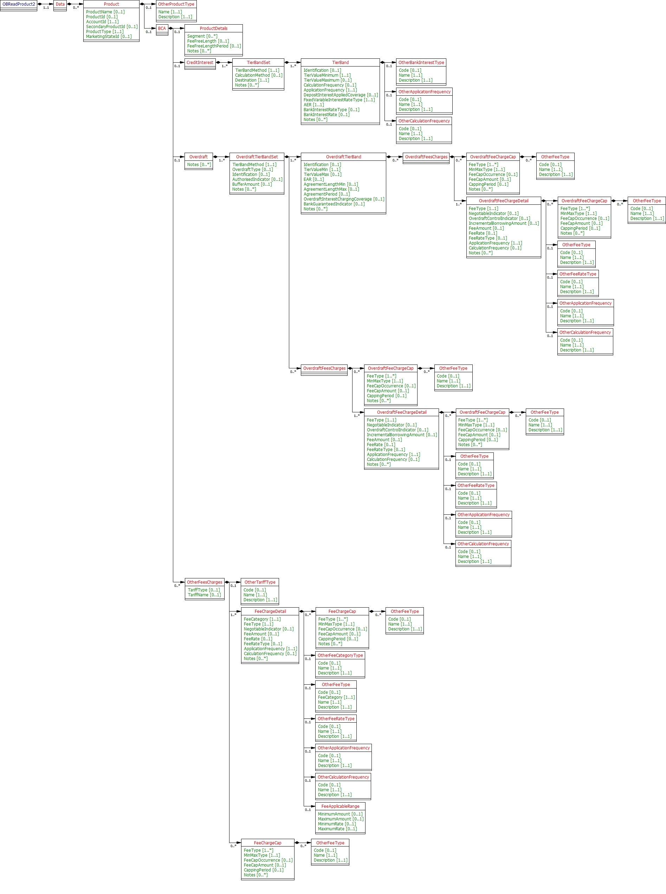

# BCA Product Data Model - v3.1.2

1. [Overview](#overview)
   1. [Fields to include in BCA Product](#fields-to-include-in-bca-product)
      1. [Notes](#notes)
   2. [Changes from the OpenData Model](#changes-from-the-opendata-model)
      1. [No Eligibility and FeaturesAndBenefits](#no-eligibility-and-featuresandbenefits)
      2. [CreditInterest Model](#creditinterest-model)
      3. [Overdraft](#overdraft)
      4. [OverdraftFeeCharges](#overdraftfeecharges)
      5. [OtherFeesCharges](#otherfeescharges)
2. [Data Model](#data-model)
   1. [Data Payload](#data-payload)
      1. [BCA](#bca)
            1. [UML Class Diagram](#uml-class-diagram)
   2. [Data Dictionary](#data-dictionary)
   3. [Data Payload - Enumerations](#data-payload---enumerations)
3. [Usage Examples](#usage-examples)
   1. [Publish Open Data Standard BCA Product](#publish-open-data-standard-bca-product)
      1. [Get Accounts Product Request](#get-accounts-product-request)
      2. [Get Accounts Product Response](#get-accounts-product-response)
   2. [Publish Open Data Standard BCA Product along with new other fee charges](#publish-open-data-standard-bca-product-along-with-new-other-fee-charges)
      1. [Request: Get Accounts Product Request](#request-get-accounts-product-request)
      2. [Response: Get Accounts Product Response](#response-get-accounts-product-response)
   3. [Publish Back Book product](#publish-back-book-product)
      1. [Get Accounts Product Request](#get-accounts-product-request-1)
      2. [Get Accounts Product Response](#get-accounts-product-response-1)
   4. [Represent a business overdraft fees](#represent-a-business-overdraft-fees)
      1. [Get Accounts Product Request](#get-accounts-product-request-2)
      2. [Get Accounts Product Response](#get-accounts-product-response-2)
   5. [Show whole interest rates](#show-whole-interest-rates)
      1. [Get Accounts Product Request](#get-accounts-product-request-3)
      2. [Get Accounts Product Response](#get-accounts-product-response-3)
   6. [Represent Tariffs and "Other Fees And Charges"](#represent-tariffs-and-other-fees-and-charges)
      1. [Get Accounts Product Request](#get-accounts-product-request-4)
      2. [Get Accounts Product Response](#get-accounts-product-response-4)

## Overview

From the analysis:-
* Banks will provide the Open Data Product ID
* In addition to the "Open Data Product ID" link, we should focus on fields that are provided by price comparison websites today. Although overdraft rates are typically marked as "Negotiable" on PCWs, we feel that it would be useful to provide information about the actual overdraft rate(s) that the accountholder is on, even if this cannot easily be used for comparison with other products.
* The sections which are most useful for price comparison are: Fee-free periods, Credit Interest and certain sections of eligibilities where other fee charges are dependent on them and periodic fee(s).
* BCA Marketing state information is not required.
* The eligibility criteria met when the BCA was sold is unlikely to be reliable. Hence eligibility criteria information is optional.

Further analysis required:-
* FeaturesAndBenefits: Further analysis is required to check whether feature and benefits section is needed.

### Fields to include in BCA Product

| Product Section |Fields to be included |
| --- |--- |
| BCA (We'll rename this "Product" and merge BCA and CoreProduct attributes) |<li>Name <li>ProductType ("BCA") <li>Product Segment (e.g. "Startup","Switcher",...) <li>Open Data Product ID (Mandatory, if product info is available on Open Data BCA API) <li>Fee-free period |
| CoreProduct |**None** - Will be merged in to new "Product" section. |
| BCAMarketingState |**None** - Sections will only include current state information, so this section is not required. |
| CreditInterest |<li>TierBandSet fields (excluding credit interest eligibility). <li>All TierBand fields <li>**Note: Only current state credit interest information is required. Where the interest rate(s) have been negotiated, the actual rates applied to the account should be provided.** |
| Overdraft |<li>All TierBandSet fields (including OverdraftFeesAndCharges) <li>All TierBand fields (including OverdraftFeesAndCharges). <li>**Note: Only current state information is required. Where the overdraft rate(s) have been negotiated, the actual rates applied to the account should be provided.** |
| Eligibility |**None** - Whether an organisation is eligible for other products cannot be determined by looking at existing product eligibility e.g., criteria for a startup can vary from bank to bank. |
| FeaturesAndBenefits |**None** - The value of a particular feature and benefit to an accountholder is dependent on their use of that benefit and whether they met the eligibility criteria. Features &amp; benefits are less significant in the BCA market than the PCA. |
| OtherFeesAndCharges |<li>See Notes below |

#### Notes

* With BCA, there are substantially more other fees &amp; charges than are applicable to PCA account holders.
* Prior to OBIE being formed, the CMA asked the 9 banks to provide a set of fees &amp; charges that would allow for a comparison between banks, the results of which are documented in the [Business current account and personal current account pricing analysis](https://assets.digital.cabinet-office.gov.uk/media/574470efe5274a0375000006/update_on_pca_pricing_working_paper.pdf). The comparison included the following Fee Types(Please see the attached codelist file), which we think are relevant, all of which are domestic transactions. As well as fee comparison information provided by the banks to the CMA9, there are tariff comparison calculators provided by some of the banks that allow a BCA holder the ability to determine which bank product would provide them with the lowest set of charges.
* **Electronic:** Auto credit, Bill payment, Debit card payment, Direct debit, Standing Order
* **Branch/Other:** Pay in (Counter), Deposit (Cheque), Issue (Cheque), Withdrawal (Counter), Cash In, Cash Out (Counter), Cash Out (ATM)
* However, our analysis is that the basket of fees is a weighted average provided as a one-off activity and it would be difficult for the banks to supply fees/charges for these business activities in a real time API. This is due to banks charging fees at different levels of granularity today and fee standardisation being required. Although comparative pricing is highlighted as a key driver of the Open Banking initiative, without fee standardisation, the complexity of comparing fees is likely to deter customers from considering switching.
* **We conclude, that as with BCA, the periodic fee is the most common "Other" fee and charge that BCA price comparison websites provide today.**
* Banks will provide the Open Data Product ID.
* In addition to the "Open Data Product ID" link, we should focus on fields that are provided by price comparison websites today. Although overdraft rates are typically marked as "Negotiable" on PCWs, we feel that it would be useful to provide information about the actual overdraft rate(s) that the accountholder is on, even if this cannot easily be used for comparison with other products.
* The sections which are most useful for price comparison for Fee-free periods, Credit Interest and certain section of eligibilities where other fee charges are dependent on them and periodic fee(s) .
* BCA Marketing state information is not required.
* Eligibility criteria met when BCA was sold is unlikely to be reliable. Hence eligibility criteria information is optional.

### Changes from the OpenData Model

#### No Eligibility and FeaturesAndBenefits

* Eligibility and FeaturesAndBenefits sections are removed from the Account Info section as information related to them might not be easily available.
* **Unlike PCA, there is no requirement to publish a MaximumMonthlyCharge , so Monthly Charge field has been omitted. In the BCA On Sale Product Data API, There were two fields MonthlyCharge and IncludedInMonthlyChargeIndicator( OtherFeesAndCharges section). Both of these fields have been removed from this specification.**



#### CreditInterest Model

* AER is the only representative rate for CreditInterest for product comparison purposes and therefore has been explicitly captured.
* The banks often also specify Gross rates. Net is usually determined by removing basic rate tax only, and banks stopped doing this from April 2016. This may still be required for backbook products.
* It has been ensured that both the calculation and application frequency for credit interest is captured. 
* The term "Nominal" used by some banks is synonymous with "Gross".
* DepositInterestAppliedCoverage refers to which interest rate is applied when interests are tiered. For example, if an account balance is £2k and the interest tiers are:- 0-£500 0.1%, 500-1000 0.2%, 1000-10000 0.5%, then the applicable interest rate could either be 0.5% of the entire balance (since the account balance sits in the top interest tier) or (0.1%*500)+(0.2%*500)+(0.5%*1000). In the 1st situation, the interest should be applied to the "Whole" of the account balance, and in the 2nd this should be "Tiered".
* Destination refers to whether the BCA allows interest to be credited to another account ("PayAway") or only to the BCA itself ("SelfCredit").



#### Overdraft

* Overdraft Types can either be Committed e.g., the bank are committed to provide this overdraft facility and cannot demand repayment without notifying the customer, or OnDemand: The bank can demand instant repayment of this overdraft.
* OverdraftFeeCharges are defined at TierBandSet level for fees/charges that are not tiered and at the TierBand level for those that are. See following slide for details.
* For BCA, as well as the bank's own tiers, they have to specify the EAR for representative overdrafts in the CMA defined bands set out in article 32.3 of the order.
* OverdraftInterestChargingCoverage refers to which interest rate is applied when interest is tiered. For example, if an overdraft balance is £2k and the interest tiers are:- 0-£500 0.1%, 500-1000 0.2%, 1000-10000 0.5%, then the applicable interest rate could either be 0.5% of the entire balance (since the account balance sits in the top interest tier) or (0.1%*500)+(0.2%*500)+(0.5%*1000). In the 1st situation, the interest should be applied to the "Whole" of the account balance, and in the 2nd, this be "Tiered".
* BankGuaranteedIndicator indicates whether the advertised overdraft rate is guaranteed to be offered to a borrower by the bank e.g., if it is part of a government scheme, or whether the rate may vary dependent on the applicant's circumstances.
* AgreementLengthMin, AgreementLengthMax and AgreementLengthPeriod are added to allow for Overdrafts where the rate varies dependent on the length of the agreement, as well as the size of the overdraft.

#### OverdraftFeeCharges

* Overdraft/borrowing fees are less important for BCA than for PCA, as only 15% of business customers have overdrafts. (Ref: page 15 - [https://assets.publishing.service.gov.uk/media/55c4bf0340f0b61374000015/BCA_and_PCA_pricing_analysis_v2.pdf](https://assets.publishing.service.gov.uk/media/55c4bf0340f0b61374000015/BCA_and_PCA_pricing_analysis_v2.pdf))
* A cap can be applied to 1 or more Overdraft Fees/Charges and are typically capped for a particular period e.g., Total overdraft charges (Arranged, Unarranged, Paid Transaction and Unpaid Transaction) may be capped on a monthly basis.
* Capping can either be based on an amount (in gbp), an amount (in items) or a rate.
* Additional notes are required to ensure it is made clear how any formula used to apply the capping is deduced.
* The codelist for OverdraftFeeChargeCap/FeeType and OverdraftFeeChargeDetail/FeeType is different from the equivalent fields in OtherFeesAndCharges.
* FeeCapOccurrence has been added to capture situations where fees/charges are captured dependent on the number of occurrences rather than capped at a particular amount.
* Setup/arrangement and renewal fees are common for business overdrafts, and therefore need to be included in the OB_BCAOverdraftFeeType1Codelist.
* Fees/charges are often negotiable, so a NegotiableIndicator has been added to OverdraftFeeChargeDetail.



#### OtherFeesCharges

* OtherFeesCharges is a lot more important for companies who have not opened a startup or switcher account.
* Fees/charges are often negotiable for BCA, so a NegotiableIndicator has been added to FeeChargeDetail.



## Data Model

### Data Payload

#### BCA

###### UML Class Diagram

* This implementation is based on the assumption that all pending decisions were based on the OBIE recommended option.
* Other Fee Charges: Only Periodic Fee(service charge) has been included in the Code List.
* We have taken Open Data BCA Segments for BCA Account Info as well.



### Data Dictionary

* [BCA Account Info Data Definition](productdatafiles/ainfobca.v3.1.2.DD.xlsx )

### Data Payload - Enumerations

* [BCA Account Info Code List](productdatafiles/ainfobca.v3.1.2.CodeList.xlsx )

## Usage Examples

### Publish Open Data Standard BCA Product

Example reference HSBC Startup Business Account

#### Get Accounts Product Request

```
GET /accounts/22389/product HTTP/1.1
Authorization: Bearer Az90SAOJklae
x-fapi-auth-date:  Sun, 10 Sep 2017 19:43:31 GMT
x-fapi-customer-ip-address: 104.25.212.99
x-fapi-interaction-id: 93bac548-d2de-4546-b106-880a5018460d
Accept: application/json
```

#### Get Accounts Product Response

```
HTTP/1.1 200 OK
x-fapi-interaction-id: 93bac548-d2de-4546-b106-880a5018460d
Content-Type: application/json
```

```json
{
   "Data":{
      "Product":[
         {
            "AccountId":"22389",
            "ProductId":"HSBC12234BAS",
            "ProductType":"BusinessCurrentAccount",
            "ProductName":"HSBC Startup Business Current Account"
         }
      ]
   },
   "Links":{
      "Self":"https://api.alphabank.com/open-banking/v3.1/aisp/accounts/22289/product"
   },
   "Meta":{
      "TotalPages":1
   }
}
```

### Publish Open Data Standard BCA Product along with new other fee charges

The example below has been taken from Santander Business Current Account.
The customer is at £12.50 monthly account fee for £3,000 cash deposits per month.

#### Request: Get Accounts Product Request

```
GET /accounts/22390/product HTTP/1.1
Authorization: Bearer Az90SAOJklae
x-fapi-auth-date:  Sun, 10 Sep 2017 19:43:31 GMT
x-fapi-customer-ip-address: 104.25.212.99
x-fapi-interaction-id: 93bac548-d2de-4546-b106-880a5018460d
Accept: application/json
```

#### Response: Get Accounts Product Response

```
HTTP/1.1 200 OK
x-fapi-interaction-id: 93bac548-d2de-4546-b106-880a5018460d
Content-Type: application/json
```

```json
{
   "Data":{
      "Product":[
         {
            "AccountId":"22390",
            "ProductId":"HSBC12234BAS",
            "ProductType":"BusinessCurrentAccount",
            "ProductName":"Business Current Account £12.50 Monthly Fee",
            "BCA":{
               "OtherFeesCharges":{
                  "FeeChargeDetail":[
                     {
                        "FeeCategory":"Servicing",
                        "FeeType":"ServiceCAccountFeeMonthly",
                        "FeeAmount":"12.500",
                        "ApplicationFrequency":"Monthly",
                        "CalculationFrequency":"Daily",
                        "Notes":[
                           "Our tariff includes:\n* depositing and sending cheques\n* cash deposits up to the limit your tariff allows\n* withdrawals\n* Direct Debits, standing orders, bill payments\n* Bas credits\n* debit card payments"
                        ]
                     }
                  ]
               }
            }
         }
      ]
   },
   "Links":{
      "Self":"https://api.alphabank.com/open-banking/v3.1/aisp/accounts/22390/product"
   },
   "Meta":{
      "TotalPages":1
   }
}
```

### Publish Back Book product

Lloyds Retail Business  Current Account

#### Get Accounts Product Request

```
GET /accounts/22391/product HTTP/1.1
Authorization: Bearer Az90SAOJklae
x-fapi-auth-date:  Sun, 10 Sep 2017 19:43:31 GMT
x-fapi-customer-ip-address: 104.25.212.99
x-fapi-interaction-id: 93bac548-d2de-4546-b106-880a5018460d
Accept: application/json
```

#### Get Accounts Product Response

```
HTTP/1.1 200 OK
x-fapi-interaction-id: 93bac548-d2de-4546-b106-880a5018460d
Content-Type: application/json
```

```json
{
   "Data":{
      "Product":[
         {
            "AccountId":"22391",
            "ProductType":"BusinessCurrentAccount",
            "ProductName":"Lloyds Business Current Account",
			"BCA": {
				"ProductDetails": {
					"Segment": "General",
					"FeeFreeLength": "18",
					"FeeFreeLengthPeriod":"Month",
					"Notes": ["The customer is no longer in the fee free period."]
				}
			}
         }
      ]
   },
   "Links":{
      "Self":"https://api.alphabank.com/open-banking/v3.1/aisp/accounts/22391/product"
   },
   "Meta":{
      "TotalPages":1
   }
}
```

### Represent a business overdraft fees

The example below has been taken from the  Barclays Business Current Account

#### Get Accounts Product Request

```
GET /accounts/22392/product HTTP/1.1
Authorization: Bearer Az90SAOJklae
x-fapi-auth-date:  Sun, 10 Sep 2017 19:43:31 GMT
x-fapi-customer-ip-address: 104.25.212.99
x-fapi-interaction-id: 93bac548-d2de-4546-b106-880a5018460d
Accept: application/json
```

#### Get Accounts Product Response

```
HTTP/1.1 200 OK
x-fapi-interaction-id: 93bac548-d2de-4546-b106-880a5018460d
Content-Type: application/json
```

```json
{
   "Data":{
      "Product":[
         {
            "AccountId":"22392",
            "ProductType":"BusinessCurrentAccount",
            "ProductName":"Barclays Business Current Account",
            "BCA":{
               "Overdraft":{
                  "OverdraftTierBandSet":[
                     {
                        "TierBandMethod":"Tiered",
                        "OverdraftType":"Committed",
                        "OverdraftFeesCharges":[
                           {
                              "OverdraftFeeChargeDetail":[
                                 {
                                    "FeeType":"OverdraftSetup",
                                    "NegotiableIndicator":true,
                                    "FeeAmount":"75.00",
                                    "CalculationFrequency":"OnOpening",
                                    "ApplicationFrequency":"OnOpening"
                                 },
                                 {
                                    "FeeType":"TempOverdraft",
                                    "FeeRate":"12.30",
                                    "FeeRateType":"Gross",
                                    "ApplicationFrequency":"Monthly",
                                    "CalculationFrequency":"Daily"
                                 },
                                 {
                                    "FeeType":"OverdraftRenewal",
                                    "FeeRate":"0.5",
                                    "FeeRateType":"Gross",
                                    "ApplicationFrequency":"OnAnniversary",
                                    "CalculationFrequency":"OnAnniversary"
                                 }
                              ]
                           }
                        ],
                        "BufferAmount":"10.00",
                        "Notes":[
                           "The daily usage fee-free overdraft period is for 12 months starting on the date you open a Current Account with us."
                        ]
                     }
                  ]
               }
            }
         }
      ]
   },
   "Links":{
      "Self":"https://api.alphabank.com/open-banking/v3.1/aisp/accounts/22392/product"
   },
   "Meta":{
      "TotalPages":1
   }
}
```

### Show whole interest rates

The example below has been taken from the Lloyds Schools Banking Account
0.05% Fixed interest
No interest-related eligibly criteria specific

#### Get Accounts Product Request

```
GET /accounts/22393/product HTTP/1.1
Authorization: Bearer Az90SAOJklae
x-fapi-auth-date:  Sun, 10 Sep 2017 19:43:31 GMT
x-fapi-customer-ip-address: 104.25.212.99
x-fapi-interaction-id: 93bac548-d2de-4546-b106-880a5018460d
Accept: application/json
```

#### Get Accounts Product Response

```
HTTP/1.1 200 OK
x-fapi-interaction-id: 93bac548-d2de-4546-b106-880a5018460d
Content-Type: application/json
```

```json
{
   "Data":{
      "Product":[
         {
            "AccountId":"22393",
            "ProductType":"BusinessCurrentAccount",
            "ProductName":"School Bank Account",
            "BCA":{
               "CreditInterest":{
                  "TierBandSet":{
                     "TierBandMethod":"Whole",
                     "CalculationMethod":"Compound",
                     "Destination":"SelfCredit",
                     "Notes":[
                        "£1 minimum balance"
                     ],
                     "TierBand":[
                        {
                           "Identification":"1",
                           "TierValueMinimum":"1.0000",
                           "CalculationFrequency":"Monthly",
                           "ApplicationFrequency":"Monthly",
                           "DepositInterestAppliedCoverage":"Whole",
                           "FixedVariableInterestRateType":"Fixed",
                           "AER":"0.0500",
                           "BankInterestRateType":"Gross",
                           "BankInterestRate":"0.0500"
                        }
                     ]
                  }
               }
            }
         }
      ]
   },
   "Links":{
      "Self":"https://api.alphabank.com/open-banking/v3.1/aisp/accounts/22393/product"
   },
   "Meta":{
      "TotalPages":1
   }
}
```

### Represent Tariffs and "Other Fees And Charges"

The example below has been taken from the HSBC Business Current Account

#### Get Accounts Product Request

```
GET /accounts/22394/product HTTP/1.1
Authorization: Bearer Az90SAOJklae
x-fapi-auth-date:  Sun, 10 Sep 2017 19:43:31 GMT
x-fapi-customer-ip-address: 104.25.212.99
x-fapi-interaction-id: 93bac548-d2de-4546-b106-880a5018460d
Accept: application/json
```

#### Get Accounts Product Response

```
HTTP/1.1 200 OK
x-fapi-interaction-id: 93bac548-d2de-4546-b106-880a5018460d
Content-Type: application/json
```

```json
{
   "Data":{
      "Product":[
         {
            "AccountId":"22394",
            "ProductId":"HSBC1234BCA",
            "ProductType":"BusinessCurrentAccount",
            "ProductName":"BCA Startup Current Account",
            "PCA":{
               "OtherFeesCharges":[
                  {
                     "TariffType":"Mixed",
                     "TariffName":"Small Business Tariff",
                     "FeeChargeDetail":{
                        "FeeCategory":"Servicing",
                        "FeeType":"ServiceCAccountFeeMonthly",
                        "FeeAmount":"5.50",
                        "CalculationFrequency":"Monthly",
                        "ApplicationFrequency":"Monthly",
                        "Notes":[
                           "Standard account charges. Small Business Tariff."
                        ]
                     }
                  },
                  {
                     "TariffType":"Electronic",
                     "TariffName":"Electronic Banking Tariff",
                     "FeeChargeDetail":{
                        "FeeCategory":"Servicing",
                        "FeeType":"ServiceCAccountFeeMonthly",
                        "FeeAmount":"5.50",
                        "CalculationFrequency":"Monthly",
                        "ApplicationFrequency":"Monthly",
                        "Notes":[
                           "Standard account charges. Electronic Banking Tariff."
                        ]
                     }
                  }
               ]
            }
         }
      ]
   },
   "Links":{
      "Self":"https://api.alphabank.com/open-banking/v3.1/aisp/accounts/22394/product"
   },
   "Meta":{
      "TotalPages":1
   }
}
```