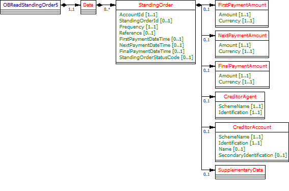

# Standing Orders - v3.1.2

1. [Overview](#overview)
2. [Endpoints](#endpoints)
   1. [GET /accounts/{AccountId}/standing-orders](#get-accountsaccountidstanding-orders)
   2. [GET /standing-orders](#get-standing-orders)
3. [Data Model](#data-model)
   1. [Resource Definition](#resource-definition)
   2. [UML Diagram](#uml-diagram)
   3. [Notes](#notes)
   4. [Frequency Examples](#frequency-examples)
   5. [Permission Codes](#permission-codes)
   6. [Data Dictionary](#data-dictionary)
4. [Usage Examples](#usage-examples)
   1. [Specific Account](#specific-account)
      1. [Get Accounts Standing Orders Request](#get-accounts-standing-orders-request)
      2. [Get Accounts Standing Orders Response](#get-accounts-standing-orders-response)
   2. [Bulk](#bulk)
      1. [Get Standing Orders Request](#get-standing-orders-request)
      2. [Get Standing Orders Response](#get-standing-orders-response)

## Overview

The standing-orders resource is used by an AISP to retrieve the standing orders for a specific AccountId or to retrieve the standing orders in bulk for all the accounts that the PSU has consented to. 

This resource description should be read in conjunction with a compatible Account Information Services API Profile.

## Endpoints

Endpoints for the resource and available methods.

|  |Resource |HTTP Operation |Endpoint |Mandatory? |Scope |Grant Type |Idempotency Key |Parameters |Request Object |Response Object |
| --- |--- |--- |--- |--- |--- |--- |--- |--- |--- |--- |
| 1 |standing-orders |GET |GET /accounts/{AccountId}/standing-orders |Conditional |accounts |Authorization Code |No | | |OBReadStandingOrder5 |
| 2 |standing-orders |GET |GET /standing-orders |Optional |accounts |Authorization Code |No |Pagination | |OBReadStandingOrder5 |

### GET /accounts/{AccountId}/standing-orders

An AISP may retrieve the standing-order resource for a specific AccountId (which is retrieved in the call to GET /accounts).

### GET /standing-orders

If an ASPSP has implemented the bulk retrieval endpoints, an AISP may optionally retrieve the standing-order resources in bulk.
This will retrieve the resources for all authorised accounts linked to the account-request.

## Data Model

The OBReadStandingOrder5 object will be used for the call to: 

* GET /accounts/{AccountId}/standing-orders
* GET /standing-orders

### Resource Definition

A resource that contains a set of elements that describes the list of standing-orders that have been set up on a specific account (AccountId).
An account (AccountId) may have no standing orders set up, or may have multiple standing orders set up.

### UML Diagram



### Notes

* The **Creditor** **Account** and **CreditorAgent** blocks replicate what is used consistently throughout the Account Information APIs to identify an account.
* For the /accounts/{AccountId}/standing-orders endpoint, the **Creditor** **Account** and **CreditorAgent** blocks represent the account that is receiving funds (so has been named the CreditorAccount for consistency with the PISP use case).
* A DateTime element has been used so that there is consistency across all API endpoints using dates. Where time elements do not exist in ASPSP systems, the time portion of the DateTime element will be defaulted to 00:00:00+00:00.
* The Amount elements all have embedded Currency elements for consistency is ISO 20022, and across the other API endpoints.

### Frequency Examples

| Frequency |Example |Details |
| --- |--- |--- |
| EvryDay |EvryDay |Every day |
| EvryWorkgDay |EvryWorkgDay |Every working day |
| IntrvlDay |IntrvlDay:15 |Every 15 Calendar day. |
| IntrvlWkDay |IntrvlWkDay:01:03 |Every week, on the 3rd day of the week |
| IntrvlWkDay |IntrvlWkDay:02:03 |Every 2nd week, on the 3rd day of the week |
| WkInMnthDay |WkInMnthDay:02:03 |Every month, on the 2nd week of the month, and on the third day of the week |
| IntrvlMnthDay |IntrvlMnthDay:01:-01 |Every month, on the last day of the month |
| IntrvlMnthDay |IntrvlMnthDay:06:15 |Every 6th month, on the 15th day of the month |
| QtrDay |QtrDay:ENGLISH |Paid on the 25th March, 24th June, 29th September and 25th December |

### Permission Codes

The resource differs depending on the permissions (ReadStandingOrdersBasic and ReadStandingOrdersDetail) used to access resource. In the event the resource is accessed with both ReadStandingOrdersBasic and ReadStandingOrdersDetail, the most detailed level (ReadStandingOrdersDetail) must be used.

* These objects **must not** be returned **without** the **ReadStandingOrdersDetail** permission: 
    * OBReadStandingOrder5/Data/StandingOrder/CreditorAgent 
    * OBReadStandingOrder5/Data/StandingOrder/CreditorAccount
* If the **ReadStandingOrdersDetail** is granted by the PSU:     
    * OBReadStandingOrder5/Data/StandingOrder/CreditorAgent **may** be returned if applicable to the account and ASPSP (0..1) 
    * OBReadStandingOrder5/Data/StandingOrder/CreditorAccount **must** be returned (1..1)

If the ReadPAN permission is granted by the PSU, the ASPSP may choose to populate the OBReadStandingOrder5/Data/StandingOrder/CreditorAccount/Identification with the unmasked PAN (if the PAN is being populated in the response).

### Data Dictionary

| Name |Occurrence |XPath |EnhancedDefinition |Class |Codes |Pattern |
| --- |--- |--- |--- |--- |--- |--- |
| OBReadStandingOrder5 | |OBReadStandingOrder5 | |OBReadStandingOrder5 | | |
| Data |1..1 |OBReadStandingOrder5/Data | |OBReadDataStandingOrder5 | | |
| StandingOrder |0..n |OBReadStandingOrder5/Data/StandingOrder | |OBStandingOrder5 | | |
| AccountId |1..1 |OBReadStandingOrder5/Data/StandingOrder/AccountId |A unique and immutable identifier used to identify the account resource. This identifier has no meaning to the account owner. |Max40Text | | |
| StandingOrderId |0..1 |OBReadStandingOrder5/Data/StandingOrder/StandingOrderId |A unique and immutable identifier used to identify the standing order resource. This identifier has no meaning to the account owner. |Max40Text | | |
| Frequency |1..1 |OBReadStandingOrder5/Data/StandingOrder/Frequency |Individual Definitions: EvryDay - Every day EvryWorkgDay - Every working day IntrvlDay - An interval specified in number of calendar days (02 to 31) IntrvlWkDay - An interval specified in weeks (01 to 09), and the day within the week (01 to 07) WkInMnthDay - A monthly interval, specifying the week of the month (01 to 05) and day within the week (01 to 07) IntrvlMnthDay - An interval specified in months (between 01 to 06, 12, 24), specifying the day within the month (-05 to -01, 01 to 31) QtrDay - Quarterly (either ENGLISH, SCOTTISH, or RECEIVED) ENGLISH = Paid on the 25th March, 24th June, 29th September and 25th December. SCOTTISH = Paid on the 2nd February, 15th May, 1st August and 11th November. RECEIVED = Paid on the 20th March, 19th June, 24th September and 20th December. Individual Patterns: EvryDay (ScheduleCode) EvryWorkgDay (ScheduleCode) IntrvlDay:NoOfDay (ScheduleCode + NoOfDay) IntrvlWkDay:IntervalInWeeks:DayInWeek (ScheduleCode + IntervalInWeeks + DayInWeek) WkInMnthDay:WeekInMonth:DayInWeek (ScheduleCode + WeekInMonth + DayInWeek) IntrvlMnthDay:IntervalInMonths:DayInMonth (ScheduleCode + IntervalInMonths + DayInMonth) QtrDay: + either (ENGLISH, SCOTTISH or RECEIVED) ScheduleCode + QuarterDay The regular expression for this element combines five smaller versions for each permitted pattern. To aid legibility - the components are presented individually here: EvryDay EvryWorkgDay IntrvlDay:((0[2-9])|([1-2][0-9])|3[0-1]) IntrvlWkDay:0[1-9]:0[1-7] WkInMnthDay:0[1-5]:0[1-7] IntrvlMnthDay:(0[1-6]|12|24):(-0[1-5]|0[1-9]|[12][0-9]|3[01]) QtrDay:(ENGLISH|SCOTTISH|RECEIVED) Full Regular Expression: ^(EvryDay)$|^(EvryWorkgDay)$|^(IntrvlDay:((0[2-9])|([1-2][0-9])|3[0-1]))$|^(IntrvlWkDay:0[1-9]:0[1-7])$|^(WkInMnthDay:0[1-5]:0[1-7])$|^(IntrvlMnthDay:(0[1-6]|12|24):(-0[1-5]|0[1-9]|[12][0-9]|3[01]))$|^(QtrDay:(ENGLISH|SCOTTISH|RECEIVED))$ |Max35Text | |^(EvryDay)$|^(EvryWorkgDay)$|^(IntrvlWkDay:0[1-9]:0[1-7])$|^(WkInMnthDay:0[1-5]:0[1-7])$|^(IntrvlMnthDay:(0[1-6]|12|24):(-0[1-5]|0[1-9]|[12][0-9]|3[01]))$|^(QtrDay:(ENGLISH|SCOTTISH|RECEIVED))$ |
| Reference |0..1 |OBReadStandingOrder5/Data/StandingOrder/Reference |Unique reference, as assigned by the creditor, to unambiguously refer to the payment transaction. Usage: If available, the initiating party should provide this reference in the structured remittance information, to enable reconciliation by the creditor upon receipt of the amount of money. If the business context requires the use of a creditor reference or a payment remit identification, and only one identifier can be passed through the end-to-end chain, the creditor's reference or payment remittance identification should be quoted in the end-to-end transaction identification. |Max35Text | | |
| FirstPaymentDateTime |0..1 |OBReadStandingOrder5/Data/StandingOrder/FirstPaymentDateTime |The date on which the first payment for a Standing Order schedule will be made. |ISODateTime | | |
| NextPaymentDateTime |0..1 |OBReadStandingOrder5/Data/StandingOrder/NextPaymentDateTime |The date on which the next payment for a Standing Order schedule will be made. |ISODateTime | | |
| FinalPaymentDateTime |0..1 |OBReadStandingOrder5/Data/StandingOrder/FinalPaymentDateTime |The date on which the final payment for a Standing Order schedule will be made. |ISODateTime | | |
| StandingOrderStatusCode |0..1 |OBReadStandingOrder5/Data/StandingOrder/StandingOrderStatusCode |Specifies the status of the standing order in code form. |OBExternalStandingOrderStatus1Code |Active Inactive | |
| FirstPaymentAmount |0..1 |OBReadStandingOrder5/Data/StandingOrder/FirstPaymentAmount |The amount of the first Standing Order |OBActiveOrHistoricCurrencyAndAmount | | |
| Amount |1..1 |OBReadStandingOrder5/Data/StandingOrder/FirstPaymentAmount/Amount |A number of monetary units specified in an active currency where the unit of currency is explicit and compliant with ISO 4217. |OBActiveCurrencyAndAmount_SimpleType | |^\d{1,13}\.\d{1,5}$ |
| Currency |1..1 |OBReadStandingOrder5/Data/StandingOrder/FirstPaymentAmount/Currency |A code allocated to a currency by a Maintenance Agency under an international identification scheme, as described in the latest edition of the international standard ISO 4217 "Codes for the representation of currencies and funds". |ActiveOrHistoricCurrencyCode | |^[A-Z]{3,3}$ |
| NextPaymentAmount |0..1 |OBReadStandingOrder5/Data/StandingOrder/NextPaymentAmount |The amount of the next Standing Order. |OBActiveOrHistoricCurrencyAndAmount | | |
| Amount |1..1 |OBReadStandingOrder5/Data/StandingOrder/NextPaymentAmount/Amount |A number of monetary units specified in an active currency where the unit of currency is explicit and compliant with ISO 4217. |OBActiveCurrencyAndAmount_SimpleType | |^\d{1,13}\.\d{1,5}$ |
| Currency |1..1 |OBReadStandingOrder5/Data/StandingOrder/NextPaymentAmount/Currency |A code allocated to a currency by a Maintenance Agency under an international identification scheme, as described in the latest edition of the international standard ISO 4217 "Codes for the representation of currencies and funds". |ActiveOrHistoricCurrencyCode | |^[A-Z]{3,3}$ |
| FinalPaymentAmount |0..1 |OBReadStandingOrder5/Data/StandingOrder/FinalPaymentAmount |The amount of the final Standing Order |OBActiveOrHistoricCurrencyAndAmount | | |
| Amount |1..1 |OBReadStandingOrder5/Data/StandingOrder/FinalPaymentAmount/Amount |A number of monetary units specified in an active currency where the unit of currency is explicit and compliant with ISO 4217. |OBActiveCurrencyAndAmount_SimpleType | |^\d{1,13}\.\d{1,5}$ |
| Currency |1..1 |OBReadStandingOrder5/Data/StandingOrder/FinalPaymentAmount/Currency |A code allocated to a currency by a Maintenance Agency under an international identification scheme, as described in the latest edition of the international standard ISO 4217 "Codes for the representation of currencies and funds". |ActiveOrHistoricCurrencyCode | |^[A-Z]{3,3}$ |
| CreditorAgent |0..1 |OBReadStandingOrder5/Data/StandingOrder/CreditorAgent |Party that manages the account on behalf of the account owner, that is manages the registration and booking of entries on the account, calculates balances on the account and provides information about the account. This is the servicer of the beneficiary account. |OBBranchAndFinancialInstitutionIdentification5 | | |
| SchemeName |1..1 |OBReadStandingOrder5/Data/StandingOrder/CreditorAgent/SchemeName |Name of the identification scheme, in a coded form as published in an external list. |OBExternalFinancialInstitutionIdentification4Code | | |
| Identification |1..1 |OBReadStandingOrder5/Data/StandingOrder/CreditorAgent/Identification |Unique and unambiguous identification of the servicing institution. |Max35Text | | |
| CreditorAccount |0..1 |OBReadStandingOrder5/Data/StandingOrder/CreditorAccount |Provides the details to identify the beneficiary account. |OBCashAccount5 | | |
| SchemeName |1..1 |OBReadStandingOrder5/Data/StandingOrder/CreditorAccount/SchemeName |Name of the identification scheme, in a coded form as published in an external list. |OBExternalAccountIdentification4Code | | |
| Identification |1..1 |OBReadStandingOrder5/Data/StandingOrder/CreditorAccount/Identification |Beneficiary account identification. |Max256Text | | |
| Name |0..1 |OBReadStandingOrder5/Data/StandingOrder/CreditorAccount/Name |The account name is the name or names of the account owner(s) represented at an account level, as displayed by the ASPSP's online channels. Note, the account name is not the product name or the nickname of the account. |Max70Text | | |
| SecondaryIdentification |0..1 |OBReadStandingOrder5/Data/StandingOrder/CreditorAccount/SecondaryIdentification |This is secondary identification of the account, as assigned by the account servicing institution. This can be used by building societies to additionally identify accounts with a roll number (in addition to a sort code and account number combination). |Max34Text | | |
| SupplementaryData |0..1 |OBReadStandingOrder5/Data/StandingOrder/SupplementaryData |Additional information that can not be captured in the structured fields and/or any other specific block. |OBSupplementaryData1 | | |

## Usage Examples

### Specific Account

#### Get Accounts Standing Orders Request

```
GET /accounts/22289/standing-orders HTTP/1.1
Authorization: Bearer Az90SAOJklae
x-fapi-auth-date:  Sun, 10 Sep 2017 19:43:31 GMT
x-fapi-customer-ip-address: 104.25.212.99
x-fapi-interaction-id: 93bac548-d2de-4546-b106-880a5018460d
Accept: application/json
```

#### Get Accounts Standing Orders Response

```
HTTP/1.1 200 OK
x-fapi-interaction-id: 93bac548-d2de-4546-b106-880a5018460d
Content-Type: application/json
```

```json
{
  "Data": {
    "StandingOrder": [
      {
        "AccountId": "22289",
        "StandingOrderId": "Ben3",
        "Frequency": "EvryWorkgDay",
        "Reference": "Towbar Club 2 - We Love Towbars",
        "FirstPaymentDateTime": "2017-08-12T00:00:00+00:00",
        "FirstPaymentAmount": {
          "Amount": "0.57",
          "Currency": "GBP"
        },
        "NextPaymentDateTime": "2017-08-13T00:00:00+00:00",
        "NextPaymentAmount": {
          "Amount": "0.56",
          "Currency": "GBP"
        },
        "FinalPaymentDateTime": "2027-08-12T00:00:00+00:00",
        "FinalPaymentAmount": {
          "Amount": "0.56",
          "Currency": "GBP"
        },
        "StandingOrderStatusCode": "Active",
        "CreditorAccount": {
          "SchemeName": "UK.OBIE.SortCodeAccountNumber",
          "Identification": "80200112345678",
          "Name": "Mrs Juniper"
        }
      }
    ]
  },
  "Links": {
    "Self": "https://api.alphabank.com/open-banking/v3.1/aisp/accounts/22289/standing-orders/"
  },
  "Meta": {
    "TotalPages": 1
  }
}
```

### Bulk

#### Get Standing Orders Request

```
GET /standing-orders HTTP/1.1
Authorization: Bearer Az90SAOJklae
x-fapi-auth-date:  Sun, 10 Sep 2017 19:43:31 GMT
x-fapi-customer-ip-address: 104.25.212.99
x-fapi-interaction-id: 93bac548-d2de-4546-b106-880a5018460d
Accept: application/json
```

#### Get Standing Orders Response

```
HTTP/1.1 200 OK
x-fapi-interaction-id: 93bac548-d2de-4546-b106-880a5018460d
Content-Type: application/json
```

```json
{
  "Data": {
    "StandingOrder": [
      {
        "AccountId": "22289",
        "StandingOrderId": "Ben3",
        "Frequency": "EvryWorkgDay",
        "Reference": "Towbar Club 2 - We Love Towbars",
        "FirstPaymentDateTime": "2017-08-12T00:00:00+00:00",
        "FirstPaymentAmount": {
          "Amount": "0.57",
          "Currency": "GBP"
        },
        "NextPaymentDateTime": "2017-08-13T00:00:00+00:00",
        "NextPaymentAmount": {
          "Amount": "0.56",
          "Currency": "GBP"
        },
        "FinalPaymentDateTime": "2027-08-12T00:00:00+00:00",
        "FinalPaymentAmount": {
          "Amount": "0.56",
          "Currency": "GBP"
        },
        "StandingOrderStatusCode": "Active",
        "CreditorAccount": {
          "SchemeName": "UK.OBIE.SortCodeAccountNumber",
          "Identification": "80200112345678",
          "Name": "Mrs Juniper"
        }
      },
      {
        "AccountId": "22289",
        "StandingOrderId": "Ben5",
        "Frequency": "WkinMnthDay(2)",
        "Reference": "Golf - We Love Golf",
        "FirstPaymentDateTime": "2017-06-12T00:00:00+00:00",
        "FirstPaymentAmount": {
          "Amount": "23.00",
          "Currency": "GBP"
        },
        "NextPaymentDateTime": "2017-07-12T00:00:00+00:00",
        "NextPaymentAmount": {
          "Amount": "23.00",
          "Currency": "GBP"
        },
        "FinalPaymentDateTime": "2018-06-12T00:00:00+00:00",
        "FinalPaymentAmount": {
          "Amount": "23.00",
          "Currency": "GBP"
        },
        "StandingOrderStatusCode": "Active",
        "CreditorAccount": {
          "SchemeName": "UK.OBIE.SortCodeAccountNumber",
          "Identification": "23605490179017",
          "Name": "Mr Tee"
        }
      }
    ]
  },
  "Links": {
    "Self": "https://api.alphabank.com/open-banking/v3.1/aisp/standing-orders/"
  },
  "Meta": {
    "TotalPages": 1
  }
}
```