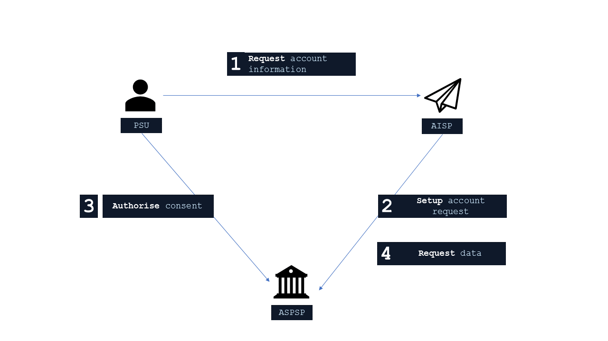
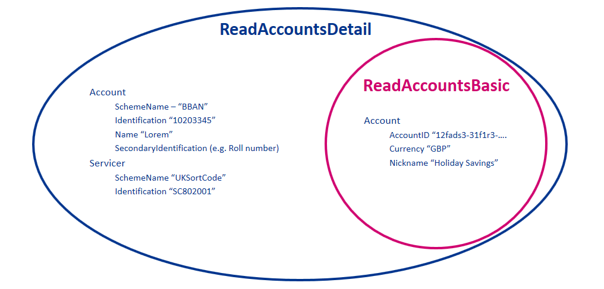

# Account and Transaction API Profile - v3.1.6  <!-- omit in toc -->

- [Overview](#overview)
  - [Document Structure](#document-structure)
  - [Resources](#resources)
- [Basics](#basics)
  - [Overview](#overview-1)
    - [Steps](#steps)
    - [Sequence Diagram](#sequence-diagram)
  - [Idempotency](#idempotency)
  - [Release Management](#release-management)
    - [Account Access Consent](#account-access-consent)
      - [POST](#post)
      - [GET](#get)
      - [DELETE](#delete)
    - [Account Information Resources](#account-information-resources)
      - [GET](#get-1)
- [Security & Access Control](#security--access-control)
  - [Scopes](#scopes)
  - [Grants Types](#grants-types)
  - [Consent Authorisation](#consent-authorisation)
    - [Consent Elements](#consent-elements)
      - [Permissions](#permissions)
        - [Detail Permissions](#detail-permissions)
        - [Reversing Entries](#reversing-entries)
      - [Expiration Date Time](#expiration-date-time)
      - [Transaction To/From Date Time](#transaction-tofrom-date-time)
    - [Account Access Consent Status](#account-access-consent-status)
    - [Consent Re-authentication](#consent-re-authentication)
  - [Consent Revocation](#consent-revocation)
  - [Access Revocation](#access-revocation)
  - [Changes to Selected Account(s)](#changes-to-selected-accounts)
  - [Account Switching](#account-switching)
  - [Risk Scoring Information](#risk-scoring-information)
- [Data Model](#data-model)
  - [Using Meta to identify Available Transaction Period](#using-meta-to-identify-available-transaction-period)
  - [Mapping to Schemes & Standards](#mapping-to-schemes--standards)
  - [Enumerations](#enumerations)
    - [Static Enumerations](#static-enumerations)
    - [ISO Enumerations](#iso-enumerations)
    - [Namespaced Enumerations](#namespaced-enumerations)
- [Alternative Flows](#alternative-flows)
  - [Multi-Authorisation Consent for Corporate Accounts](#multi-authorisation-consent-for-corporate-accounts)

## Overview

The Account and Transaction API Profile describes the flows and common functionality for the Accounts and Transaction API, which allows an Account Information Service Provider ('AISP') to:

- Register an intent to retrieve account information by creating an "account access consent". This registers the data "permissions", expiration and historical period allowed for transactions / statements - that the customer (PSU) has consented to provide to the AISP; and
- Subsequently, retrieve account and transaction data.

This profile should be read in conjunction with a compatible Read/Write Data API Profile which provides a description of the elements that are common across all the Read/Write Data APIs, and compatible individual resources.

### Document Structure

This document consists of the following parts:

 **Overview:** Provides an overview of the profile.

 **Basics:** Identifies the flows, release management and permission model.

 **Security & Access Control:** Specifies the means for AISPs and PSUs to authenticate themselves and provide consent.

 **Data Model:** Documents mappings and enumerations that apply to all the end-points.

 **Alternative Flows:** Documents rules for alternative flows.

### Resources

Each of the Account and Transaction API resources are documented in the  [*Resources and Data Models*  /  *AISP*](../resources%20and%20data%20models/aisp) area of the specification. Each resource is documented with:

- Endpoints
  - The API endpoints available for the resource.
- Data Model
  - Resource definition.
  - UML diagram.
  - Permissions as they relate to accessing the resource.
  - Data dictionary - which defines fields, re-usable classes, mandatory (1..1) or conditional (0..1) as defined in the Design Principles section, and enumerations.
- Usage Examples

## Basics

### Overview

The figure below provides a general outline of an account information request and flow using the Account Info APIs.



#### Steps

Step 1: Request Account Information

- This flow begins with a PSU consenting to allow an AISP to access account information data.

Step 2: Setup Account Access Consent

- The AISP connects to the ASPSP that services the PSU's account(s) and creates an **account-access-consent** resource. This informs the ASPSP that one of its PSUs is granting access to account and transaction information to an AISP. The ASPSP responds with an identifier for the resource (the ConsentId - which is the intent identifier). This step is carried out by making a **POST** request to / **account-access-consents** endpoint.
- The account-access-consent resource will include these fields below - which describe the data that the PSU has consented with the AISP:
  - Permissions - a list of data clusters that have been consented for access.
  - Expiration Date - an optional expiration for when the AISP will no longer have access to the PSU's data.
  - Transaction Validity Period - the From/To date range which specifies a historical period for transactions and statements which may be accessed by the AISP.
- An AISP may be a broker for data to other parties, and so it is valid for a PSU to have multiple account-access-consents for the same accounts, **with different consent/authorisation parameters agreed**.

Step 3: Authorise Consent

- The AISP requests the PSU to authorise the consent. The ASPSP may carry this out by using a  *redirection flow*  or a  *decoupled flow* .
  - In a redirection flow, the AISP redirects the PSU to the ASPSP.
    - The redirect includes the ConsentId generated in the previous step.
    - This allows the ASPSP to correlate the account-access-consent that was setup.
    - The ASPSP authenticates the PSU.
    - The ASPSP updates the state of the account-access-consent resource internally to indicate that the account access consent has been authorised.
    - Once the consent has been authorised, the PSU is redirected back to the AISP.
  - In a decoupled flow, the ASPSP requests the PSU to authorise consent on an  *authentication device* that is separate from the  *consumption device*  on which the PSU is interacting with the AISP.
    - The decoupled flow is initiated by the AISP calling a back-channel authorisation request.
    - The request contains a 'hint' that identifies the PSU, paired with the consent to be authorised.
    - The ASPSP authenticates the PSU and updates the state of the account-access-consent resource internally to indicate that the account access consent has been authorised.
    - Once the consent has been authorised, the ASPSP can make a callback to the AISP to provide an access token.
- The principle we have agreed is that consent is managed between the PSU and the AISP - so the account-access-consent details must not be changed (with the ASPSP) in this step. The PSU will only be able to authorise or reject the account-access-consent details in its entirety.
- During authorisation, the PSU selects accounts that are authorised for the AISP request (in the ASPSP's banking interface).

Step 4: Request Data

- This is carried out by making a **GET** request the relevant **resource**.
- The unique AccountId(s) that are valid for the account-access-consent will be returned with a call to GET /accounts. **This will always be the first call once an AISP has a valid access token.**

#### Sequence Diagram


<details>
  <summary>Diagram source</summary>

```
participant PSU
participant AISP
participant ASPSP Authorisation Server
participant ASPSP Resource Server

note over PSU, ASPSP Resource Server
    Step 1: Request account information
end note
PSU -> AISP: Get account/transaction information

note over PSU, ASPSP Resource Server
    Step 2: Setup account access consent
end note
AISP <-> ASPSP Authorisation Server: Establish TLS 1.2 MA
AISP -> ASPSP Authorisation Server: Initiate Client Credentials Grant
ASPSP Authorisation Server -> AISP: access-token
AISP <-> ASPSP Resource Server: Establish TLS 1.2 MA
AISP -> ASPSP Resource Server: POST /account-access-consents
state over ASPSP Resource Server: Consent Status: AwaitingAuthorisation
ASPSP Resource Server -> AISP: HTTP 201 (Created), ConsentId

note over PSU, ASPSP Resource Server
Step 3: Authorise consent
end note
alt Redirection (Using Authorization Code Grant)
        AISP -> PSU: HTTP 302 (Found), Redirect (ConsentId)
        PSU -> ASPSP Authorisation Server: Follow redirect (ConsentId)
        PSU <-> ASPSP Authorisation Server: authenticate
        PSU <-> ASPSP Authorisation Server: SCA if required
        PSU <-> ASPSP Authorisation Server: select accounts
        state over ASPSP Resource Server: Consent Status: Authorised
        ASPSP Authorisation Server -> PSU: HTTP 302 (Found), Redirect (authorization-code)
        PSU -> AISP: Follow redirect (authorization-code)
        AISP <-> ASPSP Authorisation Server: Establish TLS 1.2 MA
        AISP -> ASPSP Authorisation Server: Exchange authorization-code for access token
        ASPSP Authorisation Server -> AISP: access-token
    else Decoupled (Using CIBA)
        AISP -> ASPSP Authorisation Server: POST /bc-authorize (login_hint_token)
        ASPSP Authorisation Server -> AISP: OK

        PSU -> ASPSP Authorisation Server: Authorise (Consent Id)
        PSU <-> ASPSP Authorisation Server: authenticate
        PSU <-> ASPSP Authorisation Server: SCA if required
        PSU <-> ASPSP Authorisation Server: select accounts
        state over ASPSP Resource Server: Consent Status: Authorised

        alt Using callback
                ASPSP Authorisation Server -> AISP: Callback (authorization-code)
                AISP <-> ASPSP Authorisation Server: Establish TLS 1.2 MA
                AISP -> ASPSP Authorisation Server: Exchange authorization-code for access token
                ASPSP Authorisation Server -> AISP: access-token
        else Using polling
                AISP <-> ASPSP Authorisation Server: Establish TLS 1.2 MA
                AISP -> ASPSP Authorisation Server: Poll at /token using auth-req-id
                ASPSP Authorisation Server -> AISP: access-token
        end alt
end alt


note over PSU, ASPSP Resource Server
Step 4: Request data
end note
AISP <-> ASPSP Resource Server: Establish TLS 1.2 MA
AISP -> ASPSP Resource Server: GET /accounts
ASPSP Resource Server -> AISP: HTTP 200 (OK), List of accounts containing AccountId(s)


AISP -> ASPSP Resource Server: GET /accounts/{AccountId}/transactions
ASPSP Resource Server -> AISP: HTTP 200 (OK), List of transactions
option footer=bar

```
</details>

### Idempotency

The API endpoints for creating account-access-consent resources **are not** idempotent.

If a time-out error occurs - then we would expect an AISP to create a new account-access-consent resource - rather than try with the same resource.

### Release Management

This section overviews the release management and versioning strategy for the Account and Transaction API.

#### Account Access Consent

The account-access-consent resource is referred to as an account-request resource in v1 and v2 of this specification. For clarity, it has been generalised to 'Consent' in the detail below.

##### POST

- An AISP **must not** create a Consent on a newer version, and use it on a previous version
  - E.g., A ConsentId for an account-access-consent created in v3, must not be used to access v2 endpoints.


##### GET

- An AISP **must not** access a Consent on an older version, via the Id for a Consent created in a newer version:
  - E.g., An account-access-consent created in v3 accessed via v2 account-request.
- An ASPSP **must** allow a Consent to be accessed in a newer version.
- An ASPSP **must** ensure Permissions set associated with a Consent are unchanged when accessed in a different version:
  - E.g., An account-request created in v2 will have the same details when accessed via v2 and v3 (as an account-access-consent).
- An ASPSP **must** ensure a Consent's fields are unchanged when accessed in a different version.
- An ASPSP **may** allow expired Consents to be accessed in a newer version.
- An ASPSP **may** choose to populate new fields introduced in a resource from previous version sensible defaults (if mandatory) or not populate at all (if not mandatory):
  - E.g., OBReadResponse1/Data/StatusUpdateDateTime introduced in v2 accessed with v1 AccountRequestId can be populated with Last accessed date time, if not already available in the system of records.

##### DELETE

- An AISP **must not** delete a Consent on an older version, via an Id for a Consent created in a newer version:
  - E.g., An account-access-consent is created in v3, and request DELETE on v2.
- An ASPSP **must** support deleting a Consent from a previous version via a newer version:
  - E.g., An account-request is created in v2, and request DELETE on v3.

#### Account Information Resources

##### GET

- An AISP **may** use a token that is bound to a Consent in a previous version, to access an endpoint of a newer version.
- An AISP **may** use an Id for a Consent created in a previous version to retrieve Account Information resources in a newer version:
  - E.g., AccountRequestId from v2 can be used as ConsentId in v3, to GET /accounts.
- An AISP **must not** use an Id for a Consent from a newer version to access Account Information resources in a previous version:
  - E.g., ConsentId for an account-access-consent created in v3, must not be used to access v2 Account Information endpoints.
- An AISP **must not** use an Id for a Consent from a previous version to access a resource introduced in a newer version (as the Consent will not have Permissions required to access the new resource).
- An ASPSP **must** allow an AISP to use an Id for a Consent from a previous version to access Account Information resource endpoints in a newer version:
  - E.g., AccountRequestId created in v2 must be allowed to access Account Information resource endpoints in v3.
- An ASPSP **must** reject the request to access a resource, for which a Consent's Permissions set does not permit.
- An ASPSP **may** choose to populate new fields introduced in a resource from previous version sensible defaults (if mandatory) or not populate at all:
  - E.g., OBReadResponse1/Data/StatusUpdateDateTime introduced in Version2 accessed with V1 AccountRequestId can be populated with Last accessed date time, if not already available in the system of records.

## Security & Access Control

### Scopes

The access tokens required for accessing the Account Info APIs must have at least the following scope:

```
accounts: Ability to read Accounts information
```

### Grants Types

AISPs **must** use a client credentials grant to obtain a token to access the account-access-consents resource. In the specification, this grant type is referred to as "Client Credentials".

AISPs **must** use an authorization code grant using a redirect or decoupled flow to obtain a token to access all other resources. In the specification, this grant type is referred to as "Authorization Code".

### Consent Authorisation

The AISP **must** create an **account-access-consent** resource through a **POST** operation. This resource indicates the  *consent* that the AISP claims it has been given by the PSU to retrieve account and transaction information. At this stage, the consent is not yet authorised as the ASPSP has not yet verified this claim with the PSU.

The ASPSP responds with a ConsentId. This is the intent-id that is used when initiating the authorization code grant (as described in the Trust Framework).

As part of the consent authorization flow:

- The ASPSP authenticates the PSU.
- The ASPSP plays back the consent (registered by the AISP) back to the PSU - to get consent authorisation. The PSU may accept or reject the consent in its entirety (but not selectively).
- The ASPSP presents the PSU with a list of accounts to which the consent will apply.

Once these steps are complete, the consent is considered to have been authorised by the PSU.

#### Consent Elements

The Account Access Consent resource consists of the following fields, which together form the elements of the consent provided by the PSU to the AISP:

- **Permissions:** The set of data clusters that the PSU has consented to allow the AISP to access.
- **ExpirationDateTime:** The date-time up to which the consent is valid.
- **TransactionFromDateTime:** The earliest point of the transaction / statement historical period that the PSU has consented to provide access to the AISP.
- **TransactionToDateTime:** The last point of the transaction / statement historical period that the PSU has consented to provide access to the AISP.

##### Permissions

Permissions codes will be used to limit the data that is returned in response to a resource request.

When a permission is granted for a "Detail" permission code (e.g., ReadAccountsDetail) it implies that access is also granted to the corresponding "Basic" permission code (e.g., ReadAccountsBasic).

While it is duplication for a TPP to request a "Basic" permission code and the corresponding "Detail" permission code, it is not a malformed request, and the ASPSP must not reject solely on the basis of duplication.

The permissions array **must** contain at least **ReadAccountsBasic** or **ReadAccountsDetail**.

The following combinations of permissions are not allowed, and the ASPSP **must** reject these account-access-consents with a 400 response code:

- Account Access Consents with an empty Permissions array.
- Account Access Consents with a permission code that is not supported by the ASPSP (ASPSPs are expected to publish which API endpoints are supported).
- Account Access Consents with a Permissions array that contains **ReadTransactionsBasic** but does not contain at least one of **ReadTransactionsCredits** and **ReadTransactionsDebits**.
- Account Access Consents with a Permissions array that contains **ReadTransactionsDetail** but does not contain at least one of **ReadTransactionsCredits** and **ReadTransactionsDebits**.
- Account Access Consents with a Permissions array that contains **ReadTransactionsCredits** but does not contain at least one of **ReadTransactionsBasic** and **ReadTransactionsDetail**
- Account Access Consents with a Permissions array that contains **ReadTransactionsDebits** but does not contain at least one of **ReadTransactionsBasic** and **ReadTransactionsDetail**.

| Permissions |Endpoints |Business Logic |Data Cluster Description |
| --- |--- |--- |--- |
| ReadAccounts**Basic** |/accounts<br>/accounts/{AccountId} | |Ability to read basic account information |
| ReadAccounts**Detail** |/accounts<br>/accounts/{AccountId} |Access to additional elements in the payload |Ability to read account identification details |
| ReadBalances |/balances<br>/accounts/{AccountId}/balances | |Ability to read **all** balance information |
| ReadBeneficiaries**Basic** |/beneficiaries<br>/accounts/{AccountId}/beneficiaries | |Ability to read basic beneficiary details |
| ReadBeneficiaries**Detail** |/beneficiaries<br>/accounts/{AccountId}/beneficiaries |Access to additional elements in the payload |Ability to read account identification details for the beneficiary |
| ReadDirectDebits |/direct-debits<br>/accounts/{AccountId}/direct-debits | |Ability to read **all** direct debit information |
| ReadTransactions**Basic** |/transactions<br>/accounts/{AccountId}/transactions<br>/accounts/{AccountId}/statements/{StatementId}/transactions |Permissions must also include at least one of:<br><br><li>ReadTransactions**Credits**</li><li>ReadTransactions**Debits**</li> |Ability to read basic transaction information</li> |
| ReadTransactions**Detail** |/transactions<br>/accounts/{AccountId}/transactions<br>/accounts/{AccountId}/statements/{StatementId}/transactions |Access to additional elements in the payload<br><br>Permissions must also include at least one of:<br><br><li>ReadTransactions**Credits**</li><li>ReadTransactions**Debits**</li> |Ability to read transaction data elements which may hold silent party details |
| ReadTransactions**Credits** |/transactions<br>/accounts/{AccountId}/transactions<br>/accounts/{AccountId}/statements/{StatementId}/transactions |Access to credit transactions.<br><br>Permissions must also include one of:<br><br><li>ReadTransactions**Basic**</li><li>ReadTransactions**Detail**</li> |Ability to read **only** credit transactions |
| ReadTransactions**Debits** |/transactions<br>/accounts/{AccountId}/transactions<br>/accounts/{AccountId}/statements/{StatementId}/transactions |Access to debit transactions.<br><br>Permissions must also include one of:<br><br><li>ReadTransactions**Basic**</li><li>ReadTransactions**Detail**</li> |Ability to read **only** debit transactions |
| ReadStatements**Basic** |/statements<br>/accounts/{AccountId}/statements | |Ability to read basic statement details |
| ReadStatements**Detail** |/statements<br>/accounts/{AccountId}/statements<br>/accounts/{AccountId}/statements/{StatementId}/file |Access to additional elements in the payload<br><br>Access to download the statement file (if the ASPSP makes this available). |Ability to read statement data elements which may leak other information about the account |
| ReadProducts |/products<br>/accounts/{AccountId}/product | |Ability to read **all** product information relating to the account |
| ReadOffers |/offers<br>/accounts/{AccountId}/offers | |Ability to read **all** offer information |
| ReadParty |/accounts/{AccountId}/party<br>/accounts/{AccountId}/parties | |Ability to read party information on the account owner. |
| ReadParty**PSU** |/party | |Ability to read party information on the PSU logged in. |
| ReadScheduledPayments**Basic** |/scheduled-payments<br>/accounts/{AccountId}/scheduled-payments | |Ability to read basic statement details |
| ReadScheduledPayments**Detail** |/scheduled-payments<br>/accounts/{AccountId}/scheduled-payments |Access to additional elements in the payload | |
| ReadPAN |All API endpoints where PAN is available as a structured field |Request to access to PAN in the clear |Request to access **PAN** in the clear across the available endpoints.<br><br>If this permission code is not in the account-access-consent, the AISP will receive a masked PAN.<br><br>While an AISP may request to access PAN in the clear, an ASPSP may still respond with a masked PAN if:<br><br><li>The ASPSP does not display PAN in the clear in existing online channels</li><li>The ASPSP takes a legal view to respond with only the masked PAN</li><li> ASPSP should return last 4 digits unmasked, **or** </li><li>ASPSP should return at max first 6 and last 4 digits unmasked. e.g. 5555 **** **** 4444, **** **** **** 4444 etc</li>|

###### Detail Permissions

The additional elements that are granted for "Detail" permissions are listed in this section.

All other fields (other than these fields listed) are available with the "Basic" Permission access.

| Permission - Detail Codes |Data Element Name |Occurrence |XPath |
| --- |--- |--- |--- |
| ReadAccountsDetail |Account |0..1 |OBReadAccount3/Data/Account/Account |
| ReadAccountsDetail |Servicer |0..1 |OBReadAccount3/Data/Account/Servicer |
| ReadBeneficiariesDetail |CreditorAgent |0..1 |OBReadBeneficiary3/Data/Beneficiary/CreditorAgent |
| ReadBeneficiariesDetail |CreditorAccount |0..1 |OBReadBeneficiary3/Data/Beneficiary/CreditorAccount |
| ReadStandingOrdersDetail |CreditorAgent |0..1 |OBReadStandingOrder6/Data/StandingOrder/CreditorAgent |
| ReadStandingOrdersDetail |CreditorAccount |0..1 |OBReadStandingOrder6/Data/StandingOrder/CreditorAccount |
| ReadTransactionsDetail |TransactionInformation |0..1 |OBReadTransaction4/Data/Transaction/TransactionInformation |
| ReadTransactionsDetail |Balance |0..1 |OBReadTransaction4/Data/Transaction/Balance |
| ReadTransactionsDetail |MerchantDetails |0..1 |OBReadTransaction4/Data/Transaction/MerchantDetails |
| ReadTransactionsDetail |CreditorAgent |0..1 |OBReadTransaction4/Data/Transaction/CreditorAgent |
| ReadTransactionsDetail |CreditorAccount |0..1 |OBReadTransaction4/Data/Transaction/CreditorAccount |
| ReadTransactionsDetail |DebtorAgent |0..1 |OBReadTransaction4/Data/Transaction/DebtorAgent |
| ReadTransactionsDetail |DebtorAccount |0..1 |OBReadTransaction4/Data/Transaction/DebtorAccount |
| ReadStatementsDetail |StatementAmount |0..* |OBReadStatement1/Data/Statement/StatementAmount |
| ReadScheduledPaymentsDetail |CreditorAgent |0..1 |OBReadScheduledPayment2/Data/ScheduledPayment/CreditorAgent |
| ReadScheduledPaymentsDetail |CreditorAccount |0..1 |OBReadScheduledPayment2/Data/ScheduledPayment/CreditorAccount |

In addition the ReadStatementsDetail is required to access the statement file download via: /accounts/{AccountId}/statements/{StatementId}/file

Example behaviour of the Permissions for the ReadAccountsBasic and ReadAccountsDetail codes is as follows:



###### Reversing Entries

It is expected that transactions will be returned in the payload irrespective of whether they are reversing entries, as long as the PSU has provided consent for that type of transaction.

If the PSU has provided permission for ReadTransactionsCredits, the ASPSP **must** include all credits, including debit reversals.

If the PSU has provided permission for ReadTransactionsDebits, the ASPSP **must** include all debits, including credit reversals.

##### Expiration Date Time

The ExpirationDateTime is an optional field which specifies the expiration for AISP access to the PSU's data.

The field is optional as the consent for AISP access to a PSU's data may be indefinite. The ExpirationDateTime is different from the RTS requirement for a PSU to re-authenticate after 90 days. The same account-access-consent resource will be re-authenticated with the same ExpirationDateTime as the original request.

The ExpirationDateTime applies to all Permissions (data clusters) being consented.

ASPSP **must** not modify the ExpirationDateTime for an account access consent, and **must** leave it as provided by the TPP, i.e. null/absent. The change in ExpirationDateTime by ASPSP may be considered as altering the PSU Consent.

##### Transaction To/From Date Time

The TransactionToDateTime and the TransactionFromDateTime specify the period for consented transaction and/or statement history. Both the fields are optional and one may be specified without the other.

The AISP **must** be restricted to accessing transactions within this period when accessing the transactions resource.

The AISP **must** be restricted to accessing statements which are **completely** within this period when accessing the statements resource.

#### Account Access Consent Status

The Account Access Consent resource may have one of the following status codes after authorisation has taken place:

 |  |Status |Description |
| --- |--- |--- |
| 1 |Authorised |The account access consent has been successfully authorised. |
| 2 |Rejected |The account access consent has been rejected. |
| 3 |Revoked |The account access consent has been revoked via the ASPSP interface. This status is not applicable for the resource created after Ver 3.1.4. |	

#### Consent Re-authentication

Account Access Consents are long-lived consents.

A PSU can re-authenticate an Account Access Consent if:

- The account-access-consent has a status of `Authorised` and
- The `ExpirationDateTime` of the account-access-consent, if specified, has not elapsed.

Where there is no change in the consent parameters required, TPPs should perform a re-authentication / refresh upon the original consent using the same intent-id as before, instead of issuing a new, duplicate consent.

A TPP and PSU may have multiple consents at any point in time.

### Consent Revocation

A PSU may revoke consent for accessing account information at any point in time.

The PSU may request the AISP to revoke consent that it has authorised. If consent is revoked with the AISP:

- The AISP **must** cease to access the APIs at that point.
- The AISP **must** call the **DELETE** operation on the account-access-consent resource (before confirming consent revocation with the PSU) as soon as is practically possible, to indicate to the ASPSP that the PSU has revoked consent.

### Access Revocation

A PSU **may** revoke AISP's access directly with the ASPSP,  via the access dashboard. In such a situation:
- The ASPSPs **may** revoke/expire the access token provided to the AISP.
- The status of the account-access-consent **must** remain unchanged and the AISP **must** be allowed to request PSU to re-authenticate the same account-access-consent resource.
- Upon successful re-authentication by PSU, an ASPSP **may** issue new authorization code and subsequently new access token to the AISP.

### Changes to Selected Account(s)

The PSU **must** select the accounts to which the consent should be applied at the point of consent authorisation.

Subsequent changes to the set of accounts to which the consent authorisation applies **may** be carried out directly with the ASPSP. The method for doing this lies in the competitive space and is not part of this specification.

Additionally, the set of selected accounts may also change due to external factors. This includes (but is not limited to):

- The account being closed.
- The account is barred or frozen.
- The beneficial owner of the account revokes the PSU's mandate  or power of attorney to operate the account.

In these scenarios, only the affected account is removed from the list of selected accounts. The ASPSP **must not** revoke authorisation to other accounts.

### Account Switching

In addition to the changes that may take place to a selected account, an account may be switched to another ASPSP through an account switching service such as CASS.

In such a situation:

- The ASPSP should indicate the switching status of the account on the `accounts` resources.
- The ASPSP may chooose not to return any other resources related to an account that has switched on their corresponding end-points.

### Risk Scoring Information

Information for risk scoring and assessment will come via:

- FAPI HTTP headers. These are defined in [Section 6.3](http://openid.net/specs/openid-financial-api-part-1-wd-02.html#client-provisions) of the FAPI specification and in the Headers section above.
- Additional fields identified by the industry as business logic security concerns - which will be passed in the Risk section of the payload in the JSON object.

No fields for business logic security concerns have been identified for the Account Info APIs.

## Data Model

### Using Meta to identify Available Transaction Period

For Accounts & Transaction APIs, the `Meta` section in API responses may contain two additional fields to indicate the date range for which data has been returned.

The transactions or statements for a particular range of dates may be excluded from the response because:

- The ASPSP does not provide historical transactions / statements for that date range.
- The PSU has not consented to transactions / statements for that date range.

The absence of transactions / statements in the payload does not indicate that there were no transactions / statements during that period.

To ensure that the data is interpreted correctly, the ASPSP **may** provide the date of the first available transaction and last available transaction as part of the response in the Meta section in the FirstAvailableDateTime and LastAvailableDateTime fields.

```json
  "Meta": {
    "TotalPages": 1,
    "FirstAvailableDateTime": "2017-05-03T00:00:00+00:00",
    "LastAvailableDateTime": "2017-12-03T00:00:00+00:00"
  }
```

### Mapping to Schemes & Standards

The Account Info API resources, where possible, have been borrowed from the ISO 20022 camt.052 XML standard. However, has been adapted for APIs based as per our design principles.

Deviations from the camt.052 XML standard are:

- The camt.052 header section and trailer sections have been removed as these are not required for a RESTful API.
- Resources have been identified and payload structures have been designed for these resources rather than a full message (i.e., camt.052) that encompasses all resources in a report format. This has meant we have designed separate endpoints and payloads to cover:
  - accounts
  - balances
  - beneficiaries
  - direct-debits
  - offers
  - party
  - products
  - standing-orders
  - statements
  - transactions
  - scheduled-payments
- New payloads have been designed for beneficiaries, direct-debits, standing-orders, and products resources as these are not in the ISO 20022 standard (or the camt.052 message).
- A DateTime element has been used instead of a complex choice element of Date and DateTime (across all API endpoints). Where time elements do not exist in ASPSP systems, the expectation is the time portion of the DateTime element will be defaulted to 00:00:00+00:00.
- Variations for the accounts structure include:
  - Standardised inline with the Payment API account structures.
  - Contains elements to identify an account Nickname, SecondaryIdentification.
- Variations for the balances structure include:
  - Adding a Type into the CreditLine section to allow for multiple credit line types affecting the available balance.
  - DateTime element has been specified instead of a complex choice of Date and DateTime.
- Variations for the transactions structure include:
  - Renaming "entry" to "transaction" for consistency as this is the language used in the CMA Order and PSD2.
  - DateTime elements used instead of a complex choice of Date and DateTime.
  - Flattening of the structure for BankTransactionCode and ProprietaryBankTransactionCode.
  - Additional information for an AddressLine, MerchantDetails and a running Balance.

### Enumerations

#### Static Enumerations

| Code Class |Name |Definition |
| --- |--- |--- |
| OBAccountStatus1Code |Enabled |Account can be used for its intended purpose. |
| OBAccountStatus1Code |Disabled |Account cannot be used for its intended purpose, either temporarily or permanently. |
| OBAccountStatus1Code |Deleted |Account cannot be used any longer. |
| OBAccountStatus1Code |ProForma |Account is temporary and can be partially used for its intended purpose. The account will be fully available for use when the account servicer has received all relevant documents. |
| OBAccountStatus1Code |Pending |Account change is pending approval. |
| OBAddressTypeCode |Business |Address is the business address. |
| OBAddressTypeCode |Correspondence |Address is the address where correspondence is sent. |
| OBAddressTypeCode |DeliveryTo |Address is the address to which delivery is to take place. |
| OBAddressTypeCode |MailTo |Address is the address to which mail is sent. |
| OBAddressTypeCode |POBox |Address is a postal office (PO) box. |
| OBAddressTypeCode |Postal |Address is the complete postal address. |
| OBAddressTypeCode |Residential |Address is the home address. |
| OBAddressTypeCode |Statement |Address is the address where statements are sent. |
| OBBalanceType1Code |ClosingAvailable |Closing balance of amount of money that is at the disposal of the account owner on the date specified. |
| OBBalanceType1Code |ClosingBooked |Balance of the account at the end of the pre-agreed account reporting period. It is the sum of the opening booked balance at the beginning of the period and all entries booked to the account during the pre-agreed account reporting period. |
| OBBalanceType1Code |ClosingCleared |Closing balance of amount of money that is cleared on the date specified. |
| OBBalanceType1Code |Expected |Balance, composed of booked entries and pending items known at the time of calculation, which projects the end of day balance if everything is booked on the account and no other entry is posted. |
| OBBalanceType1Code |ForwardAvailable |Forward available balance of money that is at the disposal of the account owner on the date specified. |
| OBBalanceType1Code |Information |Balance for informational purposes. |
| OBBalanceType1Code |InterimAvailable |Available balance calculated in the course of the account servicer's business day, at the time specified, and subject to further changes during the business day. The interim balance is calculated on the basis of booked credit and debit items during the calculation time/period specified. |
| OBBalanceType1Code |InterimBooked |Balance calculated in the course of the account servicer's business day, at the time specified, and subject to further changes during the business day. The interim balance is calculated on the basis of booked credit and debit items during the calculation time/period specified. |
| OBBalanceType1Code |InterimCleared |Cleared balance calculated in the course of the account servicer's business day, at the time specified, and subject to further changes during the business day. |
| OBBalanceType1Code |OpeningAvailable |Opening balance of amount of money that is at the disposal of the account owner on the date specified. |
| OBBalanceType1Code |OpeningBooked |Book balance of the account at the beginning of the account reporting period. It always equals the closing book balance from the previous report. |
| OBBalanceType1Code |OpeningCleared |Opening balance of amount of money that is cleared on the date specified. |
| OBBalanceType1Code |PreviouslyClosedBooked |Balance of the account at the previously closed account reporting period. The opening booked balance for the new period has to be equal to this balance. Usage: the previously booked closing balance should equal (inclusive date) the booked closing balance of the date it references and equal the actual booked opening balance of the current date. |
| OBCreditDebitCode |Credit |Operation is a credit |
| OBCreditDebitCode |Debit |Operation is a debit |
| OBEntryStatus1Code |Booked |Booked means that the transfer of money has been completed between account servicer and account owner Usage: Status Booked does not necessarily imply finality of money as this depends on other factors such as the payment system used, the completion of the end- to-end transaction and the terms agreed between account servicer and owner. Status Booked is the only status that can be reversed. |
| OBEntryStatus1Code |Pending |Booking on the account owner's account in the account servicer's ledger has not been completed. Usage: this can be used for expected items, or for items for which some conditions still need to be fulfilled before they can be booked. If booking takes place, the entry will be included with status Booked in subsequent account report or statement. Status Pending cannot be reversed. |
| OBExternalAccountSubType1Code |ChargeCard |Account sub-type is a Charge Card. |
| OBExternalAccountSubType1Code |CreditCard |Account sub-type is a Credit Card. |
| OBExternalAccountSubType1Code |CurrentAccount |Account sub-type is a Current Account. |
| OBExternalAccountSubType1Code |EMoney |Account sub-type is an EMoney. |
| OBExternalAccountSubType1Code |Loan |Account sub-type is a Loan. |
| OBExternalAccountSubType1Code |Mortgage |Account sub-type is a Mortgage. |
| OBExternalAccountSubType1Code |PrePaidCard |Account sub-type is a PrePaid Card. |
| OBExternalAccountSubType1Code |Savings |Account sub-type is a Savings. |
| OBExternalAccountType1Code |Business |Account type is for business. |
| OBExternalAccountType1Code |Personal |Account type is for personal. |
| OBExternalCardAuthorisationType1Code |ConsumerDevice |Card authorisation was via a Consumer Device Cardholder Verification Method (CDCVM). |
| OBExternalCardAuthorisationType1Code |Contactless |Card authorisation was via Contactless. |
| OBExternalCardAuthorisationType1Code |None |No card authorisation was used. |
| OBExternalCardAuthorisationType1Code |PIN |Card authorisation was via PIN. |
| OBExternalCardSchemeType1Code |AmericanExpress |AmericanExpress scheme. |
| OBExternalCardSchemeType1Code |Diners |Diners scheme. |
| OBExternalCardSchemeType1Code |Discover |Discover scheme. |
| OBExternalCardSchemeType1Code |MasterCard |MasterCard scheme. |
| OBExternalCardSchemeType1Code |VISA |VISA scheme. |
| OBExternalLimitType1Code |Available |The amount of credit limit available to the account holder |
| OBExternalLimitType1Code |Credit |The amount of a credit limit that has been agreed with the account holder |
| OBExternalLimitType1Code |Emergency |The amount of an arranged lending limit that can be borrowed on top of pre-agreed lending, that has been agreed with the account holder |
| OBExternalLimitType1Code |Pre-Agreed |The amount of an arranged lending limit that has been agreed with the account holder |
| OBExternalLimitType1Code |Temporary |The amount of a temporary lending limit that has been agreed with the account holder |
| OBExternalOfferType1Code |BalanceTransfer |Offer is a balance transfer. |
| OBExternalOfferType1Code |LimitIncrease |Offer is a limit increase. |
| OBExternalOfferType1Code |MoneyTransfer |Offer is a money transfer. |
| OBExternalOfferType1Code |Other |Offer is of an other type. |
| OBExternalOfferType1Code |PromotionalRate |Offer is a promotional rate. |
| OBExternalPartyType1Code |Delegate |Party that has delegated access. |
| OBExternalPartyType1Code |Joint |Party is a joint owner of the account. |
| OBExternalPartyType1Code |Sole |Party is a sole owner of the account. |
| OBExternalScheduleType1Code |Arrival |Scheduled payment date is specified as the arrival date for the recipient. |
| OBExternalScheduleType1Code |Execution |Scheduled payment date is specified as the execution date. |
| OBExternalStandingOrderStatus1Code |Active |The standing order is active. |
| OBExternalStandingOrderStatus1Code |Inactive |The standing order is inactive. |
| OBExternalStatementType1Code |AccountClosure |Final account closure statement. |
| OBExternalStatementType1Code |AccountOpening |First statement provided for an account. |
| OBExternalStatementType1Code |Annual |Annual statement report. |
| OBExternalStatementType1Code |Interim |Adhoc or customised statement period. |
| OBExternalStatementType1Code |RegularPeriodic |Regular pre-agreed reporting statement. |

#### ISO Enumerations

These following ISO Enumerations are used in the Accounts APIs.

| ISO Data Type |Fields |ISO Enumeration Values URL |
| --- |--- |--- |
| Min3Max4Text |MerchantCategoryCode |https://www.iso.org/standard/33365.html |
| ActiveOrHistoricCurrencyCode |Currency |https://www.iso20022.org/external_code_list.page |
| CountryCode |Country |https://en.wikipedia.org/wiki/ISO_3166-1_alpha-2#Officially_assigned_code_elements |
| ExternalBankTransactionFamily1Code |BankTransactionCode/Code |https://www.iso20022.org/external_code_list.page |
| ExternalBankTransactionSubFamily1Code |BankTransactionCode/SubCode |https://www.iso20022.org/external_code_list.page |

#### Namespaced Enumerations

The enumerated values specified by Open Banking are documented in Swagger specification and Namespaced Enumerations page.

## Alternative Flows

### Multi-Authorisation Consent for Corporate Accounts

OBIE Specification doesn't provide a specific state modelling for Account Access Consent resource where the Authorisation cannot be completed by a Single Authoriser.

It's up to ASPSP to engage with AISP/PSUs to enable them to facilitate the Account Access in such cases, with an alternative workflow, and the ASPSP must document the behaviour on their Developer Portal.
