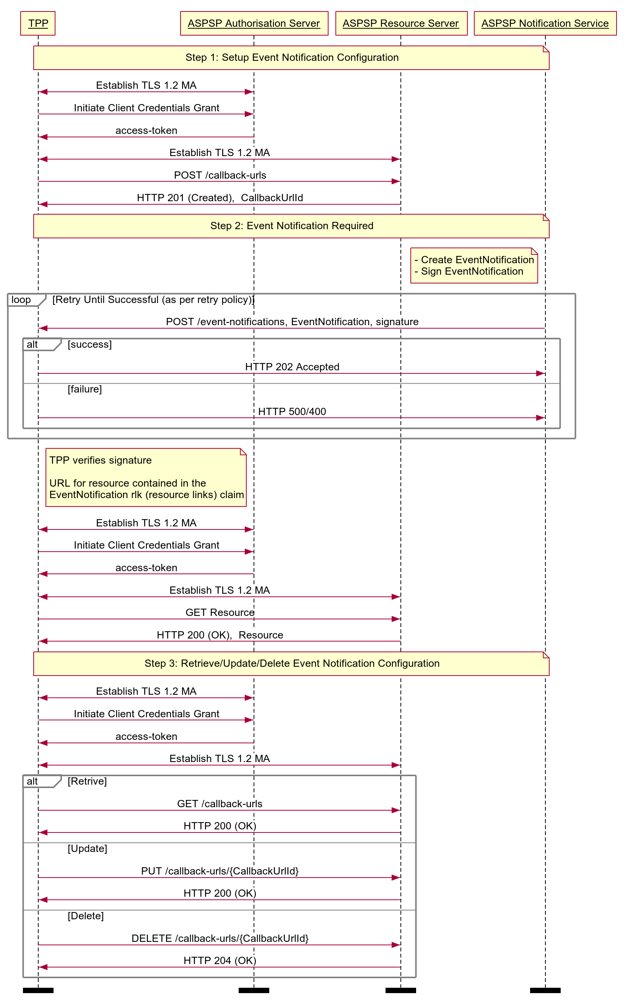

# Callback URL API Profile - v3.1.6 <!-- omit in toc -->

- [Overview](#overview)
- [Basics](#basics)
  - [Overview](#overview-1)
    - [Steps](#steps)
    - [Sequence Diagram](#sequence-diagram)
  - [Callback URL](#callback-url)
  - [Release Management](#release-management)
    - [Callback-URL Resource](#callback-url-resource)
      - [POST](#post)
      - [GET](#get)
      - [PUT](#put)
      - [DELETE](#delete)
  - [Callback-URL per TPP](#callback-url-per-tpp)

## Overview

The Callback URL API Profile describes the flows and common functionality for the Callback URL API, which allows a TPPs to:

* Register a callback URL with an ASPSP to register to receive a `urn:uk:org:openbanking:events:resource-update` event notification via the Real Time Event Notification API.
* Optionally read, update or delete a registered callback URL.

This profile should be read in conjunction with a compatible Read/Write Data API Profile, a compatible Event Notification API Profile and compatible individual resources.

## Basics

### Overview

The steps and sequence diagram below provide a general outline of a notification flow for all resources in the R/W APIs.

#### Steps

Step 1: Setup Event Notification Configuration

* This flow begins with a TPP creating a **callback-url** resource with an ASPSP.
* The callback URL must be specified at this stage.

Step 2: Event Notification Required

* When an event occurs on a resource that requires a notification, the ASPSP identifies the **callback-url** associated with the TPP owning the affected resource.
* The ASPSP sends the event notification to the callback URL, detailing the nature of the event and identifying the affected resource.
* The TPP initiates a client credential grant and retrieves the resource using the details contained in the event notification.

Step 3: Retrieve/Update/Delete Event Notification Configuration

* The TPP may optionally read/update/delete the **callback-url** resource.

#### Sequence Diagram



<details>
  <summary>Diagram source</summary>

  ```
participant TPP
participant ASPSP Authorisation Server
participant ASPSP Resource Server
participant ASPSP Notification Service

note over TPP, ASPSP Notification Service
Step 1: Setup Event Notification Configuration
end note

TPP <-> ASPSP Authorisation Server: Establish TLS 1.2 MA
TPP -> ASPSP Authorisation Server: Initiate Client Credentials Grant
ASPSP Authorisation Server -> TPP: access-token
TPP <-> ASPSP Resource Server: Establish TLS 1.2 MA
TPP -> ASPSP Resource Server: POST /callback-urls
ASPSP Resource Server -> TPP: HTTP 201 (Created),  CallbackUrlId

note over TPP, ASPSP Notification Service
 Step 2: Event Notification Required
end note


note left of ASPSP Notification Service
- Create EventNotification
- Sign EventNotification
end note

loop Retry Until Successful (as per retry policy)
ASPSP Notification Service -> TPP: POST /event-notifications, EventNotification, signature
alt success
TPP -> ASPSP Notification Service: HTTP 202 Accepted
else failure
TPP -> ASPSP Notification Service: HTTP 500/400
end alt
end loop

note right of TPP
TPP verifies signature

URL for resource contained in the
EventNotification rlk (resource links) claim
end note

TPP <-> ASPSP Authorisation Server: Establish TLS 1.2 MA
TPP -> ASPSP Authorisation Server: Initiate Client Credentials Grant
ASPSP Authorisation Server -> TPP: access-token

TPP <-> ASPSP Resource Server: Establish TLS 1.2 MA
TPP -> ASPSP Resource Server: GET Resource
ASPSP Resource Server -> TPP: HTTP 200 (OK),  Resource

note over TPP, ASPSP Notification Service
Step 3: Retrieve/Update/Delete Event Notification Configuration
end note

TPP <-> ASPSP Authorisation Server: Establish TLS 1.2 MA
TPP -> ASPSP Authorisation Server: Initiate Client Credentials Grant
ASPSP Authorisation Server -> TPP: access-token
TPP <-> ASPSP Resource Server: Establish TLS 1.2 MA
alt Retrive
TPP -> ASPSP Resource Server: GET /callback-urls
ASPSP Resource Server -> TPP: HTTP 200 (OK)
else Update
TPP -> ASPSP Resource Server: PUT /callback-urls/{CallbackUrlId}
ASPSP Resource Server -> TPP: HTTP 200 (OK)
else Delete
TPP -> ASPSP Resource Server: DELETE /callback-urls/{CallbackUrlId}
ASPSP Resource Server -> TPP: HTTP 204 (OK)
end alt
option footer=bar
```

</details>

### Callback URL

TPPs must register a URL for TPP hosted services to receive event notifications from an ASPSP. The URL **must** end with the Event Notification API specification version number, followed by ‘/event-notifications'.

For example:

* URL: https://tpp.com/open-banking/v3.1/event-notifications

### Release Management

This section overviews the release management and versioning strategy for the Callback URL API.

#### Callback-URL Resource

TPPs **must** register for event-notification callbacks with the version of Event Notification API they have implemented. The version element of the Callback-URL resource is used for this purpose.

##### POST

* A TPP **must only** create a callback-url on one version

##### GET

* A TPP **must not** access a callback-url on an older version, via the CallbackUrlId for a callback-url created in a newer version.
  * E.g., a callback-url created in v4, accessed via v3.
* An ASPSP **must** allow a callback-url resource to be accessed in a newer version.
* An ASPSP **must** ensure callback-url fields are unchanged when accessed in a different version.

##### PUT

* A TPP **must not** update a callback-url on an older version via a CallbackUrlId created in a newer version.
  * E.g., A callback-url is created in v4, and a PUT request on v3.
* An ASPSP **must** support updating a callback-url from a previous version via a CallbackUrlId created in a newer version.
  * E.g., A callback-url is created in v3, and a PUT request on v4.

##### DELETE

* A TPP **must not** delete a callback-url on an older version via a CallbackUrlId created in a newer version.
  * E.g. A callback-url is created in v4, and request DELETE on v3.
* An ASPSP **must** support deleting a callback-url from a previous version via a CallbackUrlId created in a newer version.
  * E.g., A callback-url is created in v3, and request DELETE on v4.

### Callback-URL per TPP

An ASPSP will maintain at most, a single Callback-URL resource per TPP.
