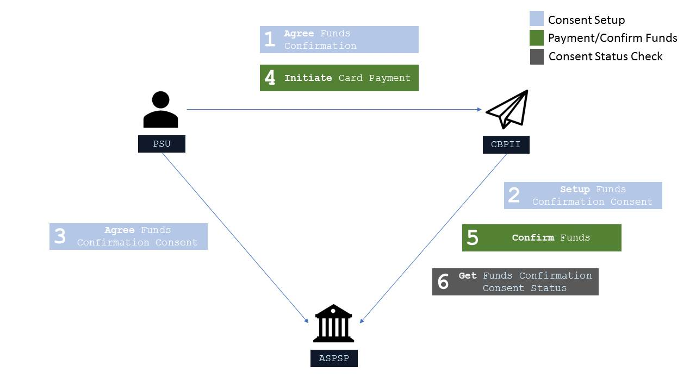
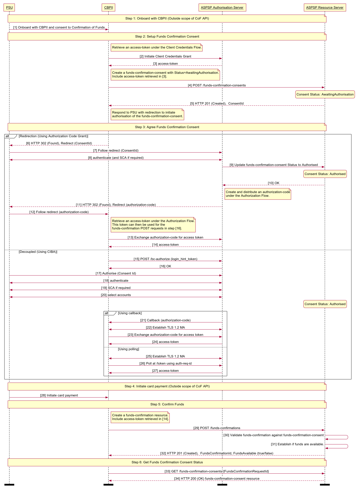

# Confirmation of Funds API Profile - v3.1.6 <!-- omit in toc -->

- [Overview](#overview)
  - [Document Structure](#document-structure)
  - [Resources](#resources)
- [Basics](#basics)
  - [Overview](#overview-1)
    - [Steps](#steps)
    - [Sequence Diagram](#sequence-diagram)
  - [Idempotency](#idempotency)
  - [Release Management](#release-management)
    - [Funds Confirmation Consent](#funds-confirmation-consent)
      - [POST](#post)
      - [GET](#get)
      - [DELETE](#delete)
    - [Funds Confirmation Resource](#funds-confirmation-resource)
      - [POST](#post-1)
- [Security & Access Control](#security--access-control)
  - [Scopes](#scopes)
  - [Grants Types](#grants-types)
  - [Consent Authorisation](#consent-authorisation)
    - [Consent Elements](#consent-elements)
    - [Funds Confirmation Consent Status](#funds-confirmation-consent-status)
    - [Consent Re-authentication](#consent-re-authentication)
  - [Consent Revocation](#consent-revocation)

## Overview

The Confirmation of Funds API Profile describes the flows and common functionality for the Confirmation of Funds API, which allows a Card Based Payment Instrument Issuer ('CBPII') to:

- Register an intent to confirm funds by creating a "funds confirmation consent" resource with an ASPSP, for agreement between the PSU and ASPSP. This consent is a long lived consent, and contains the length of time (expiration date) the customer (PSU) would like to provide to the CBPII; and
- Subsequently make a request to confirm funds are available.
  - Funds can only be confirmed against the currency of the account.

This profile should be read in conjunction with a compatible Read/Write Data API Profile which provides a description of the elements that are common across all the Read/Write Data APIs, and compatible individual resources.

### Document Structure

This document consists of the following parts:

**Overview:** Provides an overview of the profile.

**Basics:** Identifies the flows and release management.

**Security & Access Control:** Specifies the means for CBPIIs and PSUs to authenticate themselves and provide consent.

### Resources

Each of the Payment Initiation API resources are documented in the  [*Resources and Data Models*  /  *CBPII*](../resources%20and%20data%20models/cbpii) area of the specification. Each resource is documented with:

- Endpoints
  - The API endpoints available for the resource.
- Data Model
  - Resource definition.
  - UML diagram.
  - Permissions as they relate to accessing the resource.
  - Data dictionary - which defines fields, re-usable classes, mandatory (1..1) or conditional (0..1) as defined in the Design Principles section, and enumerations.
- Usage Examples

## Basics

### Overview

The diagram below provides a general outline of a confirmation of funds request and flow using the Confirmation of Funds APIs. It assumes a CBPII has issued a card to a PSU, and the PSU would like to use a PSD2 in-scope account as a funding mechanism for that card.



#### Steps

The Consent model for the Confirmation of Funds API differs to the Payments API and the Account and Transactions API, as the consent is held between the PSU and the ASPSP, rather than between the PSU and the TPP. Whilst the flow follows the same process, the context for each step has a different meaning and is detailed below.

Step 1: Agree Funds Confirmation

- This flow begins with a PSU committing to give explicit consent, to their ASPSP to respond to confirmation of funds requests from the CBPII.

Step 2: Setup Funds Confirmation Consent

- The CBPII connects to the ASPSP that services the PSU's account(s) and creates a **funds-confirmation-consent** resource. This informs the ASPSP that one of its PSUs would like to grant access to confirm the availability of funds to a CBPII. The ASPSP responds with an identifier for the resource (the ConsentId - which is the intent identifier).
- This step is carried out by making a **POST** request to the /funds-confirmation-consents endpoint, under a client credentials grant.
- The setup payload will include these fields:
  - Debtor Account - mandatory debtor account details to capture the account from which the availability of funds will be confirmed.
  - Expiration Date Time - an optional expiration for when the CBPII will no longer have access to confirm funds on a PSU's account.

Step 3: Agree Funds Confirmation Consent

- The CBPII requests the PSU to agree the consent. The ASPSP may carry this out by using a *redirection flow* or a *decoupled flow*.
  - In a redirection flow, the CBPII redirects the PSU to the ASPSP.
    - The redirect includes the ConsentId generated in the previous step.
    - This allows the ASPSP to correlate the **funds-confirmation-consent** that was setup.
    - The ASPSP authenticates the PSU.
    - The PSU gives explicit consent to the ASPSP to respond to confirmation of funds requests from the CBPII.
    - The ASPSP updates the state of the **funds-confirmation-consent** resource internally to indicate that the resource has been authorised.
    - Once the consent has been authorised, the PSU is redirected back to the CBPII.
  - In a decoupled flow, the ASPSP requests the PSU to authorise consent on an *authentication device* that is separate from the *consumption device* on which the PSU is interacting with the CBPII.
    - The decoupled flow is initiated by the CBPII calling a back-channel authorisation request.
    - The request contains a 'hint' that identifies the PSU paired with the consent to be authorised.
    - The ASPSP authenticates the PSU.
    - The PSU gives explicit consent to the ASPSP to respond to confirmation of funds requests from the CBPII.
    - The ASPSP updates the state of the **funds-confirmation-consent** resource internally to indicate that the resource has been authorised.
    - Once the consent has been authorised, the ASPSP can make a callback to the PISP to provide an access token.

Step 4: Initiate Card Payment

- A card payment is initiated by the PSU (directly or indirectly). This process is outside the scope of the Confirmation of Funds API.

Step 5: Confirm Funds

- The CBPII connects to the ASPSP that services the PSU's account(s) and creates a **funds-confirmation** resource. This informs the ASPSP that the CBPII would like to confirm funds are available in the specific payment account.
- The ASPSP responds with a yes/no (boolean) for the resource.
- This step is carried out by making a **POST** request to the /funds-confirmations endpoint, under an authorization code grant
- The setup payload will include these fields - which describe the data that the PSU has consented with the CBPII:
  - Amount - the amount to be confirmed available.
  - ConsentId - an Id that relates the request to a **funds-confirmation-consent**, and specific account with the ASPSP. This Id must match the intent identifier.

Step 6: Get Funds Confirmation Consent Status

- The CBPII may check the status of the **funds-confirmation-consent** resource (with the ConsentId).
- This step is carried out by making a **GET** request to the /funds-confirmation-consents endpoint, under a client credentials grant.

#### Sequence Diagram



<details>
  <summary>Diagram source</summary>

```
participant PSU
participant CBPII
participant ASPSP Authorisation Server
participant ASPSP Resource Server

autonumber

note over PSU, ASPSP Resource Server
Step 1: Onboard with CBPII (Outside scope of CoF API)
end note

PSU -> CBPII: Onboard with CBPII and consent to Confirmation of Funds

note over PSU, ASPSP Resource Server
Step 2: Setup Funds Confirmation Consent
end note

note right of CBPII
    Retrieve an access-token under the Client Credentials Flow.
end note

CBPII -> ASPSP Authorisation Server: Initiate Client Credentials Grant
ASPSP Authorisation Server --> CBPII: access-token

note right of CBPII
    Create a funds-confirmation-consent with Status=AwaitingAuthorisation.
    Include access-token retrieved in [3].
end note

CBPII -> ASPSP Resource Server: POST /funds-confirmation-consents
state over ASPSP Resource Server: Consent Status: AwaitingAuthorisation
ASPSP Resource Server --> CBPII: HTTP 201 (Created),  ConsentId

note right of CBPII
    Respond to PSU with redirection to initiate
    authorisation of the funds-confirmation-consent.
end note


note over PSU, ASPSP Resource Server
Step 3: Agree Funds Confirmation Consent
end note

alt Redirection (Using Authorization Code Grant)
        CBPII --> PSU: HTTP 302 (Found), Redirect (ConsentId)
        PSU -> ASPSP Authorisation Server: Follow redirect (ConsentId)
        PSU <-> ASPSP Authorisation Server: authenticate (and SCA if required)

        ASPSP Authorisation Server -> ASPSP Resource Server: Update funds-confirmation-consent Status to Authorised
        state over ASPSP Resource Server: Consent Status: Authorised
        ASPSP Resource Server --> ASPSP Authorisation Server: OK


        note right of ASPSP Authorisation Server
            Create and distribute an authorization-code
            under the Authorization Flow.
        end note

        ASPSP Authorisation Server --> PSU: HTTP 302 (Found), Redirect (authorization-code)
        PSU -> CBPII: Follow redirect (authorization-code)


        note right of CBPII
            Retrieve an access-token under the Authorization Flow.
            This token can then be used for the
            funds-confirmation POST requests in step [16].
        end note

        CBPII -> ASPSP Authorisation Server: Exchange authorization-code for access token

        ASPSP Authorisation Server --> CBPII: access-token
    else Decoupled (Using CIBA)
        CBPII -> ASPSP Authorisation Server: POST /bc-authorize (login_hint_token)
        ASPSP Authorisation Server -> CBPII: OK

        PSU -> ASPSP Authorisation Server: Authorise (Consent Id)
        PSU <-> ASPSP Authorisation Server: authenticate
        PSU <-> ASPSP Authorisation Server: SCA if required
        PSU <-> ASPSP Authorisation Server: select accounts
        state over ASPSP Resource Server: Consent Status: Authorised

        alt Using callback
                ASPSP Authorisation Server -> CBPII: Callback (authorization-code)
                CBPII <-> ASPSP Authorisation Server: Establish TLS 1.2 MA
                CBPII -> ASPSP Authorisation Server: Exchange authorization-code for access token
                ASPSP Authorisation Server -> CBPII: access-token
        else Using polling
                CBPII <-> ASPSP Authorisation Server: Establish TLS 1.2 MA
                CBPII -> ASPSP Authorisation Server: Poll at /token using auth-req-id
                ASPSP Authorisation Server -> CBPII: access-token
        end alt
end alt
note over PSU, ASPSP Resource Server
Step 4: Initiate card payment (Outside scope of CoF API)
end note

PSU -> CBPII: Initiate card payment


note over PSU, ASPSP Resource Server
 Step 5: Confirm Funds
end note


note right of CBPII
    Create a funds-confirmation resource.
    Include access-token retrieved in [14].
end note

CBPII -> ASPSP Resource Server: POST /funds-confirmations

ASPSP Resource Server -> ASPSP Resource Server: Validate funds-confirmation against funds-confirmation-consent
ASPSP Resource Server -> ASPSP Resource Server: Establish if funds are available.

ASPSP Resource Server --> CBPII: HTTP 201 (Created),  FundsConfirmationId, FundsAvailable (true/false)

note over PSU, ASPSP Resource Server
Step 6: Get Funds Confirmation Consent Status
end note

CBPII -> ASPSP Resource Server: GET /funds-confirmation-consents/{FundsConfirmationRequestId}
ASPSP Resource Server --> CBPII: HTTP 200 (OK) funds-confirmation-consent resource

option footer=bar
```

</details>

### Idempotency

The API endpoints for creating funds-confirmation-consent and funds-confirmation resources **are not** idempotent.

If a time-out error occurs, we would expect a CBPII to create a new resource, rather than try with the same resource. This is particularly relevant for the funds-confirmation resource, where the availability of funds may have changed between requests.

### Release Management

This section overviews the release management and versioning strategy for the Account And Transaction API.

#### Funds Confirmation Consent

##### POST

- A CBPII **must not** create a consent on a newer version, and use it on a previous version.
  - E.g., ConsentId for a funds-confirmation-consent resource created in v4, must not be used to access v3 endpoints.

##### GET

- A CBPII **must not** access a funds-confirmation-consent on an older version, via the ConsentId created in a newer version.
  - E.g., a funds-confirmation-consent created in v3 accessed via v2.
- An ASPSP **must** allow a funds-confirmation-consent to be accessed in a newer version.
- An ASPSP **must** ensure details in the funds-confirmation-consent are unchanged when accessed via a newer version.
  - E.g., a ConsentId created in v3 will have the same details when accessed via v3 and v4.
- An ASPSP **may** allow expired funds-confirmation-consents to be accessed in a newer version.

##### DELETE

- A CBPII **must not** delete a funds-confirmation-consent on an older version via a ConsentId created in a newer version.
  - E.g., A funds-confirmation-consent is created in v4, and request DELETE on v3.
- An ASPSP **must** support deleting a funds-confirmation-consent from a previous version via a newer version.
  - E.g., A funds-confirmation-consent is created in v3, and request DELETE on v4.

#### Funds Confirmation Resource

##### POST

- A CBPII **may** use a ConsentId created in a previous version to create a funds-confirmation resource in a newer version.
  - E.g., a ConsentId created in v3 can be used as a ConsentId in v4, to POST /funds-confirmations.
- A CBPII **must not** use a ConsentId created in a newer version to create Funds Confirmation resource in a previous version.
  - E.g., a ConsentId created in v4, must not be used as a ConsentId in v3, to POST /funds-confirmations.
- A CBPII **may** use a token that is bound to a funds-confirmation-consent in a previous version, to access an endpoint of a newer version.
- An ASPSP **must** allow a ConsentId from previous version to create a funds-confirmation resource in a newer version, provided it has not expired.
- An ASPSP **must not** allow a ConsentId from a newer version to create a funds-confirmation resource in a previous version.

## Security & Access Control

### Scopes

The access tokens required for accessing the Confirmation of Funds APIs must have at least the following scope:

```
fundsconfirmations: Funds confirmation entitlement
```

### Grants Types

CBPIIs **must** use a client credentials grant to obtain a token to make POST requests to the **funds-confirmation-consent** endpoint. In the specification, this grant type is referred to as "Client Credentials".

CBPIIs **must** use an authorization code grant using a redirect or decoupled flow to obtain a token to make POST requests to the **funds-confirmation** endpoint. When accessing, the intent-id in the token must match the ConsentId in the message payload. In the specification, this grant type is referred to as "Authorization Code".

CBPIIs **must** use a client credentials grant to obtain a token to make GET requests.

### Consent Authorisation

The CBPII **must** create a **funds-confirmation-consent** resource through a **POST** operation. This resource outlines the *consent* that the CBPII claims the PSU has committed to agreeing with the ASPSP, to retrieve confirmation of funds information. At this stage, the consent is not yet agreed between the PSU and the ASPSP.

The ASPSP responds with a ConsentId. This is the intent-id that is used when initiating the authorization code grant (as described in the Trust Framework).

As part of the authorization code grant:

- The ASPSP authenticates the PSU.
- The ASPSP plays back the consent (registered by the CBPII) back to the PSU - to agree the consent. The PSU may agree or decline the consent in its entirety (but not selectively).

Once these steps are complete, the consent is considered to have been agreed between the ASPSP and the PSU.

#### Consent Elements

The funds-confirmation-consent resource consists of the following fields, which together form the elements of the consent provided by the PSU to the CBPII:

- **DebtorAccount:** The account to which the consent has been applied.
  - The field is mandatory, as the consent for CBPII access to a PSU's data must be for a specific account known to the PSU and the CBPII.
- **ExpirationDateTime:** The date-time up to which the consent is valid.
  - The field is optional, as the consent for CBPII access to a PSU's data may be indefinite.

#### Funds Confirmation Consent Status

The funds-confirmation-consent resource may have one of the following status codes after authorisation has taken place:

|  |Status |Description |
| --- |--- |--- |
| 1 |Authorised |The Funds Confirmation Consent has been successfully authorised. |
| 2 |Rejected |The Funds Confirmation Consent has been rejected. |
| 3 |Revoked |The Funds Confirmation Consent has been revoked via the ASPSP interface. |

#### Consent Re-authentication

The funds-confirmation-consent resource is a long lived consent. A funds-confirmation-consent can be re-authenticated if:

- the funds-confirmation-consent resource has a status of `Authorised` and
- The `ExpirationDateTime`, if specified, has not elapsed

### Consent Revocation

A PSU may revoke consent for confirming funds at any point in time.

The PSU may request the ASPSP to revoke consent that it has authorised. The mechanisms for this are in the competitive space and are up to each ASPSP to implement in the ASPSP's banking interface.

The PSU may request the CBPII to revoke consent that it has authorised. If consent is revoked with the CBPII:

- The CBPII **must** call the **DELETE** operation on the funds-confirmation-consent resource as soon as it practically possible to indicate to the ASPSP that the PSU has revoked consent.
- The CBPII **must** cease to access the APIs at that point.
