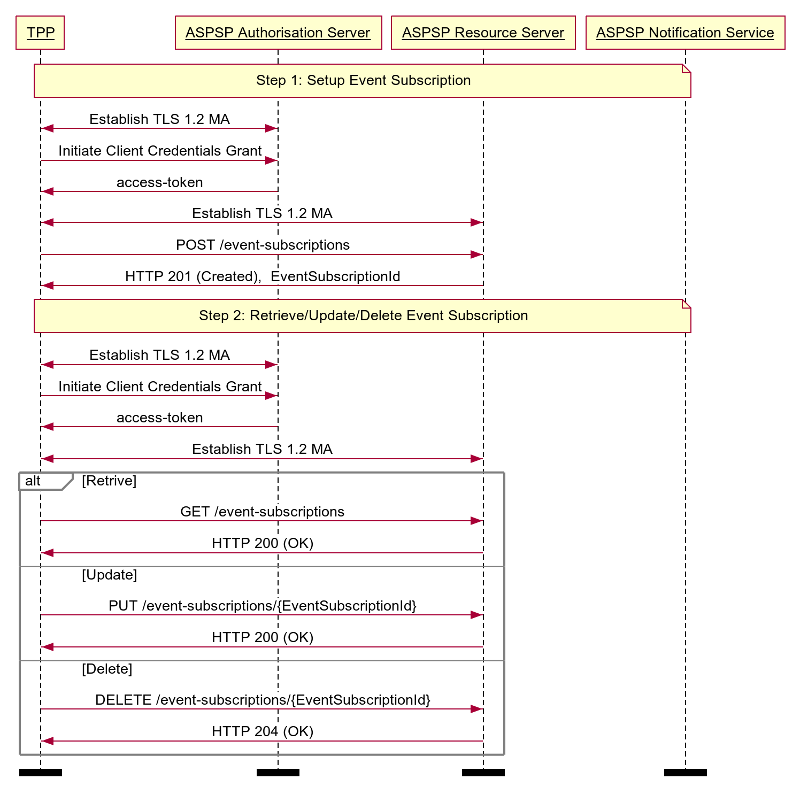

# Event Notification Subscription API Profile - v3.1.6 <!-- omit in toc -->

- [Overview](#overview)
- [Basics](#basics)
  - [Overview](#overview-1)
    - [Steps](#steps)
    - [Sequence Diagram](#sequence-diagram)
  - [Subscriptions for Real Time Event Notifications and Aggregated Polling](#subscriptions-for-real-time-event-notifications-and-aggregated-polling)
    - [Real Time Event Notifications](#real-time-event-notifications)
    - [Aggregated Polling](#aggregated-polling)
  - [Release Management](#release-management)
    - [Event-Subscription Resource](#event-subscription-resource)
      - [POST](#post)
      - [GET](#get)
      - [PUT](#put)
      - [DELETE](#delete)
  - [Event-Subscription per TPP](#event-subscription-per-tpp)

## Overview

The Event Notification Subscription API Profile describes the flows and common functionality for the Event Notification Subscription API, which allows a TPPs to:

* Register an event subscription with an ASPSP to subscribe to event notifications.
  * A subscription can enable real time event notifications via a HTTP callback from the ASPSP, and aggregated polling by the TPP.
* Specify a list of event types to be notified on.
* Optionally read, update or delete a registered event subscription.

This profile should be read in conjunction with a compatible Read/Write Data API Profile, a compatible Event Notification API Profile and compatible individual resources.

## Basics

### Overview

The steps and sequence diagram below provide a general outline of a notification flow for all resources in the R/W APIs.

#### Steps

Step 1: Setup Event Notification Subscription

* This flow begins with a TPP creating an **event-subscription** resource with an ASPSP.

Step 2: Retrieve/Update/Delete Event Notification Subscription

* The TPP may optionally read/update/delete the **event-subscription** resource.

#### Sequence Diagram



<details>
  <summary>Diagram source</summary>

  ```
participant TPP
participant ASPSP Authorisation Server
participant ASPSP Resource Server
participant ASPSP Notification Service

note over TPP, ASPSP Notification Service
Step 1: Setup Event Subscription
end note

TPP <-> ASPSP Authorisation Server: Establish TLS 1.2 MA
TPP -> ASPSP Authorisation Server: Initiate Client Credentials Grant
ASPSP Authorisation Server -> TPP: access-token
TPP <-> ASPSP Resource Server: Establish TLS 1.2 MA
TPP -> ASPSP Resource Server: POST /event-subscriptions
ASPSP Resource Server -> TPP: HTTP 201 (Created),  EventSubscriptionId

note over TPP, ASPSP Notification Service
Step 2: Retrieve/Update/Delete Event Subscription
end note

TPP <-> ASPSP Authorisation Server: Establish TLS 1.2 MA
TPP -> ASPSP Authorisation Server: Initiate Client Credentials Grant
ASPSP Authorisation Server -> TPP: access-token
TPP <-> ASPSP Resource Server: Establish TLS 1.2 MA
alt Retrive
TPP -> ASPSP Resource Server: GET /event-subscriptions
ASPSP Resource Server -> TPP: HTTP 200 (OK)
else Update
TPP -> ASPSP Resource Server: PUT /event-subscriptions/{EventSubscriptionId}
ASPSP Resource Server -> TPP: HTTP 200 (OK)
else Delete
TPP -> ASPSP Resource Server: DELETE /event-subscriptions/{EventSubscriptionId}
ASPSP Resource Server -> TPP: HTTP 204 (OK)
end alt
option footer=bar
```

</details>

### Subscriptions for Real Time Event Notifications and Aggregated Polling

ASPSPs may choose to offer Real Time Notifications, Aggregated Polling or a combination of both. TPPs will subscribe to the different notification mechanisms using the **event-subscription** resource.

#### Real Time Event Notifications

TPPs must register an event subscription with a CallbackUrl for TPP hosted services to receive real time event notifications from an ASPSP (providing an ASPSP supports this functionality).

The CallbackUrl **must** end with the Event Notification API specification version number, followed by ‘/event-notifications'.

For example:

* URL: https://tpp.com/open-banking/v3.1/event-notifications

#### Aggregated Polling

TPPs must register an event subscription to enable aggregated polling on an ASPSP (providing an ASPSP supports this functionality).

### Release Management

This section overviews the release management and versioning strategy for the Event Notification API.

#### Event-Subscription Resource

TPPs **must** register for event-subscriptions with the version of Event Notification API they have implemented. The version field of the **event-subscription** resource is used for this purpose.

##### POST

* A TPP **must only** create an **event-subscription** on one version

##### GET

* A TPP **must not** access a event-subscription on an older version, via the EventSubscriptionId for an event-subscription created in a newer version.
  * E.g., a event-subscription created in v4, accessed via v3.
* An ASPSP **must** allow an event-subscription resource to be accessed in a newer version.
* An ASPSP **must** ensure event-subscription fields are unchanged when accessed in a different version.

##### PUT

* A TPP **must not** update an event-subscription on an older version via a EventSubscriptionId created in a newer version.
  * E.g., A event-subscription is created in v4, and a PUT request on v3.
* An ASPSP **must** support updating an event-subscription from a previous version via a EventSubscriptionId created in a newer version.
  * E.g., A event-subscription is created in v3, and a PUT request on v4.

##### DELETE

* A TPP **must not** delete an event-subscription on an older version via a EventSubscriptionId created in a newer version.
  * E.g. An event-subscription is created in v4, and request DELETE on v3.
* An ASPSP **must** support deleting an event-subscription from a previous version via a EventSubscriptionId created in a newer version.
  * E.g., An event-subscription is created in v3, and request DELETE on v4.

### Event-Subscription per TPP

An ASPSP will maintain at most, a single **event-subscription** resource per TPP.
