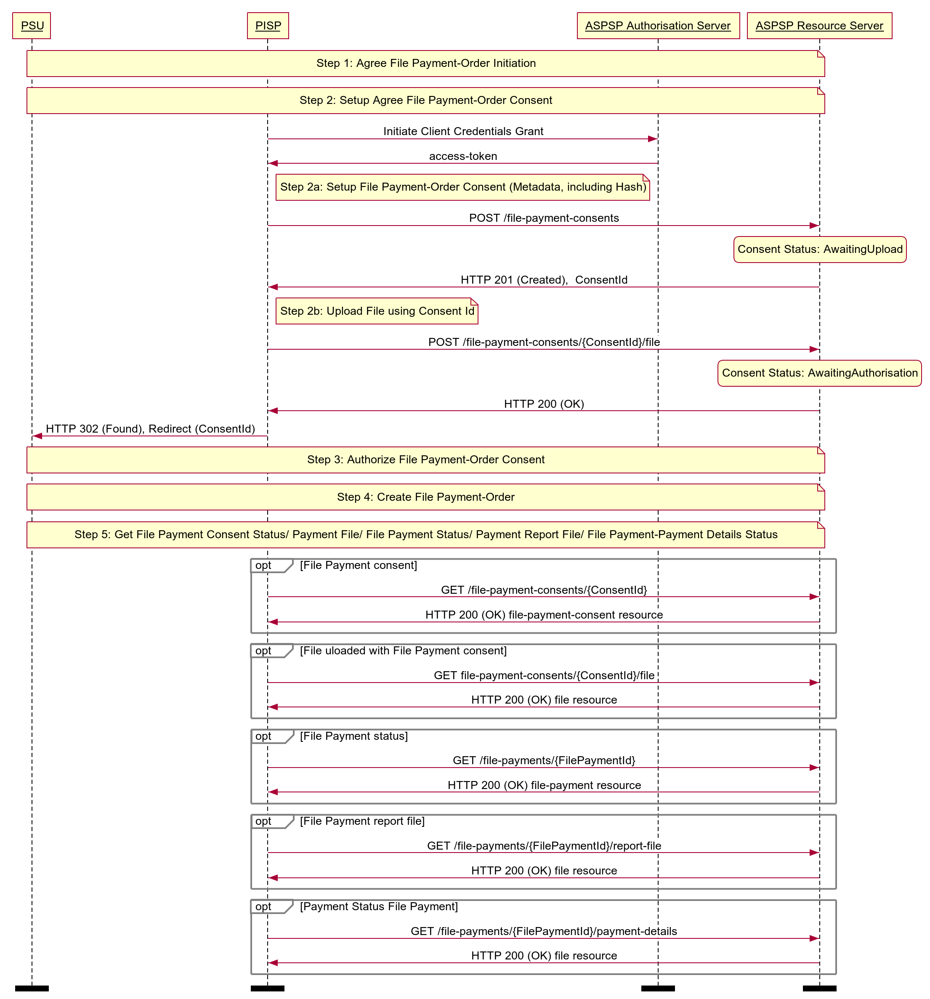

# File Payments API Profile - v3.1.6 <!-- omit in toc -->

- [Overview](#overview)
  - [Document Overview](#document-overview)
- [Basics](#basics)
  - [Overview](#overview-1)
    - [Steps](#steps)
    - [Sequence Diagram](#sequence-diagram)

## Overview

The File Payments API Profile describes the flows for File Payments, which allows a Payment Initiation Service Provider ('PISP') to:

- Register an intent to **stage** a file-payment consent.
- Subsequently **submit** the file-payment for processing.
- Optionally retrieve the status of a file-payment **consent** or file-payment **resource**.

This profile should be read in conjunction with a compatible Read/Write Data API Profile, a compatible Payment Initiation API Profile and compatible individual resources.

### Document Overview

This document consists of the following parts:

 **Overview:** Provides an overview of the profile.

 **Basics:** Identifies the flows.

## Basics

### Overview

File Payments allow a file of payments to be uploaded to an ASPSP for payment initiation.

The high-level flow for file-payments follow the flow for all other payment-order types (as described in the [Basics > Overview](payment-initiation-api-profile.md#overview-1) Section of Payment Initiation API Profile) however, with an additional step to upload the file. The step for staging the payment-order consent is broken into two steps:

* POST metadata of the file-payment for payment initiation.
* POST the file of the file-payment for payment initiation.

#### Steps

Step 1: Agree File Payment-Order Initiation.

Step 2a: Setup File Payment-Order Consent (Metadata):

* The PISP connects to the ASPSP that services the PSU's payment account and creates a new **file-payment-consent** resource. This JSON message contains the Metadata of the file payments file. The ASPSP responds with a ConsentId.
* This step is carried out by making a **POST** request to the **file-payment-consent** resource.

Step 2b: Setup File Payment-Order Consent (Upload File):

* The PISP uploads the payment file to the **file-payment-consent** endpoint with ConsentId obtained in Step 2a.
* ASPSP verifies the payment file against the hash of payment file received in the **file-payment-consent** Metadata in Step 2a.
* ASPSP responds with 200 OK.
* This step completes the **file-payment-consent** creation.

Step 3: Authorise Consent.

Step 4: Create Payment-Order.

Step 5: Get Consent/Payment-Order/Payment-Details Status:

* A PISP may optionally request the Status of the file-payment-consent.
* A PISP may optionally request File uploaded to file-payment-consent, for verification.
* A PISP may optionally request the Status of the file-payment.
* A PISP may optionally request a report in a file format, on the status of the individual payments in file-payments, if the ASPSP makes this available.
* A PISP may optionally request the detail status of the individual payments in file-payments, if the ASPSP makes this available.

#### Sequence Diagram



<details>
   <Summary>Diagram source</Summary>

```
participant PSU
participant PISP
participant ASPSP Authorisation Server
participant ASPSP Resource Server

note over PSU, ASPSP Resource Server
Step 1: Agree File Payment-Order Initiation
end note

note over PSU, ASPSP Resource Server
Step 2: Setup Agree File Payment-Order Consent
end note
PISP -> ASPSP Authorisation Server: Initiate Client Credentials Grant
ASPSP Authorisation Server -> PISP: access-token
note right of PISP
   Step 2a: Setup File Payment-Order Consent (Metadata, including Hash)
end note
PISP -> ASPSP Resource Server: POST /file-payment-consents
state over ASPSP Resource Server: Consent Status: AwaitingUpload
ASPSP Resource Server -> PISP: HTTP 201 (Created),  ConsentId
note right of PISP
   Step 2b: Upload File using Consent Id
end note
PISP -> ASPSP Resource Server: POST /file-payment-consents/{ConsentId}/file
state over ASPSP Resource Server: Consent Status: AwaitingAuthorisation
ASPSP Resource Server -> PISP: HTTP 200 (OK)
PISP -> PSU: HTTP 302 (Found), Redirect (ConsentId)

note over PSU, ASPSP Resource Server
Step 3: Authorize File Payment-Order Consent
end note
note over PSU, ASPSP Resource Server
Step 4: Create File Payment-Order
end note

note over PSU, ASPSP Resource Server
Step 5: Get File Payment Consent Status/ Payment File/ File Payment Status/ Payment Report File/ File Payment-Payment Details Status
end note

opt File Payment consent
PISP -> ASPSP Resource Server: GET /file-payment-consents/{ConsentId}
ASPSP Resource Server -> PISP: HTTP 200 (OK) file-payment-consent resource
end opt

opt File uloaded with File Payment consent
PISP -> ASPSP Resource Server: GET file-payment-consents/{ConsentId}/file
ASPSP Resource Server -> PISP: HTTP 200 (OK) file resource
end opt

opt File Payment status
PISP -> ASPSP Resource Server: GET /file-payments/{FilePaymentId}
ASPSP Resource Server -> PISP: HTTP 200 (OK) file-payment resource
end opt

opt File Payment report file
PISP -> ASPSP Resource Server: GET /file-payments/{FilePaymentId}/report-file
ASPSP Resource Server -> PISP: HTTP 200 (OK) file resource
end opt

opt Payment Status File Payment
PISP -> ASPSP Resource Server: GET /file-payments/{FilePaymentId}/payment-details
ASPSP Resource Server -> PISP: HTTP 200 (OK) file resource
end opt

option footer=bar
```
</details>
