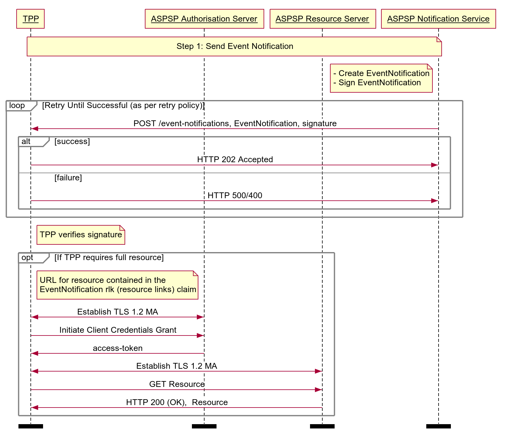

# Real Time Event Notification API Profile - v3.1.6 <!-- omit in toc -->

- [Overview](#overview)
- [Basics](#basics)
  - [Overview](#overview-1)
    - [Steps](#steps)
    - [Sequence Diagram](#sequence-diagram)

## Overview

The Real Time Event Notification API Profile describes the flows common functionality for the Real Time Event Notification API, which allows ASPSPs to:

* Notify a TPP that an event has occurred.

This profile should be read in conjunction with a compatible Read/Write Data API Profile, a compatible Event Notification API Profile and compatible individual resources.

Implementation of the Real Time Event Notification API is **optional** for ASPSPs.

## Basics

### Overview

The steps and sequence diagram below provide a general outline of an event notification flow for all resources in the R/W APIs.

#### Steps

Step 1: Send Event Notification

* When an event occurs on a resource that requires a notification, the ASPSP identifies the **callback-url** associated with the TPP owning the affected resource.
* The ASPSP sends a signed event notification to the callback URL, detailing the nature of the event and identifying the affected resource.
* The TPP may optionally initiate a client credential grant to retrieve the resource using the details contained in the event notification.

#### Sequence Diagram




<details>
  <summary>Diagram source</summary>

  ```
participant TPP
participant ASPSP Authorisation Server
participant ASPSP Resource Server
participant ASPSP Notification Service

note over TPP, ASPSP Notification Service
 Step 1: Send Event Notification
end note

note left of ASPSP Notification Service
- Create EventNotification
- Sign EventNotification
end note

loop Retry Until Successful (as per retry policy)
ASPSP Notification Service -> TPP: POST /event-notifications, EventNotification, signature
alt success
TPP -> ASPSP Notification Service: HTTP 202 Accepted
else failure
TPP -> ASPSP Notification Service: HTTP 500/400
end alt
end loop

note right of TPP
TPP verifies signature
end note

opt If TPP requires full resource

note right of TPP
URL for resource contained in the
EventNotification rlk (resource links) claim
end note

TPP <-> ASPSP Authorisation Server: Establish TLS 1.2 MA
TPP -> ASPSP Authorisation Server: Initiate Client Credentials Grant
ASPSP Authorisation Server -> TPP: access-token

TPP <-> ASPSP Resource Server: Establish TLS 1.2 MA
TPP -> ASPSP Resource Server: GET Resource
ASPSP Resource Server -> TPP: HTTP 200 (OK),  Resource

end opt

option footer=bar
```

</details>
