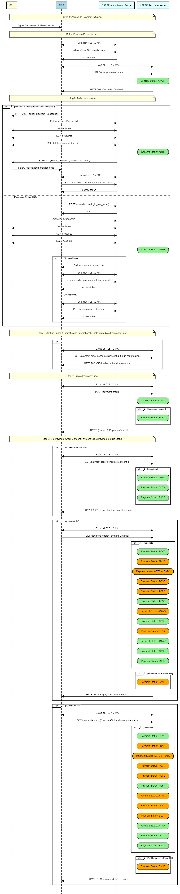

# File Payments API Profile - v4.0-draft1 <!-- omit in toc -->

- [Overview](#overview)
  - [Document Overview](#document-overview)
- [Basics](#basics)
  - [Overview](#overview-2)
    - [Steps](#steps)
    - [Sequence Diagram](#sequence-diagram)

## Overview

The File Payments API Profile describes the flows for File Payments, which allows a Payment Initiation Service Provider ('PISP') to:

- Register an intent to **stage** a file-payment consent.
- Subsequently **submit** the file-payment for processing.
- Optionally retrieve the status of a file-payment **consent** or file-payment **resource**.

This profile should be read in conjunction with a compatible Read/Write Data API Profile, a compatible Payment Initiation API Profile and compatible individual resources.

### Document Overview

This document consists of the following parts:

 **Overview:** Provides an overview of the profile.

 **Basics:** Identifies the flows.

## Basics

### Overview

File Payments allow a file of payments to be uploaded to an ASPSP for payment initiation.

The high-level flow for file-payments follow the flow for all other payment-order types (as described in the [Basics > Overview](payment-initiation-api-profile.md#overview-2) Section of Payment Initiation API Profile) however, with an additional step to upload the file. The step for staging the payment-order consent is broken into two steps:

* POST metadata of the file-payment for payment initiation.
* POST the file of the file-payment for payment initiation.

#### Steps

Step 1: Agree File Payment-Order Initiation.

Step 2a: Setup File Payment-Order Consent (Metadata):

* The PISP connects to the ASPSP that services the PSU's payment account and creates a new **file-payment-consent** resource. This JSON message contains the Metadata of the file payments file. The ASPSP responds with a ConsentId.
* This step is carried out by making a **POST** request to the **file-payment-consent** resource.

Step 2b: Setup File Payment-Order Consent (Upload File):

* The PISP uploads the payment file to the **file-payment-consent** endpoint with ConsentId obtained in Step 2a.
* ASPSP verifies the payment file against the hash of payment file received in the **file-payment-consent** Metadata in Step 2a.
* ASPSP responds with 200 OK.
* This step completes the **file-payment-consent** creation.

Step 3: Authorise Consent.

Step 4: Create Payment-Order.

Step 5: Get Consent/Payment-Order/Payment-Details Status:

* A PISP may optionally request the Status of the file-payment-consent.
* A PISP may optionally request File uploaded to file-payment-consent, for verification.
* A PISP may optionally request the Status of the file-payment.
* A PISP may optionally request a report in a file format, on the status of the individual payments in file-payments, if the ASPSP makes this available.
* A PISP may optionally request the detail status of the individual payments in file-payments, if the ASPSP makes this available.

#### Sequence Diagram



<details>
   <Summary>Diagram source</Summary>

```
participant PSU #lightyellow
participant PISP #lightblue
participant ASPSP Authorisation Server #lightcyan
participant ASPSP Resource Server #lightcyan

note over PSU, ASPSP Resource Server #lightyellow:Step 1: Agree File Payment Initiation

PSU -> PISP: Agree file-payment initiation request

note over PSU, ASPSP Resource Server #lightyellow:Setup Payment-Order Consent

PISP <-> ASPSP Authorisation Server: Establish TLS 1.2 MA
PISP -> ASPSP Authorisation Server: Initiate Client Credentials Grant
ASPSP Authorisation Server -> PISP: access-token
PISP <-> ASPSP Resource Server: Establish TLS 1.2 MA
PISP -> ASPSP Resource Server: POST /file-payment-consents

rbox over ASPSP Resource Server #lightgreen: Consent Status: AWUP 
ASPSP Resource Server -> PISP: HTTP 201 (Created),  ConsentId


note over PSU, ASPSP Resource Server #lightyellow:Step 3: Authorize Consent

alt Redirection (Using authorization code grant)
        PISP -> PSU: HTTP 302 (Found), Redirect (ConsentId)
        PSU -> ASPSP Authorisation Server: Follow redirect (ConsentId)
        PSU <-> ASPSP Authorisation Server: authenticate
        PSU <-> ASPSP Authorisation Server: SCA if required
        PSU <-> ASPSP Authorisation Server: Select debtor account if required
        rbox over ASPSP Resource Server #lightgreen: Consent Status: AUTH
        ASPSP Authorisation Server -> PSU: HTTP 302 (Found), Redirect (authorization-code)
        PSU -> PISP: Follow redirect (authorization-code)
        PISP <-> ASPSP Authorisation Server: Establish TLS 1.2 MA
        PISP -> ASPSP Authorisation Server: Exchange authorization-code for access token
        ASPSP Authorisation Server -> PISP: access-token
else Decoupled (Using CIBA)
        PISP -> ASPSP Authorisation Server: POST /bc-authorize (login_hint_token)
        ASPSP Authorisation Server -> PISP: OK

        PSU -> ASPSP Authorisation Server: Authorise (Consent Id)
        PSU <-> ASPSP Authorisation Server: authenticate
        PSU <-> ASPSP Authorisation Server: SCA if required
        PSU <-> ASPSP Authorisation Server: select accounts
        rbox over ASPSP Resource Server #lightgreen: Consent Status: AUTH

        alt Using callback
                ASPSP Authorisation Server -> PISP: Callback (authorization-code)
                PISP <-> ASPSP Authorisation Server: Establish TLS 1.2 MA
                PISP -> ASPSP Authorisation Server: Exchange authorization-code for access token
                ASPSP Authorisation Server -> PISP: access-token
        else Using polling
                PISP <-> ASPSP Authorisation Server: Establish TLS 1.2 MA
                PISP -> ASPSP Authorisation Server: Poll at /token using auth-req-id
                ASPSP Authorisation Server -> PISP: access-token
        end alt
end alt


note over PSU, ASPSP Resource Server #lightyellow:Step 4: Confirm Funds (Domestic and International Single Immediate Payments Only)

opt
PISP <-> ASPSP Resource Server: Establish TLS 1.2 MA
PISP -> ASPSP Resource Server: GET /payment-order-consents/{ConsentId}/funds-confirmation
ASPSP Resource Server -> PISP: HTTP 200 (OK) funds-confirmation resource

end opt

note over PSU, ASPSP Resource Server #lightyellow:Step 5: Create Payment-Order

PISP <-> ASPSP Resource Server: Establish TLS 1.2 MA
PISP -> ASPSP Resource Server: POST /payment-orders
rbox over ASPSP Resource Server #lightgreen: Consent Status: COND
alt Immediate Payment
rbox over ASPSP Resource Server #lightgreen: Payment Status: RCVD
end alt
ASPSP Resource Server -> PISP: HTTP 201 (Created), Payment-Order Id

note over PSU, ASPSP Resource Server #lightyellow:Step 6: Get Payment-Order-Consent/Payment-Order/Payment-details Status

opt payment-order-consent
PISP <-> ASPSP Resource Server: Establish TLS 1.2 MA
PISP -> ASPSP Resource Server: GET /payment-order-consents/{ConsentId}
alt Immediate
rbox over ASPSP Resource Server #lightgreen: Payment Status: AWAU
rbox over ASPSP Resource Server #lightgreen: Payment Status: AUTH
rbox over ASPSP Resource Server #lightgreen: Payment Status: RJCT
end alt
ASPSP Resource Server -> PISP: HTTP 200 (OK) payment-order-consent resource
end opt

opt payment-order
PISP <-> ASPSP Resource Server: Establish TLS 1.2 MA
PISP -> ASPSP Resource Server: GET /payment-orders/{Payment-Order Id}
alt Immediate
rbox over ASPSP Resource Server #lightgreen: Payment Status: RCVD
rbox over ASPSP Resource Server #orange: Payment Status: PDNG
rbox over ASPSP Resource Server #orange: Payment Status: ACTC or PATC
rbox over ASPSP Resource Server #orange: Payment Status: ACCP
rbox over ASPSP Resource Server #orange: Payment Status: ACFC
rbox over ASPSP Resource Server #lightgreen: Payment Status: ACSP
rbox over ASPSP Resource Server #orange: Payment Status: ACWC
rbox over ASPSP Resource Server #lightgreen: Payment Status: ACSC
rbox over ASPSP Resource Server #orange: Payment Status: BLCK
rbox over ASPSP Resource Server #lightgreen: Payment Status: ACWP
rbox over ASPSP Resource Server #lightgreen: Payment Status: ACCC
rbox over ASPSP Resource Server #lightgreen: Payment Status: RJCT
end alt
alt Additional for FDP and SO 
rbox over ASPSP Resource Server #orange: Payment Status: CANC
end alt
ASPSP Resource Server -> PISP: HTTP 200 (OK) payment-order resource
end opt

opt payment-details
PISP <-> ASPSP Resource Server: Establish TLS 1.2 MA
PISP -> ASPSP Resource Server: GET /payment-orders/{Payment-Order Id}/payment-details
alt Immediate
rbox over ASPSP Resource Server #lightgreen: Payment Status: RCVD
rbox over ASPSP Resource Server #orange: Payment Status: PDNG
rbox over ASPSP Resource Server #orange: Payment Status: ACTC or PATC
rbox over ASPSP Resource Server #orange: Payment Status: ACCP
rbox over ASPSP Resource Server #orange: Payment Status: ACFC
rbox over ASPSP Resource Server #lightgreen: Payment Status: ACSP
rbox over ASPSP Resource Server #orange: Payment Status: ACWC
rbox over ASPSP Resource Server #orange: Payment Status: ACSC
rbox over ASPSP Resource Server #orange: Payment Status: BLCK
rbox over ASPSP Resource Server #lightgreen: Payment Status: ACWP
rbox over ASPSP Resource Server #lightgreen: Payment Status: ACCC
rbox over ASPSP Resource Server #lightgreen: Payment Status: RJCT
end alt
alt Additional for FDP and SO 
rbox over ASPSP Resource Server #orange: Payment Status: CANC
end alt
ASPSP Resource Server -> PISP: HTTP 200 (OK) payment-details resource
end opt


```
</details>
