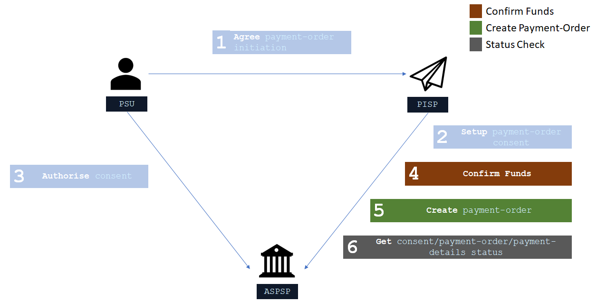
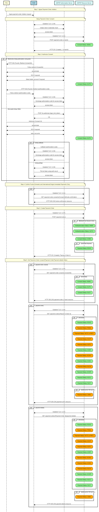
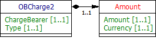
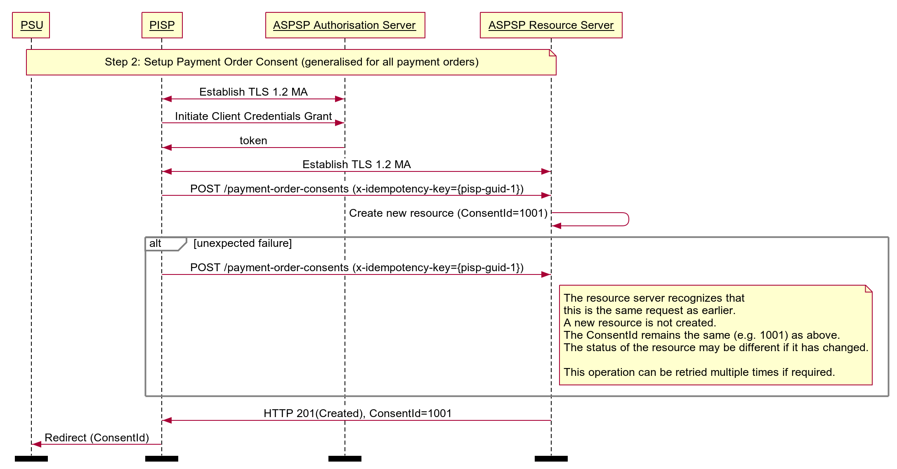
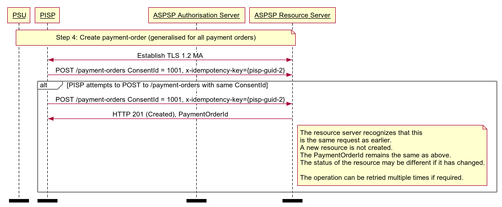
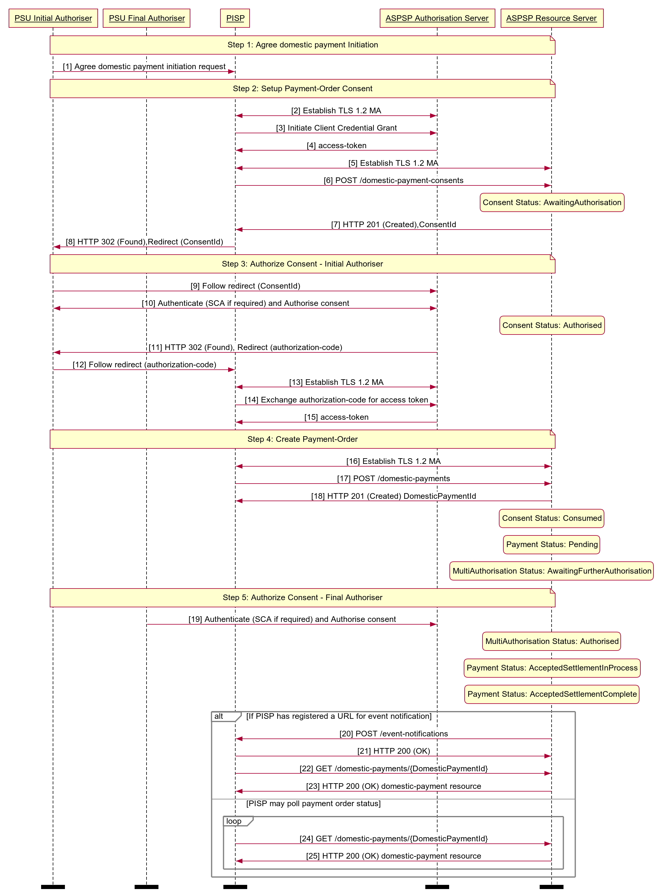
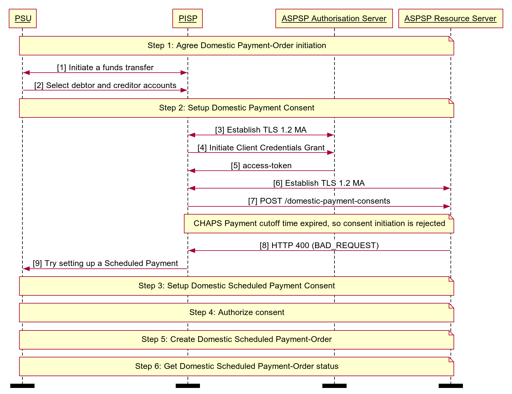
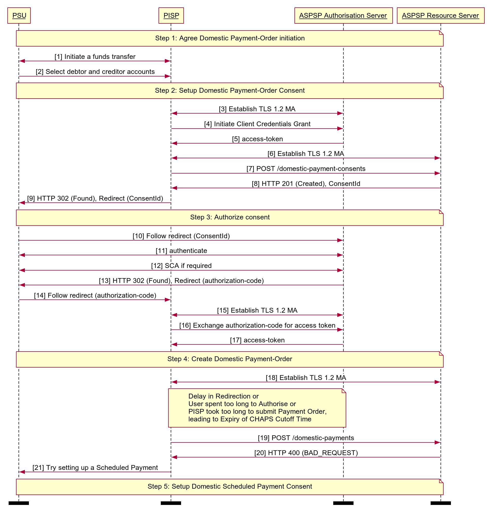

# Payment Initiation API Profile - v4.0-draft1 <!-- omit in toc -->

- [Overview](#overview)
  - [Document Overview](#document-overview)
  - [Resources](#resources)
  - [Design Principles](#design-principles)
    - [Scheme Agnostic](#scheme-agnostic)
    - [Status Codes](#status-codes)
- [Basics](#basics)
  - [Overview](#overview-2)
    - [Steps](#steps)
    - [Sequence Diagram](#sequence-diagram)
  - [Payment Restrictions](#payment-restrictions)
    - [CutOffDateTime Behaviour](#cutoffdatetime-behaviour)
      - [Reject the Payment-Order](#reject-the-payment-order)
      - [Accept the Payment-Order](#accept-the-payment-order)
  - [Release Management](#release-management)
    - [Payment-Order Consent](#payment-order-consent)
      - [POST](#post)
      - [GET](#get)
    - [Payment-Order Consent (Confirm Funds)](#payment-order-consent-confirm-funds)
      - [GET](#get-2)
    - [Payment-Order Resource](#payment-order-resource)
      - [POST](#post-2)
      - [GET](#get-3)
- [Security & Access Control](#security-access-control)
  - [Scopes](#scopes)
  - [Grants Types](#grants-types)
  - [Consent Authorisation](#consent-authorisation)
    - [Multiple Authorisation](#multiple-authorisation)
    - [Error Condition](#error-condition)
    - [Consent Revocation](#consent-revocation)
    - [Changes to Selected Account](#changes-to-selected-account)
    - [Consent Re-authentication](#consent-re-authentication)
  - [Risk Scoring Information](#risk-scoring-information)
- [Data Model](#data-model)
  - [Reused Classes](#reused-classes)
    - [OBRisk1](#obrisk1)
      - [UML Diagram](#uml-diagram)
      - [Data Dictionary](#data-dictionary)
    - [OBCharge2](#obcharge2)
      - [UML Diagram](#uml-diagram-1)
      - [Data Dictionary](#data-dictionary-2)
    - [OBAuthorisation1](#obauthorisation1)
      - [UML Diagram](#uml-diagram-2)
      - [Data Dictionary](#data-dictionary-3)
    - [OBMultiAuthorisation1](#obmultiauthorisation1)
      - [UML Diagram](#uml-diagram-3)
      - [Data Dictionary](#data-dictionary-4)
    - [OBDomesticRefundAccount1](#obdomesticrefundaccount1)
      - [UML Diagram](#uml-diagram-4)
      - [Data Dictionary](#data-dictionary-5)
    - [OBInternationalRefundAccount1](#obinternationalrefundaccount1)
      - [UML Diagram](#uml-diagram-5)
      - [Data Dictionary](#data-dictionary-6)
    - [OBWritePaymentDetailsResponse1](#OBWritePaymentDetailsResponse1)
      - [UML Diagram](#uml-diagram-6)
      - [Data Dictionary](#data-dictionary-7)
    - [OBSCASupportData1](#obscasupportdata1)
      - [UML Diagram](#uml-diagram-7)
      - [Data Dictionary](#data-dictionary-8)
    - [OBRemittanceInformation1](#obremittanceinformation1)
      - [Data Dictionary](#data-dictionary-9)
    - [OBMandateRelatedInformation1](#obmandaterelatedinformation1)
      - [Data Dictionary](#data-dictionary-10)
    - [OBRegulatoryReporting1](#obregulatoryreporting1)
      - [Data Dictionary](#data-dictionary-11)
    - [OBUltimateCreditor1](#obultimatecreditor1)
      - [Data Dictionary](#data-dictionary-12)
    - [OBUltimateDebtor1](#obultimatedebtor1)
      - [Data Dictionary](#data-dictionary-13)
    - [OBPostalAddress6](#obpostaladdress6)
      - [Data Dictionary](#data-dictionary-14)
  - [Identifier Fields](#identifier-fields)
    - [Merchant Flow](#merchant-flow)
    - [Party to Party Flow](#party-to-party-flow)
  - [Enumerations](#enumerations)
    - [Static Enumerations](#static-enumerations)
    - [ISO Enumerations](#iso-enumerations)
    - [Namespaced Enumerations](#namespaced-enumerations)
- [Alternative and Error Flows](#alternative-and-error-flows)
  - [Idempotent Payment Order Consent](#idempotent-payment-order-consent)
  - [Idempotent Payment Order](#idempotent-payment-order)
  - [Multi-Auth Payment Order Consent](#multi-auth-payment-order-consent)
  - [Reject the Payment Order Consent Creation After CutOffDateTime](#reject-the-payment-order-consent-creation-after-cutoffdatetime)
  - [Reject the Payment Order Creation After CutOffDateTime](#reject-the-payment-order-creation-after-cutoffdatetime)

## Overview

The Payment Initiation API Profile describes the flows and common functionality for the Payment Initiation API, which allows a Payment Initiation Service Provider ('PISP') to:

- Register an intent to **stage** a payment-order consent.
- Optionally confirm available funds for a payment-order
  - Domestic immediate, international immediate and international scheduled (immediate debit) payments only.
- Subsequently **submit** the payment-order for processing.
- Optionally retrieve the status of a payment-order **consent** or payment-order **resource**.

This profile should be read in conjunction with a compatible Read/Write Data API Profile which provides a description of the elements that are common across all the Read/Write Data APIs, and compatible individual resources.

### Document Overview

This document consists of the following parts:

 **Overview:** Provides an overview of the profile.

 **Basics:** Identifies the flows, restrictions and release management.

 **Security & Access Control:** Specifies the means for PISPs and PSUs to authenticate themselves and provide consent.

 **Data Model:** Documents mappings and enumerations that apply to all the end-points.

 **Alternative Flows:** Documents rules for alternative flows.

### Resources

Each of the Payment Initiation API resources are documented in the  [Resources and Data Models/PISP](../resources-and-data-models/pisp/README.md) area of the specification. Each resource is documented with:

- Endpoints
  - The API endpoints available for the resource.
- Data Model
  - Resource definition.
  - UML diagram.
  - Permissions as they relate to accessing the resource.
  - Data dictionary - which defines fields, re-usable classes, mandatory (1..1) or conditional (0..1) as defined in the Design Principles section, and enumerations.
- Usage Examples

### Design Principles

#### Scheme Agnostic

The API has been be designed so that it is agnostic to the underlying payment scheme that is responsible for carrying out the payment.

In doing so, this means we will not design field lengths and payloads to only match the Faster Payments message, and will instead rely on the field lengths and definitions in ISO 20022. Due diligence has been carried out to ensure that the API has the necessary fields to function with Bacs payments as per the agreed scope.

Further mapping guidance has been provided to ensure that differences are understood between the Open Banking Payment API standard, and other message formats in the Domestic Payment Message Formats sub-page.

#### Status Codes

The API uses two status codes that serve two different purposes:

- The HTTP Status Code reflects the outcome of the API call (the HTTP operation on the resource).
- The Status Code field for the payment-order consent reflects the status of the PSU consent authorisation.
- The Status Code field for the payment-order resource reflects the status of the payment-order initiation or execution.

## Basics

### Overview

The figure below provides a **general** outline of a payment flow for all payment-order types using the Payment APIs. The payment-order types covered in this profile include:

- Domestic payments.
- Domestic scheduled payments.
- Domestic standing orders.
- International payments.
- International scheduled payments.

The payment-order consent and payment-order resource in the following flow generalises for the different payment-order types. e.g. for a domestic payment, the payment-order consent resource is domestic-payment-consents; and the payment-order resource is domestic-payments.



#### Steps

Step 1: Agree Payment-Order Initiation

- This flow begins with a PSU consenting to a payment being made. The consent is between the PSU and the PISP.
- The debtor account details can optionally be specified at this stage.

Step 2: Setup Payment-Order Consent

- The PISP connects to the ASPSP that services the PSU's payment account and creates a new **payment-order consent** resource. This informs the ASPSP that one of its PSUs intends to make a **payment-order**. The ASPSP responds with an identifier for the payment-order consent resource (the ConsentId, which is the intent identifier).
- This step is carried out by making a **POST** request to the **payment-order consent** resource.

Step 3: Authorise Consent

- The PISP requests the PSU to authorise the consent. The ASPSP may carry this out by using a *redirection flow* or a *decoupled flow*.
  - In a redirection flow, the PISP redirects the PSU to the ASPSP.
    - The redirect includes the ConsentId generated in the previous step.
    - This allows the ASPSP to correlate the payment order consent that was setup.
    - The ASPSP authenticates the PSU.
    - The PSU selects the debtor account at this stage (if it has not been previously specified in Step 1).
    - The ASPSP updates the state of the payment order consent resource internally to indicate that the consent has been authorised.
    - Once the consent has been authorised, the PSU is redirected back to the PISP.
  - In a decoupled flow, the ASPSP requests the PSU to authorise consent on an  *authentication device* that is separate from the  *consumption device* on which the PSU is interacting with the PISP.
    - The decoupled flow is initiated by the PISP calling a back-channel authorisation request.
    - The request contains a 'hint' that identifies the PSU paired with the consent to be authorised.
    - The ASPSP authenticates the PSU
    - The PSU selects the debtor account at this stage (if it has not been previously specified in Step 1)
    - The ASPSP updates the state of the payment order consent resource internally to indicate that the consent has been authorised.
    - Once the consent has been authorised, the ASPSP can make a callback to the PISP to provide an access token.

Step 4: Confirm Funds (Domestic and International Single Immediate Payments Only)

- Once the PSU is authenticated and authorised the **payment-order-consent** , the PISP can check whether funds are available to make the payment.
- This is carried out by making a **GET** request, calling the **funds-confirmation** operator on the **payment-order-consent** resource.

Step 5: Create Payment-Order

- The PISP creates a **payment-order** resource to indicate that the payment created in the steps above should be submitted for processing.
- This is carried out by making a **POST** request to the appropriate **payment-order** resource.
- The ASPSP returns the identifier for the payment-order resource to the PISP.

Step 6: Get Consent/Payment-Order/Payment-Details Status

- The PISP can check the status of the payment-order consent (with the ConsentId) or payment-order resource (with the payment-order resource identifier) or payment-details(with the payment-order resource identifier) .
- This is carried out by making a **GET** request to the **payment-order consent** or **payment-order** or **payment-details** resource.

#### Sequence Diagram



<details>
  <summary>Diagram source</summary>

```
participant PSU #lightyellow
participant PISP #lightblue
participant ASPSP Authorisation Server #lightcyan
participant ASPSP Resource Server #lightcyan

note over PSU, ASPSP Resource Server #lightyellow:Step 1: Agree Payment-Order Initiation

PSU -> PISP: Agree payment-order initiation request

note over PSU, ASPSP Resource Server #lightyellow:Setup Payment-Order Consent

PISP <-> ASPSP Authorisation Server: Establish TLS 1.2 MA
PISP -> ASPSP Authorisation Server: Initiate Client Credentials Grant
ASPSP Authorisation Server -> PISP: access-token
PISP <-> ASPSP Resource Server: Establish TLS 1.2 MA
PISP -> ASPSP Resource Server: POST /payment-order-consents
rbox over ASPSP Resource Server #lightgreen: Consent Status: AWAU 
ASPSP Resource Server -> PISP: HTTP 201 (Created),  ConsentId

note over PSU, ASPSP Resource Server #lightyellow:Step 3: Authorize Consent

alt Redirection (Using authorization code grant)
        PISP -> PSU: HTTP 302 (Found), Redirect (ConsentId)
        PSU -> ASPSP Authorisation Server: Follow redirect (ConsentId)
        PSU <-> ASPSP Authorisation Server: authenticate
        PSU <-> ASPSP Authorisation Server: SCA if required
        PSU <-> ASPSP Authorisation Server: Select debtor account if required
        rbox over ASPSP Resource Server #lightgreen: Consent Status: AUTH
        ASPSP Authorisation Server -> PSU: HTTP 302 (Found), Redirect (authorization-code)
        PSU -> PISP: Follow redirect (authorization-code)
        PISP <-> ASPSP Authorisation Server: Establish TLS 1.2 MA
        PISP -> ASPSP Authorisation Server: Exchange authorization-code for access token
        ASPSP Authorisation Server -> PISP: access-token
else Decoupled (Using CIBA)
        PISP -> ASPSP Authorisation Server: POST /bc-authorize (login_hint_token)
        ASPSP Authorisation Server -> PISP: OK

        PSU -> ASPSP Authorisation Server: Authorise (Consent Id)
        PSU <-> ASPSP Authorisation Server: authenticate
        PSU <-> ASPSP Authorisation Server: SCA if required
        PSU <-> ASPSP Authorisation Server: select accounts
        rbox over ASPSP Resource Server #lightgreen: Consent Status: AUTH

        alt Using callback
                ASPSP Authorisation Server -> PISP: Callback (authorization-code)
                PISP <-> ASPSP Authorisation Server: Establish TLS 1.2 MA
                PISP -> ASPSP Authorisation Server: Exchange authorization-code for access token
                ASPSP Authorisation Server -> PISP: access-token
        else Using polling
                PISP <-> ASPSP Authorisation Server: Establish TLS 1.2 MA
                PISP -> ASPSP Authorisation Server: Poll at /token using auth-req-id
                ASPSP Authorisation Server -> PISP: access-token
        end alt
end alt


note over PSU, ASPSP Resource Server #lightyellow:Step 4: Confirm Funds (Domestic and International Single Immediate Payments Only)

opt
PISP <-> ASPSP Resource Server: Establish TLS 1.2 MA
PISP -> ASPSP Resource Server: GET /payment-order-consents/{ConsentId}/funds-confirmation
ASPSP Resource Server -> PISP: HTTP 200 (OK) funds-confirmation resource

end opt

note over PSU, ASPSP Resource Server #lightyellow:Step 5: Create Payment-Order

PISP <-> ASPSP Resource Server: Establish TLS 1.2 MA
PISP -> ASPSP Resource Server: POST /payment-orders
alt Multiauthorise Payment Order
rbox over ASPSP Resource Server #lightgreen: Multiauthoriation Status: AWAF
rbox over ASPSP Resource Server #lightgreen: Multiauthoriation Status: AUTH
end alt
rbox over ASPSP Resource Server #lightgreen: Consent Status: COND
alt Immediate Payment
rbox over ASPSP Resource Server #lightgreen: Payment Status: RCVD
end alt
ASPSP Resource Server -> PISP: HTTP 201 (Created), Payment-Order Id

note over PSU, ASPSP Resource Server #lightyellow:Step 6: Get Payment-Order-Consent/Payment-Order/Payment-details Status

opt payment-order-consent
PISP <-> ASPSP Resource Server: Establish TLS 1.2 MA
PISP -> ASPSP Resource Server: GET /payment-order-consents/{ConsentId}
alt Immediate
rbox over ASPSP Resource Server #lightgreen: Consent Status: AWAU
rbox over ASPSP Resource Server #lightgreen: Consent Status: AUTH
rbox over ASPSP Resource Server #lightgreen: Consent Status: RJCT
end alt
ASPSP Resource Server -> PISP: HTTP 200 (OK) payment-order-consent resource
end opt

opt payment-order
PISP <-> ASPSP Resource Server: Establish TLS 1.2 MA
PISP -> ASPSP Resource Server: GET /payment-orders/{Payment-Order Id}
alt Immediate
rbox over ASPSP Resource Server #lightgreen: Payment Status: RCVD
rbox over ASPSP Resource Server #orange: Payment Status: PDNG
rbox over ASPSP Resource Server #orange: Payment Status: ACTC or PATC
rbox over ASPSP Resource Server #orange: Payment Status: ACCP
rbox over ASPSP Resource Server #orange: Payment Status: ACFC
rbox over ASPSP Resource Server #lightgreen: Payment Status: ACSP
rbox over ASPSP Resource Server #orange: Payment Status: ACWC
rbox over ASPSP Resource Server #lightgreen: Payment Status: ACSC
rbox over ASPSP Resource Server #orange: Payment Status: BLCK
rbox over ASPSP Resource Server #lightgreen: Payment Status: ACWP
rbox over ASPSP Resource Server #lightgreen: Payment Status: ACCC
rbox over ASPSP Resource Server #lightgreen: Payment Status: RJCT
end alt
alt Additional for FDP and SO 
rbox over ASPSP Resource Server #orange: Payment Status: CANC
end alt
ASPSP Resource Server -> PISP: HTTP 200 (OK) payment-order resource
end opt

opt payment-details
PISP <-> ASPSP Resource Server: Establish TLS 1.2 MA
PISP -> ASPSP Resource Server: GET /payment-orders/{Payment-Order Id}/payment-details
alt Immediate
rbox over ASPSP Resource Server #lightgreen: Payment Status: RCVD
rbox over ASPSP Resource Server #orange: Payment Status: PDNG
rbox over ASPSP Resource Server #orange: Payment Status: ACTC or PATC
rbox over ASPSP Resource Server #orange: Payment Status: ACCP
rbox over ASPSP Resource Server #orange: Payment Status: ACFC
rbox over ASPSP Resource Server #lightgreen: Payment Status: ACSP
rbox over ASPSP Resource Server #orange: Payment Status: ACWC
rbox over ASPSP Resource Server #orange: Payment Status: ACSC
rbox over ASPSP Resource Server #orange: Payment Status: BLCK
rbox over ASPSP Resource Server #lightgreen: Payment Status: ACWP
rbox over ASPSP Resource Server #lightgreen: Payment Status: ACCC
rbox over ASPSP Resource Server #lightgreen: Payment Status: RJCT
end alt
alt Additional for FDP and SO 
rbox over ASPSP Resource Server #orange: Payment Status: CANC
end alt
ASPSP Resource Server -> PISP: HTTP 200 (OK) payment-details resource
end opt

```

</details>

### Payment Restrictions

The standard does not provide a uniform set of restrictions for payment-order types that can be supported through this API.

For example, but not limited to:

- The maximum InstructedAmount allowable.
- The domestic-standing-order Frequency patterns supported.
- The maximum future date on a scheduled-payment.

Each ASPSP **must** determine appropriate restrictions that they support based on their individual practices, standards and limitations. These restrictions should be documented on ASPSP developer portals.

An ASPSP **must** reject the payment-order **consent** if the ASPSP is unable to handle the request.

#### CutOffDateTime Behaviour

An ASPSP **may** return the specific CutOffDateTime when responding to a payment-order consent request.

An ASPSP **must** document the behaviour for a payment receipt before and after the CutOffDateTime for a payment-order has elapsed.

Two strategies for handling behaviour are:

- Reject the payment-order (and steps associated with the creation of payment-order) if received after the applicable CutOffDateTime
- Accept the payment-order (and steps associated with the creation of payment-order) if received after the applicable CutOffDateTime

#####  Reject the Payment-Order

In this scenario, the behaviour of payment-order execution is explicit to the PISP and PSU.

- An ASPSP **must** reject the payment-order **consent** if the CutOffDateTime for a specific payment-order type has elapsed.
- An ASPSP **must** reject an authorization request when the underlying intent object is associated with a CutoffDateTime that has elapsed. The ASPSP **must not** issue an access token in such a situation. The ASPSP **must** set the status of the payment-order consent resource to 'RJCT' which mean 'Rejected'.
- An ASPSP **must** reject the payment-order **resource** if the CutOffDateTime for a specific payment-order type, has been established and has elapsed.
- A PISP **must** ensure that the PSU consent authorisation is completed and the payment-order resource is created before the CutOffDateTime elapses.

For a payment-order **consent** or a payment-order **resource** that has been rejected due to the elapsed CutoffDateTime, the PISP **may** decide to create a corresponding schedule payment endpoint to create a new payment-order consent. E.g. if a PISP attempts to make a BACS payment after 16:00, it would be rejected. The PISP may use the /domestic-scheduled-payment-consents endpoint to create a consent for the same payment for the next working day.

##### Accept the Payment-Order

In this scenario, the behaviour of the payment-order execution is not explicit to the PISP and PSU, and the payment-order will be executed on the next available working day.

- An ASPSP **must** accept the payment-order **consent** if the CutOffDateTime for a specific payment-order type has elapsed.
- An ASPSP **must** accept an authorization request when the underlying intent object is associated with a CutoffDateTime that has elapsed.
- An ASPSP **must** accept the payment-order **resource** if the CutOffDateTime for a specific payment-order type, has been established and has elapsed.
- An ASPSP **may** update the payment-order consent or payment-order **resource** with the CutOffDateTime, ExpectedExecutionDateTime and ExpectedSettlementDateTime, to communicate expected execution behaviour  if the CutOffDateTime has elapsed.

### Release Management

This section overviews the release management and versioning strategy for the Payment Initiation API. It applies to all Payment Order Consent and Payment Order resources, specified in the Endpoints section.

#### Payment-Order Consent

##### POST

- A PISP **must not** create a payment-order consent ConsentId on a newer version and use it to create a payment-order resource in a previous version
  - E.g., A ConsentId created in v3, must not be used to create a v1 PaymentSubmissionId
- A PISP **must not** create a payment-order consent ConsentId on a previous version and use it to create a payment-order resource in a newer version
  - E.g., A PaymentId created in v1, must not be used to create a v3 DomesticPaymentId

##### GET

- A PISP **must not** access a payment-order ConsentId created in a newer version, via a previous version endpoint
  - E.g., A ConsentId created in v3 accessed via a v1 PaymentId
- An ASPSP **may** choose to make ConsentIds accessible across versions
  - E.g., for a PaymentId created in v1, an ASPSP may or may not make it available via v3, as this is a short-lived consent

#### Payment-Order Consent (Confirm Funds)

##### GET

- A PISP **must not** confirm funds using a payment-order-consent ConsentId created in a different version.
  - E.g. A ConsentId created in v3, must not be used to confirm funds on a v1 endpoint.

#### Payment-Order Resource

##### POST

- A PISP **must** use a payment-order consent ConsentId within the same version to create the payment-order resource (in that version)
  - E.g., A v3 payment-order **consent** can only be used to create a payment-order **resource** in v3.
- An ASPSP **must not** allow a PISP to use a ConsentId from a previous version to create a Payment Order in a newer version, and vice versa

##### GET

- A PISP **must** refer to the ASPSP's online Developer Portal for guidelines on accessibility of a payment-order resource in a newer version

- A PISP **must** not access the payment-order resource types introduced in a newer version, on an older version endpoint:
  - E.g., an international-payment created in v3, that is accessed via the v1 payment-submissions endpoint.
- A PISP **must** not access the payment-order resource created in a newer version on an older version endpoint:
  - E.g., for a domestic-payment resource created in v3, access via the v1 payment-submissions endpoint is not permitted.
- An ASPSP **must** document the behaviour on the accessibility of a payment-order resource in a newer version on the ASPSP's online Developer Portal.
- An ASPSP **must** allow access to the payment-order resource created in a previous version on a newer version endpoint (depending on an ASPSP's legal requirement for data retention):
  - E.g., a payment-submission created in v1, must be accessible as a v3 domestic-payment, with sensible defaults for additional fields introduced in v3 (e.g., if an ASPSP must make payment resources available for 7 years).
- In the case where a payment-order type is the same, but the structure has changed in a newer version, sensible defaults may be used, with the ASPSP's Developer Portal clearly specifying the behaviour.
  - E.g., a new field StatusUpdateDateTime was introduced in v3, an ASPSPs must populate this with the last status update time (as the StatusUpdateDateTime is a mandatory field).

## Security & Access Control

### Scopes

The access tokens required for accessing the Payment APIs must have at least the following scope:

```
payments: Generic payment scope
```

### Grants Types

PISPs **must** use a client credentials grant to obtain a token to make POST requests to the payment-order **consent** endpoints. In the specification, this grant type is referred to as "Client Credentials".

PISPs **must** use an authorization code grant using a redirect or decoupled flow to obtain a token to make POST requests to the payment-order **resource** endpoints. This token may also be used to confirm funds on a payment-order **consent** resource. In the specification, this grant type is referred to as "Authorization Code".

PISPs **must** use a client credentials grant to obtain a token to make GET requests (excluding confirming funds).

### Consent Authorisation

OAuth 2.0 scopes are coarse-grained and the set of available scopes are defined at the point of client registration. There is no standard method for specifying and enforcing fine-grained scopes e.g., a scope to enforce payments of a specified amount on a specified date.

A  *consent authorisation* is used to define the fine-grained scope that is granted by the PSU to the PISP.

The PISP **must** begin a payment-order request by creating a **payment-order consent** resource through a **POST** operation. These resources indicate the  _consent_ that the PISP claims it has been given by the PSU. At this stage, the consent is not yet authorised as the ASPSP has not yet verified this claim with the PSU.

The ASPSP responds with a ConsentId. This is the intent-id that is used when initiating the authorization code grant (as described in the Trust Framework).

As part of the authorization code grant:

- The ASPSP authenticates the PSU.
- The ASPSP plays back the consent (registered by the PISP) back to the PSU to get consent authorisation. The PSU may accept or reject the consent in its entirety (but not selectively).
- If the consent did not indicate a debtor account the ASPSP presents the PSU with a list of accounts from which the PSU may select one.

Once these steps are complete, the consent is considered to have been authorised by the PSU.

#### Multiple Authorisation

In a multiple authorisation context, the same consent authorisation steps are followed for the first PSU to authorise or stage the payment-order consent.

In the payment-order consent:

- A PISP **may** request an AuthorisationType for the payment-order (i.e., Single or Any). If a value is not provided, an ASPSP will interpret the AuthorisationType as 'Any'.
- A PISP **may** request a CompletionDateTime for the payment-order authorisation to be complete. If a value is not provided, an ASPSP will interpret the CompletionDateTime as unbounded.
- An ASPSP **must** reject the payment-order consent if the AuthorisationType requested by the PISP does not match the DebtorAccount in the request.
- An ASPSP **must** set the status of the payment-order consent to 'RJCT' which means 'Rejected', if the AuthorisationType requested by the PISP cannot be satisfied, after PSU Authentication:
  - The ASPSP must respond back with an OAuth error response fields  _**error**_ specified as invalid_request and _**error_description**_ containing an appropriate message. The ASPSP must also provide the same status reason in the payment-order consent.
- An ASPSP **must** restrict the selection of DebtorAccount (in the ASPSP online channel) to accounts that match the AuthorisationType requested by the PISP.

In the payment-order resource:

- An ASPSP **must** respond with the MultiAuthorisation object if the payment-order requires multiple authorisations. The MultiAuthorisation object indicates to the PISP that the payment-order requires multiple authorisations.
- The ASPSP **must** populate the MultiAuthorisation object with the Status of the multiple authorisaitons.
- The ASPSP **may** populate the MultiAuthorisation object with additional details of the multiple authorisation journey including:
  - The number of required authorisations (total required at the start of the multi authorisation journey).
  - The number of authorisations complete.
  - The date and time of the last authorisation update.
  - The date and time that the authorisation flow must be completed.

Once the final authorisation is received by the ASPSP, the ASPSP **may** notify the PISP that the payment-order resource has been fully Authorised using an Event Notification (as described in the Event Notification API Profile and Resources).

#### Error Condition

If the PSU does not complete a successful consent authorisation (e.g., if the PSU has not authenticated successfully), the authorization code grant ends with a redirection to the TPP with an error response as described in [RFC 6749 Section 4.1.2.1](https://tools.ietf.org/html/rfc6749#section-4.1.2.1). The PSU is redirected to the TPP with an error parameter indicating the error that occurred.
The ASPSP must update the payment-order consent status reason with appropriate reason. Refer to CEG - Common Error Scenarios – [Preferred Status and Reasons](https://consultation.standards.openbanking.org.uk/customer-experience-guidelines/appendices/common-errors/v4-0-draft1/).

#### Consent Revocation

A PSU cannot revoke a payment-order consent once it has been authorized.

This is required to comply with Article 80 of PSD2.

#### Changes to Selected Account

For a payment-order consent, the selected debtor account cannot be changed once the consent has been authorized.

#### Consent Re-authentication

Payment consents are short-lived and cannot be re-authenticated by the PSU.

### Risk Scoring Information

During the design workshops, ASPSPs articulated a need to perform risk scoring on the payments initiated via the Payment API.

Information for risk scoring and assessment will come via:

- FAPI HTTP headers. These are defined in [Section 6.2.2](https://openid.net/specs/openid-financial-api-part-1-1_0.html#client-provisions) of the FAPI specification and in the Headers section above.
- Additional fields identified by the industry as business logic security concerns which will be passed in the Risk section of the payload in the JSON object as defined `OBRisk*` components.

These fields are documented further in the Data Payload section.

## Data Model

### Reused Classes

#### OBRisk1

This section describes the Risk1 class which is reused in the payment-order consent and payment-order resources.

##### UML Diagram


##### Data Dictionary

| Name                             | Occurrence | XPath                                      | EnhancedDefinition                                                                                                                                                                                                             | Class                              | Codes                                                                                                                                                                                                                                                                                                                   | Pattern |
|----------------------------------|------------|--------------------------------------------|--------------------------------------------------------------------------------------------------------------------------------------------------------------------------------------------------------------------------------|------------------------------------|-------------------------------------------------------------------------------------------------------------------------------------------------------------------------------------------------------------------------------------------------------------------------------------------------------------------------|---------|
| OBRisk1                          |            | OBRisk1                                    | The Risk section is sent by the initiating party to the ASPSP. It is used to specify additional details for risk scoring for Payments.                                                                                         | OBRisk1|||
| BeneficiaryAccountType| 0..1       | OBRisk1/BeneficiaryAccountType             | To be provided if the AccountType is known.| OBExternalExtendedAccountType1Code | Personal<br>JointPersonal<br>PersonalSavingsAccount<br>Business<br>BusinessSavingsAccount<br>Charity<br>Collection<br>Corporate<br>Government<br>Ewallet<br>Investment<br>ISA<br>Premier<br>Wealth<br>Pension<br>| |
| BeneficiaryPrepopulatedIndicator | 0..1       | OBRisk1/BeneficiaryPrepopulatedIndicator   | Indicates if PISP has immutably prepopulated payment details in for the PSU. |Boolean|||
| CategoryPurposeCode| 0..1       | OBRisk1/CategoryPurposeCode|Specifies the category purpose, as published in an external category purpose code list.<br> For a full description see `ExternalCategoryPurpose1Code` [here](https://github.com/OpenBankingUK/External_Interal_CodeSets).<br> For more guidance refer to the [CEGs](https://consultation.standards.openbanking.org.uk/customer-experience-guidelines/appendices/common-errors/v4-0-draft1/). | ExternalCategoryPurpose1Code |||
| ContractPresentIndicator       | 0..1       | OBRisk1/ContractPresentIndicator         | Indicates if Payee has a contractual relationship with the PISP.| Boolean| | |
| ExtendedPurpose |0..1 |OBRisk1/ExtendedPurpose |Specifies the purpose of an __international payment__, when there is no corresponding 4 character code available in the ISO20022 list of Purpose Codes. |Max140Text | | |
| MerchantCategoryCode | 0..1       | OBRisk1/MerchantCategoryCode               | Category code conform to ISO 18245, related to the type of services or goods the merchant provides for the transaction. For more guidance refer to the [CEGs](https://consultation.standards.openbanking.org.uk/customer-experience-guidelines/appendices/common-errors/v4-0-draft1/). | Min3Max4Text |  |         |
| MerchantCustomerIdentification   | 0..1       | OBRisk1/MerchantCustomerIdentification     | The unique customer identifier of the PSU with the merchant. | Max70Text|| |
| PaymentContextCode               | 0..1       | OBRisk1/PaymentContextCode                 | Specifies the payment context | OBExternalPaymentContext1Code      | <br>BillingGoodsAndServicesInAdvance <br>BillingGoodsAndServicesInArrears <br>EcommerceMerchantInitiatedPayment <br>FaceToFacePointOfSale <br>TransferToSelf <br>TransferToThirdParty |         |
| PaymentPurposeCode |0..1 |OBRisk1/PaymentPurposeCode | For a full description see `ExternalPurpose1Code` [here](https://github.com/OpenBankingUK/External_Interal_CodeSets). |ExternalPurpose1Code | | |
| DeliveryAddress                  | 0..1       | OBRisk1/DeliveryAddress                    | Information that locates and identifies a specific address, as defined by postal services or in free format text.| OBPostalAddress6||    |
|AddressLine| 0..7| OBRisk1/DeliveryAddress/AddressLine | Information that locates and identifies a specific address, as defined by postal services, that is presented in free format text.| Max70text|
| AddressType |0..1 |OBRisk1/DeliveryAddress/AddressType | Identifies the nature of the postal address. <br>For a full description see `OBAddressType2Code` [here](https://github.com/OpenBankingUK/External_Interal_CodeSets). | OBAddressType2Code ||
| BuildingName |0..1 |OBRisk1/DeliveryAddress/BuildingName |Name of the building or house. |Max140Text| | |
| BuildingNumber |0..1 |OBRisk1/DeliveryAddress/BuildingNumber |Number that identifies the position of a building on a street. |Max16Text | | |
| CareOf |0..1 |OBRisk1/DeliveryAddress/CareOf |Identifies an addressee that is accepting the correspondence for the intended recipient. Using care of ensures the correspondence reaches the right recipient rather than getting returned to the
sender. |Max140Text| | |
| Country                          | 0..1       | OBRisk1/DeliveryAddress/Country            | Nation with its own government, occupying a particular territory.  | CountryCode | | ^[A-Z]{2,2}$  |
|CountrySubDivision| 0..1| OBRisk1/DeliveryAddress/CountrySubDivision | Identifies a subdivision of a country such as state, region, county. | Max35Text|||
| Department |0..1 |OBRisk1/DeliveryAddress/Department |Identification of a division of a large organisation or building. |Max70Text | | |
| DistrictName |0..1 |OBRisk1/DeliveryAddress DistrictName |Identifies a subdivision within a country sub-division. |Max140Text | | |
| Floor |0..1 |OBRisk1/DeliveryAddress/Floor|Floor or storey within a building. |Max70Text | | |
|PostBox | 0..1 | OBRisk1/DeliveryAddress/PostBox | Numbered box in a post office, assigned to a person or organisation, where letters are kept until called for. | Max16Text |||
| PostCode                         | 0..1       | OBRisk1/DeliveryAddress/PostCode           | Identifier consisting of a group of letters and/or numbers that is added to a postal address to assist the sorting of mail.  | Max16Text   |     |         |
| Room |0..1 |OBRisk1/DeliveryAddress/Room|Building room number. |Max70Text | | |
| StreetName |0..1 |OBRisk1/DeliveryAddress StreetName |Name of a street or thoroughfare. |Max140Text | | |
| SubDepartment |0..1 |OBRisk1/DeliveryAddress/SubDepartment |Identification of a sub-division of a large organisation or building. |Max70Text | | |
| TownLocationName |0..1 |OBRisk1/DeliveryAddress TownLocationName | Specific location name within the town. |Max140Text | | |
| TownName  | 0..1       | OBRisk1/DeliveryAddress/TownName           | Name of a built-up area, with defined boundaries, and a local government. | Max140Text ||  |
| UnitNumber|0..1 |OBRisk1/DeliveryAddress/UnitNumber|Identifies a flat or dwelling within the building. |Max16Text | | |


#### OBCharge2

This section describes the OBCharge2 class - which is reused in the response payloads in the payment-order consent and payment-order resources.

##### UML Diagram



##### Data Dictionary

| Name |Occurrence |XPath |EnhancedDefinition |Class |Codes |Pattern |
| --- |--- |--- |--- |--- |--- |--- |
| OBCharge2 | |OBCharge2 |Set of elements used to provide details of a charge for the payment initiation. |OBCharge2 | | |
| ChargeBearer |1..1 |OBCharge2/ChargeBearer |Specifies which party/parties will bear the charges associated with the processing of the payment transaction. |OBChargeBearerType1Code |BorneByCreditor<br>BorneByDebtor<br>FollowingServiceLevel<br>Shared | |
| Type |1..1 |OBCharge2/Type |Charge type, in a coded form. |OBExternalPaymentChargeType1Code | | |
| Amount |1..1 |OBCharge2/Amount |Amount of money associated with the charge type. |OBActiveOrHistoricCurrencyAndAmount | | |
| Amount |1..1 |OBCharge2/Amount/Amount |A number of monetary units specified in an active currency where the unit of currency is explicit and compliant with ISO 4217. |OBActiveCurrencyAndAmount_SimpleType | |`^\d{1,13}$|^\d{1,13}\.\d{1,5}$` |
| Currency |1..1 |OBCharge2/Amount/Currency |A code allocated to a currency by a Maintenance Agency under an international identification scheme, as described in the latest edition of the international standard ISO 4217 "Codes for the representation of currencies and funds". |ActiveOrHistoricCurrencyCode | |`^[A-Z]{3,3}$` |

#### OBAuthorisation1

This section describes the OBAuthorisation1 class which is used in the payment-order consent request and payment-order consent response payloads.

##### UML Diagram


##### Data Dictionary

| Name |Occurrence |XPath |EnhancedDefinition |Class |Codes |Pattern |
| --- |--- |--- |--- |--- |--- |--- |
| OBAuthorisation1 | |OBAuthorisation1 |The authorisation type request from the TPP. |OBAuthorisation1 | | |
| AuthorisationType |1..1 |OBAuthorisation1/AuthorisationType |Type of authorisation flow requested. |OBExternalAuthorisation1Code |Any<br>Single | |
| CompletionDateTime |0..1 |OBAuthorisation1/CompletionDateTime |Date and time at which the requested authorisation flow must be completed. |ISODateTime | | |

#### OBMultiAuthorisation1

This section describes the OBMultiAuthorisation1 class which used in the response payloads of payment-order resources.

##### UML Diagram


##### Data Dictionary

| Name |Occurrence |XPath |EnhancedDefinition |Class |Codes |Pattern |
| --- |--- |--- |--- |--- |--- |--- |
| OBMultiAuthorisation1 | |OBMultiAuthorisation1 |The multiple authorisation flow response from the ASPSP. |OBMultiAuthorisation1 | | |
| Status |1..1 |OBMultiAuthorisation1/Status |Specifies the status of the authorisation flow in code form. |OBExternalStatus2Code |AUTH<br>AWAU<br>RJCT | |
| NumberRequired |0..1 |OBMultiAuthorisation1/NumberRequired |Number of authorisations required for payment order (total required at the start of the multi authorisation journey). |Number | | |
| NumberReceived |0..1 |OBMultiAuthorisation1/NumberReceived |Number of authorisations received. |Number | | |
| LastUpdateDateTime |0..1 |OBMultiAuthorisation1/LastUpdateDateTime |Last date and time at the authorisation flow was updated. |ISODateTime | | |
| ExpirationDateTime |0..1 |OBMultiAuthorisation1/ExpirationDateTime |Date and time at which the requested authorisation flow must be completed. |ISODateTime | | |

#### OBDomesticRefundAccount1

This section describes the OBDomesticRefundAccount1 class which is used in the response payloads of Domestic Payment, Domestic Scheduled Payment and Domestic Standing Order.

##### UML Diagram


##### Data Dictionary

| Name |Occurrence |XPath |EnhancedDefinition |Class |Codes |Pattern |
| --- |--- |--- |--- |--- |--- |--- |
| OBDomesticRefundAccount1 |1..1 |OBDomesticRefundAccount1 |Unambiguous identification of the refund account to which a refund will be made as a result of the transaction. |OBDomesticRefundAccount1 | | |
| Account |1..1 |OBDomesticRefundAccount1/Data/Account |Provides the details to identify an account. |OBCashAccountCreditor3 | | |
| SchemeName |1..1 |OBDomesticRefundAccount1/Account/SchemeName |Name of the identification scheme, in a coded form as published in an external list. |OBExternalAccountIdentification4Code | | |
| Identification |1..1 |OBDomesticRefundAccount1/Account/Identification |Identification assigned by an institution to identify an account. This identification is known by the account owner. |Max256Text | | |
| Name |1..1 |OBDomesticRefundAccount1/Account/Name |Name of the account, as assigned by the account servicing institution. Usage: The account name is the name or names of the account owner(s) represented at an account level. The account name is not the product name or the nickname of the account. OB: ASPSPs may carry out name validation for Confirmation of Payee, but it is not mandatory. |Max350Text | | |
| SecondaryIdentification |0..1 |OBDomesticRefundAccount1/Account/SecondaryIdentification |This is secondary identification of the account, as assigned by the account servicing institution. This can be used by building societies to additionally identify accounts with a roll number (in addition to a sort code and account number combination). |Max34Text | | |


#### OBInternationalRefundAccount1

This section describes the OBInternationalRefundAccount1 class which is used in the response payloads of International Payment, International Scheduled Payment and International Standing Order.

##### UML Diagram


##### Data Dictionary

| Name |Occurrence |XPath |EnhancedDefinition |Class |Codes |Pattern |
| --- |--- |--- |--- |--- |--- |--- |
| OBInternationalRefundAccount1 |1..1 |OBInternationalRefundAccount1 |Unambiguous identification of the refund account to which a refund will be made as a result of the transaction. |OBInternationalRefundAccount1 | | |
| Creditor |0..1 |OBInternationalRefundAccount1/Creditor |Party to which an amount of money is due. |OBPartyIdentification43 | | |
| Name |0..1 |OBInternationalRefundAccount1/Creditor/Name |Name by which a party is known and which is usually used to identify that party. |Max350Text | | |
| LEI |0..1 | OBInternationalRefundAccount1/Creditor/LEI |Legal entity identification |Max20Text | |[A-Z0-9]{18,18}[0-9]{2,2} |
| PostalAddress |0..1 |OBInternationalRefundAccount1/Creditor/PostalAddress |Information that locates and identifies a specific address, as defined by postal services. |OBPostalAddress6 | | |
| AddressType |0..1 |OBInternationalRefundAccount1/Creditor/PostalAddress/AddressType | Identifies the nature of the postal address. <br>For a full description see `OBAddressType2Code` [here](https://github.com/OpenBankingUK/External_Interal_CodeSets). | OBAddressType2Code |
| Department |0..1 |OBInternationalRefundAccount1/Creditor/PostalAddress/Department |Identification of a division of a large organisation or building. |Max70Text | | |
| SubDepartment |0..1 |OBInternationalRefundAccount1/Creditor/PostalAddress/SubDepartment |Identification of a sub-division of a large organisation or building. |Max70Text | | |
| StreetName |0..1 |OBInternationalRefundAccount1/Creditor/PostalAddress/StreetName |Name of a street or thoroughfare. |Max70Text | | |
| BuildingNumber |0..1 |OBInternationalRefundAccount1/Creditor/PostalAddress/BuildingNumber |Number that identifies the position of a building on a street. |Max16Text | | |
| BuildingName |0..1 |OBInternationalRefundAccount1/Creditor/PostalAddress/BuildingName |Name of a referenced building. |Max70Text | | |
| Floor |0..1 |OBInternationalRefundAccount1/Creditor/PostalAddress/Floor|Number that identifies the level within a building. |Max16Text | | |
| UnitNumber|0..1 |OBInternationalRefundAccount1/Creditor/PostalAddress/UnitNumber|Number that identifies the unit of a specific address |Max16Text | | |
| Room |0..1 |OBInternationalRefundAccount1/Creditor/PostalAddress/Room|Information that locates and identifies a room to form part of an address. |Max70Text | | |
| TownLocationName |0..1 |OBInternationalRefundAccount1/Creditor/PostalAddress/TownLocationName |Name of a built-up area, with defined boundaries, and a local government. |Max35Text | | |
| DistrictName |0..1 |OBInternationalRefundAccount1/Creditor/PostalAddress/DistrictName |Number that of the regional area, known as a district, which forms part of an address. |Max35Text | | |
| CareOf |0..1 |OBInternationalRefundAccount1/Creditor/PostalAddress/CareOf |The 'care of' address is used whenever sending mail to a person or organisation who does not actually live or work at the address. They will receive the mail for the individual. |Max70Text | | |
| PostCode |0..1 |OBInternationalRefundAccount1/Creditor/PostalAddress/PostCode |Identifier consisting of a group of letters and/or numbers that is added to a postal address to assist the sorting of mail. |Max16Text | | |
| TownName |0..1 |OBInternationalRefundAccount1/Creditor/PostalAddress/TownName |Name of a built-up area, with defined boundaries, and a local government. |Max35Text | | |
| CountrySubDivision |0..1 |OBInternationalRefundAccount1/Creditor/PostalAddress/CountrySubDivision |Identifies a subdivision of a country such as state, region, county. |Max35Text | | |
| Country |0..1 |OBInternationalRefundAccount1/Creditor/PostalAddress/Country |Nation with its own government. |CountryCode | |^[A-Z]{2,2}$ |
| AddressLine |0..7 |OBInternationalRefundAccount1/Creditor/PostalAddress/AddressLine |Information that locates and identifies a specific address, as defined by postal services, presented in free format text. |Max70Text | | |
| Agent |0..1 |OBInternationalRefundAccount1/Agent |Financial institution servicing an account for the creditor. |OBBranchAndFinancialInstitutionIdentification6 | | |
| SchemeName |0..1 |OBInternationalRefundAccount1/Agent/SchemeName |Name of the identification scheme, in a coded form as published in an external list. |OBExternalFinancialInstitutionIdentification4Code | | |
| Identification |0..1 |OBInternationalRefundAccount1/Agent/Identification |Unique and unambiguous identification of a financial institution or a branch of a financial institution. |Max35Text | | |
| Name |0..1 |OBInternationalRefundAccount1/Agent/Name |Name by which an agent is known and which is usually used to identify that agent. |Max140Text | | |
| PostalAddress |0..1 |OBInternationalRefundAccount1/Agent/PostalAddress |Information that locates and identifies a specific address, as defined by postal services. |OBPostalAddress6 | | |
| AddressType |0..1 |OBInternationalRefundAccount1/Agent/PostalAddress/AddressType |Identifies the nature of the postal address. <br>For a full description see `OBAddressType2Code` [here](https://github.com/OpenBankingUK/External_Interal_CodeSets). | OBAddressType2Code |
| Department |0..1 |OBInternationalRefundAccount1/Agent/PostalAddress/Department |Identification of a division of a large organisation or building. |Max70Text | | |
| SubDepartment |0..1 |OBInternationalRefundAccount1/Agent/PostalAddress/SubDepartment |Identification of a sub-division of a large organisation or building. |Max70Text | | |
| StreetName |0..1 |OBInternationalRefundAccount1/Agent/PostalAddress/StreetName |Name of a street or thoroughfare. |Max70Text | | |
| BuildingNumber |0..1 |OBInternationalRefundAccount1/Agent/PostalAddress/BuildingNumber |Number that identifies the position of a building on a street. |Max16Text | | |
| BuildingName |0..1 |OBInternationalRefundAccount1/Agent/PostalAddress/BuildingName |Name of a referenced building. |Max70Text | | |
| Floor |0..1 |OBInternationalRefundAccount1/Agent/PostalAddress/Floor|Number that identifies the level within a building. |Max16Text | | |
| UnitNumber|0..1 |OBInternationalRefundAccount1/Agent/PostalAddress/UnitNumber|Number that identifies the unit of a specific address |Max16Text | | |
| Room |0..1 |OBInternationalRefundAccount1/Agent/PostalAddress/Room|Information that locates and identifies a room to form part of an address. |Max70Text | | |
| TownLocationName |0..1 |OBInternationalRefundAccount1/Agent/PostalAddress/TownLocationName |Name of a built-up area, with defined boundaries, and a local government. |Max35Text | | |
| DistrictName |0..1 |OBInternationalRefundAccount1/Agent/PostalAddress/DistrictName |Number that of the regional area, known as a district, which forms part of an address. |Max35Text | | |
| CareOf |0..1 |OBInternationalRefundAccount1/Agent/PostalAddress/CareOf |The 'care of' address is used whenever sending mail to a person or organisation who does not actually live or work at the address. They will receive the mail for the individual. |Max70Text | | |
| PostCode |0..1 |OBInternationalRefundAccount1/Agent/PostalAddress/PostCode |Identifier consisting of a group of letters and/or numbers that is added to a postal address to assist the sorting of mail. |Max16Text | | |
| TownName |0..1 |OBInternationalRefundAccount1/Agent/PostalAddress/TownName |Name of a built-up area, with defined boundaries, and a local government. |Max35Text | | |
| CountrySubDivision |0..1 |OBInternationalRefundAccount1/Agent/PostalAddress/CountrySubDivision |Identifies a subdivision of a country such as state, region, county. |Max35Text | | |
| Country |0..1 |OBInternationalRefundAccount1/Agent/PostalAddress/Country |Nation with its own government. |CountryCode | |^[A-Z]{2,2}$ |
| AddressLine |0..7 |OBInternationalRefundAccount1/Agent/PostalAddress/AddressLine |Information that locates and identifies a specific address, as defined by postal services, presented in free format text. |Max70Text | | |
| Account |1..1 |OBInternationalRefundAccount1/Account |Unambiguous identification of the account of the creditor to which a credit entry will be posted as a result of the payment transaction. |OBCashAccountCreditor3 | | |
| SchemeName |1..1 |OBInternationalRefundAccount1/Account/SchemeName |Name of the identification scheme, in a coded form as published in an external list. |OBExternalAccountIdentification4Code | | |
| Identification |1..1 |OBInternationalRefundAccount1/Account/Identification |Identification assigned by an institution to identify an account. This identification is known by the account owner. |Max256Text | | |
| Name |1..1 |OBInternationalRefundAccount1/Account/Name |The account name is the name or names of the account owner(s) represented at an account level. Note, the account name is not the product name or the nickname of the account. OB: ASPSPs may carry out name validation for Confirmation of Payee, but it is not mandatory. |Max350Text | | |
| SecondaryIdentification |0..1 |OBInternationalRefundAccount1/Account/SecondaryIdentification |This is secondary identification of the account, as assigned by the account servicing institution. This can be used by building societies to additionally identify accounts with a roll number (in addition to a sort code and account number combination). |Max34Text | | |
| Proxy |0..1 |OBInternationalRefundAccount1/Account/Proxy |The external proxy account type |OBProxyAccount | | |
| Identification |1..1 |OBInternationalRefundAccount1/Account/Proxy/Identification| Identification assigned by an institution to identify an account. This identification is known by the account owner. |Max256Text | | |
| Type |0..1 |OBInternationalRefundAccount1/Account/Proxy/Type| Specifies the external proxy account type |MaxText70 | | |
| Code |1..1 |OBInternationalRefundAccount1/Account/Proxy/Code| Specifies the external proxy account type code, as published in the proxy account type external code set.<br> For more information see `ExternalProxyAccountType1Code` [here](https://github.com/OpenBankingUK/External_Interal_CodeSets) |ExternalProxyAccountType1Code | | |
| Proprietary |1..1 |OBInternationalRefundAccount1/Account/Proxy/Proprietary| The owner of the proxy account |MaxText70 | | |


#### OBWritePaymentDetailsResponse1

This section describes the OBWritePaymentDetailsResponse1 class which used in the response payloads of payment-detail sub resources.

##### UML Diagram


##### Data Dictionary

| Name |Occurrence |XPath |EnhancedDefinition |Class |Codes |Pattern |
| --- |--- |--- |--- |--- |--- |--- |
| OBWritePaymentDetailsResponse1 |1..1 |OBWritePaymentDetailsResponse1 |Payment status details. |OBWritePaymentDetailsResponse1 | | |
| LocalInstrument |0..1 |OBWritePaymentDetailsResponse1/Data/StatusDetail/LocalInstrument |User community specific instrument.<br><br>Usage: This element is used to specify a local instrument, local clearing option and/or further qualify the service or service level. |OBExternalLocalInstrument1Code | | |
| PaymentTransactionId |1..1 |OBWritePaymentDetailsResponse1/Data/PaymentTransactionId |Unique identifier for the transaction within an servicing institution. This identifier is both unique and immutable. |Max210Text | | |
| StatusCode |1..1 |OBWritePaymentDetailsResponse1/Data/StatusCode |Status of a transfer, as assigned by the transaction administrator. <br> For more information and enum values see `ExternalPaymentTransactionStatus1Code`[here](https://github.com/OpenBankingUK/External_Interal_CodeSets). |ExternalPaymentTransactionStatus1Code |Specifies the status reason in a code form. Values:<br>RCVD<br>PDNG<br>ACTC<br>ACFC<br>ACSP<br>ACSC<br>ACWP<br>ACCC<br>BLCK<br>CANC<br>RJCT| |
| StatusUpdateDateTime |1..1 |OBWritePaymentDetailsResponse1/Data/StatusUpdateDateTime |Date and time at which the status was assigned to the transfer. |ISODateTime | | |
| StatusDetail |0..* |OBWritePaymentDetailsResponse1/Data/StatusDetail |Array of Payment StatusCodes| | | |
| StatusCode |1..1 |OBWritePaymentDetailsResponse1/Data/StatusDetail/*/StatusCode |Status of a transfer, as assigned by the transaction administrator. <br> For more information and enum values see `ExternalPaymentTransactionStatus1Code`[here](https://github.com/OpenBankingUK/External_Interal_CodeSets). |ExternalPaymentTransactionStatus1Code |Specifies the status reason in a code form. Values:<br>RCVD<br>PDNG<br>ACTC<br>ACFC<br>ACSP<br>ACSC<br>ACWP<br>ACCC<br>BLCK<br>CANC<br>RJCT| |
| StatusReasonCode |0..1 |OBWritePaymentDetailsResponse1/Data/StatusDetail/*/StatusReasonCode |Specifies the status reason in a code form.<br> For more information and enum values see `ExternalStatusReason1Code`[here](https://github.com/OpenBankingUK/External_Interal_CodeSets) |ExternalStatusReason1Code | | |
| StatusReasonDescription |0..* |OBWritePaymentDetailsResponse1/Data/StausDetail/*/StatusReasonDescription |Description supporting the StatusReasonCode|Max500Text | | |
| StatusReasonDescription |0..1 |OBWritePaymentDetailsResponse1/Data/StatusDetail/*/StatusReasonDescription |Reason provided for the status of a transfer. |Max256Text | | |
| StatusUpdateDateTime |1..1 |OBWritePaymentDetailsResponse1/Data/StatusDetail/*/StatusUpdateDateTime |Date and time at which the status was assigned to the transfer. |ISODateTime | | |

#### OBSCASupportData1

This section describes the OBSCASupportData1 class, which is used across all  _payment order consent_  request resources, enabling PISPs to provide Supporting Data when requesting ASPSP for SCA Exemption.

##### UML Diagram


##### Data Dictionary

| Name |Occurrence |XPath |EnhancedDefinition |Class |Codes |Pattern |
| --- |--- |--- |--- |--- |--- |--- |
| OBSCASupportData1 | |SCASupportData |Supporting Data provided by TPP, when requesting SCA Exemption. |OBSCASupportData1 | | |
| AppliedAuthenticationApproach |0..1 |SCASupportData/AppliedAuthenticationApproach |Specifies a character string with a maximum length of 40 characters.<br><br>Usage: This field indicates whether the PSU was subject to SCA performed by the TPP |OBExternalAppliedAuthenticationApproach1Code |CA<br>SCA | |
| ReferencePaymentOrderId |0..1 |SCASupportData/ReferencePaymentOrderId |If the payment is recurring, then this field is populated with the transaction identifier of the previous payment occurrence so that the ASPSP can verify that the PISP, amount and the payee are the same as the previous occurrence. The value here refers to the payment id e.g. DomesticPaymentId |Max40Text | | |
| RequestedSCAExemptionType |0..1 |SCASupportData/RequestedSCAExemptionType |This field allows a PISP to request specific SCA Exemption for a Payment Initiation |OBExternalSCAExemptionType1Code |BillPayment<br>ContactlessTravel<br>EcommerceGoods<br>EcommerceServices<br>Kiosk<br>Parking<br>PartyToParty | |

#### OBRemittanceInformation1

##### Data Dictionary
| Name | Occurrence | XPath | EnhancedDefinition | Class | Codes |
| --- | --- | --- | --- | --- | ---|
| OBRemittanceInformation1 || |Information supplied to enable the matching of an entry with the items that the transfer is intended to settle, such as commercial invoices in an accounts' receivable system. |OBRemittanceInformation1 | |
| Structured |0..* |OBRemittanceInformation1/Structured |Information supplied to enable the matching/reconciliation of an entry with the items that the payment is intended to settle, such as commercial invoices in an accounts' receivable system, in an structured form. |OBRemittanceInformationStructured1 | |
| ReferredDocumentAmount |0..1 |OBRemittanceInformation1/Structured/ReferredDocumentAmount | Provides details on the amounts of the referred document. |Int32| | 
| Invoicer |0..1 |OBRemittanceInformation1/Structured/Invoicer |Identification of the organisation issuing the invoice, when it is different from the creditor or ultimate creditor |Max256Text| | 
| Invoicee |0..1 |OBRemittanceInformation1/Structured/Invoicee | Identification of the party to whom an invoice is issued, when it is different from the debtor or ultimate debtor.|Max256Text| | 
| TaxRemittance |0..1 |OBRemittanceInformation1/Structured/TaxRemittance | Provides remittance information about a payment made for tax-related purposes.|Max140Text| | 
| AdditionalRemittanceInformation |0..3|OBRemittanceInformation1/Structured/AdditionalRemittanceInformation |Additional information, in free text form, to complement the structured remittance information. |Array of Max140Text ||
| CreditorReferenceInformation |0..1 |OBRemittanceInformation1/Structured/CreditorReferenceInformation | Reference information provided by the creditor to allow the identification of the underlying documents.|OBCreditorReferenceInformation1| | 
| Code | 0..1| OBRemittanceInformation1/Structured/CreditorReferenceInformation/Code | Specifies the amount type, as published in an external referred amount code set.|`ExternalCreditorReferenceType1Code`| For more information see `ExternalCreditorReferenceType1Code` [here](https:/github.com/OpenBankingUK/External_Interal_CodeSets) ||
|Issuer | 0..1| OBRemittanceInformation1/Structured/CreditorReferenceInformation/Issuer | Entity that assigns the identification.| Max35Text |||
|Reference | 0..1| OBRemittanceInformation1/Structured/CreditorReferenceInformation/Reference | Unique reference, as assigned by the creditor, to unambiguously refer to the payment transaction.| Max35Text ||
| ReferredDocumentInformation |0..* |OBRemittanceInformation1/Structured/ReferredDocumentInformation |Provides the identification and the content of the referred document. |Array ||  
| Code | 0..1 |OBRemittanceInformation1/Structured/ReferredDocumentInformation/Code |Type of remittance document, as published in an external document type code set. |`ExternalDocumentType1Code` |For more information see `ExternalDocumentType1Code` [here](https://github.com/OpenBankingUK/External_Internal_CodeSets)|  |
| Issuer | 0..1 | OBRemittanceInformation1/Structured/ReferredDocumentInformation/Issuer | Identification of the issuer of the reference document type. | Max35Text ||
| LineDetails | 0..* | OBRemittanceInformation1/Structured/ReferredDocumentInformation/LineDetails | Set of elements used to provide the content of the referred document line. | Array of String ||
| Number | 0..1 | OBRemittanceInformation1/Structured/ReferredDocumentInformation/Number | Identification of the type specified for the referred document line. | Max35Text ||
| RelatedDate | 0..1 | OBRemittanceInformation1/Structured/ReferredDocumentInformation/RelatedDate | Date associated with the referred document line. | ISODate ||

#### OBMandateRelatedInformation1

##### Data Dictionary
| Name | Occurrence | XPath | EnhancedDefinition | Class | Codes |
| --- | --- | --- | --- | --- | ---|
| OBMandateRelatedInformation1 |  | | Provides further details of the mandate signed between the creditor and the debtor.| OBMandateRelatedInformation1 | | 
| MandateIdentification | 0..1 |OBMandateRelatedInformation1/MandateIdentification |Unique identification, as assigned by the creditor, to unambiguously identify the mandate.|Max35Text | | 
| Classification | 0..1 |OBMandateRelatedInformation1/Classification| Type of mandate instruction.|OBClassification1Code |FIXE<br>USGB<br>VARI | |
| CategoryPurposeCode | 0..1 |OBMandateRelatedInformation1/CategoryPurposeCode |Specifies the high level purpose of the mandate based on a set of pre-defined categories.|ExternalCategoryPurpose1Code | For all enum values see `ExternalCategoryPurpose1Code` [here](https://github.com/OpenBankingUK/External_Internal_CodeSets/)| 
| FirstPaymentDateTime | 0..1 |OBMandateRelatedInformation1/FirstPaymentDate |The date on which the first payment for a recurrent credit transfer will be made. |ISODateTime | | 
| RecurringPaymentDateTime | 0..1 |OBMandateRelatedInformation1/RecurringPaymentDateTime |he date on which the first recurring payment for a Standing Order schedule will be made.<br><br> Usage: This must be populated only if the first recurring date is different to the first payment date. |ISODateTime | |
| FinalPaymentDateTime | 0..1 |OBMandateRelatedInformation1/FinalPaymentDate |The date on which the final payment for a recurrent credit transfer  will be made. |ISODateTime | | 
| Frequency | 0..1 |OBMandateRelatedInformation1/Frequency |Regularity with which credit transfer instructions are to be created and processed |OBFrequency6 || |
| CountPerPeriod | 0..1 |OBMandateRelatedInformation1/Frequency/CountPerPeriod |Number of instructions to be created and processed during the specified period. |Int32 || |
| PointInTime | 0..1 |OBMandateRelatedInformation1/Frequency/PointInTime |Further information on the exact point in time the event should take place.|Exact2NumericText | | 
| Type | 1..1 |OBMandateRelatedInformation1/Frequency/Type |A code indicating the point in time for the credit transfer. |`OBFrequency6Code` | For all enum values see `OBFrequency6Code` [here](https://github.com/OpenBankingUK/External_Internal_CodeSets/)| 
| Reason| 0..1 |OBMandateRelatedInformation1/Reason | Reason for the setup of the credit transfer mandate. |Max256Text | |

#### OBRegulatoryReporting1

##### data Dictionary

| Name | Occurrence | XPath | EnhancedDefinition | Class | Codes | Pattern|
| --- | --- | --- | --- | --- | ---| ---|
| OBRegulatoryReporting1 | | |Information needed due to regulatory and statutory requirements. |OBRegulatoryReporting1 | | |
| DebitCreditReportingIndicator |0..1 |OBRegulatoryReporting1/DebitCreditReportingIndicator | Identifies whether the regulatory reporting information applies to the debit side, to the credit side or to both debit and credit sides of the transaction. |RegulatoryReportingType1Code |CRED DEBT BOTH | |
| Authority |0..1 |OBRegulatoryReporting1/Authority |Entity requiring the regulatory reporting information. |OBRegulatoryAuthority2 | | |
| Name |0..1 |OBRegulatoryReporting1/Authority/Name |Name of the entity requiring the regulatory reporting information. |Max140Text | | |
| CountryCode |0..1 |OBRegulatoryReporting1/Authority/CountryCode |Country of the entity that requires the regulatory reporting information. |CountryCode | | [A-Z]{2,2}|
| Details |0..* |OBRegulatoryReporting1/Details |Set of elements used to provide details on the regulatory reporting information. |OBStructuredRegulatoryReporting3 | | |
| Type |0..1 |OBRegulatoryReporting1/Details/Type |Specifies the type of the information supplied in the regulatory reporting details. |Max35Text | | |
| Information |0..* |OBRegulatoryReporting1/Details/Information |Additional details that cater for specific domestic regulatory requirements. |Max35Text | | |
| Date |0..1 |OBRegulatoryReporting1/Details/Date |Date related to the specified type of regulatory reporting details. |ISODateTime | | |
| Country |0..1 |OBRegulatoryReporting1/Details/Country |Country related to the specified type of regulatory reporting details. |CountryCode | | ^[A-Z]{2,2}$ |
| Amount |0..1 |OBRegulatoryReporting1/Details/Amount |Amount of money to be reported for regulatory and statutory requirements. |OBActiveOrHistoricCurrencyAndAmount | | |
| Amount |1..1 |OBRegulatoryReporting1/Details/Amount/Amount |A number of monetary units specified in an active currency where the unit of currency is explicit and compliant with ISO 4217. | OBActiveCurrencyAndAmount_SimpleType | ^\d{1,13}$|^\d{1,13}\.\d{1,5}$ |
| Currency |1..1 |OBRegulatoryReporting1/Details/Amount/Currency |A code allocated to a currency by a Maintenance Agency under an international identification scheme, as described in the latest edition of the international standard ISO 4217 "Codes for the representation of currencies and funds". |ActiveOrHistoricCurrencyCode | | ^[A-Z]{3,3}$ |

#### OBUltimateCreditor1

##### Data Dictionary
| Name | Occurrence | XPath | EnhancedDefinition | Class | Codes | Pattern |
| --- | --- | --- | --- | --- | --- | --- |
| OBUltimateCreditor1 | | | Ultimate party to which an amount of money is due.| OBUltimateCreditor1 | | |
| Name |0..1 |OBUltimateCreditor1/Name |Name by which a party is known and which is usually used to identify that party. |Max140Text | | |
| Identification |0..1 |OBUltimateCreditor1/Identification |Identification assigned by an institution. |Max256Text | | |
| LEI |0..1 | OBUltimateCreditor1/LEI |Legal Entity Identification by which a party is known and which is usually used to identify that party. |Max20Text | | ^[A-Z0-9]{18,18}[0-9]{2,2}$|
| SchemeName |0..1 |OBUltimateCreditor1/SchemeName |Name of the identification scheme, in a coded form as published in an external list. | OBExternalAccountIdentification4Code |For a full description see `OBExternalAccountIdentification4Code` [here](https://github.com/OpenBankingUK/External_Internal_CodeSets).| |
| PostalAddress | 0..1 | OBUltimateCreditor1/PostalAddress | Information that locates and identifies a specific address, as defined by postal services. | OBPostalAddress6 | | 

#### OBUltimateDebtor1

##### Data Dictionary
| Name | Occurrence | XPath | EnhancedDefinition | Class | Codes | Pattern |
| --- | --- | --- | --- | --- | --- | --- |
| OBUltimateDebtor1 | | | Ultimate party that owes an amount of money to the (ultimate) creditor. | OBUltimateDebtor1 | | |
| Name |0..1 |OBUltimateDebtor1/Name |Name by which a party is known and which is usually used to identify that party. |Max140Text | | |
| Identification |0..1 |OBUltimateDebtor1/Identification |Identification assigned by an institution. |Max256Text | | |
| LEI |0..1 | OBUltimateDebtor1/LEI |Legal Entity Identification by which a party is known and which is usually used to identify that party. |Max20Text | | ^[A-Z0-9]{18,18}[0-9]{2,2}$|
| SchemeName |0..1 |OBUltimateDebtor1/SchemeName |Name of the identification scheme, in a coded form as published in an external list. | OBExternalAccountIdentification4Code |For a full description see `OBExternalAccountIdentification4Code` [here](https://github.com/OpenBankingUK/External_Internal_CodeSets).| |
| PostalAddress | 0..1 | OBUltimateDebtor1/PostalAddress | Information that locates and identifies a specific address, as defined by postal services. | OBPostalAddress6 | | 

#### OBPostalAddress6

##### Data Dictionary
| Name | Occurrence | XPath | EnhancedDefinition | Class | Codes | Pattern |
| --- | --- | --- | --- | --- | --- | --- |
| OBPostalAddress6 | | |Information that locates and identifies a specific address, as defined by postal services. |OBPostalAddress6 | | |
| AddressType |0..1 |OBPostalAddress6/AddressType |Identifies the nature of the postal address. | `OBAddressType2Code` | For a full set of codes see `OBAddressType2Code` [here](https://github.com/OpenBankingUK/External_Internal_CodeSets).| |
| CareOf |0..1 |OBPostalAddress6/CareOf |The 'care of' address is used whenever sending mail to a person or organisation who does not actually live or work at the address. They will receive the mail for the individual. |Max140Text | | |
| PostBox |0..1 |OBPostalAddress6/PostBox |Numbered box in a post office, assigned to a person or organisation, where letters are kept until called for |Max16Text | | |
| BuildingNumber |0..1 |OBPostalAddress6/BuildingNumber |Number that identifies the position of a building on a street. |Max16Text | | |
| UnitNumber|0..1 |OBPostalAddress6/UnitNumber|Number that identifies the unit of a specific address |Max16Text | | |
| BuildingName |0..1 |OBPostalAddress6/BuildingName |Name of a referenced building. |Max140Text | | |
| Department |0..1 |OBPostalAddress6/Department |Identification of a division of a large organisation or building. |Max70Text | | |
| SubDepartment |0..1 |OBPostalAddress6/SubDepartment |Identification of a sub-division of a large organisation or building. |Max70Text | | |
| Room |0..1 |OBPostalAddress6/Room|Information that locates and identifies a room to form part of an address. |Max70Text | | |
| Floor |0..1 |OBPostalAddress6/Floor|Number that identifies the level within a building. |Max70Text | | |
| StreetName |0..1 |OBPostalAddress6/StreetName |Name of a street or thoroughfare. |Max140Text | | |
| TownName |0..1 |OBPostalAddress6/TownName |Name of a built-up area, with defined boundaries, and a local government. |Max140Text | | |
| TownLocationName |0..1 |OBPostalAddress6/TownLocationName |Name of a built-up area, with defined boundaries, and a local government. |Max140Text | | |
| DistrictName |0..1 |OBPostalAddress6/DistrictName |Number that of the regional area, known as a district, which forms part of an address. |Max140Text | | |
| PostCode |0..1 |OBPostalAddress6/PostCode |Identifier consisting of a group of letters and/or numbers that is added to a postal address to assist the sorting of mail. |Max16Text | | |
| CountrySubDivision |0..1 |OBPostalAddress6/CountrySubDivision |Identifies a subdivision of a country such as state, region, county. |Max35Text | | |
| Country |0..1 |OBPostalAddress6/Country |Nation with its own government. |CountryCode | |^[A-Z]{2,2}$ |
| AddressLine |0..7 |OBPostalAddress

### Identifier Fields

This section describes the identifiers used through the Payment API flows, the direction of flow through the system, and how they are used.

The standard definitions for the elements in the API payloads are described in the Data Payload section. However, this table gives further detail on the business meaning, and how they are used.

| Generated |Identifier |Business Description |
| --- |--- |--- |
| Merchant/PISP Sent in API Payload |EndToEndIdentification |The EndToEndIdentification reference is a reference that can be populated by the debtor (or merchant in the ecommerce space). This reference is important to the debtor (could be an internal reference Id against the transaction), it Is NOT the reference information that will be primarily populated on the statement of the creditor (beneficiary). |
| Merchant/PISP Sent in API Payload |InstructionIdentification |The PISP generates the InstructionIdentification which is a unique transaction Id and passes it to the ASPSP (this is mandatory), but this does not have to go any further in the payment flow. The flow of this identifier needs to align with payment scheme rules.<br><br>The expectation is that this is unique indefinitely across all time periods. The PISP can ensure this is indefinitely unique by including a date or date time element to the field, or by inserting a unique Id. |
| Merchant/PISP Sent in API Payload |RemittanceInformation |The RemittanceInformation is the reference information that the creditor (or beneficiary) will need to reconcile (e.g. Invoice 123). |
| ASPSP / API System |ConsentId |A unique identification as assigned by the ASPSP to uniquely identify the payment-order consent resource. |
| ASPSP / API System |Payment Order Id |Anique identification as assigned by the ASPSP to uniquely identify the payment-order resource.<br><br><li>DomesticPaymentId</li><li>DomesticScheduledPaymentId</li><li>DomesticStandingOrderId</li><li>InternationalPaymentId</li><li>InternationalScheduledPaymentId</li> |
| ASPSP / Payment Scheme |Scheme Payment ID |This is generated by the ASPSP to uniquely identify a payment through a processing scheme. In the case of FPS, this is the FPID. |

The tables below identify the actor that initially creates each of the message identifiers and their transmission and visibility to other actors.

These flows are indicative and will be dependent on what payment schemes or agencies are able to support.

Key:

- O indicates the actor that creates the identifier.
- **=>** downstream direction of flow
- **<=** upstream direction of flow

#### Merchant Flow

| Identifier |PSU |Merchant |PISP |ASPSP Originating Bank |Payment Scheme |Beneficiary |
| --- |--- |--- |--- |--- |--- |--- |
| EndToEndIdentification | |O |=> |=> |=> |=> |
| RemittanceInformation | |O |=> |=> |=> |=> |
| InstructionIdentification | | |O |=> | | |
| ConsentId | | |<= |O | | |
| Payment Order Id | | |<= |O | | |
| Scheme Payment ID (e.g., FPID) | | | |O |=> |=> |

#### Party to Party Flow

| Identifier |PSU |Merchant |PISP |ASPSP Originating Bank |Payment Scheme |Beneficiary |
| --- |--- |--- |--- |--- |--- |--- |
| EndToEndIdentification | | |O |=> |=> |=> |
| RemittanceInformation |O | |=> |=> |=> |=> |
| InstructionIdentification | | |O |=> | | |
| ConsentId | | |<= |O | | |
| Payment Order Id | | |<= |O | | |
| Scheme Payment ID (e.g., FPID) | | | |O |=> |=> |

### Enumerations

#### Static Enumerations

The definitions for enumerations used in the Payment APIs can be found [here](https://github.com/OpenBankingUK/External_Interal_CodeSets)


#### ISO Enumerations

These following ISO Enumerations are used in the Payment APIs.

| ISO Data Type |Fields |ISO Enumeration Values URL |
| --- |--- |--- |
| Min3Max4Text |MerchantCategoryCode |https://www.iso.org/standard/33365.html |
| ActiveOrHistoricCurrencyCode |Currency |https://www.iso20022.org/external_code_list.page |
| CountryCode |Country |https://en.wikipedia.org/wiki/ISO_3166-1_alpha-2#Officially_assigned_code_elements |

#### Namespaced Enumerations

The enumerated values specified by Open Banking are documented in Swagger specification,  Namespaced Enumerations page and [here](https://github.com/OpenBankingUK/External_Interal_CodeSets).

## Alternative and Error Flows

### Idempotent Payment Order Consent

Note: this flow has been generalised for all payment-order types.



<details>
  <summary>Diagram source</summary>

```
participant PSU
participant PISP
participant ASPSP Authorisation Server
participant ASPSP Resource Server

note over PSU, ASPSP Resource Server
Step 2: Setup Payment Order Consent (generalised for all payment orders)
end note
PISP <-> ASPSP Authorisation Server: Establish TLS 1.2 MA
PISP -> ASPSP Authorisation Server: Initiate Client Credentials Grant
ASPSP Authorisation Server -> PISP: token
PISP <-> ASPSP Resource Server: Establish TLS 1.2 MA
PISP -> ASPSP Resource Server: POST /payment-order-consents (x-idempotency-key={pisp-guid-1})
ASPSP Resource Server -> ASPSP Resource Server: Create new resource (ConsentId=1001)
alt unexpected failure
PISP -> ASPSP Resource Server: POST /payment-order-consents (x-idempotency-key={pisp-guid-1})
note right of ASPSP Resource Server
    The resource server recognizes that
    this is the same request as earlier.
    A new resource is not created.
    The ConsentId remains the same (e.g. 1001) as above.
    The status of the resource may be different if it has changed.

    This operation can be retried multiple times if required.
end note
end alt

ASPSP Resource Server -> PISP: HTTP 201(Created), ConsentId=1001
PISP -> PSU: Redirect (ConsentId)

option footer=bar
```

</details>

### Idempotent Payment Order

Note: this flow has been generalised for all payment-order types.



<details>
  <summary>Diagram source</summary>

```
participant PSU
participant PISP
participant ASPSP Authorisation Server
participant ASPSP Resource Server

note over PSU, ASPSP Resource Server
 Step 4: Create payment-order (generalised for all payment orders)
end note
PISP <-> ASPSP Resource Server: Establish TLS 1.2 MA
PISP -> ASPSP Resource Server: POST /payment-orders ConsentId = 1001, x-idempotency-key={pisp-guid-2}

alt PISP attempts to POST to /payment-orders with same ConsentId
PISP -> ASPSP Resource Server: POST /payment-orders ConsentId = 1001, x-idempotency-key={pisp-guid-2}
ASPSP Resource Server -> PISP: HTTP 201 (Created), PaymentOrderId

note right of ASPSP Resource Server
    The resource server recognizes that this
    is the same request as earlier.
    A new resource is not created.
    The PaymentOrderId remains the same as above.
    The status of the resource may be different if it has changed.

    The operation can be retried multiple times if required.
end note
end alt
option footer=bar
```

</details>

### Multi-Auth Payment Order Consent



<details>
  <summary>Diagram source</summary>

```
autonumber

participant PSU Initial Authoriser
participant PSU Final Authoriser
participant PISP
participant ASPSP Authorisation Server
participant ASPSP Resource Server

note over PSU Initial Authoriser, ASPSP Resource Server
Step 1: Agree domestic payment Initiation
end note
PSU Initial Authoriser -> PISP: Agree domestic payment initiation request

note over PSU Initial Authoriser, ASPSP Resource Server
 Step 2: Setup Payment-Order Consent
end note
PISP <-> ASPSP Authorisation Server: Establish TLS 1.2 MA
PISP -> ASPSP Authorisation Server: Initiate Client Credential Grant
ASPSP Authorisation Server -> PISP: access-token
PISP <-> ASPSP Resource Server: Establish TLS 1.2 MA
PISP -> ASPSP Resource Server: POST /domestic-payment-consents
state over ASPSP Resource Server: Consent Status: AwaitingAuthorisation
ASPSP Resource Server -> PISP: HTTP 201 (Created),ConsentId
PISP -> PSU Initial Authoriser: HTTP 302 (Found),Redirect (ConsentId)

note over PSU Initial Authoriser, ASPSP Resource Server
 Step 3: Authorize Consent - Initial Authoriser
end note
PSU Initial Authoriser -> ASPSP Authorisation Server: Follow redirect (ConsentId)
PSU Initial Authoriser <-> ASPSP Authorisation Server: Authenticate (SCA if required) and Authorise consent
state over ASPSP Resource Server: Consent Status: Authorised
ASPSP Authorisation Server -> PSU Initial Authoriser: HTTP 302 (Found), Redirect (authorization-code)
PSU Initial Authoriser -> PISP: Follow redirect (authorization-code)
PISP <-> ASPSP Authorisation Server: Establish TLS 1.2 MA
PISP -> ASPSP Authorisation Server: Exchange authorization-code for access token
ASPSP Authorisation Server -> PISP: access-token

note over PSU Initial Authoriser, ASPSP Resource Server
Step 4: Create Payment-Order
end note
PISP <-> ASPSP Resource Server: Establish TLS 1.2 MA
PISP -> ASPSP Resource Server: POST /domestic-payments
ASPSP Resource Server -> PISP: HTTP 201 (Created) DomesticPaymentId
state over ASPSP Resource Server: Consent Status: Consumed
state over ASPSP Resource Server: Payment Status: Pending
state over ASPSP Resource Server: MultiAuthorisation Status: AwaitingFurtherAuthorisation

note over PSU Initial Authoriser, ASPSP Resource Server
 Step 5: Authorize Consent - Final Authoriser
end note

PSU Final Authoriser -> ASPSP Authorisation Server: Authenticate (SCA if required) and Authorise consent

state over ASPSP Resource Server: MultiAuthorisation Status: Authorised
state over ASPSP Resource Server: Payment Status: AcceptedSettlementInProcess
state over ASPSP Resource Server: Payment Status: AcceptedSettlementComplete

    alt If PISP has registered a URL for event notification
        ASPSP Resource Server -> PISP: POST /event-notifications
        PISP -> ASPSP Resource Server: HTTP 200 (OK)
        PISP -> ASPSP Resource Server: GET /domestic-payments/{DomesticPaymentId}
        ASPSP Resource Server -> PISP: HTTP 200 (OK) domestic-payment resource
    else PISP may poll payment order status
        loop
            PISP -> ASPSP Resource Server: GET /domestic-payments/{DomesticPaymentId}
            ASPSP Resource Server -> PISP: HTTP 200 (OK) domestic-payment resource
        end
    end

option footer=bar
```
</details>

### Reject the Payment Order Consent Creation After CutOffDateTime

This example illustrates a scenario where an ASPSP choses to Reject the Payment-Order consent/resource request, after the CutoffTime. We have a CHAPS payment-order consent created after the CutOffDateTime, and ASPSP rejects the Consent, and the PISP chooses to place a Scheduled Payment-Order consent.



<details>
  <summary>Diagram source</summary>

```
autonumber
participant PSU
participant PISP
participant ASPSP Authorisation Server
participant ASPSP Resource Server

note over PSU, ASPSP Resource Server
Step 1: Agree Domestic Payment-Order initiation
end note
PSU <-> PISP: Initiate a funds transfer
PSU -> PISP: Select debtor and creditor accounts

note over PSU, ASPSP Resource Server
Step 2: Setup Domestic Payment Consent
end note
PISP <-> ASPSP Authorisation Server: Establish TLS 1.2 MA
PISP -> ASPSP Authorisation Server: Initiate Client Credentials Grant
ASPSP Authorisation Server -> PISP: access-token
PISP <-> ASPSP Resource Server: Establish TLS 1.2 MA
PISP -> ASPSP Resource Server: POST /domestic-payment-consents
note over PISP, ASPSP Resource Server
CHAPS Payment cutoff time expired, so consent initiation is rejected
end note
ASPSP Resource Server -> PISP: HTTP 400 (BAD_REQUEST)
PISP -> PSU: Try setting up a Scheduled Payment

note over PSU, ASPSP Resource Server
Step 3: Setup Domestic Scheduled Payment Consent
end note

note over PSU, ASPSP Resource Server
Step 4: Authorize consent
end note

note over PSU, ASPSP Resource Server
Step 5: Create Domestic Scheduled Payment-Order
end note

note over PSU, ASPSP Resource Server
Step 6: Get Domestic Scheduled Payment-Order status
end note
option footer=bar
```

</details>

### Reject the Payment Order Creation After CutOffDateTime

This example illustrates a scenario where an ASPSP choses to Reject the Payment-Order consent/resource request, after the CutoffTime. We have a CHAPS payment-order Consent created and the Authorisation completed before the CutOffDateTime, but the Payment-Order submission happened after the CutOffDateTime, so the ASPSP has rejected it.



<details>
  <summary>Diagram source</summary>

```
autonumber
participant PSU
participant PISP
participant ASPSP Authorisation Server
participant ASPSP Resource Server

note over PSU, ASPSP Resource Server
Step 1: Agree Domestic Payment-Order initiation
end note
PSU <-> PISP: Initiate a funds transfer
PSU -> PISP: Select debtor and creditor accounts

note over PSU, ASPSP Resource Server
Step 2: Setup Domestic Payment-Order Consent
end note
PISP <-> ASPSP Authorisation Server: Establish TLS 1.2 MA
PISP -> ASPSP Authorisation Server: Initiate Client Credentials Grant
ASPSP Authorisation Server -> PISP: access-token
PISP <-> ASPSP Resource Server: Establish TLS 1.2 MA
PISP -> ASPSP Resource Server: POST /domestic-payment-consents
ASPSP Resource Server -> PISP: HTTP 201 (Created), ConsentId
PISP -> PSU: HTTP 302 (Found), Redirect (ConsentId)

note over PSU, ASPSP Resource Server
Step 3: Authorize consent
end note
PSU -> ASPSP Authorisation Server: Follow redirect (ConsentId)
PSU <-> ASPSP Authorisation Server: authenticate
PSU <-> ASPSP Authorisation Server: SCA if required
ASPSP Authorisation Server -> PSU: HTTP 302 (Found), Redirect (authorization-code)
PSU -> PISP: Follow redirect (authorization-code)
PISP <-> ASPSP Authorisation Server: Establish TLS 1.2 MA
PISP -> ASPSP Authorisation Server: Exchange authorization-code for access token
ASPSP Authorisation Server -> PISP: access-token

note over PSU, ASPSP Resource Server
Step 4: Create Domestic Payment-Order
end note
PISP <-> ASPSP Resource Server: Establish TLS 1.2 MA
note over PISP, ASPSP Authorisation Server
Delay in Redirection or
User spent too long to Authorise or
PISP took too long to submit Payment Order,
leading to Expiry of CHAPS Cutoff Time
end note

PISP -> ASPSP Resource Server: POST /domestic-payments
ASPSP Resource Server -> PISP: HTTP 400 (BAD_REQUEST)
PISP -> PSU: Try setting up a Scheduled Payment

note over PSU, ASPSP Resource Server
Step 5: Setup Domestic Scheduled Payment Consent
end note

option footer=bar
```

</details>
