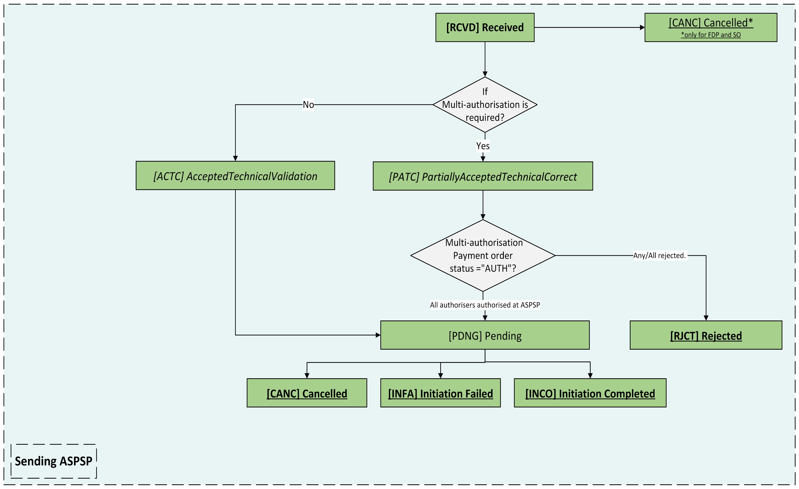

# Domestic Standing Orders - v4.0-draft1 <!-- omit in toc -->

- [Overview](#overview)
- [Endpoints](#endpoints)
  - [POST /domestic-standing-orders](#post-domestic-standing-orders)
    - [StatusCode](#statuscode)
  - [GET /domestic-standing-orders/{DomesticStandingOrderId}](#get-domestic-standing-orders-domesticstandingorderid)
    - [StatusCode](#statuscode-2)
  - [GET /domestic-standing-orders/{DomesticStandingOrderId}/payment-details](#get-domestic-standing-orders-domesticstandingorderid-payment-details)
    - [StatusCode](#statuscode-3)
  - [State Model](#state-model)
    - [Payment Order](#payment-order)
      - [Multiple Authorisation](#multiple-authorisation)
- [Data Model](#data-model)
  - [Reused Classes](#reused-classes)
    - [OBDomesticStandingOrder3](#obdomesticstandingorder3)
  - [Domestic Standing Order - Request](#domestic-standing-order-request)
    - [UML Diagram](#uml-diagram)
    - [Notes](#notes)
    - [Data Dictionary](#data-dictionary)
  - [Domestic Standing Order - Response](#domestic-standing-order-response)
    - [UML Diagram](#uml-diagram-2)
    - [Notes](#notes-2)
    - [Data Dictionary](#data-dictionary-2)
  - [Domestic Standing Order - Payment Details - Response](#domestic-standing-order-payment-details-response)
    - [UML Diagram](#uml-diagram-3)
    - [Data Dictionary](#data-dictionary-3)
- [Usage Examples](#usage-examples)
  - [Create a Domestic Standing Order](#create-a-domestic-standing-order)
    - [POST /domestic-standing-orders request](#post-domestic-standing-orders-request)
    - [POST /domestic-standing-orders response](#post-domestic-standing-orders-response)

## Overview

The Domestic Standing Orders resource is used by a PISP to initiate a Domestic Standing Order.

This resource description should be read in conjunction with a compatible Payment Initiation API Profile.

## Endpoints

| Resource |HTTP Operation |Endpoint |Mandatory ? |Scope |Grant Type |Message Signing |Idempotency Key |Request Object |Response Object |
| -------- |-------------- |-------- |----------- |----- |---------- |--------------- |--------------- |-------------- |--------------- |
| domestic-standing-orders |POST |POST /domestic-standing-orders |Conditional |payments |Authorization Code |Signed Request Signed Response |Yes |OBWriteDomesticStandingOrder3 |OBWriteDomesticStandingOrderResponse6 |
| domestic-standing-orders |GET |GET /domestic-standing-orders/{DomesticStandingOrderId} |Mandatory (if resource POST implemented) |payments |Client Credentials |Signed Response |No |NA |OBWriteDomesticStandingOrderResponse6 |
| payment-details |GET |GET /domestic-standing-orders/{DomesticStandingOrderId}/payment-details |Optional |payments |Client Credentials |Signed Response |No |NA |OBWritePaymentDetailsResponse1 |

### POST /domestic-standing-orders

Once the domestic-standing-order-consent has been authorised by the PSU, the PISP can proceed to submitting the domestic-standing-order for processing:

* This is done by making a POST request to the **domestic-standing-orders** endpoint.
* This request is an instruction to the ASPSP to begin the domestic standing order journey. The PISP must submit the domestic standing order immediately, however, there are some scenarios where the ASPSP may not warehouse the domestic standing order immediately (e.g. busy periods at the ASPSP).
* The PISP **must** ensure that the Initiation and Risk sections of the domestic-standing-order match the corresponding Initiation and Risk sections of the domestic-standing-order-consent resource. If the two do not match, the ASPSP **must not** process the request and **must** respond with a 400 (Bad Request).
* Any operations on the domestic-standing-order resource will not result in a Status change for the domestic-standing-order resource.

#### StatusCode

A domestic-standing-order can only be created if its corresponding domestic-standing-order-consent resource has the StatusCode of "AUTH". 

The domestic-standing-order resource that is created successfully must have one of the following initial StatusCodes:

| StatusCode |
| --- |
| RCVD |
| RJCT |

### GET /domestic-standing-orders/{DomesticStandingOrderId}

A PISP can retrieve the domestic-standing-order to check its status.

#### StatusCode

The domestic-standing-order resource must have one of the following StatusCodes:

| StatusCode |
| --- |
| RCVD |
| CANC |
| ACTC |
| PATC |
| PDNG |
| INFA |
| INCO |
| RJCT |

For full flow refer to state 1 diagram bellow.

### GET /domestic-standing-orders/{DomesticStandingOrderId}/payment-details

A PISP can retrieve the Details of the underlying payment transaction via this endpoint. This resource allows ASPSPs to return richer list of Payment Statuses, and if available payment scheme related statuses.

#### StatusCode

The domestic-standing-orders - payment-details must have one of the following ExternalPaymentTransactionStatus1Code code-set enumerations (for more information see `ExternalPaymentTransactionStatus1Code` [here](https://github.com/OpenBankingUK/External_internal_CodeSets)) :

| StatusCode |
| ------ |
| INCO |
| CANC |
| PDNG |
| ACTC |
| PATC |
| ACCP |
| ACFC |
| ACSP |
| ACWC |
| ACSC |
| ACWP |
| ACCC |
| BLCK |
| RJCT |
| RCVD |

For full flow refer to state 2 diagram bellow.

Refer to [External_Internal_CodeSets](https://github.com/OpenBankingUK/External_Internal_CodeSets) -> ISO_External_CodeSet -> `ExternalPaymentTransactionStatus1Code`.

### State Model

#### Payment Order

The state model for the domestic-standing-order resource describes the initiation status and the subsequent execution of the domestic-standing-order.

__Payment order state model key:__
| Colour (Style) | Description |
| --- | --- |
| Green (Bold) | Mandatory |
| Orange (Italic) | Optional, but recommended |

##### State 1


##### State 2


##### Multiple Authorisation
If the payment-order requires multiple authorisations the status of the multiple authorisations will be updated in the MultiAuthorisation object.

Once the payment is RCVD, the domestic-standing-order StatusCode must be set to PATC and the MultiAuthorisation object status updated with the AWAF status. Once all authorisations have been successfully completed the MultiAuthorisation status must be set to AUTH and domestic-standing-order StatusCode updated to ACSP if any intermediate status are not supported.

Any rejections in the multiple authorisation process should result in the MultiAuthorisation status and StatusCode being set to RJCT. 


|  | Status |Status Description |
| ---| ------ |------------------ |
| 1 |AWAF |The consent resource is awaiting further authorisation. |
| 2 |RJCT |The consent resource has been rejected. |
| 3 |AUTH |The consent resource has been successfully authorised. |

Refer to [External_Internal_CodeSets](https://github.com/OpenBankingUK/External_Internal_CodeSets) -> OB_Internal_CodeSet -> `OBInternalStatus2Code`.


## Data Model

The Data Dictionary section gives the detail on the payload content for the Domestic Standing Order API flows.

### Reused Classes

#### OBDomesticStandingOrder3

The OBDomesticStandingOrder3 class is defined in the [domestic-standing-order-consents](./domestic-standing-order-consents.md#OBDOBDomesticstandingorder3) page.


### Domestic Standing Order - Request

The OBWriteDomesticStandingOrder3 object will be used for a call to:

* POST /domestic-standing-orders

#### UML Diagram


#### Notes

The domestic-standing-order **request** object contains the:

* ConsentId.
* The full Initiation and Risk objects from the domestic-standing-order-consent request.
* The **Initiation** and **Risk** sections of the domestic-standing-order request **must** match the **Initiation** and **Risk** sections of the corresponding domestic-standing-order-consent request.

#### Data Dictionary

| Name |Occurrence |XPath |EnhancedDefinition |Class |Codes |Pattern |
| ---- |---------- |----- |------------------ |----- |----- |------- |
| OBWriteDomesticStandingOrder3 | |OBWriteDomesticStandingOrder3 | |OBWriteDomesticStandingOrder3 | | |
| Data |1..1 |OBWriteDomesticStandingOrder3/Data | |OBWriteDataDomesticStandingOrder3 | | |
| ConsentId |1..1 |OBWriteDomesticStandingOrder3/Data/ConsentId |OB: Unique identification as assigned by the ASPSP to uniquely identify the consent resource. |Max128Text | | |
| Initiation |1..1 |OBWriteDomesticStandingOrder3/Data/Initiation |The Initiation payload is sent by the initiating party to the ASPSP. It is used to request movement of funds from the debtor account to a creditor for a domestic standing order. |OBDomesticStandingOrder3 | | |
| Risk |1..1 |OBWriteDomesticStandingOrder3/Risk |The Risk section is sent by the initiating party to the ASPSP. It is used to specify additional details for risk scoring for Payments. |OBRisk1 | | |

### Domestic Standing Order - Response

The OBWriteDomesticStandingOrderResponse6 object will be used for a response to a call to:

* POST /domestic-standing-orders
* GET /domestic-standing-orders/{DomesticStandingOrderId}

#### UML Diagram


#### Notes

The domestic-standing-order **response** object contains the:

* DomesticStandingOrderId.
* ConsentId.
* CreationDateTime the domestic-standing-order resource was created.
* StatusCode and StatusUpdateDateTime of the domestic-standing-order resource.
* Refund account details, if requested by PISP as part of the domestic-payment-consents resource.
* Charges array - for the breakdown of applicable ASPSP charges.
* The Initiation object from the domestic-standing-order-consent.
* The MultiAuthorisation object if the domestic-standing-order resource requires multiple authorisations.
* An ASPSP should conditionally provide `Debtor/Name` in the Payment Order Response, even when the Payer didn't provide the Debtor Account via PISP.

#### Data Dictionary

| Name |Occurrence |XPath |EnhancedDefinition |Class |Codes |Pattern |
| ---- |---------- |----- |------------------ |----- |----- |------- |
| OBWriteDomesticStandingOrderResponse6 | |OBWriteDomesticStandingOrderResponse6 | |OBWriteDomesticStandingOrderResponse6 | | |
| Data |1..1 |OBWriteDomesticStandingOrderResponse6/Data | |OBWriteDataDomesticStandingOrderResponse6 | | |
| DomesticStandingOrderId |1..1 |OBWriteDomesticStandingOrderResponse6/Data/DomesticStandingOrderId |OB: Unique identification as assigned by the ASPSP to uniquely identify the domestic standing order resource. |Max40Text | | |
| ConsentId |1..1 |OBWriteDomesticStandingOrderResponse6/Data/ConsentId |OB: Unique identification as assigned by the ASPSP to uniquely identify the consent resource. |Max128Text | | |
| CreationDateTime |1..1 |OBWriteDomesticStandingOrderResponse6/Data/CreationDateTime |Date and time at which the resource was created. |ISODateTime | | |
| StatusCode |1..1 |OBWriteDomesticStandingOrderResponse6/Data/StatusCode |Specifies the status of the payment order resource. |OBExternalStatus1Code |RCVD RJCT ASCP CANC | |
| StatusUpdateDateTime |1..1 |OBWriteDomesticStandingOrderResponse6/Data/StatusUpdateDateTime |Date and time at which the resource status was updated. |ISODateTime | | |
| StatusReason |0..* |OBWriteDomesticStandingOrderResponse6/Data/StatusReason |An array of StatusReasonCode | OBStatusReason |
| StatusReasonCode |0..1 |OBWriteDomesticStandingOrderResponse6/Data/StatusReason/StatusReasonCode |Specifies the status reason in a code form. For a full description see `ExternalStatusReason1Code` [here](https://github.com/OpenBankingUK/External_internal_CodeSets). | ExternalStatusReason1Code |
| StatusReasonDescription |0..1 |OBWriteDomesticStandingOrderResponse6/Data/StatusReason/StatusReasonDescription |Description supporting the StatusReasonCode. |Max500Text|
|Path| 0..1 | OBWriteDomesticStandingOrderResponse6/Data/StatusReason/Path| Path is optional but relevant when the status reason refers to an object/field and hence conditional to provide JSON path| Max500Text| | |
| Refund |0..1 |OBWriteDomesticStandingOrderResponse6/Data/Refund |Unambiguous identification of the refund account to which a refund will be made as a result of the transaction. |OBDomesticRefundAccount1 | | |
| Charges |0..* |OBWriteDomesticStandingOrderResponse6/Data/Charges |Set of elements used to provide details of a charge for the payment initiation. |OBCharge2 | | |
| Initiation |1..1 |OBWriteDomesticStandingOrderResponse6/Data/Initiation |The Initiation payload is sent by the initiating party to the ASPSP. It is used to request movement of funds from the debtor account to a creditor for a domestic standing order. |OBDomesticStandingOrder3 | | |
| MultiAuthorisation |0..1 |OBWriteDomesticStandingOrderResponse6/Data/MultiAuthorisation | |OBMultiAuthorisation1 | | |
| Debtor |0..1 |OBWriteDomesticStandingOrderResponse6/Data/Debtor |Set of elements used to identify a person or an organisation. | OBCashAccountDebtor6| | |

### Domestic Standing Order - Payment Details - Response

The OBWritePaymentDetailsResponse1 object will be used for a response to a call to:

* GET /domestic-standing-orders/{DomesticStandingOrderId}/payment-details

#### UML Diagram


#### Data Dictionary

| Name |Occurrence |XPath |EnhancedDefinition |Class |Codes |Pattern |
| ---- |---------- |----- |------------------ |----- |----- |------- |
| OBWritePaymentDetailsResponse1 | |OBWritePaymentDetailsResponse1 | |OBWritePaymentDetailsResponse1 | | |
| Data |1..1 |OBWritePaymentDetailsResponse1/Data | |OBWriteDataPaymentOrderStatusResponse1 | | |
| StatusDetail |0..* |OBWritePaymentDetailsResponse1/Data/StatusDetail |An array of Payment status details. |OBWritePaymentDetails1 | | |

## Usage Examples

### Create a Domestic Standing Order

#### POST /domestic-standing-orders request

```
POST /domestic-standing-orders HTTP/1.1
Authorization: Bearer eYJQLMQLMQLM
x-idempotency-key: FRESNO.1317.GFX.22
x-jws-signature: TGlmZSdzIGEgam91cm5leSBub3QgYSBkZXN0aW5hdGlvbiA=..T2ggZ29vZCBldmVuaW5nIG1yIHR5bGVyIGdvaW5nIGRvd24gPw==
x-fapi-auth-date:  Sun, 10 Sep 2017 19:43:31 GMT
x-fapi-customer-ip-address: 104.25.212.99
x-fapi-interaction-id: 93bac548-d2de-4546-b106-880a5018460d
Content-Type: application/json
Accept: application/json
```

```json
{
  "Data": {
	"ConsentId": "SOC-100",
    "Initiation": {
	  "Frequency": "EvryDay",
	  "Reference": "Pocket money for Damien",
	  "FirstPaymentDateTime": "1976-06-06T06:06:06+00:00",
	  "FirstPaymentAmount": {
        "Amount": "6.66",
        "Currency": "GBP"
	  },
	  "RecurringPaymentAmount": {
        "Amount": "7.00",
        "Currency": "GBP"
	  },
	  "FinalPaymentDateTime": "1981-03-20T06:06:06+00:00",
	  "FinalPaymentAmount": {
        "Amount": "7.00",
        "Currency": "GBP"
	  },
      "DebtorAccount": {
        "SchemeName": "UK.OB.SortCodeAccountNumber",
        "Identification": "11280001234567",
        "Name": "Andrea Smith",
        "Proxy": {
          "Identification": "+441632960540",
          "Code": "TELE"
        },
      },
      "CreditorAccount": {
        "SchemeName": "UK.OB.SortCodeAccountNumber",
        "Identification": "08080021325698",
        "Name": "Bob Clements"
      },
      "MandateRelatedInformation": {
        "MandateIdentification": "Golfers",
        "Classification": "FIXE",
        "CategoryPurposeCode": "BONU",
        "FirstPaymentDateTime": "2024-04-25T12:46:49.425Z",
        "RecurringPaymentDateTime": "2024-04-25T12:46:49.425Z",
        "FinalPaymentDateTime": "2024-04-25T12:46:49.425Z",
        "Frequency": { 
          "Type": "MNTH",
          "CountPerPeriod": 1,
          "PointInTime": "00"
        }
      },
      "UltimateDebtor": {
        "SchemeName": "UK.OB.BICFI",
        "Identification": "2360549017905161589",
        "Name": "Ultimate Debtor",
        "LEI": "8200007YHFDMEODY1965",
        "PostalAddress": {
            "AddressType": "BIZZ",
            "StreetName": "Bank Street",
            "BuildingNumber": "11",
            "Floor": "6",
            "PostCode": "Z78 4TY",
            "TownName": "London",
            "Country": "UK"
        }
      },
      "UltimateCreditor": {
        "SchemeName": "UK.OB.BICFI",
        "Identification": "2360549017905161589",
        "Name": "Ultimate Creditor",
        "LEI": "60450004FECVJV7YN339",
        "PostalAddress": {
            "AddressType": "BIZZ",
            "StreetName": "Bank Street",
            "BuildingNumber": "11",
            "Floor": "6",
            "PostCode": "Z78 4TY",
            "TownName": "London",
            "Country": "UK"
            }
        },
      "RegulatoryReporting": [
          {
            "DebitCreditReportingIndicator": "CRED",
            "Authority": {
              "Name": "string",
              "CountryCode": "UG"
            },
            "Details": [
              {
                "Date": "2024-04-25T13:26:41.911Z",
                "Country": "QG",
                "Amount": {
                  "Amount": "4.68702",
                  "Currency": "JGM"
                }
              }
          ]
        }
      ],
      "RemittanceInformation": {
          "Structured": [
            {
              "ReferredDocumentInformation": [
                {
                  "Code": "CINV",
                  "Issuer": "Issuer01",
                  "Number": "Number_01",
                  "RelatedDate": "2024-04-25T13:26:41.911Z",
                  "LineDetails": [
                    "string"
                  ]
                }
              ],
              "ReferredDocumentAmount": 1,
              "CreditorReferenceInformation": {
                "Code": "DISP",
                "Issuer": "Issuer01",
                "Reference": "REF_26518"
              },
              "Invoicer": "INVR51856",
              "Invoicee": "INVE5161856"
            }
          ]
        }
    }
  },
  "Risk": {
    "PaymentContextCode": "TransferToThirdParty"
  }
}

```

#### POST /domestic-standing-orders response

```
HTTP/1.1 201 Created
x-jws-signature: V2hhdCB3ZSBnb3QgaGVyZQ0K..aXMgZmFpbHVyZSB0byBjb21tdW5pY2F0ZQ0K
x-fapi-interaction-id: 93bac548-d2de-4546-b106-880a5018460d
Content-Type: application/json
```

```json
{
  "Data": {
	"DomesticStandingOrderId": "SO-SOC-100",
	"ConsentId": "SOC-100",
	"CreationDateTime": "1976-01-01T06:06:06+00:00",
	"StatusCode": "ASCP",
	"StatusUpdateDateTime": "1976-06-06T06:06:06+00:00",
   "Refund": {
      "Account": {
        "SchemeName": "UK.OB.SortCodeAccountNumber",
        "Identification": "08080021325677",
        "Name": "NTPC Inc"
      }
    },
    "Initiation": {
	  "Frequency": "EvryDay",
	  "Reference": "Pocket money for Damien",
	  "FirstPaymentDateTime": "1976-06-06T06:06:06+00:00",
	  "FirstPaymentAmount": {
        "Amount": "6.66",
        "Currency": "GBP"
	  },
	  "RecurringPaymentAmount": {
        "Amount": "7.00",
        "Currency": "GBP"
	  },
	  "FinalPaymentDateTime": "1981-03-20T06:06:06+00:00",
	  "FinalPaymentAmount": {
        "Amount": "7.00",
        "Currency": "GBP"
	  },
      "DebtorAccount": {
        "SchemeName": "UK.OB.SortCodeAccountNumber",
        "Identification": "11280001234567",
        "Name": "Andrea Smith"
      },
      "CreditorAccount": {
        "SchemeName": "UK.OB.SortCodeAccountNumber",
        "Identification": "08080021325698",
        "Name": "Bob Clements"
      }
    }
  },
  "Risk": {
    "PaymentContextCode": "TransferToThirdParty"
  },
  "Links": {
    "Self": "https://api.alphabank.com/open-banking/v3.1/pisp/domestic-standing-orders/SO-SOC-100"
  },
  "Meta": {}
}
```
