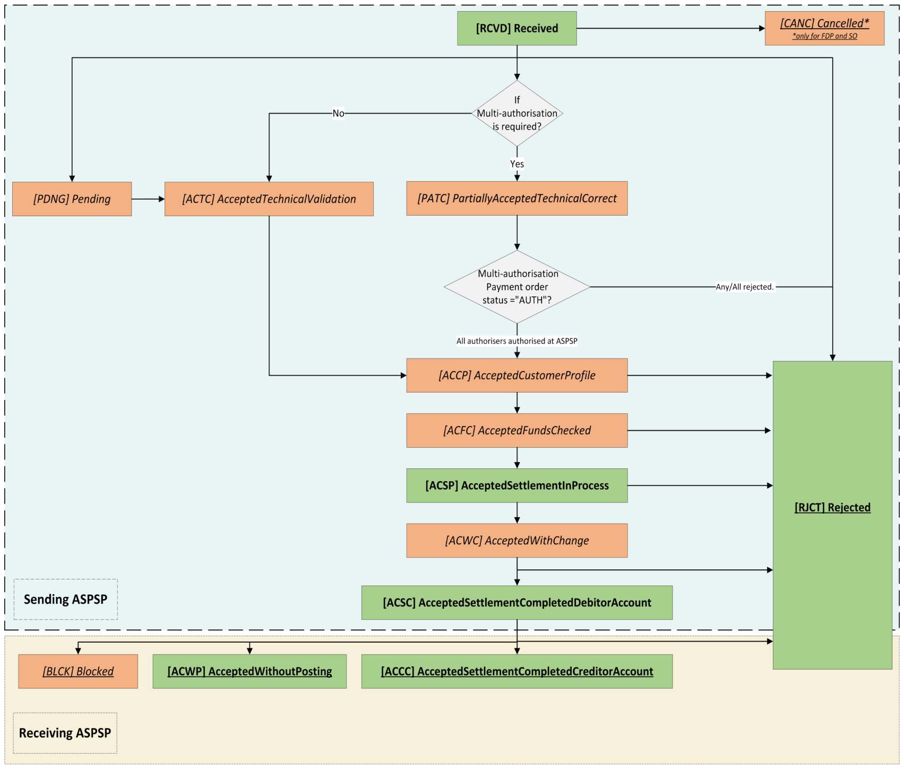

# International Scheduled Payments - v4.0-draft1 <!-- omit in toc -->

- [Overview](#overview)
- [Endpoints](#endpoints)
  - [POST /international-scheduled-payments](#post-international-scheduled-payments)
    - [StatusCode](#statuscode)
  - [GET /international-scheduled-payments/{InternationalScheduledPaymentId}](#get-international-scheduled-payments-internationalscheduledpaymentid)
    - [StatusCode](#statuscode-2)
  - [GET /international-scheduled-payments/{InternationalScheduledPaymentId}/payment-details](#get-international-scheduled-payments-internationalscheduledpaymentid-payment-details)
    - [StatusCode](#statuscode-3)
  - [State Model](#state-model)
    - [Payment Order](#payment-order)
      - [Multiple Authorisation](#multiple-authorisation)
- [Data Model](#data-model)
  - [Reused Classes](#reused-classes)
    - [OBInternationalScheduled3](#obinternationalscheduled3)
    - [OBExchangeRate2](#obexchangerate2)
  - [International Scheduled Payment - Request](#international-scheduled-payment-request)
    - [UML Diagram](#uml-diagram)
    - [Notes](#notes)
    - [Data Dictionary](#data-dictionary)
  - [International Scheduled Payment - Response](#international-scheduled-payment-response)
    - [UML Diagram](#uml-diagram-2)
    - [Notes](#notes-2)
    - [Data Dictionary](#data-dictionary-2)
  - [International Schedule Payment Order - Payment Details - Response](#international-schedule-payment-order-payment-details-response)
    - [UML Diagram](#uml-diagram-3)
    - [Data Dictionary](#data-dictionary-3)

## Overview

The International Scheduled Payments resource is used by a PISP to initiate an International Scheduled Payment.

This resource description should be read in conjunction with a compatible Payment Initiation API Profile.

## Endpoints

| Resource |HTTP Operation |Endpoint |Mandatory ? |Scope |Grant Type |Message Signing |Idempotency Key |Request Object |Response Object |
| --- |--- |--- |--- |--- |--- |--- |--- |--- |--- |
| international-scheduled-payments |POST |POST /international-scheduled-payments |Conditional |payments |Authorization Code |Signed Request Signed Response |Yes |OBWriteInternationalScheduled3 |OBWriteInternationalScheduledResponse6 |
| international-scheduled-payments |GET |GET /international-scheduled-payments/{InternationalScheduledPaymentId} |Mandatory (if resource POST implemented) |payments |Client Credentials |Signed Response |No |NA |OBWriteInternationalScheduledResponse6 |
| payment-details |GET |GET /international-scheduled-payments/{InternationalScheduledPaymentId}/payment-details |Optional |payments |Client Credentials |Signed Response |No |NA |OBWritePaymentDetailsResponse1 |

### POST /international-scheduled-payments

Once the international-scheduled-payment-consent has been authorised by the PSU, the PISP can proceed to submit the international-scheduled-payment for processing:

* This is done by making a POST request to the **international-scheduled-payments** endpoint.
* This request is an instruction to the ASPSP to begin the international scheduled payment journey. The PISP must submit the international scheduled payment immediately, however, there are some scenarios where the ASPSP may not warehouse the international scheduled payment immediately (e.g. busy periods at the ASPSP).
* The PISP **must** ensure that the Initiation and Risk sections of the international-scheduled-payment match the corresponding Initiation and Risk sections of the international-scheduled-payment-consent resource. If the two do not match, the ASPSP **must not** process the request and **must** respond with a 400 (Bad Request).
* Any operations on the international-scheduled-payment resource will not result in a Status change for the international-scheduled-payment resource.

#### StatusCode

An international-scheduled-payment can only be created if its corresponding international-scheduled-payment-consent resource has the StatusCode of "AUTH". 

The international-scheduled-payment resource that is created successfully must have one of the following initial StatusCodes:

| StatusCode |
| --- |
| RCVD |
| RJCT |

### GET /international-scheduled-payments/{InternationalScheduledPaymentId}

A PISP can retrieve the international-scheduled-payment to check its status.

#### StatusCode

The international-scheduled-payment resource must have one of the following StatusCodes:

| StatusCode |
| --- |
| RCVD |
| CANC |
| PDNG |
| ACTC |
| PATC |
| ACCP |
| ACFC |
| ACSP |
| ACWC |
| ACSC |
| ACWP |
| ACCC |
| BLCK |
| RJCT |

### GET /international-scheduled-payments/{InternationalScheduledPaymentId}/payment-details

A PISP can retrieve the Details of the underlying payment transaction via this endpoint. This resource allows ASPSPs to return richer list of Payment Statuses, and if available payment scheme related statuses.

#### StatusCode

The international-scheduled-payments - payment-details must have one of the following PaymentStatusCode code-set enumerations:

| StatusCode |
| ------ |
| RCVD |
| CANC |
| PDNG |
| ACTC |
| PATC |
| ACCP |
| ACFC |
| ACSP |
| ACWC |
| ACSC |
| ACWP |
| ACCC |
| BLCK |
| RJCT |

Refer to [External_Internal_CodeSets](https://github.com/OpenBankingUK/External_Internal_CodeSets) -> ISO_External_CodeSet -> `ExternalPaymentTransactionStatus1Code`.

### State Model

#### Payment Order

The state model for the international-scheduled-payment resource describes the initiation status and the subsequent execution of the international-scheduled-payment.

##### Multiple Authorisation
If the payment-order requires multiple authorisations the status of the multiple authorisations will be updated in the MultiAuthorisation object.

Once the payment is RCVD, the international-scheduled-payment StatusCode must be set to PATC and the MultiAuthorisation object status updated with the AWAF status. Once all authorisations have been successfully completed the MultiAuthorisation status must be set to AUTH and international-scheduled-payment StatusCode updated to ACSP if any intermediate status are not supported.

Any rejections in the multiple authorisation process should result in the MultiAuthorisation status and StatusCode being set to RJCT. 

The definitions for the StatusCode:

|  |Status |Status Description |
| --- |--- |--- |
| 1 |AWAU |The payment-order resource is awaiting further authorisation. |
| 2 |RJCT |The payment-order resource has been rejected by an authoriser. |
| 3 |AUTH |The payment-order resource has been successfully authorised by all required authorisers. |

## Data Model

The data dictionary section gives the detail on the payload content for the International Scheduled Payment API flows.

### Reused Classes

#### OBInternationalScheduled3

The OBInternationalScheduled3 class is defined in the [international-scheduled-payment-consents](./international-scheduled-payment-consents.md#obinternationalscheduled3) page.

#### OBExchangeRate2

The OBExchangeRate2 class is defined in the [international-scheduled-payment-consents](./international-scheduled-payment-consents.md#obexchangerate2) page.

### International Scheduled Payment - Request

The OBWriteInternationalScheduled3 object will be used for a call to:

* POST /international-scheduled-payments

#### UML Diagram

#### Notes

The international-scheduled-payment **request** object contains the: 

* ConsentId.
* The full Initiation and Risk objects from the international-scheduled-payment-consent request.
* The **Initiation** and **Risk** sections of the international-scheduled-payment request **must** match the **Initiation** and **Risk** sections of the corresponding international-scheduled-payment-consent request.

#### Data Dictionary

| Name |Occurrence |XPath |EnhancedDefinition |Class |Codes |Pattern |
| --- |--- |--- |--- |--- |--- |--- |
| OBWriteInternationalScheduled3 |OBWriteInternationalScheduled3 | |OBWriteInternationalScheduled3 | | | |
| Data |1..1 |OBWriteInternationalScheduled3/Data | |OBWriteDataInternationalScheduled3 | | |
| ConsentId |1..1 |OBWriteInternationalScheduled3/Data/ConsentId |OB: Unique identification as assigned by the ASPSP to uniquely identify the consent resource. |Max128Text | | |
| Initiation |1..1 |OBWriteInternationalScheduled3/Data/Initiation |The Initiation payload is sent by the initiating party to the ASPSP. It is used to request movement of funds from the debtor account to a creditor for a single scheduled international payment. |OBInternationalScheduled3 | | |
| Risk |1..1 |OBWriteInternationalScheduled3/Risk |The Risk section is sent by the initiating party to the ASPSP. It is used to specify additional details for risk scoring for Payments. |OBRisk1 | | |

### International Scheduled Payment - Response

The OBWriteInternationalScheduledResponse6 object will be used for a response to a call to:

* POST /international-scheduled-payments
* GET /international-scheduled-payments/{InternationalScheduledPaymentId}

#### UML Diagram

#### Notes

The international-scheduled-payment **response** object contains the:

* InternationalScheduledPaymentId.
* ConsentId.
* CreationDateTime the international-scheduled-payment resource was created.
* StatusCode and StatusUpdateDateTime of the international-scheduled-payment resource.
* ExpectedExecutionDateTime for the international-scheduled-payment resource.
* ExpectedSettlementDateTime for the international-scheduled-payment resource.
* Refund account details, if requested by PISP as part of the international-scheduled-payment-consents resource.
* The Charges and ExchangeRateInformation in the international-scheduled-payment-consent response from the ASPSP.
* The Initiation object from the international-payment-consent.
* The MultiAuthorisation object if the international-scheduled-payment resource requires multiple authorisations.
* An ASPSP should conditionally provide `Debtor/Name` in the Payment Order Response, even when the Payer didn't provide the Debtor Account via PISP.

#### Data Dictionary

| Name |Occurrence |XPath |EnhancedDefinition |Class |Codes |Pattern |
| --- |--- |--- |--- |--- |--- |--- |
| OBWriteInternationalScheduledResponse6 | |OBWriteInternationalScheduledResponse6 | |OBWriteInternationalScheduledResponse6 | | |
| Data |1..1 |OBWriteInternationalScheduledResponse6/Data | |OBWriteDataInternationalScheduledResponse6 | | |
| InternationalScheduledPaymentId |1..1 |OBWriteInternationalScheduledResponse6/Data/InternationalScheduledPaymentId |OB: Unique identification as assigned by the ASPSP to uniquely identify the international scheduled payment resource. |Max40Text | | |
| ConsentId |1..1 |OBWriteInternationalScheduledResponse6/Data/ConsentId |OB: Unique identification as assigned by the ASPSP to uniquely identify the consent resource. |Max128Text | | |
| CreationDateTime |1..1 |OBWriteInternationalScheduledResponse6/Data/CreationDateTime |Date and time at which the resource was created. |ISODateTime | | |
| StatusCode |1..1 |OBWriteInternationalScheduledResponse6/Data/StatusCode |Specifies the status of the payment order resource. |OBExternalStatus1Code |RCVD RJCT ASCP CANC | |
| StatusUpdateDateTime |1..1 |OBWriteInternationalScheduledResponse6/Data/StatusUpdateDateTime |Date and time at which the resource status was updated. |ISODateTime | | |
| ExpectedExecutionDateTime |0..1 |OBWriteInternationalScheduledResponse6/Data/ExpectedExecutionDateTime |Expected execution date and time for the payment resource. |ISODateTime | | |
| StatusReason |0..* |OBWriteInternationalScheduledResponse6/Data/StatusReason |Specifies the status reason. | OBStatusReason |
| StatusReasonCode |0..1 |OBWriteInternationalScheduledResponse6/Data/StatusReason/StatusReasonCode |Specifies the status reason in a code form. For a full description see `ExternalStatusReason1Code` [here](https://github.com/OpenBankingUK/External_Interal_CodeSets). | ExternalStatusReason1Code |
| StatusReasonDescription |0..1 |OBWriteInternationalScheduledResponse6/Data/StatusReason/StatusReasonDescription |Description supporting the StatusReasonCode. | Max500Text |
|Path| 0..1 | OBWriteInternationalScheduledResponse6/Data/StatusReason/Path| Path is optional but relevant when the status reason refers to an object/field and hence conditional to provide JSON path.| Max500Text| | |
| ExpectedSettlementDateTime |0..1 |OBWriteInternationalScheduledResponse6/Data/ExpectedSettlementDateTime |Expected settlement date and time for the payment resource. |ISODateTime | | |
| Refund |0..1 |OBWriteInternationalScheduledResponse6/Data/Refund |Unambiguous identification of the refund account to which a refund will be made as a result of the transaction. |OBInternationalRefundAccount1 | | |
| Charges |0..n |OBWriteInternationalScheduledResponse6/Data/Charges |Set of elements used to provide details of a charge for the payment initiation. |OBCharge2 | | |
| ExchangeRateInformation |0..1 |OBWriteInternationalScheduledResponse6/Data/ExchangeRateInformation |Further detailed information on the exchange rate that has been used in the payment transaction. |OBExchangeRate2 | | |
| Initiation |1..1 |OBWriteInternationalScheduledResponse6/Data/Initiation |The Initiation payload is sent by the initiating party to the ASPSP. It is used to request movement of funds from the debtor account to a creditor for a single scheduled international payment. |OBInternationalScheduled3 | | |
| MultiAuthorisation |0..1 |OBWriteInternationalScheduledResponse6/Data/MultiAuthorisation | |OBMultiAuthorisation1 | | |
| Debtor |0..1 |OBWriteInternationalScheduledResponse6/Data/Debtor |Set of elements used to identify a person or an organisation. | | | |
| SchemeName |0..1 |OBWriteInternationalScheduledResponse6/Data/Debtor/SchemeName |Name of the identification scheme, in a coded form as published in an external list. |OBExternalAccountIdentification4Code | | |
| Identification |0..1 |OBWriteInternationalScheduledResponse6/Data/Debtor/Identification |Identification assigned by an institution to identify an account. This identification is known by the account owner. |Max256Text | | |
| Name |0..1 |OBWriteInternationalScheduledResponse6/Data/Debtor/Name |The account name is the name or names of the account owner(s) represented at an account level, as displayed by the ASPSP's online channels. Note, the account name is not the product name or the nickname of the account. |Max350Text | | |
| SecondaryIdentification |0..1 |OBWriteInternationalScheduledResponse6/Data/Debtor/SecondaryIdentification |This is secondary identification of the account, as assigned by the account servicing institution. This can be used by building societies to additionally identify accounts with a roll number (in addition to a sort code and account number combination). |Max34Text | | |
| LEI |0..1 | OBWriteInternationalScheduledResponse6/Data/Debtor/LEI |Legal Entity Identification Legal entity identification as an alternate identification for a party. Legal Entity Identifier is a code allocated to a party as described in ISO 17442 "Financial Services - Legal Entity Identifier (LEI)". |Max20Text | |^[A-Z0-9]{18,18}[0-9]{2,2}$ |

### International Schedule Payment Order - Payment Details - Response

The OBWritePaymentDetailsResponse1 object will be used for a response to a call to:

* GET /international-scheduled-payments/{InternationalScheduledPaymentId}/payment-details

#### UML Diagram

#### Data Dictionary

| Name |Occurrence |XPath |EnhancedDefinition |Class |Codes |Pattern |
| --- |--- |--- |--- |--- |--- |--- |
| OBWritePaymentDetailsResponse1 | |OBWritePaymentDetailsResponse1 | |OBWritePaymentDetailsResponse1 | | |
| Data |1..1 |OBWritePaymentDetailsResponse1/Data | |OBWriteDataPaymentOrderStatusResponse1 | | |
| StausDetail |0..unbounded |OBWritePaymentDetailsResponse1/Data/StausDetail |An array of payment status details. |OBWritePaymentDetails1 | | |
