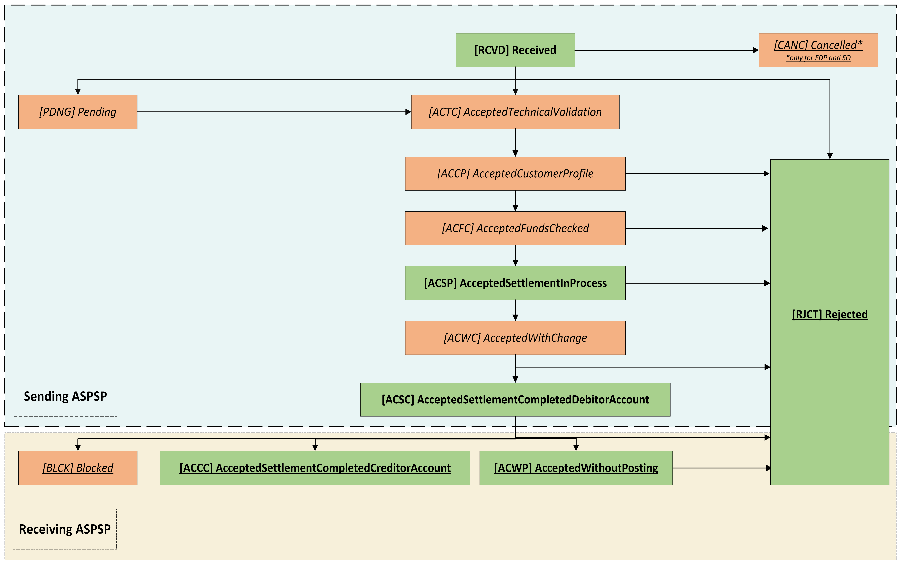

# Domestic VRPS - v4.0-draft1 <!-- omit in toc -->

- [Overview](#overview)
- [Endpoints](#endpoints)
  - [POST /domestic-vrps](#post-domestic-vrps)
    - [Status](#status)
  - [GET /domestic-vrps/{DomesticVRPId}](#get-domestic-vrpsdomesticvrpid)
  - [GET /domestic-vrps/{DomesticVRPId}/payment-details](#get-domestic-vrpsdomesticvrpidpayment-details)
- [State Model](#state-model)
  - [Payment Order](#payment-order)
- [Data Model](#data-model)
  - [OBDomesticVRPInstruction](#obdomesticvrpinstruction)
  - [OBDomesticVRPRequest](#obdomesticvrprequest)
  - [OBDomesticVRPResponse](#obdomesticvrpresponse)
  - [OBDomesticVRPDetails](#obdomesticvrpdetails)
- [Usage Examples](#usage-examples)

## Overview

The Domestic VRPs resource is used by a TPP to initiate a domestic payment, under an authorised VRP Consent.

This resource description should be read in conjunction with a compatible Payment Initiation API Profile.

## Endpoints

| Resource |HTTP Operation |Endpoint |Mandatory |Scope |Grant Type |Message Signing |Idempotency Key |Request Object |Response Object |
| -------- |-------------- |-------- |----------- |----- |---------- |--------------- |--------------- |-------------- |--------------- |
| domestic-vrps |POST |POST /domestic-vrps | Conditional |payments |Authorization Code |Signed Request Signed Response |Yes | OBDomesticVRPRequest |OBDomesticVRPResponse |
| domestic-vrps |GET |GET /domestic-vrps/{DomesticVRPId} | Conditional |payments |Client Credentials |Signed Response |No |NA |OBDomesticVRPResponse |
| domestic-vrps |GET |GET /domestic-vrps/{DomesticVRPId}/payment-details | Optional |payments |Client Credentials |Signed Response |No |NA |OBDomesticVRPDetails |

### POST /domestic-vrps

Once a `domestic-vrp-consents` has been authorised by the PSU, the TPP can proceed to submitting a `domestic-vrps` for processing.

This is done by making a POST request to the `domestic-vrps` endpoint.

This request is an instruction to the ASPSP to begin the domestic single immediate payment journey. The domestic payment must be executed immediately, however, there are some scenarios where the domestic payment may not be executed immediately (e.g., busy periods at the ASPSP).

The TPP **must** ensure that the `Initiation` and `Risk` section matches the values specified in the consent.

The ASPSP **must** ensure that the payment instruction adheres to the limitations set by the corresponding VRP consent's `ControlParameters`.

When a payment would breach a limitation set by one or more `ControlParameters`, the ASPSP **must** return an error with code `U014` and pass in the control parameter field that caused the error in the `Field` field of the error message.

If the `CreditorAccount` was not specified in the the consent, the `CreditorAccount` must be specified in the instruction.

The TPP **must** ensure that the end-point is called with the same scope as the one used for the corresponding consent.

The ASPSP **must** reject a payment that has `Data.Instruction.SupplementaryData` that it cannot process.

#### Status

A `domestic-vrps` can only be created if its corresponding `domestic-vrp-consents` resource has the Status of `AUTH`.

The `domestic-vrps` resource that is created successfully must have one of the following `PaymentStatusCode` values

| Status |
| ------ |
| RCVD |
| PDNG |
| ACTC |
| RJCT |

### GET /domestic-vrps/{DomesticVRPId}

Once the domestic vrp is created, a TPP can retrieve the `domestic-vrps` to check its status by using this endpoint.

The domestic-vrp resource must have one of the following ExternalPaymentTransactionStatus1Code code-set enumerations (for more information see `ExternalPaymentTransactionStatus1Code` [here](https://github.com/OpenBankingUK/External_internal_CodeSets)) :

| Status |
| ------ |
| PDNG |
| ACTC |
| PATC |
| ACCP |
| ACFC |
| ACSP |
| ACWC |
| ACSC |
| ACWP |
| ACCC |
| BLCK |
| RJCT |
| RCVD |

### GET /domestic-vrps/{DomesticVRPId}/payment-details

A TPP can retrieve the details of the underlying payment transaction via this endpoint. This resource allows ASPSPs to return a richer list of Payment Statuses, and if available payment scheme related statuses.

The API must return one of the following StatusCodes:

| Status |
| ------ |
| RCVD |
| PDNG |
| ACTC |
| ACCP |
| ACFC |
| ACSP |
| ACWC |
| ACSC |
| ACWP |
| ACCC |
| BLCK |
| RJCT |

## State Model

### Payment Order

The state model for the `domestic-vrps` resource follows the behavior and definitions for the ISO 20022 PaymentStatusCode code-set.

__Note: Multi-authorisation is not currently supported in VRP.__

__Payment order state model key:__
| Colour (Style) | Description |
| --- | --- |
| Green (Bold) | Mandatory |
| Orange (Italic) | Optional, but recommended |

## Data Model

### OBDomesticVRPInstruction

| Name |Path |Definition | Type |
| ---- |-----|---------- |------|
| __InstructionIdentification__ (1..1) | `InstructionIdentification` |Unique identification as assigned by an instructing party for an instructed party to unambiguously identify the instruction. Usage: the instruction identification is a point to point reference that can be used between the instructing party and the instructed party to refer to the individual instruction. It can be included in several messages related to the instruction. |Max35Text
| __EndToEndIdentification__ (1..1) | `EndToEndIdentification` |Unique identification assigned by the initiating party to unambiguously identify the transaction. This identification is passed on, unchanged, throughout the entire end-to-end chain. Usage: The end-to-end identification can be used for reconciliation or to link tasks relating to the transaction. It can be included in several messages related to the transaction. OB: The Faster Payments Scheme can only access 31 characters for the EndToEndIdentification field. |Max35Text
| __RemittanceInformation__ (0..1) | `RemittanceInformation` |Information supplied to enable the matching of an entry with the items that the transfer is intended to settle, such as commercial invoices in an accounts' receivable system. | [OBRemittanceInformation1](../../profiles/vrp-profile.md#obremittanceinformation1)
| __LocalInstrument__ (0..1) | `LocalInstrument` |User community specific instrument. Usage: This element is used to specify a local instrument, local clearing option and/or further qualify the service or service level. For a full list of enumeration values refer to `OB_Internal_CodeSet` [here].(https://github.com/OpenBankingUK/External_Internal_CodeSets) |OBInternalLocalInstrument1Code |
| __InstructedAmount__ (1..1) | `InstructedAmount` |Amount of money to be moved between the debtor and creditor, before deduction of charges, expressed in the currency as ordered by the initiating party. Usage: This amount has to be transported unchanged through the transaction chain. | OBActiveOrHistoricCurrencyAndAmount
| __Amount__ (1..1) |`InstructedAmount. Amount` |A number of monetary units specified in an active currency where the unit of currency is explicit and compliant with ISO 4217. |OBActiveCurrencyAndAmount_SimpleType | `^\d{1,13}$|^\d{1,13}\.\d{1,5}$`
| __Currency__ (1..1) | `InstructedAmount. Currency` |A code allocated to a currency by a Maintenance Agency under an international identification scheme, as described in the latest edition of the international standard ISO 4217 "Codes for the representation of currencies and funds". |ActiveOrHistoricCurrencyCode | `^[A-Z]{3,3}$`
| __CreditorAgent__ (0..1) | `CreditorAgent` | Financial institution servicing an account for the creditor.     | OBBranchAndFinancialInstitutionIdentification6
| __CreditorAccount__ (1..1) | `CreditorAccount`   |Unambiguous identification of the account of the creditor to which a credit entry will be posted as a result of the payment transaction.       |OBCashAccountCreditor3|
| __CreditorPostalAddress__ (0..1)| `CreditorPostalAddress` |Information that locates and identifies a specific address, as defined by postal services.| [OBPostalAddress7](../../profiles/vrp-profile.md#obpostaladdress7)  |
| __UltimateCreditor__ (0..1)| `UltimateCreditor` | Ultimate party to which an amount of money is due. |[OBUltimateCreditor1](../../profiles/vrp-profile.md#obultimatecreditor1) |
| __SupplementaryData__ (0..1)        | `SupplementaryData`                 | Additional information that can not be captured in the structured fields and/or any other specific block     

### OBDomesticVRPRequest

| Name                               | Path                            | Definition                                                                                                  | Type                                                  |
|------------------------------------|---------------------------------|-------------------------------------------------------------------------------------------------------------|-------------------------------------------------------|
| __Data__ (1..1)                    | `Data`                          |                                                                                                             |                                                       |
| __PSUAuthenticationMethod__ (1..1) | `Data. PSUAuthenticationMethod` | The authentication method that was used to authenicate the PSU.                                             | OBVRPAuthenticationMethods - Namespaced Enumeration   |
| __PSUInteractionType__ (0..1)      | `Data. PSUInteractionType`      | Indicates interaction type, currently if customer is present or not present. If not provided the default is `"OffSession"` (customer is not present) when the individual VRP payment is made.                                                  | OBVRPInteractionTypes                                 |
| __VRPType__ (1..1)      | `Data. VRPType`      |  	The type of payment being made under the VRP consent. This can be used to indicate whether this include sweeping payment or other ecommerce payments. 	                                | OBVRPConsentType - Namespaced Enumeration                                 |
| __ConsentId__ (1..1)               | `Data. ConsentId`               | Identifier for the Domestic VRP Consent that this payment is made under                                     | Max128Text                                            |
| __Initiation__ (1..1)              | `Data. Initiation`              | The parameters of the VRP consent that should remain unchanged for each payment under this VRP.             | OBDomesticVRPInitiation                               |
| __Instruction__ (1..1)             | `Data. Instruction`             | Specific instructions for this particular payment within the VRP consent                                    | [OBDomesticVRPInstruction](#OBDomesticVRPInstruction) |
| __Risk__ (1..1)                    | `Risk`                          | The risk block for this payment. This must match the risk block for the corresponding Domestic VRP consent. | OBRisk2                                               |

### OBDomesticVRPResponse

| Name                                  | Path                               | Definition                                                                                                                                                                                                   | Type                                                                                                                              |
|---------------------------------------|------------------------------------|--------------------------------------------------------------------------------------------------------------------------------------------------------------------------------------------------------------|-----------------------------------------------------------------------------------------------------------------------------------|
| __Data__ (1..1)                       | `Data`                             |                                                                                                                                                                                                              |                                                                                                                                   |
| __DomesticVRPId__ (1..1)              | `Data. DomesticVRPId`              | OB: Unique identification as assigned by the ASPSP to uniquely identify the domestic payment resource.                                                                                                       | Max40Text                                                                                                                         |
| __ConsentId__ (1..1)                  | `Data. ConsentId`                  | Identifier for the Domestic VRP Consent that this payment is made under                                                                                                                                      | Max128Text                                                                                                                        |
| __CreationDateTime__ (1..1)           | `Data. CreationDateTime`           | Date and time at which the message was created.                                                                                                                                                              | ISODateTime                                                                                                                       |
| __Status__ (1..1)                     | `Data. Status`                     | Specifies the status of the payment information group.                                                                                                                                                       |  RCVD PDNG ACTC ACCP ACFC ACSP ACWC ACSC ACWP ACCC BLCK RJCT  |
| __StatusUpdateDateTime__ (1..1)       | `Data. StatusUpdateDateTime`       | Date and time at which the resource Status was updated.                                                                                                                                                      | ISODateTime                                                                                                                       |
| __StatusReason__ (0..*)               | `Data. StatusReason`               | Array of StatusReasonCode.                                                                                                                      | Array                                                                                     |
| __StatusReasonCode__ (0..1)| `Data. StatusReason. StatusReasonCode` | Specifies the status reason in a code form. For a full description see ` OB_Internal_CodeSet` [here](https://github.com/OpenBankingUK/External_internal_CodeSets). | OBExternalStatusReason1Code |
| __StatusReasonDescription__ (0..1)    | `Data.StatusReason. StatusReasonDescription`    | Description supporting the StatusReasonCode                                                                                                                                                         | Max256Text                                                                                                                        |
| __Path__ (0..1)| `Data. StatusReason. Path` |Path is optional but relevant when the status reason refers to an object/field and hence conditional to provide JSON path.| Max500Text| 
| __ExpectedExecutionDateTime__ (0..1)  | `Data. ExpectedExecutionDateTime`  | Expected execution date and time for the payment resource.                                                                                                                                                   | ISODateTime                                                                                                                       |
| __ExpectedSettlementDateTime__ (0..1) | `Data. ExpectedSettlementDateTime` | Expected settlement date and time for the payment resource.                                                                                                                                                  | ISODateTime                                                                                                                       |
| __Refund__ (0..1)                     | `Data. Refund`                     | Unambiguous identification of the refund account to which a refund will be made as a result of the transaction. This object is populated only when `Data. ReadRefundAccount` is set to `Yes` in the consent. | OBDomesticRefundAccount1                                                                                                          |
| __Charges__ (0..n)                    | `Data. Charges`                    | Set of elements used to provide details of a charge for the payment initiation.                                                                                                                              | OBCharge2                                                                                                                         |
| __Initiation__ (1..1)                 | `Data. Initiation`                 | The parameters of the VRP consent that should remain unchanged for each payment under this VRP.                                                                                                              | OBDomesticVRPInitiation                                                                                                           |
| __Instruction__ (1..1)                | `Data. Instruction`                | Specific instructions for this particular payment within the VRP consent                                                                                                                                     | OBDomesticVRPInstruction|
| __DebtorAccount__ (0..1)              | `Data.DebtorAccount`               | The approved DebtorAccount that the payment was made from.                                                                                                                                                   | OBCashAccountDebtorWithName                                                                                                       |

### OBDomesticVRPDetails

| Name |Path |Definition | Type |
| ---- |-----|---------- |------|
| __Data__ (1..1) | `Data`
| __LocalInstrument__ (0..1) | `Data. LocalInstrument` |User community specific instrument.  Usage: This element is used to specify a local instrument, local clearing option and/or further qualify the service or service level. For a full list of enumeration values refer to `OB_Internal_CodeSet` [here].(https://github.com/OpenBankingUK/External_Internal_CodeSets) |OBInternalLocalInstrument1Code|
| __PaymentTransactionId__ (1..1) | `Data. PaymentTransactionId` |Unique identifier for the transaction within an servicing institution. This identifier is both unique and immutable. |Max210Text|
| __Status__ (1..1) |`Data. Status` |Status of a transfer, as assigned by the transaction administrator. |Values: RCVD PDNG ACTC ACCP ACFC ACSP ACWC ACSC ACWP ACCC BLCK RJCT  (See `ExternalPaymentTransactionStatus1Code` in [External codeset list](https://github.com/OpenBankingUK/External_internal_CodeSets))| Max4Text|
| __StatusUpdateDateTime__ (1..1)       | `Data. StatusUpdateDateTime`       | Date and time at which the resource Status was updated. | ISODateTime |
| __StatusDetail__ (0..*) | `Data. StatusDetail` |Array of StatusCodes| Array|
| __Status__ (1..1) | `Data. StatusDetail. Status` |Status of a transfer, as assigned by the transaction administrator. |Max4Text|
| __StatusReasonCode__ (0..1) | `Data. StatusDetail. StatusReason` |Reason code for the Status Code update| Specifies the status reason in a code form. For a full description see `OBExternalStatusReason1Code` in `OB_Internal_CodeSet` [here](https://github.com/OpenBankingUK/)|
| __StatusReasonDescription__ (0..1) | `Data. StatusDetail. StatusReasonDescription` |Reason provided for the status of a transfer. |Max256Text |
| __StatusUpdateDateTime__ (1..1)       | `Data. StatusDetail. StatusUpdateDateTime`       | Date and time at which the resource Status was updated. | ISODateTime |

## Usage Examples

See [Usage Examples](../../references/usage-examples/vrp-usage-examples.md)
