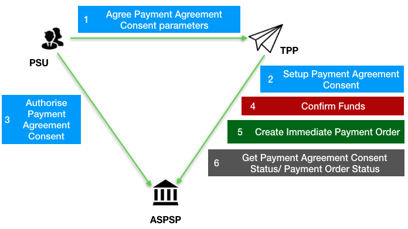
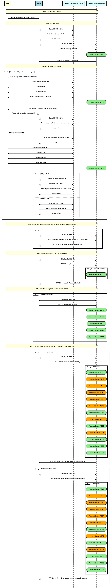

# Variable Recurring Payments API Profile - v4.0 <!-- omit in toc -->

- [Introduction](#introduction)
  - [Resources](#resources)
- [Basics](#basics)
  - [Overview](#overview)
    - [Steps](#steps)
    - [Sequence Diagram](#sequence-diagram)
  - [Payment Restrictions](#payment-restrictions)
  - [Deferred specification of VRP Consent Parameters](#deferred-specification-of-vrp-consent-parameters)
  - [Deferred specification of CreditorAccount and CreditorAgent](#deferred-specification-of-creditoraccount-and-creditoragent)
- [Security & Access Control](#security-access-control)
  - [Scopes](#scopes)
  - [Grants Types](#grants-types)
  - [Consent Authorisation](#consent-authorisation)
  - [PSU Authentication Methods](#psu-authentication-methods)
  - [Consent Revocation](#consent-revocation)
  - [Multiple Authorisation](#multiple-authorisation)
  - [SCA through the PISP](#sca-through-the-pisp)
  - [Error Condition](#error-condition)
  - [Consent Re-authentication](#consent-re-authentication)
  - [Risk Scoring Information](#risk-scoring-information)
  - [Migration of a consent to a new version](#migration-of-a-consent-to-a-new-version)
- [Data Model](#data-model)
  - [Reused Classes](#reused-classes)
    - [OBProxy1 ](#obproxy1)
      - [Data Dictionary](#obproxy1-data-dictionary)
    - [OBPostalAddress7](#obpostaladdress7)
      - [Data Dictionary](#obpostaladdress7-data-dictionary)
    - [OBRemittanceInformation2](#obremittanceinformation2)
      - [Data Dictionary](#obremittanceinformation2-data-dictionary)
    - [OBUltimateCreditor1](#obultimatecreditor1)
      - [Data Dictionary](#obultimatecreditor1-data-dictionary)
    - [OBUltimateDebtor1](#obultimatedebtor1)
      - [Data Dictionary](#obultimatedebtor1-data-dictionary)  
    - [OBRegulatoryReporting1](#obregulatoryreporting1)
      - [Data Dictionary](#obregulatoryreporting1-data-dictionary)
- [Event Notifications](#event-notifications)
  - [Event Notification for changes to DebtorAccount](#event-notification-for-changes-to-debtoraccount)
  - [Event notifications for cancellation of a VRP Consent](#event-notifications-for-cancellation-of-a-vrp-consent)

## Introduction

The Variable Recurring Payments API Profile describes the flows and common functionality for setting up VRP Consents and subsequently creating one or more payment orders that meet the limitations set by the VRP Consent.

The functionality includes the ability to:

- **Stage** a VRP Consent.
- Optionally **confirm available funds** for a VRP of a specified amount
- Subsequently **submit** the VRP for processing.
- Optionally **retrieve the status** of VRP Consents and VRPs.

This profile should be read in conjunction with a compatible Read/Write Data API Profile which provides a description of the elements that are common across all the Read/Write Data APIs.

### Resources

Each of the Payment Initiation API resources are documented in the  [Resources and Data Models](../resources-and-data-models/) area of the specification. Each resource is documented with:

- Endpoints
  - The API endpoints available for the resource.
- Data Model
  - Resource definition.
  - UML diagram.
  - Permissions as they relate to accessing the resource.
  - Data dictionary - which defines fields, re-usable classes, mandatory (1..1) or conditional (0..1) as defined in the Design Principles section, and enumerations.
- Usage Examples

## Basics

### Overview

The figure below provides a **general** outline of a VRP flow.

The flow below is documented in terms of two abstract resources:

- `domestic-vrp-consents`: A consent created between a PSU and TPP that allows the TPP to create `vrps` on behalf of the PSU subject to _control parameters_
- `vrps`: A payment order created by the TPP that meets the limitations set out by an approved `domestic-vrp-consents` resource.

These resources will be instantiated as specific resources for various types of payments.

This version of the specification is limited to `domestic-vrp-consents` and `domestic-vrps`.



#### Steps

Step 1: PSU and TPP agree upon a VRP Consent

- This flow begins with a PSU agreeing to the setup of VRP Consent. The consent is between the PSU and the TPP.
- At this stage, the control parameters are agreed between the PSU and TPP
- The PSU may provide the debtor accounts to be used (or specify them at a later stage directly to the ASPSP)

Step 2: Setup VRP Consent

- The TPP connects to the ASPSP that services the PSU's payment account and creates a new `domestic-vrp-consents` resource. This informs the ASPSP that one of its PSUs intends to setup a VRP Consent. The ASPSP responds with a consent id that is the identifier for the VRP Consent resource
- This step is carried out by making a **POST** request to the `domestic-vrp-consents` resource.

Step 3: Authorise Consent

- The TPP requests the PSU to authorise the consent. The ASPSP may carry this out by using a ***redirection flow*** or a ***decoupled flow***.
  - In a redirection flow, the TPP redirects the PSU to the ASPSP.
    - The redirect includes the ConsentId generated in the previous step.
    - This allows the ASPSP to correlate the VRP Consent that was setup.
    - The ASPSP authenticates the PSU.
    - The PSU reviews the debtor account(s) at this stage (and other control parameters, specified in Step 1).
    - The ASPSP provides an interface for the PSU to select the debtor accounts to be used.
    - The ASPSP updates the state of the VRP Consent resource internally to indicate that the consent has been authorised.
    - Once the consent has been authorised, the PSU is redirected back to the TPP.
  - In a decoupled flow, the ASPSP requests the PSU to authorise consent on an  *authentication device* that is separate from the  *consumption device* on which the PSU is interacting with the TPP.
    - The decoupled flow is initiated by the TPP calling a back-channel authorisation request.
    - The request contains a 'hint' that identifies the PSU paired with the consent to be authorised.
    - The ASPSP authenticates the PSU
    - The PSU reviews the debtor account(s) at this stage (and other control parameters, specified in Step 1).
    - The ASPSP provides an interface for the PSU to select the debtor accounts to be used.
    - The ASPSP updates the state of the VRP Consent resource internally to indicate that the consent has been authorised.
    - Once the consent has been authorised, the ASPSP can make a callback to the TPP to provide an access token.

Step 4: Confirm Funds (TPP confirms the availability of specific amount in PSU's account)

- Once the PSU is authenticated and authorised the VRP Consent, the TPP can check whether funds are available to make the payment.
- This is carried out by making a **POST** request, calling the **funds-confirmation** operator on the `domestic-vrp-consents` resource.

Step 5: Create domestic-vrp

- The TPP can then creates one or more VRPs for processing the payment. The payment orders must adhere to the control parameters specified by the VRP Consent.
- This is carried out by making a **POST** request to the appropriate `vrps` resource.
- The ASPSP returns the identifier for the domestic-vrps resource to the TPP.

Step 6: Check resource status

- The TPP can check the status of the VRP Consent (with the ConsentId), VRPs and VRP details.
- This is carried out by making a **GET** request to the `domestic-vrp-consents`, `vrps` or `vrp-details` resource.

#### Sequence Diagram



<details>
  <summary>Diagram source</summary>

```
participant PSU #lightyellow
participant PISP #lightblue
participant ASPSP Authorisation Server #lightcyan
participant ASPSP Resource Server #lightcyan
 
note over PSU, ASPSP Resource Server #lightyellow:Step 1: Agree VRP Consent
 
PSU -> PISP: Agree domestic-vrp-consents request
 
note over PSU, ASPSP Resource Server #lightyellow:Setup VRP Consent
 
PISP <-> ASPSP Authorisation Server: Establish TLS 1.2 MA
PISP -> ASPSP Authorisation Server: Initiate Client Credentials Grant
ASPSP Authorisation Server -> PISP: access-token
PISP <-> ASPSP Resource Server: Establish TLS 1.2 MA
PISP -> ASPSP Resource Server: POST /domestic-vrp-consents
rbox over ASPSP Resource Server #lightgreen: Consent Status: AWAU
ASPSP Resource Server -> PISP: HTTP 201 (Created),  ConsentId
 
note over PSU, ASPSP Resource Server #lightyellow:Step 3: Authorize VRP Consent
 
alt Redirection (Using authorization code grant)
        PISP -> PSU: HTTP 302 (Found), Redirect (ConsentId)
        PSU -> ASPSP Authorisation Server: Follow redirect (ConsentId)
        PSU <-> ASPSP Authorisation Server: authenticate
        PSU <-> ASPSP Authorisation Server: SCA if required
        PSU <-> ASPSP Authorisation Server: Select debtor account if required
        rbox over ASPSP Resource Server #lightgreen: Consent Status: AUTH
        ASPSP Authorisation Server -> PSU: HTTP 302 (Found), Redirect (authorization-code)
        PSU -> PISP: Follow redirect (authorization-code)
        PISP <-> ASPSP Authorisation Server: Establish TLS 1.2 MA
        PISP -> ASPSP Authorisation Server: Exchange authorization-code for access token
        ASPSP Authorisation Server -> PISP: access-token
else Decoupled (Using CIBA)
        PISP -> ASPSP Authorisation Server: POST /bc-authorize (login_hint_token)
        ASPSP Authorisation Server -> PISP: OK
 
        PSU -> ASPSP Authorisation Server: Authorise (Consent Id)
        PSU <-> ASPSP Authorisation Server: authenticate
        PSU <-> ASPSP Authorisation Server: SCA if required
        PSU <-> ASPSP Authorisation Server: select accounts
        rbox over ASPSP Resource Server #lightgreen: Consent Status: AUTH
 
        alt Using callback
                ASPSP Authorisation Server -> PISP: Callback (authorization-code)
                PISP <-> ASPSP Authorisation Server: Establish TLS 1.2 MA
                PISP -> ASPSP Authorisation Server: Exchange authorization-code for access token
                ASPSP Authorisation Server -> PISP: access-token
        else Using polling
                PISP <-> ASPSP Authorisation Server: Establish TLS 1.2 MA
                PISP -> ASPSP Authorisation Server: Poll at /token using auth-req-id
                ASPSP Authorisation Server -> PISP: access-token
        end alt
end alt
 
 
note over PSU, ASPSP Resource Server #lightyellow:Step 4: Confirm Funds (Domestic VRP Single Immediate Payments Only)
 
opt
PISP <-> ASPSP Resource Server: Establish TLS 1.2 MA
PISP -> ASPSP Resource Server: POST /domestic-vrp-consents/{ConsentId}/funds-confirmation
ASPSP Resource Server -> PISP: HTTP 200 (OK) funds-confirmation resource
 
end opt
 
note over PSU, ASPSP Resource Server #lightyellow:Step 5: Create Domestic VRP Payment Order
 
PISP <-> ASPSP Resource Server: Establish TLS 1.2 MA
PISP -> ASPSP Resource Server: POST /domestic-vrps
 
alt Immediate Payment
rbox over ASPSP Resource Server #lightgreen: Payment Status: RCVD
end alt
ASPSP Resource Server -> PISP: HTTP 201 (Created), Payment-Order Id
 
note over PSU, ASPSP Resource Server #lightyellow:Step 6: Get VRP Payment-Order Consent Status
 
opt VRP Payment Order
PISP <-> ASPSP Resource Server: Establish TLS 1.2 MA
PISP -> ASPSP Resource Server: GET /domestic-vrp-consents
rbox over ASPSP Resource Server #lightgreen: Consent Status: AWAU
rbox over ASPSP Resource Server #lightgreen: Consent Status: AUTH
rbox over ASPSP Resource Server #lightgreen: Consent Status: RJCT
rbox over ASPSP Resource Server #lightgreen: Consent Status: CANC
rbox over ASPSP Resource Server #lightgreen: Consent Status: EXPD
end opt
 
note over PSU, ASPSP Resource Server #lightyellow:Step 7: Get VRP Payment-Order Status or Payment-Order detail Status
 
opt VRP Payment Order
PISP <-> ASPSP Resource Server: Establish TLS 1.2 MA
PISP -> ASPSP Resource Server: GET /domestic-vrps/{DomesticVRPId}
alt Immediate
rbox over ASPSP Resource Server #lightgreen: Payment Status: RCVD
rbox over ASPSP Resource Server #orange: Payment Status: PDNG
rbox over ASPSP Resource Server #orange: Payment Status: CANC
rbox over ASPSP Resource Server #orange: Payment Status: ACTC
rbox over ASPSP Resource Server #orange: Payment Status: ACCP
rbox over ASPSP Resource Server #orange: Payment Status: ACFC
rbox over ASPSP Resource Server #lightgreen: Payment Status: ACSP
rbox over ASPSP Resource Server #orange: Payment Status: ACWC
rbox over ASPSP Resource Server #lightgreen: Payment Status: ACSC
rbox over ASPSP Resource Server #orange: Payment Status: BLCK
rbox over ASPSP Resource Server #lightgreen: Payment Status: ACWP
rbox over ASPSP Resource Server #lightgreen: Payment Status: ACCC
rbox over ASPSP Resource Server #lightgreen: Payment Status: RJCT
end alt
ASPSP Resource Server -> PISP: HTTP 200 (OK) vrp-domestic-payment-order resource
end opt
 
opt VRP Payment Order Details
PISP <-> ASPSP Resource Server: Establish TLS 1.2 MA
PISP -> ASPSP Resource Server: GET /domestic-vrps/{DomesticVRPId}/payment-details
alt Immediate
rbox over ASPSP Resource Server #lightgreen: Payment Status: RCVD
rbox over ASPSP Resource Server #orange: Payment Status: PDNG
rbox over ASPSP Resource Server #orange: Payment Status: CANC
rbox over ASPSP Resource Server #orange: Payment Status: ACTC
rbox over ASPSP Resource Server #orange: Payment Status: ACCP
rbox over ASPSP Resource Server #orange: Payment Status: ACFC
rbox over ASPSP Resource Server #lightgreen: Payment Status: ACSP
rbox over ASPSP Resource Server #orange: Payment Status: ACWC
rbox over ASPSP Resource Server #lightgreen: Payment Status: ACSC
rbox over ASPSP Resource Server #orange: Payment Status: BLCK
rbox over ASPSP Resource Server #lightgreen: Payment Status: ACWP
rbox over ASPSP Resource Server #lightgreen: Payment Status: ACCC
rbox over ASPSP Resource Server #lightgreen: Payment Status: RJCT
end alt
ASPSP Resource Server -> PISP: HTTP 200 (OK) vrp-domestic-payment-order-details resource
end opt


```

</details>

### Payment Restrictions

The standard provides a set of conrol parameters that may be specified as part of the VRP Consent. These control parameters set limits for the payment orders that can be created by the TPP for a given VRP.

In addition to the control parameters defined in this standard ASPSPs may implement additional control parameters, limits and restrictions for non-sweeping VRPs.

These restrictions should be documented on ASPSP's developer portal.

### Deferred specification of VRP Consent Parameters

For non-sweeping VRPs a PISP may create a `vrp-consent` without specifying VRP Consent Parameters in the `ControlParameters` for the VRP Consent.

The PISP subsequently provides this information when initiating a VRP Payment based on the VRP Consent.

An ASPSP may permit these type of consents only when an appropriate contract is in place with the PISP.

As described in the section below, the ASPSP may also rely on the PISP to carry out SCA (with appropriate contracts in place).

### Deferred specification of CreditorAccount and CreditorAgent

Similarly, for non-sweeping VRPs a PISP may create a `vrp-consent` without specifying the `CreditorAccount` and `CreditorAgent` for the VRP Consent.

The PISP subsequently provides this information when initiating a VRP Payment based on the VRP Consent.

An ASPSP may permit these type of consents only when an appropriate contract is in place with the PISP.

As described in the section below, the ASPSP may also rely on the PISP to carry out SCA (with appropriate contracts in place).

## Security & Access Control

### Scopes

A PISP can call VRP APIs using the `payments` scope.

### Grants Types

As defined in resources and data models.

### Consent Authorisation

OAuth 2.0 scopes are coarse-grained and the set of available scopes are defined at the point of client registration. There is no standard method for specifying and enforcing fine-grained scopes e.g., a scope to enforce payments of a specified amount on a specified date.

A *consent authorisation* is used to define the fine-grained scope that is granted by the PSU to the TPP.

The TPP **must** begin setup of a Variable Recurring Payment, by creating a `domestic-vrp-consents` resource through a **POST** operation. These resources indicate the  _consent_ that the TPP claims it has been given by the PSU. At this stage, the consent is not yet authorised as the ASPSP has not yet verified this claim with the PSU.

The ASPSP responds with a ConsentId. This is the intent-id that is used when initiating the authorization code grant (as described in the Trust Framework).

As part of the authorization code grant:

- The ASPSP authenticates the PSU.
- The ASPSP plays back the consent (registered by the TPP) back to the PSU to get consent authorisation. The PSU may accept or reject the consent in its entirety (but not selectively).

Once these steps are complete, the consent is considered to have been authorised by the PSU.

### PSU Authentication Methods

The VRP Consent must specify the `PSUAuthenticationMethods` that are acceptable for payments made under that consent.

One or more PSU Authentication methods can be specified:

- __Authentication Not Required__: This indicates that the PSU does not need to authenticate for individual payments and the payments can be made without the PSU being present. This method is useful for sweeping use-cases, but may also be used in other situations.
- __SCA By TPP__: This indicates that SCA is carried out by the TPP. The ASPSP and TPP must have a contract in place to accept this type of authentication.

### Consent Revocation

A PSU may revoke consent for initiation of any future payment orders, by revoking the authorisation of VRP Consent, at any point in time.

The PSU may request the TPP to revoke consent that it has authorised. If consent is revoked with the TPP:

- The TPP must cease to initiate any future payment orders or Funds Confirmations using the VRP Consent.
- The TPP must call the DELETE operation on the VRP Consent resource to indicate to the ASPSP that the PSU has revoked consent.

The PSU may revoke the VRP access via ASPSP's online channel. If the access is revoked via ASPSP:

- The ASPSP must fail any future payment order request using the ConsentId.
- The ASPSP must make a Notification Event available for the TPP to poll/deliver Real Time Event Notification for the event - `consent-access-revoked`.
- The ASPSP must take the necessary action to revoke access e.g. by revoking/expiring the access token provided to the PISP.
- The status of the `domestic-vrp-consents` resource must remain unchanged and the PISP must be allowed to request PSU to re-authenticate the same `domestic-vrp-consents` resource.
- Upon successful re-authentication by the PSU, an ASPSP may issue new authorization code and subsequently new access token to the PISP.

### Multiple Authorisation

- In the current version of the specification, VRP is not supported for accounts that require multiple PSUs to authorise a payment.

### SCA through the PISP

An ASPSP may enter into a contractual arrangement with a PISP to carry out SCA on its behalf. The Read-Write API profile describes the use of a `jwt-bearer` grant type.

This can also be used for vrp consents.

### Error Condition

If the PSU does not complete a successful consent authorisation (e.g., if the PSU has not authenticated successfully), the authorization code grant ends with a redirection to the TPP with an error response as described in [RFC 6749 Section 4.1.2.1](https://tools.ietf.org/html/rfc6749#section-4.1.2.1). The PSU is redirected to the TPP with an error parameter indicating the error that occurred.

### Consent Re-authentication

VRP Consents are long-lived and can be re-authenticated by the PSU. The access token issued by the ASPSP must be valid for the same length of time as the VRP consent.

ASPSPs may revoke access tokens associated with a VRP consent for fraud and risk reduction. In such situations, they would have to provide a event delivery mechanism.

A PSU may re-authenticate a VRP Consent where:

- the resource has a status of `AUTH` and
- the consent has not expired as determined through the `ValidToDate` in the control parameters.

ASPSPs may revoke access tokens issued for a VRP consent if they suspect risk or fraud situations. However, unlike AIS consents, VRP access tokens should not be set to expire at 90 days.

### Risk Scoring Information

The same risk scoring information contained in the `Risk` of other OBL R/W payment resources will be available.

### Migration of a consent to a new version
New releases of the standard may change the schema and/or enumerations used in VRP payments.  In order to allow successful data validation of payments where the consent was created and authenticated on a previous version of the standard the following features can be used. 

These features __must__ only be used to support migration across Standards versions and __must not__ be used to modify consent data that does not require migration.

#### Payload-version header
This header can be used to indicate the version of a payload being sent/received. It’s value is the _major.minor.patch_ of the API standard used to create it

TPPs should check ASPSP developer portals for information on whether legacy formats will be accepted.

__Example:__
`payload-version: 3.1.10`

#### HTTP PUT | PATCH  /domestic-vrp-consents/{consentId}
Implementation of these endpoints is conditional and TPPs should check the ASPSP developer portal for information on which have been implemented. 
Additional information on usage is on the **Domestic VRP Consents** page

## Data Model

### Reused Classes

#### OBProxy1

##### OBProxy1 Data Dictionary
| Name | Occurrence | XPath | EnhancedDefinition | Class | Codes |
| --- | --- | --- | --- | --- | --- | 
| OBProxy1 | | |Specifies an alternate assumed name for the identification of the account. |OBProxy1 | |
| Identification |1..1 |OBProxy1/Identification|  Identification used to indicate the account identification under another specified name. | Max2048Text| |
| Type |0..1 |OBProxy1/Type| Type of the proxy identification. |Max35Text | |
| Code |1..1 |OBProxy1/Code| Specifies the external proxy account type code, as published in the proxy account type external code set. |For a full list of enumeration values refer `to External_CodeSet`[here](https://github.com/OpenBankingUK/External_Internal_CodeSets) |ExternalProxyAccountType1Code|

#### OBPostalAddress7

##### OBPostalAddress7 Data Dictionary
| Name | Occurrence | XPath | EnhancedDefinition | Class | Codes | Pattern |
| --- | --- | --- | --- | --- | --- | --- |
| OBPostalAddress7 | | |Information that locates and identifies a specific address, as defined by postal services. |OBPostalAddress7 | | |
| AddressType |0..1 |OBPostalAddress7/AddressType |Identifies the nature of the postal address. | `OBAddressType2Code` | For a full set of codes see `OBAddressType2Code` [here](https://github.com/OpenBankingUK/External_Internal_CodeSets).| |
| CareOf |0..1 |OBPostalAddress7/CareOf |The 'care of' address is used whenever sending mail to a person or organisation who does not actually live or work at the address. They will receive the mail for the individual. |Max140Text | | |
| PostBox |0..1 |OBPostalAddress7/PostBox |Numbered box in a post office, assigned to a person or organisation, where letters are kept until called for |Max16Text | | |
| BuildingNumber |0..1 |OBPostalAddress7/BuildingNumber |Number that identifies the position of a building on a street. |Max16Text | | |
| UnitNumber|0..1 |OBPostalAddress7/UnitNumber|Number that identifies the unit of a specific address |Max16Text | | |
| BuildingName |0..1 |OBPostalAddress7/BuildingName |Name of a referenced building. |Max140Text | | |
| Department |0..1 |OBPostalAddress7/Department |Identification of a division of a large organisation or building. |Max70Text | | |
| SubDepartment |0..1 |OBPostalAddress7/SubDepartment |Identification of a sub-division of a large organisation or building. |Max70Text | | |
| Room |0..1 |OBPostalAddress7/Room|Information that locates and identifies a room to form part of an address. |Max70Text | | |
| Floor |0..1 |OBPostalAddress7/Floor|Number that identifies the level within a building. |Max70Text | | |
| StreetName |0..1 |OBPostalAddress7/StreetName |Name of a street or thoroughfare. |Max140Text | | |
| TownName |0..1 |OBPostalAddress7/TownName |Name of a built-up area, with defined boundaries, and a local government. |Max140Text | | |
| TownLocationName |0..1 |OBPostalAddress7/TownLocationName |Name of a built-up area, with defined boundaries, and a local government. |Max140Text | | |
| DistrictName |0..1 |OBPostalAddress7/DistrictName |Number that of the regional area, known as a district, which forms part of an address. |Max140Text | | |
| PostCode |0..1 |OBPostalAddress7/PostCode |Identifier consisting of a group of letters and/or numbers that is added to a postal address to assist the sorting of mail. |Max16Text | | |
| CountrySubDivision |0..1 |OBPostalAddress7/CountrySubDivision |Identifies a subdivision of a country such as state, region, county. |Max35Text | | |
| Country |0..1 |OBPostalAddress7/Country |Nation with its own government. |CountryCode | |^[A-Z]{2,2}$ |
| AddressLine |0..7 |OBPostalAddress7/AddressLine |Information that locates and identifies a specific address, as defined by postal services, presented in free format text. |Array of Max70Text | | | |

#### OBRemittanceInformation2

##### OBRemittanceInformation2 Data Dictionary
| Name | Occurrence | XPath | EnhancedDefinition | Class | Codes |
| --- | --- | --- | --- | --- | ---|
| OBRemittanceInformation2 || |Information supplied to enable the matching of an entry with the items that the transfer is intended to settle, such as commercial invoices in an accounts' receivable system. |OBRemittanceInformation2 | |
| Structured |0..* |OBRemittanceInformation2/Structured |Information supplied to enable the matching/reconciliation of an entry with the items that the payment is intended to settle, such as commercial invoices in an accounts' receivable system, in an structured form. |OBRemittanceInformationStructured1 | |
| ReferredDocumentAmount |0..1 |OBRemittanceInformation2/Structured/ReferredDocumentAmount | Provides details on the amounts of the referred document. |Int32| | 
| Invoicer |0..1 |OBRemittanceInformation2/Structured/Invoicer |Identification of the organisation issuing the invoice, when it is different from the creditor or ultimate creditor |Max256Text| | 
| Invoicee |0..1 |OBRemittanceInformation2/Structured/Invoicee | Identification of the party to whom an invoice is issued, when it is different from the debtor or ultimate debtor.|Max256Text| | 
| TaxRemittance |0..1 |OBRemittanceInformation2/Structured/TaxRemittance | Provides remittance information about a payment made for tax-related purposes.|Max140Text| | 
| AdditionalRemittanceInformation |0..3|OBRemittanceInformation2/Structured/AdditionalRemittanceInformation |Additional information, in free text form, to complement the structured remittance information. |Array of Max140Text ||
| CreditorReferenceInformation |0..1 |OBRemittanceInformation2/Structured/CreditorReferenceInformation | Reference information provided by the creditor to allow the identification of the underlying documents.|OBCreditorReferenceInformation1| | 
| Code | 0..1| OBRemittanceInformation2/Structured/CreditorReferenceInformation/Code | Specifies the amount type, as published in an external referred amount code set.|`ExternalCreditorReferenceType1Code`| For more information see `ExternalCreditorReferenceType1Code` [here](https:/github.com/OpenBankingUK/External_internal_CodeSets) ||
|Issuer | 0..1| OBRemittanceInformation2/Structured/CreditorReferenceInformation/Issuer | Entity that assigns the identification.| Max35Text |||
|Reference | 0..1| OBRemittanceInformation2/Structured/CreditorReferenceInformation/Reference | Unique reference, as assigned by the creditor, to unambiguously refer to the payment transaction.| Max35Text ||
| ReferredDocumentInformation |0..* |OBRemittanceInformation2/Structured/ReferredDocumentInformation |Provides the identification and the content of the referred document. |Array ||  
| Code | 0..1 |OBRemittanceInformation2/Structured/ReferredDocumentInformation/Code |Type of remittance document, as published in an external document type code set. |`ExternalDocumentType1Code` |For more information see `ExternalDocumentType1Code` [here](https://github.com/OpenBankingUK/External_Internal_CodeSets)|  |
| Issuer | 0..1 | OBRemittanceInformation2/Structured/ReferredDocumentInformation/Issuer | Identification of the issuer of the reference document type. | Max35Text ||
| LineDetails | 0..* | OBRemittanceInformation2/Structured/ReferredDocumentInformation/LineDetails | Set of elements used to provide the content of the referred document line. | Array of String ||
| Number | 0..1 | OBRemittanceInformation2/Structured/ReferredDocumentInformation/Number | Identification of the type specified for the referred document line. | Max35Text ||
| RelatedDate | 0..1 | OBRemittanceInformation2/Structured/ReferredDocumentInformation/RelatedDate | Date associated with the referred document line. | ISODate ||
| Unstructured |0..* |OBRemittanceInformation2/Unstructured |Information supplied to enable the matching/reconciliation of an entry with the items that the payment is intended to settle, such as commercial invoices in an accounts' receivable system, in an unstructured form. |Max140Text | |

#### OBUltimateCreditor1

##### OBUltimateCreditor1 Data Dictionary
| Name | Occurrence | XPath | EnhancedDefinition | Class | Codes | Pattern |
| --- | --- | --- | --- | --- | --- | --- |
| OBUltimateCreditor1 | | | Ultimate party to which an amount of money is due.| OBUltimateCreditor1 | | |
| Name |0..1 |OBUltimateCreditor1/Name |Name by which a party is known and which is usually used to identify that party. |Max140Text | | |
| Identification |0..1 |OBUltimateCreditor1/Identification |Identification assigned by an institution. |Max256Text | | |
| LEI |0..1 | OBUltimateCreditor1/LEI |Legal entity identification as an alternate identification for a party. Legal Entity Identifier is a code allocated to a party as described in ISO 17442 "Financial Services - Legal Entity Identifier (LEI)".|Max20Text | | ^[A-Z0-9]{18,18}[0-9]{2,2}$|
| SchemeName |0..1 |OBUltimateCreditor1/SchemeName |Name of the identification scheme, in a coded form as published in an external list. |For a full list of enumeration values refer to `OB_Internal_CodeSet` [here](https://github.com/OpenBankingUK/External_Internal_CodeSets). |OBInternalAccountIdentification4Code | 
| PostalAddress | 0..1 | OBUltimateCreditor1/PostalAddress | Information that locates and identifies a specific address, as defined by postal services. | OBPostalAddress7 | | 

#### OBUltimateDebtor1

##### OBUltimateDebtor1 Data Dictionary
| Name | Occurrence | XPath | EnhancedDefinition | Class | Codes | Pattern |
| --- | --- | --- | --- | --- | --- | --- |
| OBUltimateDebtor1 | | | Ultimate party that owes an amount of money to the (ultimate) creditor. | OBUltimateDebtor1 | | |
| Name |0..1 |OBUltimateDebtor1/Name |Name by which a party is known and which is usually used to identify that party. |Max140Text | | |
| Identification |0..1 |OBUltimateDebtor1/Identification |Identification assigned by an institution. |Max256Text | | |
| LEI |0..1 | OBUltimateDebtor1/LEI |Legal entity identification as an alternate identification for a party. Legal Entity Identifier is a code allocated to a party as described in ISO 17442 "Financial Services - Legal Entity Identifier (LEI)".|Max20Text | | ^[A-Z0-9]{18,18}[0-9]{2,2}$|
| SchemeName |0..1 |OBUltimateDebtor1/SchemeName |Name of the identification scheme, in a coded form as published in an external list. | For a full list of enumeration values refer to `OB_Internal_CodeSet` [here](https://github.com/OpenBankingUK/External_Internal_CodeSets). |OBInternalAccountIdentification4Code | 
| PostalAddress | 0..1 | OBUltimateDebtor1/PostalAddress | Information that locates and identifies a specific address, as defined by postal services. | OBPostalAddress7 | | 

#### OBRegulatoryReporting1

##### OBRegulatoryReporting1 Data Dictionary

| Name | Occurrence | XPath | EnhancedDefinition | Class | Codes | Pattern|
| --- | --- | --- | --- | --- | ---| ---|
| OBRegulatoryReporting1 | | |Information needed due to regulatory and statutory requirements. |OBRegulatoryReporting1 | | |
| DebitCreditReportingIndicator |0..1 |OBRegulatoryReporting1/DebitCreditReportingIndicator | Identifies whether the regulatory reporting information applies to the debit side, to the credit side or to both debit and credit sides of the transaction. |For a full list of enumeration values refer to `OB_Internal_CodeSet` [here](https://github.com/OpenBankingUK/External_Internal_CodeSets) |OBExternalRegulatoryReportingType1Code | |
| Authority |0..1 |OBRegulatoryReporting1/Authority |Entity requiring the regulatory reporting information. |OBRegulatoryAuthority2 | | |
| Name |0..1 |OBRegulatoryReporting1/Authority/Name |Name of the entity requiring the regulatory reporting information. |Max140Text | | |
| CountryCode |0..1 |OBRegulatoryReporting1/Authority/CountryCode |Country of the entity that requires the regulatory reporting information. |CountryCode | | [A-Z]{2,2}|
| Details |0..* |OBRegulatoryReporting1/Details |Set of elements used to provide details on the regulatory reporting information. |OBStructuredRegulatoryReporting3 | | |
| Type |0..1 |OBRegulatoryReporting1/Details/Type |Specifies the type of the information supplied in the regulatory reporting details. |Max35Text | | |
| Information |0..* |OBRegulatoryReporting1/Details/Information |Additional details that cater for specific domestic regulatory requirements. |Max35Text | | |
| Date |0..1 |OBRegulatoryReporting1/Details/Date |Date related to the specified type of regulatory reporting details. |ISODateTime | | |
| Country |0..1 |OBRegulatoryReporting1/Details/Country |Country related to the specified type of regulatory reporting details. |CountryCode | | ^[A-Z]{2,2}$ |
| Amount |0..1 |OBRegulatoryReporting1/Details/Amount |Amount of money to be reported for regulatory and statutory requirements. |OBActiveOrHistoricCurrencyAndAmount | | |
| Amount |1..1 |OBRegulatoryReporting1/Details/Amount/Amount |A number of monetary units specified in an active currency where the unit of currency is explicit and compliant with ISO 4217. | OBActiveCurrencyAndAmount_SimpleType | ^\d{1,13}$|^\d{1,13}\.\d{1,5}$ |
| Currency |1..1 |OBRegulatoryReporting1/Details/Amount/Currency |A code allocated to a currency by a Maintenance Agency under an international identification scheme, as described in the latest edition of the international standard ISO 4217 "Codes for the representation of currencies and funds". |ActiveOrHistoricCurrencyCode | | ^[A-Z]{3,3}$ |

## Event Notifications

### Event Notification for changes to DebtorAccount

The `DebtorAccount` that is associated with a `vrp-consent` may change due to a number of factors:

- The PSU may close the account
- The PSU may close the account and switch to another ASPSP
- The account may be blocked due to a fraud referal
- The PSU may have ceased trading or may be deceased

In any such situation where an account linked to a vrp-consent can no longer be used, temporarily or permanently, to make payments, the ASPSP should inform the TPP using events.

The TPP may subscribe to these events using an aggregated polling mechanism or a push notification mechanism.

The `urn:uk:org:openbanking:events:domestic-vrp-consent-linked-account-update` event should be used to indicate such a change for domestic VRP Consents

A custom claim, `reason` should be used with the event to indicate the reason for the event. This should be a namespaced enumeration.

The `sub` and `subject` claim references the URL of the `vrp-consent` that gives the TPP access to the account.
The TPP can then use the GET operation to retrieve the `vrp-consent`

``` json
{
  "iss": "https://examplebank.com/",
  "iat": 1516239022,
  "jti": "b460a07c-4962-43d1-85ee-9dc10fbb8f6c",
  "sub": "https://examplebank.com/api/open-banking/v4.0/pisp/domestic-vrp-consents/aac-1234-007",
  "aud": "7umx5nTR33811QyQfi",
  "events": {
    "urn:uk:org:openbanking:events:domestic-vrp-consent-linked-account-update": {
      "subject": {
        "subject_type": "http://openbanking.org.uk/rid_http://openbanking.org.uk/rty",
        "http://openbanking.org.uk/rid": "90200",
        "http://openbanking.org.uk/rty": "domestic-vrp-consents",
        "http://openbanking.org.uk/rlk": [{
            "version": "v3.1",
            "link": "https://examplebank.com/api/open-banking/v4.0/pisp/domestic-vrp-consents/aac-1234-007"
          }
        ]
      }
      }
   },
  "txn": "dfc51628-3479-4b81-ad60-210b43d02306",
  "toe": 1516239022
}
```

### Event notifications for cancellation of a VRP Consent

In the situation that a VRP Consent is cancelled by a PSU at the ASPSP, the ASPSP must inform the PISP through an event notification about the cancellation.

The TPP may subscribe to these events using an aggregated polling mechanism or a push notification mechanism.

The `urn:uk:org:openbanking:events:consent-authorization-revoked` event should be used to indicate this.

The TPP can then use the GET operation to retrieve the consent.

```json
{
  "iss": "https://examplebank.com/",
  "iat": 1516239022,
  "jti": "b460a07c-4962-43d1-85ee-9dc10fbb8f6c",
  "sub": "https://examplebank.com/api/open-banking/v4.0/pisp/domestic-vrp-consents/88379",
  "aud": "7umx5nTR33811QyQfi",
  "events": {
    "urn:uk:org:openbanking:events:consent-authorization-revoked": {
      "subject": {
        "subject_type": "http://openbanking.org.uk/rid_http://openbanking.org.uk/rty",
        "http://openbanking.org.uk/rid": "88379",
        "http://openbanking.org.uk/rty": "domestic-vrp-consents",
        "http://openbanking.org.uk/rlk": [
          {
            "version": "v3.1",
            "link": "https://examplebank.com/api/open-banking/v4.0/vtp/domestic-vrp-consents/88379"
          }
        ]
      }
    }
  },
  "txn": "dfc51628-3479-4b81-ad60-210b43d02306",
  "toe": 1516239022
}
```
