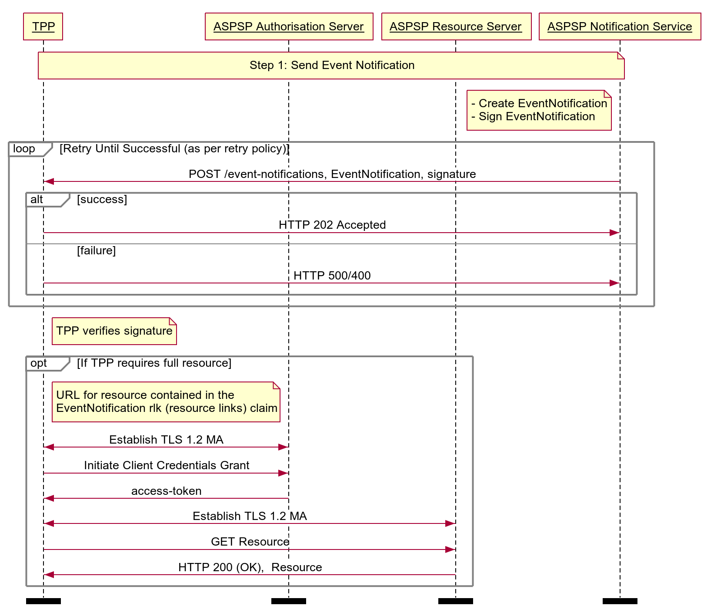

# Real Time Event Notification Profile <!-- omit in toc -->

## Overview

The Real Time Event Notification API Specification describes the flows and payloads to allow ASPSPs to deliver real time event notifications to TPPs. 

The endpoint described here allows an ASPSP to:

* Notify a TPP that an event has occurred.

## Basics

### Overview

The steps and sequence diagram below provide a general outline of an event notification flow for all resources in the R/W APIs.

#### Steps

Step 1: Send Event Notification

* When an event occurs on a resource that requires a notification, the ASPSP identifies the  **callback-url**  associated with the TPP owning the affected resource.
* The ASPSP sends a signed event notification to the callback URL, detailing the nature of the event and identifying the affected resource.
* The TPP may optionally initiate a client credential grant to retrieve the resource using the details contained in the event notification.

#### Sequence Diagram




<details>
  <summary>Diagram source</summary>
  
  ```
participant TPP
participant ASPSP Authorisation Server
participant ASPSP Resource Server
participant ASPSP Notification Service

note over TPP, ASPSP Notification Service
 Step 1: Send Event Notification
end note

note left of ASPSP Notification Service
- Create EventNotification
- Sign EventNotification
end note

loop Retry Until Successful (as per retry policy)
ASPSP Notification Service -> TPP: POST /event-notifications, EventNotification, signature
alt success
TPP -> ASPSP Notification Service: HTTP 202 Accepted
else failure
TPP -> ASPSP Notification Service: HTTP 500/400 
end alt
end loop

note right of TPP
TPP verifies signature
end note

opt If TPP requires full resource

note right of TPP
URL for resource contained in the 
EventNotification rlk (resource links) claim
end note

TPP <-> ASPSP Authorisation Server: Establish TLS 1.2 MA
TPP -> ASPSP Authorisation Server: Initiate Client Credentials Grant
ASPSP Authorisation Server -> TPP: access-token

TPP <-> ASPSP Resource Server: Establish TLS 1.2 MA
TPP -> ASPSP Resource Server: GET Resource
ASPSP Resource Server -> TPP: HTTP 200 (OK),  Resource

end opt

option footer=bar
``` 
 
</details>

## Endpoints

An ASPSP will send event notifications to a TPP using the event-notification resource.

### Endpoints
| Resource |HTTP Operation |Endpoint |Mandatory ? |Scope |Grant Type |Message Signing |Idempotency Key |Request Object |Response Object |
| --- |--- |--- |--- |--- |--- |--- |--- |--- |--- |
| event-notification |POST |POST /event-notifications |Optional |n/a |n/a |Signed Request |No |OBEventNotification1 | |


Notes:

* A TPP  **must**  make available an event notification endpoint to receive event notifications.
* A TPP  **must**  acknowledge an event notification with a 202 HTTP response and include the provided `x-fapi-interaction-id`.

#### POST /event-notifications

The API endpoint allows the ASPSP to send an  **event-notification**  resource to a TPP.

### Transport Level Security

TPP hosted endpoints  **must**  be protected using TLS 1.2, as per the FAPI R/W specification.

TPP hosted endpoints  **must**  be protected using a network certificate issued by a Trust Anchor supported by the ASPSP.

MA-TLS is not applicable to TPP hosted endpoints.

## Data Model

### Event Notification - Request

The OBEventNotification2 object will be used for a call to:

* POST /event-notifications

## Event Notification Retry Policy

### ASPSP

An ASPSP's Event Notification Retry Policy defines behaviour when an event notification is unacknowledged or the ASPSP receives a 5xx error.

* An Event Notification Retry Policy  **must**  define an Exponential Backoff Policy to calculate the Retry Time Interval.
* An Event Notification Retry Policy  **must**  define the Maximum Number of Retries an ASPSP will make before declaring the TPP Event Notification endpoint unresponsive and ceasing further attempts.
* An Event Notification Retry Policy  **must**  define the Maximum Time Interval for Retries, after which an ASPSP will declare the TPP Event Notification endpoint unresponsive and cease further attempts.

### TPP

A TPP  **may**  make GET requests for its resources if its `/event-notifications` endpoint was unavailable for the Maximum Time Interval for Retries, as defined in an ASPSP's Event Notification Retry Policy.

## Usage Examples

### Send Event Notification - Resource Update

 **POST /event-notifications** 
<b>Event Notification Request</b>

```
POST /event-notifications HTTP/1.1
x-fapi-interaction-id: 14ba1762-a316-4a87-8d6e-5bfbefaf01d7
Content-Type: application/jwt

eyJhbGciOiJIUzI1NiIsInR5cCI6IkpXVCJ9.eyJpc3MiOiJodHRwczovL2V4YW1wbGViYW5rLmNvbS8iLCJpYXQiOiIxNTE2MjM5MDIyIiwianRpIjoiYjQ2MGEwN2MtNDk2Mi00M2QxLTg1ZWUtOWRjMTBmYmI4ZjZjIiwic3ViIjoiaHR0cHM6Ly9leGFtcGxlYmFuay5jb20vYXBpL29wZW4tYmFua2luZy92My4wL3Bpc3AvZG9tZXN0aWMtcGF5bWVudHMvcG10LTcyOTAtMDAzIiwiYXVkIjoiN3VteDVuVFIzMzgxMVF5UWZpIiwiZXZlbnRzIjp7InVybjp1azpvcmc6b3BlbmJhbmtpbmc6ZXZlbnRzOnJlc291cmNlLXVwZGF0ZSI6eyJzdWJqZWN0Ijp7InN1YmplY3RfdHlwZSI6Imh0dHA6Ly9vcGVuYmFua2luZy5vcmcudWsvcmlkX2h0dHA6Ly9vcGVuYmFua2luZy5vcmcudWsvcnR5IiwiaHR0cDovL29wZW5iYW5raW5nLm9yZy51ay9yaWQiOiJwbXQtNzI5MC0wMDMiLCJodHRwOi8vb3BlbmJhbmtpbmcub3JnLnVrL3J0eSI6ImRvbWVzdGljLXBheW1lbnQiLCJodHRwOi8vb3BlbmJhbmtpbmcub3JnLnVrL3JsayI6W3sidmVyc2lvbiI6InYzLjAiLCJsaW5rIjoiaHR0cHM6Ly9leGFtcGxlYmFuay5jb20vYXBpL29wZW4tYmFua2luZy92My4wL3Bpc3AvZG9tZXN0aWMtcGF5bWVudHMvcG10LTcyOTAtMDAzIn0seyJ2ZXJzaW9uIjoidjEuMSIsImxpbmsiOiJodHRwczovL2V4YW1wbGViYW5rLmNvbS9hcGkvb3Blbi1iYW5raW5nL3YxLjEvcGF5bWVudHMvcG10LTcyOTAtMDAzIn1dfX19LCJ0eG4iOiJkZmM1MTYyOC0zNDc5LTRiODEtYWQ2MC0yMTBiNDNkMDIzMDYiLCJ0b2UiOiIxNTE2MjM5MDIyIn0.-coUJsJVycbZufiWHi71TIQsCjP4gj9uZ4FOsNEysZ4
```

<b>Decoded JWT Body - Event Notification Payload</b>

```json
{
  "iss": "https://examplebank.com/",
  "iat": 1516239022,
  "jti": "b460a07c-4962-43d1-85ee-9dc10fbb8f6c",
  "sub": "https://examplebank.com/api/open-banking/v3.1/aisp/account-access-consents/aac-1234-007",
  "aud": "7umx5nTR33811QyQfi",
  "events": {
    "urn:uk:org:openbanking:events:resource-update": {
      "subject": {
        "subject_type": "http://openbanking.org.uk/rid_http://openbanking.org.uk/rty",
        "http://openbanking.org.uk/rid": "aac-1234-007",
        "http://openbanking.org.uk/rty": "account-access-consent",
        "http://openbanking.org.uk/rlk": [{
            "version": "v3.1",
            "link": "https://examplebank.com/api/open-banking/v3.1/aisp/account-access-consents/aac-1234-007"
          }
        ]
      }
    }
  },
  "txn": "dfc51628-3479-4b81-ad60-210b43d02306",
  "toe": 1516239022
}
```

 **POST /event-notifications response** 
<b>Event Notification Response</b>

```
HTTP/1.1 202 Accepted
x-fapi-interaction-id: 14ba1762-a316-4a87-8d6e-5bfbefaf01d7
```

### Send Event Notification - Consent Authorisation Revoked

 **POST /event-notifications** 
<b>Event Notification Request</b>

```
POST /event-notifications HTTP/1.1
x-fapi-interaction-id: db54268f-2cc7-47e3-bf3c-4b5a7d08a614
Content-Type: application/jwt

eyJhbGciOiJIUzI1NiIsInR5cCI6IkpXVCJ9.eyJpc3MiOiJodHRwczovL2V4YW1wbGViYW5rLmNvbS8iLCJpYXQiOjE1MTYyMzkwMjIsImp0aSI6ImI0NjBhMDdjLTQ5NjItNDNkMS04NWVlLTlkYzEwZmJiOGY2YyIsInN1YiI6Imh0dHBzOi8vZXhhbXBsZWJhbmsuY29tL2FwaS9vcGVuLWJhbmtpbmcvdjQuMC9haXNwL2FjY291bnQtYWNjZXNzLWNvbnNlbnRzL2FhYy0xMjM0LTAwNyIsImF1ZCI6Ijd1bXg1blRSMzM4MTFReVFmaSIsImV2ZW50cyI6eyJ1cm46dWs6b3JnOm9wZW5iYW5raW5nOmV2ZW50czpyZXNvdXJjZS11cGRhdGUiOnsic3ViamVjdCI6eyJzdWJqZWN0X3R5cGUiOiJodHRwOi8vb3BlbmJhbmtpbmcub3JnLnVrL3JpZF9odHRwOi8vb3BlbmJhbmtpbmcub3JnLnVrL3J0eSIsImh0dHA6Ly9vcGVuYmFua2luZy5vcmcudWsvcmlkIjoiYWFjLTEyMzQtMDA3IiwiaHR0cDovL29wZW5iYW5raW5nLm9yZy51ay9ydHkiOiJhY2NvdW50LWFjY2Vzcy1jb25zZW50IiwiaHR0cDovL29wZW5iYW5raW5nLm9yZy51ay9ybGsiOlt7InZlcnNpb24iOiJ2NC4wIiwibGluayI6Imh0dHBzOi8vZXhhbXBsZWJhbmsuY29tL2FwaS9vcGVuLWJhbmtpbmcvdjQuMC9haXNwL2FjY291bnQtYWNjZXNzLWNvbnNlbnRzL2FhYy0xMjM0LTAwNyJ9LHsidmVyc2lvbiI6InYzLjEiLCJsaW5rIjoiaHR0cHM6Ly9leGFtcGxlYmFuay5jb20vYXBpL29wZW4tYmFua2luZy92My4xL2Fpc3AvYWNjb3VudC1hY2Nlc3MtY29uc2VudHMvYWFjLTEyMzQtMDA3In1dfX0sInVybjp1azpvcmc6b3BlbmJhbmtpbmc6ZXZlbnRzOmNvbnNlbnQtYXV0aG9yaXphdGlvbi1yZXZva2VkIjp7fX0sInR4biI6ImRmYzUxNjI4LTM0NzktNGI4MS1hZDYwLTIxMGI0M2QwMjMwNiIsInRvZSI6MTUxNjIzOTAyMn0.rt5vlM5xXA25CqxOdRCSB89HKabGIHgFqEIncyC6Jjs
```

<b>Decoded JWT Body - Event Notification Payload</b>

```json
{
	"iss": "https://examplebank.com/",
	"iat": 1516239022,
	"jti": "b460a07c-4962-43d1-85ee-9dc10fbb8f6c",
	"sub": "https://examplebank.com/api/open-banking/v3.1/aisp/account-access-consents/aac-1234-007",
	"aud": "7umx5nTR33811QyQfi",
	"events": {
		"urn:uk:org:openbanking:events:resource-update": {
			"subject": {
				"subject_type": "http://openbanking.org.uk/rid_http://openbanking.org.uk/rty",
				"http://openbanking.org.uk/rid": "aac-1234-007",
				"http://openbanking.org.uk/rty": "account-access-consent",
				"http://openbanking.org.uk/rlk": [{
						"version": "v3.1",
						"link": "https://examplebank.com/api/open-banking/v3.1/aisp/account-access-consents/aac-1234-007"
					}
				]
			}
		},
		"urn:uk:org:openbanking:events:consent-authorization-revoked": {}
	},
	"txn": "dfc51628-3479-4b81-ad60-210b43d02306",
	"toe": 1516239022
}
```

 **POST /event-notifications response** 
<b>Event Notification Response</b>

```
HTTP/1.1 202 Accepted
x-fapi-interaction-id: db54268f-2cc7-47e3-bf3c-4b5a7d08a614
```