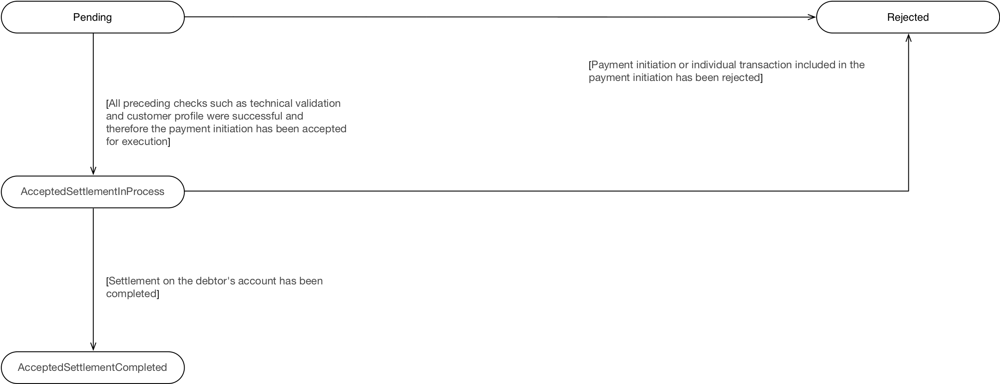

# Endpoints
| Resource |HTTP Operation |Endpoint |Mandatory ? |Scope |Grant Type |Message Signing |Idempotency Key |Request Object |Response Object |
| -------- |-------------- |-------- |----------- |----- |---------- |--------------- |--------------- |-------------- |--------------- |
| domestic-payment-consents |POST |POST /domestic-payment-consents |Mandatory |payments |Client Credentials |Signed Request Signed Response |Yes |OBWriteDomesticConsent2 |OBWriteDomesticConsentResponse2 |
| domestic-payment-consents |GET |GET /domestic-payment-consents/{ConsentId} |Mandatory |payments |Client Credentials |Signed Response |No |NA |OBWriteDomesticConsentResponse2 |
| domestic-payment-consents |GET |GET /domestic-payment-consents/{ConsentId}/funds-confirmation |Mandatory |payments |Authorization Code |Signed Response |No |NA |OBWriteFundsConfirmationResponse1 |
| domestic-payments |POST |POST /domestic-payments |Mandatory |payments |Authorization Code |Signed Request Signed Response |Yes |OBWriteDomestic2 |OBWriteDomesticResponse2 |
| domestic-payments |GET |GET /domestic-payments/{DomesticPaymentId} |Mandatory |payments |Client Credentials |Signed Response |No |NA |OBWriteDomesticResponse2 |

## POST /domestic-payment-consents 
```POST /domestic-payment-consents```

The API endpoint allows the PISP to ask an ASPSP to create a new **domestic-payment-consent** resource.

* The POST action indicates to the ASPSP that a domestic payment consent has been staged. At this point, the PSU may not have been identified by the ASPSP, and the request payload may not contain any information of the account that should be debited.
* The endpoint allows the PISP to send a copy of the consent (between PSU and PISP) to the ASPSP for the PSU to authorise.
* The ASPSP creates the **domestic-payment-consent** resource and responds with a unique ConsentId to refer to the resource.
### Status
The default Status is &quot;AwaitingAuthorisation&quot; immediately after the domestic-payment-consent has been created.

| Status |
| ------ |
| AwaitingAuthorisation |

## GET /domestic-payment-consents/{ConsentId}
```GET /domestic-payment-consents/{ConsentId}```

A PISP can optionally retrieve a payment consent resource that they have created to check its status. 
### Status

Once the PSU authorises the payment-consent resource - the Status of the payment-consent resource will be updated with "Authorised".

If the PSU rejects the consent or the domestic-payment-consent has failed some other ASPSP validation, the Status will be set to "Rejected".

Once a domestic-payment has been successfully created using the domestic-payment-consent, the Status of the domestic-payment-consent will be set to "Consumed".

The available status codes for the domestic-payment-consent resource are:

| Status |
| ------ |
| AwaitingAuthorisation |
| Rejected |
| Authorised |
| Consumed |

## GET /domestic-payment-consents/{ConsentId}/funds-confirmation
```GET /domestic-payment-consents/{ConsentId}/funds-confirmation```

The API endpoint allows the PISP to ask an ASPSP to confirm funds on a **domestic-payment-consent** resource.

* An ASPSP can only respond to a funds confirmation request if the **domestic-payment-consent** resource has an Authorised status. If the status is not Authorised, an ASPSP must respond with a 400 (Bad Request) and a ```UK.OBIE.Resource.InvalidConsentStatus``` error code.
* Confirmation of funds requests do not affect the status of the **domestic-payment-consent** resource.

## POST /domestic-payments
```POST /domestic-payments```

Once the domestic-payment-consent has been authorised by the PSU, the PISP can proceed to submitting the domestic-payment for processing:

* This is done by making a POST request to the **domestic-payments** endpoint.
* This request is an instruction to the ASPSP to begin the domestic single immediate payment journey. The domestic payment must be submitted immediately, however, there are some scenarios where the domestic payment may not be executed immediately (e.g., busy periods at the ASPSP).
* The PISP **must** ensure that the Initiation and Risk sections of the domestic-payment match the corresponding Initiation and Risk sections of the domestic-payment-consent resource. If the two do not match, the ASPSP must not process the request and **must** respond with a 400 (Bad Request).
* Any operations on the domestic-payment resource will not result in a status change for the domestic-payment resource.

### Status

A domestic-payment can only be created if its corresponding domestic-payment-consent resource has the status of "Authorised". 

The domestic-payment resource that is created successfully must have one of the following PaymentStatusCode code-set enumerations:

| Status |
| ------ |
| Pending |
| Rejected |
| AcceptedSettlementInProcess |

## GET /domestic-payments/{DomesticPaymentId}
```GET /domestic-payments/{DomesticPaymentId}```

A PISP can retrieve the domestic-payment to check its status.

### Status

The domestic-payment resource must have one of the following PaymentStatusCode code-set enumerations:

| Status |
| ------ |
| Pending |
| Rejected |
| AcceptedSettlementInProcess |
| AcceptedSettlementCompleted |

## State Model
### Payment Order Consent
The state model for the domestic-payment-consent resource follows the generic consent state model. However, does not use the "Revoked" status, as the consent for a domestic-payment is not a long-lived consent.


The definitions for the Status:

|  | Status |Status Description |
| ---| ------ |------------------ |
| 1 |AwaitingAuthorisation |The consent resource is awaiting PSU authorisation. |
| 2 |Rejected |The consent resource has been rejected. |
| 3 |Authorised |The consent resource has been successfully authorised. |
| 4 |Consumed |The consented action has been successfully completed. This does not reflect the status of the consented action. |

### Payment Order
The state model for the domestic-payment resource follows the behaviour and definitions for the ISO 20022 PaymentStatusCode code-set.



The definitions for the status:

|  |Status |Payment Status Description |
|--|------ |-------------------------- |
| 1 |Pending |Payment initiation or individual transaction included in the payment initiation is pending. Further checks and status update will be performed. |
| 2 |Rejected |Payment initiation or individual transaction included in the payment initiation has been rejected. |
| 3 |AcceptedSettlementInProcess |All preceding checks such as technical validation and customer profile were successful and therefore the payment initiation has been accepted for execution. |
| 4 |AcceptedSettlementCompleted |Settlement on the debtor's account has been completed. |

#### Multiple Authorisation
If the payment-order requires multiple authorisations - the Status of the multiple authorisations will be updated in the MultiAuthorisation object.


The definitions for the status:

|  |Status |Status Description |
|-- |------ |------------------ |
| 1 |AwaitingFurtherAuthorisation |The payment-order resource is awaiting further authorisation. |
| 2 |Rejected |The payment-order resource has been rejected by an authoriser. |
| 3 |Authorised |The payment-order resource has been successfully authorised by all required authorisers.|

# Data Model
The data dictionary section gives the detail on the payload content for the Domestic Payment API flows.

## Reused Classes
### OBDomestic2
This section describes the OBDomestic2 class which is reused as the Initiation object in the domestic-payment-consent and domestic-payment resources.

#### UML Diagram


#### Notes
For the OBDomestic2 Initiation object:  

* All elements in the Initiation payload that are specified by the PISP must not be changed via the ASPSP as this is part of formal consent from the PSU.
* If the ASPSP is able to establish a problem with payload or any contextual error during the API call, the ASPSP must reject the domestic-payment-consent request immediately.

* If the ASPSP establishes a problem with the domestic-payment-consent after the API call, the ASPSP must set the status of the domestic-payment-consent resource to Rejected.

* DebtorAccount is **optional** as the PISP may not know the account identification details for the PSU.
* If the DebtorAccount is specified by the PISP and is invalid for the PSU, then the domestic-payment-consent will be set to Rejected after PSU authentication.
* Account Identification field usage:
  * Where "UK.OBIE.SortCodeAccountNumber" is specified as the SchemeName in the Account identification section (either DebtorAccount or CreditorAccount), the Identification field **must** be populated with the 6 digit Sort Code and 8 digit Account Number (a 14 digit field).
  * Where the "UK.OBIE.IBAN" is specified as the SchemeName in the Account identification section (either DebtorAccount or CreditorAccount), the Identification field must be populated with the full IBAN.
* The element Reference has been renamed from CreditorReferenceInformation as this is the unique ISO 20022 element used in pain.001, rather than an ISO 20022 message component.
* As a merchant may be initiating a payment via a PISP two identifiers are included in the payload: 
InstructionIdentification is uniquely generated by the PISP. The expectation is that this is unique indefinitely across all time periods. The PISP can ensure that this is indefinitely unique by including a date or date-time element to the field, or by inserting a unique Id. 
* EndToEndIdentification is uniquely generated by the merchant.
* Neither the InstructionIdentification nor EndToEndIdentification will be used as the domestic-payment-consent resource identifier (ConsentId) as the ConsentId must be uniquely generated by the ASPSP.
* LocalInstrument is the requested payment scheme for execution. This is a free-text field.
* Design decisions for the Initiation section of the payload and how this maps to the ISO 20022 messaging standard are articulated in the Mapping to Schemes and Standards section.

| Name |Occurrence |XPath |EnhancedDefinition |Class |Codes |Pattern |
| ---- |---------- |----- |------------------ |----- |----- |------- |
| OBDomestic2 | |OBDomestic2 |The Initiation payload is sent by the initiating party to the ASPSP. It is used to request movement of funds from the debtor account to a creditor for a single domestic payment. |OBDomestic2 | | |
| InstructionIdentification |1..1 |OBDomestic2/InstructionIdentification |Unique identification as assigned by an instructing party for an instructed party to unambiguously identify the instruction. Usage: the instruction identification is a point to point reference that can be used between the instructing party and the instructed party to refer to the individual instruction. It can be included in several messages related to the instruction. |Max35Text | | |
| EndToEndIdentification |1..1 |OBDomestic2/EndToEndIdentification |Unique identification assigned by the initiating party to unambiguously identify the transaction. This identification is passed on, unchanged, throughout the entire end-to-end chain. Usage: The end-to-end identification can be used for reconciliation or to link tasks relating to the transaction. It can be included in several messages related to the transaction. OB: The Faster Payments Scheme can only access 31 characters for the EndToEndIdentification field. |Max35Text | | |
| LocalInstrument |0..1 |OBDomestic2/LocalInstrument |User community specific instrument. Usage: This element is used to specify a local instrument, local clearing option and/or further qualify the service or service level. |OBExternalLocalInstrument1Code | | |
| InstructedAmount |1..1 |OBDomestic2/InstructedAmount |Amount of money to be moved between the debtor and creditor, before deduction of charges, expressed in the currency as ordered by the initiating party. Usage: This amount has to be transported unchanged through the transaction chain. |OBActiveOrHistoricCurrencyAndAmount | | |
| Amount |1..1 |OBDomestic2/InstructedAmount/Amount |A number of monetary units specified in an active currency where the unit of currency is explicit and compliant with ISO 4217. |OBActiveCurrencyAndAmount_SimpleType | |^\d{1,13}\.\d{1,5}$ |
| Currency |1..1 |OBDomestic2/InstructedAmount/Currency |A code allocated to a currency by a Maintenance Agency under an international identification scheme, as described in the latest edition of the international standard ISO 4217 "Codes for the representation of currencies and funds". |ActiveOrHistoricCurrencyCode | |^[A-Z]{3,3}$ |
| DebtorAccount |0..1 |OBDomestic2/DebtorAccount |Unambiguous identification of the account of the debtor to which a debit entry will be made as a result of the transaction. |OBCashAccountDebtor4 | | |
| SchemeName |1..1 |OBDomestic2/DebtorAccount/SchemeName |Name of the identification scheme, in a coded form as published in an external list. |OBExternalAccountIdentification4Code | | |
| Identification |1..1 |OBDomestic2/DebtorAccount/Identification |Identification assigned by an institution to identify an account. This identification is known by the account owner. |Max256Text | | |
| Name |0..1 |OBDomestic2/DebtorAccount/Name |Name of the account, as assigned by the account servicing institution. Usage: The account name is the name or names of the account owner(s) represented at an account level. The account name is not the product name or the nickname of the account. |Max70Text | | |
| SecondaryIdentification |0..1 |OBDomestic2/DebtorAccount/SecondaryIdentification |This is secondary identification of the account, as assigned by the account servicing institution. This can be used by building societies to additionally identify accounts with a roll number (in addition to a sort code and account number combination). |Max34Text | | |
| CreditorAccount |1..1 |OBDomestic2/CreditorAccount |Unambiguous identification of the account of the creditor to which a credit entry will be posted as a result of the payment transaction. |OBCashAccountCreditor3 | | |
| SchemeName |1..1 |OBDomestic2/CreditorAccount/SchemeName |Name of the identification scheme, in a coded form as published in an external list. |OBExternalAccountIdentification4Code | | |
| Identification |1..1 |OBDomestic2/CreditorAccount/Identification |Identification assigned by an institution to identify an account. This identification is known by the account owner. |Max256Text | | |
| Name |1..1 |OBDomestic2/CreditorAccount/Name |Name of the account, as assigned by the account servicing institution. Usage: The account name is the name or names of the account owner(s) represented at an account level. The account name is not the product name or the nickname of the account. OB: ASPSPs may carry out name validation for Confirmation of Payee, but it is not mandatory. |Max70Text | | |
| SecondaryIdentification |0..1 |OBDomestic2/CreditorAccount/SecondaryIdentification |This is secondary identification of the account, as assigned by the account servicing institution. This can be used by building societies to additionally identify accounts with a roll number (in addition to a sort code and account number combination). |Max34Text | | |
| CreditorPostalAddress |0..1 |OBDomestic2/CreditorPostalAddress |Information that locates and identifies a specific address, as defined by postal services. |OBPostalAddress6 | | |
| AddressType |0..1 |OBDomestic2/CreditorPostalAddress/AddressType |Identifies the nature of the postal address. |OBAddressTypeCode |Business Correspondence DeliveryTo MailTo POBox Postal Residential Statement | |
| Department |0..1 |OBDomestic2/CreditorPostalAddress/Department |Identification of a division of a large organisation or building. |Max70Text | | |
| SubDepartment |0..1 |OBDomestic2/CreditorPostalAddress/SubDepartment |Identification of a sub-division of a large organisation or building. |Max70Text | | |
| StreetName |0..1 |OBDomestic2/CreditorPostalAddress/StreetName |Name of a street or thoroughfare. |Max70Text | | |
| BuildingNumber |0..1 |OBDomestic2/CreditorPostalAddress/BuildingNumber |Number that identifies the position of a building on a street. |Max16Text | | |
| PostCode |0..1 |OBDomestic2/CreditorPostalAddress/PostCode |Identifier consisting of a group of letters and/or numbers that is added to a postal address to assist the sorting of mail. |Max16Text | | |
| TownName |0..1 |OBDomestic2/CreditorPostalAddress/TownName |Name of a built-up area, with defined boundaries, and a local government. |Max35Text | | |
| CountrySubDivision |0..1 |OBDomestic2/CreditorPostalAddress/CountrySubDivision |Identifies a subdivision of a country such as state, region, county. |Max35Text | | |
| Country |0..1 |OBDomestic2/CreditorPostalAddress/Country |Nation with its own government. |CountryCode | |^[A-Z]{2,2}$ |
| AddressLine |0..7 |OBDomestic2/CreditorPostalAddress/AddressLine |Information that locates and identifies a specific address, as defined by postal services, presented in free format text. |Max70Text | | |
| RemittanceInformation |0..1 |OBDomestic2/RemittanceInformation |Information supplied to enable the matching of an entry with the items that the transfer is intended to settle, such as commercial invoices in an accounts' receivable system. |OBRemittanceInformation1 | | |
| Unstructured |0..1 |OBDomestic2/RemittanceInformation/Unstructured |Information supplied to enable the matching/reconciliation of an entry with the items that the payment is intended to settle, such as commercial invoices in an accounts' receivable system, in an unstructured form. |Max140Text | | |
| Reference |0..1 |OBDomestic2/RemittanceInformation/Reference |Unique reference, as assigned by the creditor, to unambiguously refer to the payment transaction. Usage: If available, the initiating party should provide this reference in the structured remittance information, to enable reconciliation by the creditor upon receipt of the amount of money. If the business context requires the use of a creditor reference or a payment remit identification, and only one identifier can be passed through the end-to-end chain, the creditor's reference or payment remittance identification should be quoted in the end-to-end transaction identification. OB: The Faster Payments Scheme can only accept 18 characters for the ReferenceInformation field - which is where this ISO field will be mapped. |Max35Text | | |
| SupplementaryData |0..1 |OBDomestic2/SupplementaryData |Additional information that can not be captured in the structured fields and/or any other specific block. |OBSupplementaryData1 | | |
